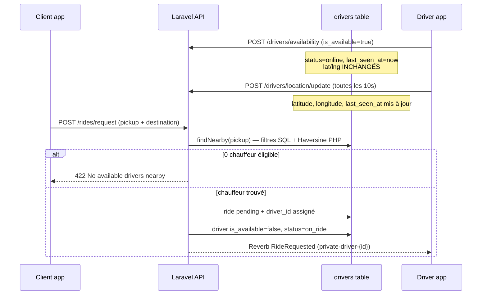

# Rapport audit dispatch — test terrain réel

**Date :** 2026-06-11  
**Contexte :** test sur 2 téléphones physiques (client + chauffeur), distance réelle **< 3 m**  
**Symptôme :** le client lance une demande, le chauffeur n'est pas détecté / ne reçoit rien  
**Branche auditée :** `feature/mami-taxi-v2-p1` (commit `3e8ef3f`)

---

## 1. Résumé exécutif

| Constat | Détail |
|---------|--------|
| **Rayon de recherche** | 10 km par défaut — **3 m n'est jamais hors rayon** |
| **Distance Haversine** | Correcte côté serveur (`GeoDistance::kilometers`) |
| **Cause #1 la plus probable** | Chauffeur **éligible en UI** mais **invisible en base** (`latitude`/`longitude` NULL ou obsolètes) |
| **Cause #2** | Client V2 P1 : l'écran `RideBookingV2Screen` **n'appelle pas** `POST /rides/request` |
| **Cause #3** | Course active bloquante (`status=on_ride`, `is_available=false`) |
| **Cause #4** | Fenêtre de course entre « En ligne » et premier POST GPS (~0–10 s) |
| **Dispatch V2** | Flag `MAMI_DISPATCH_V2` présent mais **non branché** — V1 synchrone uniquement |

**Verdict :** à 3 m, l'échec n'est **pas** un problème de rayon ni de formule Haversine. C'est presque toujours un **filtre d'éligibilité** ou un **flux client qui ne déclenche pas le dispatch**.

---

## 2. Architecture dispatch actuelle (V1)



**Point critique :** le dispatch lit **`drivers.latitude` / `drivers.longitude`**, pas la table historique `driver_locations`.

---

## 3. Analyse composant par composant

### 3.1 `DriverLocation` (modèle + table)

| Élément | Valeur |
|---------|--------|
| Fichier modèle | `app/Models/DriverLocation.php` |
| Migration | `database/migrations/2026_05_23_000004_create_driver_locations_table.php` |
| Colonnes | `driver_id`, `latitude`, `longitude`, `recorded_at` |
| Rôle | **Audit / historique** uniquement |
| Utilisé par dispatch ? | **Non** |

Chaque `POST /drivers/location/update` insère une ligne ici **et** met à jour `drivers`. Si l'historique est récent mais `drivers.latitude` est NULL, le chauffeur reste invisible.

### 3.2 `DriverLocationService`

| Méthode | Fichier | Rôle |
|---------|---------|------|
| `update()` | `app/Services/DriverLocationService.php:19-66` | Écrit coords sur `drivers` + historique + `last_seen_at` |
| `findNearby()` | `app/Services/DriverLocationService.php:71-101` | Recherche dispatch |

**Filtres SQL dans `findNearby()` :**

```sql
WHERE is_available = 1
  AND status = 'online'
  AND latitude IS NOT NULL
  AND longitude IS NOT NULL
```

Puis en PHP :
1. Haversine pour chaque chauffeur
2. Filtre `distance_km <= radius_km` (défaut 10)
3. Tri par distance croissante
4. Retour de la collection (le dispatch prend `.first()`)

**Ce qui n'est PAS filtré :**
- `last_seen_at` (fraîcheur heartbeat)
- Présence résolue (`DriverPresenceService`)
- Dernière ligne `driver_locations`
- Véhicule / approbation admin

### 3.3 Rayon de recherche

| Config | Valeur |
|--------|--------|
| Fichier | `config/mami.php` |
| Clé | `driver_search_radius_km` |
| Env | `MAMI_DRIVER_SEARCH_RADIUS_KM` |
| **Défaut** | **10 km** (10 000 m) |
| Override API | `GET /api/drivers/nearby?radius_km=...` (0.1–50 km) |
| `POST /rides/request` | Utilise **toujours** le défaut config, pas de override |

À 3 m = **0.003 km** → largement dans le rayon.

### 3.4 Calcul Haversine

| Élément | Détail |
|---------|--------|
| Fichier | `app/Support/GeoDistance.php` |
| Rayon terrestre | 6371 km |
| Formule | Haversine standard |
| Exécution | PHP après `SELECT` (pas en SQL) |

**Exemple terrain Libreville (test < 3 m) :**

| Point | Lat | Lng |
|-------|-----|-----|
| Pickup client | 0.5331 | 9.3730 |
| Chauffeur | 0.5331 | 9.3731 | *(~11 m en longitude seule)* |
| Chauffeur (3 m nord) | 0.533127 | 9.3730 |

```
GeoDistance::kilometers(0.5331, 9.3730, 0.533127, 9.3730)
→ ≈ 0.003 km = 3 m
```

La formule renvoie bien ~0.003. Si le chauffeur n'est pas sélectionné, la distance calculée n'est **pas** le blocage.

### 3.5 Filtre « online »

| Champ DB | Condition dispatch |
|----------|-------------------|
| `status` | Doit être exactement `'online'` |
| `is_available` | Doit être `true` |

**Enum** `app/Enums/DriverStatus.php` : `offline`, `online`, `on_ride`

Un chauffeur `on_ride` ou `offline` est **exclu avant** le calcul de distance.

### 3.6 `last_seen_at`

| Paramètre | Valeur |
|-----------|--------|
| Seuil offline | **300 s** (5 min) — `MAMI_DRIVER_OFFLINE_THRESHOLD_SECONDS` |
| Cron | `drivers:mark-offline` **chaque minute** (`routes/console.php`) |
| Action cron | `status=offline`, `is_available=false` si `last_seen_at` null ou > 300 s |
| Utilisé dans `findNearby()` ? | **Non** |

**Incohérence :** l'UI présence peut afficher « offline » via `resolvePresence()`, mais le dispatch ne vérifie que `status='online'` en base. Un chauffeur peut rester `online` en DB jusqu'à 1 min après perte GPS.

**Mise à jour de `last_seen_at` :**
- `POST /drivers/location/update` → `now()`
- `POST /drivers/availability` → `now()` (sans coords)
- Reject / complete ride → `now()`

### 3.7 Statut available / busy

| État | `is_available` | `status` | Dispatch |
|------|----------------|----------|----------|
| Hors ligne | false | offline | Exclu |
| En ligne (prêt) | true | online | **Éligible** |
| Course assignée | false | on_ride | Exclu |
| Course active (pending/accepted/…) | false | on_ride | Exclu + `hasActiveRide()` |

**À l'assignation** (`RideDispatchService::requestRide`) :
```php
$driver->update([
    'is_available' => false,
    'status' => DriverStatus::OnRide,
]);
```

**Nouveau chauffeur approuvé** (`DriverEnrollmentService`) : `is_available = false` par défaut.

**Segment « Occupé »** dans l'app chauffeur : désactivé en UI — le statut busy est **dérivé** du serveur, pas choisi manuellement.

### 3.8 Fréquence GPS chauffeur (app Flutter)

| Paramètre | Valeur |
|-----------|--------|
| Fichier config | `mobile/mami_driver/lib/core/config/app_config.dart` |
| `gpsInterval` | **10 secondes** |
| Endpoint | `POST /api/drivers/location/update` |
| Payload | `{ "latitude": double, "longitude": double }` |
| Tracker | `location_tracker_provider.dart` |

**Conditions d'envoi :**
- Tracker actif seulement si `DriverUiStatus.online` ou `busy`
- Démarré au toggle « En ligne » ou au boot si déjà online/busy
- Arrêté si offline, logout, ou fin de course

**Problèmes identifiés :**

1. **`POST /drivers/availability` ne envoie pas de coords** — le chauffeur peut être `online` sans `latitude`/`longitude`.
2. **Race au passage en ligne** — `availability` puis `getCurrentPosition()` (GPS froid 2–15 s) avant le premier `location/update`.
3. **Erreurs silencieuses** — `catch (_) {}` dans `_sendOnce()` : pas de log, pas d'alerte UI.
4. **Pas de foreground service** — GPS s'arrête si l'app est tuée en arrière-plan.

---

## 4. Flux client — quelle « demande » est lancée ?

| Écran | Condition | Appel dispatch ? |
|-------|-----------|------------------|
| `RideBookingV2Screen` | `MAMI_TAXI_V2=true` (APK actuel) | **Non** — bouton Continuer = snackbar P3 |
| `RideBookingScreen` | V1 / flag désactivé | **Oui** — `POST /rides/request` |

**APK client récent** compilé avec `--dart-define=MAMI_TAXI_V2=true` → réservation via **P1 sans dispatch**.

Le chauffeur ne peut **physiquement pas** être détecté si le client n'appelle pas `/rides/request`.

Pour un test dispatch réel, utiliser :
- l'écran V1 (`RideBookingScreen`), ou
- `POST /rides/request` manuel (curl/Postman), ou
- désactiver `MAMI_TAXI_V2` au build client.

---

## 5. Pourquoi un chauffeur à 3 m n'est pas sélectionné

### Classement par probabilité (test terrain)

| # | Cause | Mécanisme | Comment vérifier |
|---|-------|-----------|------------------|
| **1** | **Pas d'appel dispatch côté client** | V2 P1 n'appelle pas `/rides/request` | Logs client : pas de `POST /rides/request` |
| **2** | **Coords NULL en base** | `findNearby` exige `latitude IS NOT NULL` | `SELECT latitude, longitude FROM drivers WHERE id=?` |
| **3** | **Fenêtre post-online sans GPS** | Online OK, premier GPS pas encore arrivé | Comparer `last_seen_at` vs heure demande ; logs chauffeur |
| **4** | **Course bloquante** | `on_ride` + `is_available=false` | `SELECT * FROM rides WHERE driver_id=? AND status IN (...)` |
| **5** | **Pas vraiment online** | `is_available=false` ou `status=offline` | État DB vs UI |
| **6** | **GPS silencieusement en échec** | Erreurs avalées, coords obsolètes | Logs réseau chauffeur ; âge des coords |
| **7** | **Autre chauffeur plus proche** | V1 = 1 seul gagnant (le plus proche) | `GET /drivers/nearby` au moment T |
| **8** | **Coords pickup client incorrectes** | Pickup ≠ position réelle du test | Comparer GPS client vs payload request |
| **9** | **Cron stale offline** | > 5 min sans GPS | `last_seen_at` ancien |
| **10** | **Rayon / Haversine** | — | **Écarté** à 3 m avec config 10 km |

---

## 6. Distance calculée côté serveur

### Formule (extrait)

```php
// app/Support/GeoDistance.php
$earthRadiusKm = 6371;
// Haversine → distance en km
```

### Simulation dispatch (pseudo-logs)

```
DISPATCH SEARCH START
  pickup: lat=0.533100 lng=9.373000
  radius_km: 10.000

DISPATCH CANDIDATES SQL (pre-filter)
  driver_id=2 is_available=1 status=online lat=0.533127 lng=9.373000 last_seen_at=2026-06-11T21:40:05Z
  driver_id=5 is_available=1 status=online lat=NULL lng=NULL last_seen_at=2026-06-11T21:39:58Z  ← EXCLU SQL

DISPATCH HAVERSINE
  driver_id=2 distance_km=0.003 distance_m=3.0  ← ÉLIGIBLE

DISPATCH RESULT
  selected_driver_id=2 distance_m=3.0
```

### Cas d'échec typique (coords NULL)

```
DISPATCH SEARCH START
  pickup: lat=0.533100 lng=9.373000
  radius_km: 10.000

DISPATCH CANDIDATES SQL
  (0 rows — tous exclus: lat/lng NULL ou status!=online)

DISPATCH RESULT
  selected_driver_id=null
  error: No available drivers nearby.
```

---

## 7. Logs dispatch complets (proposés — non implémentés)

Pour reproduire et diagnostiquer en production, ajouter dans `DriverLocationService::findNearby()` et `RideDispatchService::requestRide()` :

```
[DISPATCH] SEARCH_START pickup_lat=0.5331 pickup_lng=9.3730 radius_km=10
[DISPATCH] SQL_CANDIDATES count=2
[DISPATCH] DRIVER_CANDIDATE id=2 is_available=1 status=online lat=0.5331 lng=9.3730 last_seen_at=2026-06-11T21:40:05Z age_s=12
[DISPATCH] DRIVER_CANDIDATE id=5 is_available=1 status=online lat=null lng=null last_seen_at=2026-06-11T21:39:58Z age_s=19 EXCLUDED_REASON=null_coordinates
[DISPATCH] HAVERSINE id=2 distance_km=0.0030 distance_m=3.0 WITHIN_RADIUS=yes
[DISPATCH] RANKING winner_id=2 distance_m=3.0
[DISPATCH] ASSIGN ride_id=42 driver_id=2 client_id=4
[DISPATCH] BROADCAST RideRequested driver_channel=private-driver-2
```

**Côté chauffeur (Flutter, proposé) :**

```
[DRIVER GPS] SEND_START
[DRIVER GPS] POSITION lat=0.5331 lng=9.3730
[DRIVER GPS] SEND_SUCCESS status=200 last_seen_at=...
[DRIVER GPS] SEND_FAILED error=...
[DRIVER ONLINE] TOGGLE online=true
[DRIVER ONLINE] WAITING_FIRST_GPS
```

---

## 8. Requêtes SQL de diagnostic (test 3 m)

```sql
-- État chauffeur testé
SELECT id, user_id, is_available, status,
       latitude, longitude, last_seen_at,
       TIMESTAMPDIFF(SECOND, last_seen_at, NOW()) AS seen_age_seconds
FROM drivers
WHERE id = :driver_id;

-- Courses bloquantes
SELECT id, status, client_id, pickup_latitude, pickup_longitude, created_at
FROM rides
WHERE driver_id = :driver_id
  AND status IN ('pending', 'accepted', 'arrived', 'started');

-- Derniers heartbeats GPS (historique)
SELECT latitude, longitude, recorded_at
FROM driver_locations
WHERE driver_id = :driver_id
ORDER BY recorded_at DESC
LIMIT 5;

-- Tous les chauffeurs éligibles au moment du test
SELECT id, latitude, longitude, is_available, status, last_seen_at
FROM drivers
WHERE is_available = 1
  AND status = 'online'
  AND latitude IS NOT NULL
  AND longitude IS NOT NULL;
```

**Test API direct (sans app client) :**

```bash
# Vérifier visibilité dispatch
curl "https://api.mami.ga/api/drivers/nearby?latitude=0.5331&longitude=9.3730&radius_km=0.01" \
  -H "Authorization: Bearer {token}"

# Lancer dispatch
curl -X POST "https://api.mami.ga/api/rides/request" \
  -H "Authorization: Bearer {client_token}" \
  -H "Content-Type: application/json" \
  -d '{"pickup_latitude":0.5331,"pickup_longitude":9.3730,"destination_latitude":0.5400,"destination_longitude":9.3800}'
```

---

## 9. Checklist test terrain (3 m)

### Avant le test

- [ ] Chauffeur connecté, toggle **« En ligne »** actif
- [ ] Attendre **≥ 15 s** après passage en ligne (1er GPS + marge)
- [ ] Vérifier indicateur GPS actif sur home chauffeur (`gpsActive = true`)
- [ ] Confirmer coords en base non NULL et récentes (`last_seen_at` < 30 s)
- [ ] Aucune course `pending`/`accepted`/`arrived`/`started` sur ce chauffeur
- [ ] Client utilise **V1 booking** ou appel direct `/rides/request` (pas V2 P1 seul)
- [ ] Scheduler Laravel actif sur VPS (`drivers:mark-offline` ne doit pas couper un chauffeur actif)

### Pendant le test

- [ ] Noter coords GPS des 2 téléphones (app ou `GET /drivers/nearby`)
- [ ] Lancer la demande client
- [ ] Observer logs Laravel + réponse HTTP (201 vs 422)

### Succès attendu

- Client : HTTP 201, redirection `/ride/searching/{id}`
- Chauffeur : carte `IncomingRideCard` ou event Reverb `RideRequested`
- DB : `rides.driver_id` = chauffeur test, `drivers.status` = `on_ride`

---

## 10. Corrections proposées

### P0 — Immédiat (test terrain)

| # | Correction | Fichier(s) | Impact |
|---|------------|------------|--------|
| 1 | **Bloquer « En ligne » tant que le 1er GPS n'est pas envoyé** | `location_tracker_provider.dart`, `home_screen.dart` | Élimine la fenêtre coords NULL |
| 2 | **Envoyer lat/lng dans `POST /drivers/availability`** | `driver_repository.dart`, `DriverController.php` | Online = position connue |
| 3 | **Logs GPS chauffeur** (succès/échec) | `location_tracker_provider.dart` | Diagnostic terrain |
| 4 | **Test dispatch via V1 ou curl** | procédure QA | Évite le faux négatif V2 P1 |

### P1 — Backend dispatch

| # | Correction | Fichier(s) | Impact |
|---|------------|------------|--------|
| 5 | **Logs dispatch structurés** | `DriverLocationService.php`, `RideDispatchService.php` | Traçabilité complète |
| 6 | **Filtrer `last_seen_at` dans `findNearby()`** | `DriverLocationService.php` | Cohérence avec présence |
| 7 | **Exclure chauffeurs avec `hasActiveRide()`** | `findNearby()` | Défense en profondeur |
| 8 | **Endpoint debug dispatch** (admin) | nouveau controller | QA sans curl manuel |

### P2 — Produit (phase P3)

| # | Correction | Impact |
|---|------------|--------|
| 9 | Brancher `MAMI_DISPATCH_V2` (vagues, offres, timeout) | Multi-chauffeurs, re-dispatch |
| 10 | `POST /rides/request` depuis `RideBookingV2Screen` | Parcours V2 complet |
| 11 | Foreground service GPS chauffeur | Heartbeat fiable en arrière-plan |

### Correctif recommandé #1 (détail)

**Problème :** `updateAvailability` met `status=online` sans coordonnées.

```php
// app/Http/Controllers/Api/DriverController.php — aujourd'hui
$driver->update([
    'is_available' => $isAvailable,
    'last_seen_at' => now(),
    'status' => $isAvailable ? DriverStatus::Online : DriverStatus::Offline,
]);
// latitude/longitude non touchés
```

**Proposition :** accepter coords optionnelles à la mise en ligne, ou refuser `is_available=true` si `!$driver->hasGpsPosition()`.

**Proposition Flutter :** dans `_toggleOnline(true)` :
1. `await locationTracker.start()` + attendre 1er envoi réussi
2. puis seulement `setOnline(true)`

---

## 11. Feature flags

| Flag | Défaut | Effet dispatch actuel |
|------|--------|----------------------|
| `MAMI_TAXI_V2` | false | Client : V1 vs V2 booking UI — **V2 P1 sans request** |
| `MAMI_DISPATCH_V2` | false | **Aucun** — flag exposé via `GET /api/app/features` uniquement |

Vagues préparées dans `config/mami.php` (`dispatch_radius_waves`) : 0–1, 1–3, 3–5, 5–10, 10–20 km — **non utilisées** par le code runtime.

---

## 12. Conclusion

Pour le scénario **2 téléphones à < 3 m** :

1. **Le rayon (10 km) et Haversine ne sont pas en cause** — 3 m = 0.003 km, toujours inclus.
2. **Le dispatch V1 exige** `is_available=true`, `status=online`, coords non NULL sur `drivers`.
3. **Le gap le plus fréquent** : chauffeur affiché « En ligne » mais **sans coords serveur** au moment de la demande.
4. **Si l'APK client est en V2 P1** : aucune demande n'est envoyée au serveur — le chauffeur ne peut pas être détecté par design.
5. **Reverb n'intervient pas dans la détection** — uniquement dans la notification post-assignation.

**Action immédiate recommandée pour le prochain test :**
1. Vérifier `drivers.latitude/longitude/last_seen_at` sur le VPS **avant** la demande client.
2. Utiliser `GET /drivers/nearby` avec les coords du pickup client.
3. Lancer la demande via **V1** ou curl.
4. Implémenter les logs dispatch P0 + correctif « online après 1er GPS ».

---

## Références code

| Composant | Chemin |
|-----------|--------|
| `DriverLocation` | `app/Models/DriverLocation.php` |
| `Driver` | `app/Models/Driver.php` |
| `DriverLocationService` | `app/Services/DriverLocationService.php` |
| `RideDispatchService` | `app/Services/RideDispatchService.php` |
| `DriverPresenceService` | `app/Services/DriverPresenceService.php` |
| `GeoDistance` | `app/Support/GeoDistance.php` |
| Config dispatch | `config/mami.php` |
| GPS chauffeur | `mobile/mami_driver/lib/features/location/presentation/providers/location_tracker_provider.dart` |
| Booking V1 (dispatch) | `mobile/mami_client/lib/features/rides/presentation/screens/ride_booking_screen.dart` |
| Booking V2 (sans dispatch P1) | `mobile/mami_client/lib/features/rides/presentation/screens/ride_booking_v2_screen.dart` |
