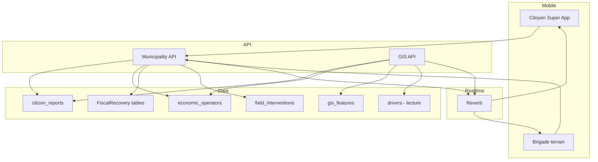
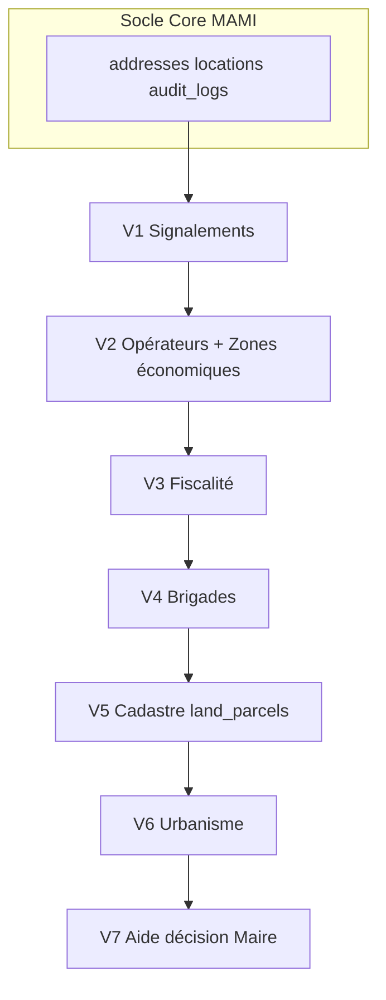

# MAMI GIS — Architecture SIG Territorial Communal d'Owendo

**Version** : 1.0 (document de conception — **aucun code**)  
**Date** : juin 2026  
**Périmètre** : Commune d'Owendo, Gabon  
**Statut** : En attente de validation direction  
**Dépendances** : Super App MAMI (`MAMI_SUPER_APP_ARCHITECTURE.md`)

---

## 1. Vision

Le **SIG MAMI Owendo** est le centre de pilotage numérique communal intégré à la Super App. Il unifie sur une carte interactive :

1. Signalements citoyens  
2. Cartographie économique (recensement numérique)  
3. Suivi du recouvrement fiscal  
4. Supervision du transport MAMI (couche lecture seule)  
5. Équipements municipaux  
6. Pilotage des brigades de terrain  

**Objectif stratégique** : passer d'une gestion administrative réactive à une **gouvernance territoriale data-driven** pour le Maire, les services techniques et les brigades.

---

## 2. Principes généraux

| # | Principe | Application |
|---|----------|-------------|
| G1 | **Tout objet important est géolocalisé** | `latitude`, `longitude` obligatoires ; `address_id` → table `addresses` |
| G2 | **Découpage territorial** | `quartier`, `secteur` (enum ou référentiel) sur chaque entité SIG |
| G3 | **Une source de vérité** | Pas de doublon GPS : profil courant sur l'entité, historique dans `locations` |
| G4 | **Couches cartographiques** | Modèle `gis_layers` + `gis_features` + vues métier spécialisées |
| G5 | **Temps réel + historique** | Reverb pour signalements / transport ; `audit_logs` + snapshots pour fiscalité |
| G6 | **Zéro impact Taxi** | Couche transport = **lecture seule** sur `drivers` — aucune migration Taxi |
| G7 | **Activation progressive** | `MAMI_MODULE_MUNICIPALITY=true` **ET** `MAMI_MODULE_GIS=true` |
| G8 | **Réutilisation Core** | `addresses`, `locations`, `attachments`, `audit_logs`, `roles`, `permissions`, `notifications`, `payments`, `transactions` |

---

## 3. Positionnement dans la Super App

```
app/Modules/
├── Core/                    # Existant — tables communes
├── Taxi/                    # Existant — gel API
├── Municipality/            # Portail mairie, signalements, dashboard maire
│   ├── CitizenReports/      # Sous-domaine signalements
│   ├── EconomicRegistry/    # Recensement opérateurs économiques
│   ├── FiscalRecovery/      # Recouvrement & campagnes
│   └── FieldOperations/     # Brigades terrain
└── GIS/                     # Moteur cartographique transversal
    ├── LayerRegistry/       # gis_layers, gis_features
    ├── MapServices/         # Agrégation couches, tuiles, filtres
    └── RealtimeBroadcast/   # Diffusion carto temps réel
```

### Séparation des responsabilités

| Module | Rôle |
|--------|------|
| **Municipality** | Métier communal (CRUD signalements, opérateurs, fiscalité, brigades) |
| **GIS** | Rendu cartographique, agrégation couches, filtres, recherche spatiale, API carte |

> Le module GIS **ne duplique pas** les données métier : il **projette** les entités Municipality (et Taxi en lecture) sur la carte.

---

## 4. Acteurs et interfaces

| Acteur | Rôle | Interface cible |
|--------|------|-----------------|
| **Citoyen** | Créer / suivre signalements | Super App mobile (`mami_client`) |
| **Agent municipal** | Traiter signalements, consulter carte | Web admin SIG + API |
| **Brigade terrain** | Visites, constats, photos GPS | App mobile brigade (V1.1) ou mode agent dans client |
| **Responsable fiscal** | Campagnes recouvrement, dashboard | Web admin |
| **Maire / cabinet** | Tableau de bord décisionnel | Web dashboard maire |
| **Super admin** | Configuration couches, référentiels | Web admin |

### Rôles existants (extension)

| Rôle | Slug | GIS |
|------|------|-----|
| Citoyen | `citizen` | Signalements |
| Agent municipal | `municipal_agent` | Carte + traitement |
| Admin | `admin` | Configuration |
| Super admin | `super_admin` | Tout |

**Nouveaux rôles proposés (V1)** :

| Rôle | Slug |
|------|------|
| Chef de brigade | `field_team_leader` |
| Agent de brigade | `field_agent` |
| Responsable fiscal | `fiscal_officer` |

---

## 5. Couches cartographiques

### 5.1 Signalements citoyens

| Attribut | Valeur |
|----------|--------|
| Source données | `citizen_reports` (Municipality) |
| Catégories | voirie, eclairage, dechets, inondations, marches, securite, environnement |
| Statuts | nouveau, assigne, en_cours, resolu, cloture |
| Couleurs carte | Rouge / Orange / Vert / Gris |

**Temps réel** : broadcast `CitizenReportCreated`, `CitizenReportStatusChanged` sur canal `private-municipality-{commune_id}`.

### 5.2 Opérateurs économiques

| Attribut | Valeur |
|----------|--------|
| Source | `economic_operators` |
| ID public | `OWE-COM-000001` |
| Statut fiscal | vert / orange / rouge / noir (calculé depuis `economic_operator_tax_status`) |

### 5.3 Commerces

V1 : **sous-ensemble** des opérateurs économiques filtrés par catégorie (boutique, restaurant, atelier, PME, PMI, marché).  
V2 : lien optionnel avec module Commerce (`merchants`) si activé.

### 5.4 Transport MAMI (lecture seule)

| Donnée | Source |
|--------|--------|
| Taxis disponibles | `drivers` WHERE `is_available=true` AND `status=online` |
| Taxis occupés | `drivers` avec course active (`rides` status IN accepted, arrived, started) |
| Position | `drivers.latitude/longitude`, `last_gps_at` |

**Aucune écriture** depuis le module GIS vers les tables Taxi.

### 5.5 Équipements municipaux

Source : `gis_features` WHERE `layer_slug = municipal_facilities`  
Types : école, centre_sante, marche, batiment_admin, espace_public.

---

## 6. Architecture technique

### 6.1 Stack

| Couche | Technologie |
|--------|-------------|
| API | Laravel 13, Sanctum |
| BDD | MySQL 8 |
| Temps réel | Laravel Reverb (Pusher protocol) |
| Carte web admin | Leaflet + OSM (aligné admin existant) |
| Carte mobile | `flutter_map` (aligné apps MAMI) |
| Fichiers | `attachments` polymorphique |
| Audit | `audit_logs` |

### 6.2 Flux de données SIG



### 6.3 Services clés (à implémenter post-validation)

| Service | Module | Responsabilité |
|---------|--------|----------------|
| `GisLayerAggregatorService` | GIS | Fusion couches + filtres |
| `TerritorialSearchService` | GIS | Recherche par bbox, quartier, secteur |
| `CitizenReportService` | Municipality | Cycle de vie signalements |
| `EconomicRegistryService` | Municipality | CRUD opérateurs, génération ID OWE-COM |
| `TaxStatusResolverService` | FiscalRecovery | Calcul vert/orange/rouge/noir |
| `RecoveryCampaignService` | FiscalRecovery | Campagnes et zones prioritaires |
| `FieldInterventionService` | FieldOperations | Visites brigade + validation GPS |
| `MayorDashboardService` | Municipality | KPIs agrégés |

---

## 7. Feature flags

```env
MAMI_MODULE_MUNICIPALITY=true   # Prérequis métier communal
MAMI_MODULE_GIS=true            # Prérequis moteur cartographique
```

Middleware API : `module:municipality` + `module:gis` (GIS endpoints) ou check combiné `EnsureMunicipalityGisEnabled`.

Exposition mobile : extension de `GET /api/app/features` :

```json
{
  "modules": {
    "municipality": true,
    "gis": true
  }
}
```

---

## 8. Sécurité

| Niveau | Mécanisme |
|--------|-----------|
| Authentification | Sanctum Bearer |
| Autorisation | `permissions` + Policies par entité |
| Données fiscales | Restriction `fiscal_officer`, `municipal_agent`, `admin` |
| Transport Taxi | Lecture seule, pas d'exposition PII chauffeur (nom masqué optionnel V1) |
| Photos terrain | `attachments` avec `purpose=field_intervention_photo` |
| Audit | Chaque changement statut → `audit_logs` |

---

## 9. Performance & scalabilité Owendo

| Contrainte | Stratégie |
|------------|-----------|
| ~500–2000 opérateurs économiques | Index spatial `(latitude, longitude)` + filtres quartier |
| Signalements pics | Pagination + clustering carte (Leaflet.markercluster) |
| Temps réel transport | Poll 10 s + Reverb `DriverLocationUpdated` (existant) |
| Dashboard maire | Vues matérialisées ou cache Redis (Phase V1.2) |

---

## 10. Hors périmètre immédiat (V1–V4)

- Orthophotos / données IGN externes  
- Paiement Mobile Money fiscal (via `payments` — V3)  
- App brigade standalone (V4 — mode agent Super App d'abord)  
- Modification tables Taxi  
- **Cadastre** : modèle documenté §8 / `MUNICIPAL_TERRITORIAL_REFERENCE.md` §13 — implémentation **V5**  
- **Urbanisme** : **V6**  
- **BI avancé maire** : **V7**

---

## 11. Documents associés

| Document | Contenu |
|----------|---------|
| `GIS_DATABASE_DESIGN.md` | Schéma tables détaillé |
| `GIS_API_SPECIFICATION.md` | Contrats REST |
| `MUNICIPAL_TERRITORIAL_REFERENCE.md` | Quartiers, ZOP, zones économiques, cadastre futur |
| `MUNICIPALITY_V1_IMPLEMENTATION_PLAN.md` | Phases, jalons, tests |
| `FISCAL_RECOVERY_MODULE_SPEC.md` | Recouvrement fiscal détaillé |

---

## 12. Critères de validation direction

- [ ] Périmètre fonctionnel V1 validé (5 couches carte)  
- [ ] Référentiel quartiers/secteurs Owendo fourni  
- [ ] Règles fiscales vert/orange/rouge/noir validées par la commune  
- [ ] Politique de confidentialité données opérateurs économiques  
- [ ] Référentiel territorial Owendo validé (`MUNICIPAL_TERRITORIAL_REFERENCE.md`)  
- [ ] Zones économiques et schéma d'évolution V1–V7 approuvés  

---

## 13. Schéma d'évolution SIG Owendo (V1 → V7)

Roadmap produit validée — chaque version **étend** la précédente sans refonte.

| Version | Nom | Contenu principal | Couches SIG |
|---------|-----|-------------------|-------------|
| **V1** | Signalements | `citizen_reports`, workflow citoyen → agent, Reverb | Signalements |
| **V2** | Opérateurs économiques | `economic_operators`, `economic_zones`, registre `OWE-COM-*` | + Opérateurs, commerces |
| **V3** | Fiscalité | Statuts fiscal, `municipal_revenues`, campagnes recouvrement | + Fiscalité (couleur statut) |
| **V4** | Brigades | `field_teams`, `field_interventions`, GPS + photos terrain | + Interventions |
| **V5** | Cadastre communal | `land_parcels`, `parcel_reference`, occupations, concessions, domaine communal | + Cadastre |
| **V6** | Urbanisme | Permis, zonage, occupations irrégulières, lien parcelles | + Zonage PLU |
| **V7** | Aide à la décision Maire | BI, scénarios, indicateurs prédictifs, exports exécutifs | Toutes couches + analytics |



### Jalons techniques par version

| Version | Feature flags | Migration clé |
|---------|---------------|---------------|
| V1 | `MUNICIPALITY` + `GIS` | M3 `citizen_reports` |
| V2 | idem | M1–M2 `economic_zones`, `economic_operators` |
| V3 | idem | M5 recouvrement |
| V4 | idem | M4 brigades |
| V5 | `MUNICIPALITY_CADASTRE` *(proposé)* | M7 `land_parcels` |
| V6 | `MUNICIPALITY_URBANISM` *(proposé)* | Tables urbanisme *(à spécifier)* |
| V7 | — | Vues BI / cache — pas de rupture schéma |

> Plan détaillé phases P1–P7 : `MUNICIPALITY_V1_IMPLEMENTATION_PLAN.md`  
> Référentiel territorial : `MUNICIPAL_TERRITORIAL_REFERENCE.md`

### Critères Go développement

- [ ] Budget VPS / stockage photos brigades  
- [ ] **Go / No-Go développement**  

---

*Document de conception — ne pas implémenter de code avant validation complète.*
