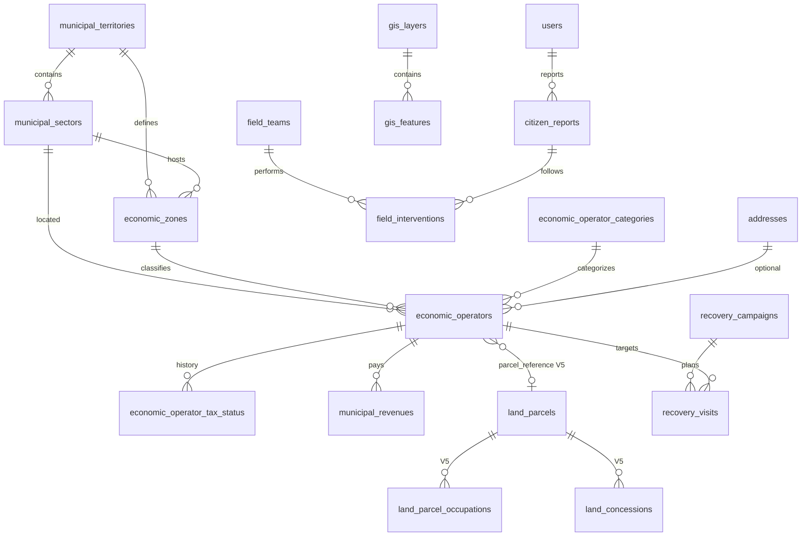

# MAMI GIS — Conception Base de Données

**Version** : 1.0 (document de conception — **aucun code**)  
**Date** : juin 2026  
**Référence** : `MAMI_DATABASE_MASTER_PLAN.md`, `GIS_ARCHITECTURE.md`

---

## 1. Principes

| Règle | Application |
|-------|-------------|
| Réutiliser le Core | `addresses`, `locations`, `attachments`, `audit_logs`, `payments`, `transactions`, `notifications` |
| Pas de table GPS dupliquée | Coordonnées courantes sur entité + FK `address_id` optionnelle |
| Pas de table Taxi altérée | Couche transport = lecture `drivers` |
| ID opérateur lisible | `OWE-COM-NNNNNN` stocké dans `economic_operators.public_id` |
| Statut fiscal calculé + historisé | `economic_operator_tax_status` (journal) + colonne dénormalisée `current_tax_status` |

---

## 2. Référentiels territoriaux (nouvelles tables)

### 2.1 `municipal_territories`

Découpage administratif Owendo.

| Colonne | Type | Notes |
|---------|------|-------|
| id | BIGINT PK | |
| name | VARCHAR(100) | Ex. « Owendo » |
| code | VARCHAR(20) UNIQUE | `OWE` |
| bounds_ne_lat/lng, bounds_sw_lat/lng | DECIMAL | Bbox commune (optionnel) |
| timestamps | | |

### 2.2 `municipal_sectors`

Secteurs / quartiers.

| Colonne | Type | Notes |
|---------|------|-------|
| id | BIGINT PK | |
| territory_id | FK | → `municipal_territories` |
| name | VARCHAR(100) | Nom quartier |
| slug | VARCHAR(50) | `owendo-centre` |
| sector_type | ENUM | quartier, secteur, zone |
| parent_id | FK NULL | Hiérarchie |
| center_latitude | DECIMAL(10,7) NULL | |
| center_longitude | DECIMAL(10,7) NULL | |
| polygon_geojson | JSON NULL | V1 optionnel ; V2 polygones |
| timestamps | | |

**Index** : `(territory_id, slug)` UNIQUE

### 2.3 `economic_zones`

Référentiel économique communal — marchés, zones industrielles, portuaires et commerciales.  
Voir `MUNICIPAL_TERRITORIAL_REFERENCE.md` §5.

| Colonne | Type | Notes |
|---------|------|-------|
| id | BIGINT PK | |
| territory_id | FK | → `municipal_territories` |
| code | VARCHAR(20) UNIQUE | `OWE-ZEC-06` |
| name | VARCHAR(150) | Ex. « Zone commerciale SNI » |
| slug | VARCHAR(50) | `zone-commerciale-sni` |
| zone_kind | ENUM | `marche`, `zone_industrielle`, `zone_portuaire`, `zone_commerciale` |
| operational_zone_id | FK NULL | → `municipal_sectors` (`sector_type = zone`) |
| primary_sector_id | FK NULL | Quartier de référence |
| center_latitude | DECIMAL(10,7) NULL | |
| center_longitude | DECIMAL(10,7) NULL | |
| polygon_geojson | JSON NULL | V2 — emprise zone économique |
| is_active | BOOLEAN DEFAULT true | |
| metadata | JSON NULL | |
| timestamps | | |

**Index** : `(territory_id, zone_kind)`, `(operational_zone_id)`

---

## 3. Tables demandées — spécification détaillée

### 3.1 `economic_operator_categories`

| Colonne | Type | Notes |
|---------|------|-------|
| id | BIGINT PK | |
| slug | VARCHAR(50) UNIQUE | boutique, restaurant, atelier, pme, pmi, marche |
| name | VARCHAR(100) | Libellé FR |
| parent_id | FK NULL | Arborescence |
| icon | VARCHAR(50) NULL | Carte |
| timestamps | | |

### 3.2 `economic_operators`

Registre numérique communal — cœur cartographie économique.

| Colonne | Type | Notes |
|---------|------|-------|
| id | BIGINT PK | |
| public_id | VARCHAR(20) UNIQUE | `OWE-COM-000001` |
| territory_id | FK | Commune |
| sector_id | FK NULL | → `municipal_sectors` (quartier) |
| operational_zone_id | FK NULL | → `municipal_sectors` (ZOP) — dénormalisé |
| economic_zone_id | FK NULL | → `economic_zones` |
| category_id | FK | → `economic_operator_categories` |
| address_id | FK NULL | → `addresses` |
| commercial_name | VARCHAR(255) | |
| legal_name | VARCHAR(255) NULL | |
| activity_label | VARCHAR(255) | Activité déclarée |
| responsible_name | VARCHAR(150) | |
| phone | VARCHAR(20) | |
| email | VARCHAR(150) NULL | |
| latitude | DECIMAL(10,7) | **Obligatoire V1** |
| longitude | DECIMAL(10,7) | **Obligatoire V1** |
| quartier | VARCHAR(100) NULL | Texte libre si sector_id absent |
| secteur | VARCHAR(100) NULL | |
| registration_date | DATE | Date enregistrement communal |
| registered_by | FK NULL | → `users` (agent) |
| current_tax_status | ENUM | a_jour, retard_90, retard_plus_90, non_enregistre |
| parcel_reference | VARCHAR(50) NULL | **Réservé V5** — `OWE-PAR-*` → `land_parcels` |
| is_active | BOOLEAN DEFAULT true | |
| metadata | JSON NULL | |
| timestamps | | |
| deleted_at | TIMESTAMP NULL | Soft delete |

**Index** :
- `(latitude, longitude)` — requêtes carte  
- `(sector_id, current_tax_status)`  
- `(economic_zone_id, current_tax_status)`  
- `(operational_zone_id)`  
- `(category_id)`  
- `public_id` UNIQUE  

### 3.3 `economic_operator_tax_status`

Journal historique du statut fiscal (ne jamais écraser).

| Colonne | Type | Notes |
|---------|------|-------|
| id | BIGINT PK | |
| economic_operator_id | FK | |
| status | ENUM | a_jour, retard_90, retard_plus_90, non_enregistre |
| effective_from | DATE | |
| effective_to | DATE NULL | |
| days_overdue | INT NULL | |
| outstanding_amount | DECIMAL(12,2) NULL | FCFA |
| assessed_by | FK NULL | → `users` |
| notes | TEXT NULL | |
| timestamps | | |

**Index** : `(economic_operator_id, effective_from)`

### 3.4 `municipal_revenues`

Encaissements liés aux opérateurs — utilise `payments` en V2 ; V1 enregistrement direct.

| Colonne | Type | Notes |
|---------|------|-------|
| id | BIGINT PK | |
| economic_operator_id | FK | |
| payment_id | FK NULL | → `payments` (Phase V2) |
| amount | DECIMAL(12,2) | |
| currency | CHAR(3) DEFAULT XAF | |
| revenue_type | VARCHAR(30) | taxe_municipale, redevance, amende |
| period_year | SMALLINT | |
| period_month | TINYINT NULL | |
| collected_at | TIMESTAMP | |
| collected_by | FK NULL | → `users` |
| field_intervention_id | FK NULL | Lien visite brigade |
| receipt_reference | VARCHAR(50) NULL | |
| metadata | JSON NULL | |
| timestamps | | |

**Index** : `(period_year, period_month)`, `(economic_operator_id)`

### 3.5 `recovery_campaigns`

Campagnes de recouvrement ciblées.

| Colonne | Type | Notes |
|---------|------|-------|
| id | BIGINT PK | |
| territory_id | FK | |
| name | VARCHAR(150) | |
| description | TEXT NULL | |
| status | ENUM | draft, active, paused, completed |
| target_sectors | JSON NULL | Liste sector_id |
| target_tax_statuses | JSON | ex. `["retard_90","retard_plus_90"]` |
| start_date | DATE | |
| end_date | DATE NULL | |
| target_amount | DECIMAL(14,2) NULL | |
| collected_amount | DECIMAL(14,2) DEFAULT 0 | |
| created_by | FK | → `users` |
| timestamps | | |

### 3.6 `recovery_visits`

Visites planifiées dans le cadre d'une campagne.

| Colonne | Type | Notes |
|---------|------|-------|
| id | BIGINT PK | |
| campaign_id | FK | → `recovery_campaigns` |
| economic_operator_id | FK | |
| field_team_id | FK NULL | → `field_teams` |
| scheduled_at | TIMESTAMP NULL | |
| visited_at | TIMESTAMP NULL | |
| status | ENUM | planned, completed, skipped, rescheduled |
| outcome | VARCHAR(50) NULL | paid, promise, refused, absent |
| amount_collected | DECIMAL(12,2) NULL | |
| notes | TEXT NULL | |
| timestamps | | |

### 3.7 `field_teams`

Brigades municipales.

| Colonne | Type | Notes |
|---------|------|-------|
| id | BIGINT PK | |
| territory_id | FK | |
| name | VARCHAR(100) | Ex. « Brigade Owendo Centre » |
| leader_user_id | FK | → `users` |
| assigned_sectors | JSON | sector_id[] |
| is_active | BOOLEAN DEFAULT true | |
| timestamps | | |

### 3.8 `field_team_members`

| team_id | user_id | role (leader, agent) | joined_at |

### 3.9 `field_interventions`

Trace terrain (signalements + recouvrement + contrôles).

| Colonne | Type | Notes |
|---------|------|-------|
| id | BIGINT PK | |
| field_team_id | FK | |
| agent_user_id | FK | → `users` |
| intervention_type | ENUM | report_followup, fiscal_visit, inspection, other |
| citizen_report_id | FK NULL | |
| recovery_visit_id | FK NULL | |
| economic_operator_id | FK NULL | |
| latitude | DECIMAL(10,7) | GPS constat |
| longitude | DECIMAL(10,7) | |
| accuracy_meters | SMALLINT NULL | |
| started_at | TIMESTAMP | |
| completed_at | TIMESTAMP NULL | |
| report_text | TEXT NULL | Compte rendu |
| validated_gps | BOOLEAN DEFAULT false | |
| status | ENUM | draft, submitted, validated, rejected |
| validated_by | FK NULL | |
| timestamps | | |

**Pièces jointes** : `attachments` WHERE `attachable_type = field_intervention`

**Historique GPS** : entrée `locations` à la soumission

### 3.10 `gis_layers`

Registre des couches cartographiques.

| Colonne | Type | Notes |
|---------|------|-------|
| id | BIGINT PK | |
| slug | VARCHAR(50) UNIQUE | citizen_reports, economic_operators, fiscal, transport, facilities |
| name | VARCHAR(100) | |
| description | TEXT NULL | |
| is_enabled | BOOLEAN DEFAULT true | |
| default_visible | BOOLEAN | |
| z_index | SMALLINT | Ordre affichage |
| style_config | JSON | Couleurs, icônes par statut |
| source_type | ENUM | table, view, api |
| source_config | JSON | Table/vue/endpoint |
| timestamps | | |

### 3.11 `gis_features`

Entités géographiques génériques (équipements municipaux, points d'intérêt).

| Colonne | Type | Notes |
|---------|------|-------|
| id | BIGINT PK | |
| layer_id | FK | → `gis_layers` |
| feature_type | VARCHAR(50) | school, health_center, market, admin_building, public_space |
| name | VARCHAR(255) | |
| address_id | FK NULL | |
| latitude | DECIMAL(10,7) | |
| longitude | DECIMAL(10,7) | |
| sector_id | FK NULL | |
| properties | JSON | Attributs libres |
| is_active | BOOLEAN DEFAULT true | |
| timestamps | | |

**Index** : `(layer_id, feature_type)`, `(latitude, longitude)`

---

## 4. Table complémentaire — Signalements citoyens

Non listée dans le cahier des charges initial mais **requise** pour la couche signalements.

### `citizen_reports`

| Colonne | Type | Notes |
|---------|------|-------|
| id | BIGINT PK | |
| public_reference | VARCHAR(20) UNIQUE | `OWE-SIG-000001` |
| reporter_user_id | FK | → `users` |
| category | ENUM | voirie, eclairage, dechets, inondations, marches, securite, environnement |
| status | ENUM | nouveau, assigne, en_cours, resolu, cloture |
| title | VARCHAR(255) | |
| description | TEXT | |
| latitude | DECIMAL(10,7) | |
| longitude | DECIMAL(10,7) | |
| address_id | FK NULL | |
| sector_id | FK NULL | |
| quartier | VARCHAR(100) NULL | |
| assigned_to | FK NULL | → `users` |
| assigned_team_id | FK NULL | → `field_teams` |
| resolved_at | TIMESTAMP NULL | |
| resolution_notes | TEXT NULL | |
| timestamps | | |

**Index** : `(status, category)`, `(latitude, longitude)`, `(sector_id)`

---

## 5. Réutilisation tables Core (existantes)

| Table Core | Usage GIS / Municipality |
|------------|------------------------|
| `addresses` | Normalisation adresses opérateurs, équipements |
| `locations` | Trace GPS interventions brigade, historique déplacement |
| `attachments` | Photos signalements, photos constats brigade |
| `audit_logs` | Tous changements statut signalement / fiscal |
| `notifications` | Alertes citoyen (signalement résolu), agent (nouveau signalement) |
| `payments` | V2 — encaissement fiscal Mobile Money |
| `transactions` | V2 — ledger paiements |
| `roles` / `permissions` | Contrôle accès |
| `users` | Citoyens, agents, brigades |

---

## 6. Vues SQL proposées (V1.1)

| Vue | Usage |
|-----|-------|
| `v_gis_economic_operators_map` | Opérateurs + statut fiscal + catégorie |
| `v_gis_citizen_reports_map` | Signalements + couleur statut |
| `v_gis_transport_snapshot` | JOIN `drivers` + course active (lecture seule) |
| `v_fiscal_recovery_dashboard` | Agrégats campagnes / montants |

---

## 7. Diagramme entités (simplifié)

---

## 8. Cadastre communal — modèle futur (V5, non migré V1)

Préparation **sans refonte** : champs `parcel_reference` réservés dès V2 ; tables créées en V5 uniquement.

### 8.1 `land_parcels` *(future)*

| Colonne | Type | Notes |
|---------|------|-------|
| id | BIGINT PK | |
| parcel_reference | VARCHAR(50) UNIQUE | `OWE-PAR-000001` |
| territory_id | FK | |
| sector_id | FK NULL | Quartier |
| economic_zone_id | FK NULL | |
| parcel_type | ENUM | concession, occupation, domaine_communal, autre |
| area_sqm | DECIMAL(12,2) NULL | |
| owner_name | VARCHAR(255) NULL | |
| occupant_name | VARCHAR(255) NULL | |
| polygon_geojson | JSON | Emprise |
| status | ENUM | active, disputed, regularized, archived |
| metadata | JSON NULL | |
| timestamps | | |

### 8.2 `land_parcel_occupations` *(future)*

| Colonne | Type | Notes |
|---------|------|-------|
| id | BIGINT PK | |
| land_parcel_id | FK | |
| economic_operator_id | FK NULL | |
| occupation_type | ENUM | commercial, residential, industrial, other |
| started_at | DATE NULL | |
| ended_at | DATE NULL | |
| is_current | BOOLEAN | |
| timestamps | | |

### 8.3 `land_concessions` *(future)*

| Colonne | Type | Notes |
|---------|------|-------|
| id | BIGINT PK | |
| land_parcel_id | FK | |
| concession_reference | VARCHAR(50) UNIQUE | Référence titre |
| holder_name | VARCHAR(255) | |
| granted_at | DATE | |
| expires_at | DATE NULL | |
| status | ENUM | active, expired, revoked |
| metadata | JSON NULL | |
| timestamps | | |

### 8.4 `communal_domain_parcels` *(future)*

Sous-ensemble `land_parcels` où `parcel_type = domaine_communal` ; table de liaison optionnelle pour équipements (`gis_features.parcel_reference`).

### 8.5 Couche SIG cadastre (V5)

| `gis_layers.slug` | Source |
|-------------------|--------|
| `cadastre` | `land_parcels` + style par `parcel_type` / `status` |

---

## 9. Tables Taxi — confirmation non-altération

| Table Taxi | Modifiée par GIS V1 ? |
|------------|----------------------|
| `drivers` | **Non** — lecture seule via vue |
| `rides` | **Non** |
| `ride_offers` | **Non** |
| `ride_dispatch_waves` | **Non** |
| `vehicles` | **Non** |

---

## 10. Migration strategy

| Phase | Migrations |
|-------|------------|
| M1 | `municipal_territories`, `municipal_sectors`, `economic_zones` |
| M2 | `economic_operator_categories`, `economic_operators` (+ `economic_zone_id`, `operational_zone_id`, `parcel_reference` NULL), `economic_operator_tax_status` |
| M3 | `citizen_reports` |
| M4 | `field_teams`, `field_team_members`, `field_interventions` |
| M5 | `recovery_campaigns`, `recovery_visits`, `municipal_revenues` |
| M6 | `gis_layers`, `gis_features` + seed couches |
| M7 *(V5)* | `land_parcels`, `land_parcel_occupations`, `land_concessions` + couche `cadastre` |

Chaque migration **additive uniquement** — aucun `Schema::table` sur tables Taxi ou Core existantes.

---

## 11. Seeders prévus

| Seeder | Contenu |
|--------|---------|
| `OwendoTerritorySeeder` | Commune, arrondissements, quartiers, ZOP, **zones économiques** |
| `EconomicOperatorCategorySeeder` | Catégories métiers |
| `GisLayerSeeder` | 5 couches + styles couleur |
| `MunicipalityPermissionSeeder` | Permissions GIS / fiscal / brigade |

---

*Document de conception — validation requise avant `php artisan make:migration`.*
