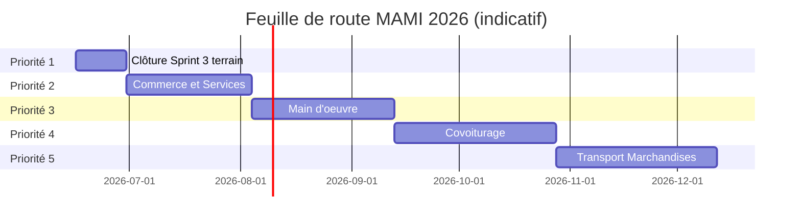

# Plan d'exécution MAMI 2026

**Version :** 1.0  
**Date :** juin 2026  
**Statut :** document de gouvernance produit — feuille de route figée  
**Branche de référence :** `feature/mami-taxi-v2-p2`  
**Public :** Maire, chef de projet, équipe technique

---

## Documents liés

| Document | Contenu |
|----------|---------|
| [ARCHITECTURE_SUPER_APP_MAMI.md](MAMI_SUPER_APP_MASTER_ARCHITECTURE.md) | Architecture plateforme |
| [MAMI_MODULES_SPECIFICATION.md](MAMI_MODULES_SPECIFICATION.md) | Spécification modules backend |
| [MAMI_ROLE_PERMISSION_MATRIX.md](MAMI_ROLE_PERMISSION_MATRIX.md) | Matrice rôles et permissions |
| [MUNICIPALITY_V3_SPRINT3_REPORT.md](MUNICIPALITY_V3_SPRINT3_REPORT.md) | Livraison Sprint 3 |
| [municipality-v3/18_PLAN_DEPLOIEMENT.md](municipality-v3/18_PLAN_DEPLOIEMENT.md) | Déploiement fiscal V3.0 → V3.5 |

---

## Règles de gouvernance

1. **La feuille de route officielle 2026 est figée.** Aucun nouveau module ne démarre tant que le module précédent n'est pas déclaré terminé.
2. **Toute nouvelle idée** doit être documentée dans un backlog et reportée à une phase ultérieure, sans modifier l'ordre des priorités.
3. **Langue officielle :** français pour le métier, la documentation et les interfaces utilisateur. Les noms techniques de classes Laravel/Flutter restent en anglais.
4. **Séparation Taxi / Covoiturage :** le covoiturage concerne des particuliers publiant des trajets à l'avance ; le taxi reste un service professionnel avec dispatch et tarification dédiés.

### Ordre obligatoire des développements

| Priorité | Module | Statut juin 2026 |
|----------|--------|------------------|
| **1** | Municipality V3 Sprint 3 — Quittances officielles | ✅ Livré — clôture terrain en cours |
| **2** | MAMI Commerce & Services | ⏳ À démarrer après clôture P1 |
| **3** | MAMI Main d'œuvre | ⏳ En attente |
| **4** | MAMI Covoiturage | ⏳ En attente |
| **5** | MAMI TM (Transport Marchandises) | ⏳ En attente |

### Architecture cible fin 2026

| APK | Modules |
|-----|---------|
| **MAMI Client** | Taxi, Commerce & Services, Main d'œuvre, Covoiturage, TM, Signalements |
| **MAMI Driver** | Taxi, Covoiturage, TM (profils multiples par utilisateur) |
| **MAMI Agent** | Recensement, Fiscalité, Recouvrement, SIG |
| **Backend partagé** | Laravel, MySQL, Reverb, Paiements, GIS, Notifications |

---

## Synthèse des estimations globales

| Priorité | Module | Jours dev estimés | Migrations | API | Écrans Flutter | Réutilisation majeure |
|----------|--------|-------------------|------------|-----|----------------|----------------------|
| 1 | Municipality V3 Sprint 3 | 0–10 (clôture) | 0 | 0–1 | 0–1 | Sprint 1–3 existant |
| 2 | Commerce & Services | 25–35 | 4–6 | 12–18 | 8–12 | `economic_operators`, SIG, QR, GPS |
| 3 | Main d'œuvre | 30–40 | 5–7 | 14–20 | 10–14 | Auth, ratings, notifications, GIS |
| 4 | Covoiturage | 35–45 | 6–8 | 16–22 | 12–16 | GPS taxi, Reverb, notifications, paiements |
| 5 | TM | 35–45 | 6–8 | 16–22 | 12–16 | Dispatch taxi, profils driver, Reverb |
| **Total estimé** | | **125–175 jours** | **21–29** | **58–83** | **42–59** | |

> Estimations pour une équipe de 2 développeurs full-stack (Laravel + Flutter), hors déploiement VPS et validation terrain mairie.

---

# PRIORITÉ 1 — Municipality V3 Sprint 3

## Résumé exécutif

**Objectif :** boucler le cycle fiscal municipal complet : scan QR → situation fiscale → encaissement → quittance officielle → impression terrain → vérification publique.

**État juin 2026 :** livraison technique **terminée** (backend + Flutter agent). La priorité 1 est en phase de **clôture et validation terrain** avant déclaration officielle « module terminé ».

---

## 1. Objectif métier

Permettre aux agents municipaux d'Owendo d'encaisser les taxes sur le terrain, d'émettre une **quittance officielle** vérifiable publiquement, et de la remettre immédiatement au commerçant via impression thermique Bluetooth 58 mm.

**Fin attendue :** cycle fiscal municipal complet opérationnel en production sur au moins une zone pilote (ex. Marché Central Owendo).

---

## 2. Fonctionnalités utilisateurs

### Agent municipal (APK Agent / `mami_client`)
- Scanner le QR d'un opérateur économique
- Consulter la situation fiscale (obligations, impayés)
- Encaisser en espèces dans une session de caisse ouverte
- Recevoir une quittance officielle `OWE-RCP-YYYY-NNNNNN`
- Imprimer la quittance sur imprimante Bluetooth 58 mm
- Consulter l'historique des quittances et réimprimer (audit)
- Superviseur : annuler une quittance avec motif

### Commerçant / citoyen
- Scanner le QR imprimé sur la quittance
- Vérifier l'authenticité sur `https://mami.ga/public/receipts/verify/{token}`
- Statuts affichés : valide, annulée, remboursée, introuvable

### Maire / administrateur (backoffice)
- Dashboard quittances émises, annulées, montants par quartier/agent/taxe
- Supervision agents actifs et dernières quittances

---

## 3. Modules Laravel concernés

| Composant | Emplacement | Rôle |
|-----------|-------------|------|
| `MunicipalReceiptController` | `app/Modules/Municipality/Http/Controllers/` | API quittances agent |
| `PublicReceiptVerificationController` | idem | Vérification publique |
| `MayorReceiptAdminController` | `Admin/` | Dashboard maire |
| `MunicipalReceiptPdfService` | `app/Modules/Municipality/Services/` | PDF A4 + thermique 58 mm |
| `ReceiptDocumentHasher` | idem | Signature SHA-256 |
| `ReceiptVerificationService` | idem | Vérification token |
| `ReceiptReprintService` | idem | Réimpression versionnée |
| `ReceiptCancellationService` | idem | Annulation superviseur |
| `FiscalCollectionController` | idem | Encaissement (émet quittance) |
| `MayorReceiptDashboardService` | idem | KPIs maire |

---

## 4. Modules Flutter concernés

| Écran | Route | APK |
|-------|-------|-----|
| Hub recouvrement | `/municipality/recovery` | Agent |
| Ouverture / fermeture caisse | `/municipality/recovery/open-session`, `close-session` | Agent |
| Scan QR commerce | `/municipality/recovery/scan` | Agent |
| Situation fiscale | `/municipality/recovery/fiscal-summary` | Agent |
| Encaissement | `/municipality/recovery/collect` | Agent |
| Historique quittances | `/municipality/recovery/receipts` | Agent |
| Impression quittance | `/municipality/recovery/print-receipt/:id` | Agent |
| `PrinterService` + `BluetoothPrinterAdapter` | `features/municipality/printing/` | Agent |

---

## 5. Tables réutilisées

| Table | Usage Sprint 3 |
|-------|----------------|
| `municipal_receipts` | Quittance officielle (base Sprint 1–2, enrichie Sprint 3) |
| `municipal_payments` | Paiement source de la quittance |
| `municipal_payment_allocations` | Ventilation par taxe |
| `cash_sessions` | Session de caisse active |
| `economic_operators` | Commerce payeur |
| `fiscal_obligations` | Obligations couvertes |
| `users` | Agent collecteur, superviseur |

---

## 6. Nouvelles tables créées (Sprint 3 — livré)

| Table / colonnes | Migration |
|------------------|-----------|
| Colonnes Sprint 3 sur `municipal_receipts` : `verification_token`, `document_hash`, `signed_at`, `status`, `annulled_*`, `refunded_*`, `reprint_count` | `2026_06_25_100000_create_municipality_v3_sprint3_official_receipts.php` |
| `municipal_receipt_documents` | idem (versions PDF A4 / thermique) |
| Extension `receipt_qr_value` (URL complète) | `2026_06_25_100001_widen_municipal_receipt_qr_value_column.php` |

**Migrations restantes pour clôture P1 :** aucune.

---

## 7. API développées (Sprint 3 — livré)

| Méthode | Route | Permission |
|---------|-------|------------|
| GET | `/api/municipality/fiscal/receipts` | `municipal.payment.collect` |
| GET | `/api/municipality/fiscal/receipts/{id}` | idem |
| GET | `/api/municipality/fiscal/receipts/{id}/pdf/{format?}` | idem |
| POST | `/api/municipality/fiscal/receipts/{id}/reprint` | idem |
| POST | `/api/municipality/fiscal/receipts/{id}/annul` | `municipal.receipt.annul` |
| GET | `/public/receipts/verify/{token}` | Publique (sans auth) |
| GET | `/admin/municipality/mayor` | `core.admin.access` |

**API optionnelle clôture :** `POST /api/municipality/fiscal/receipts/{id}/refund` (service `ReceiptCancellationService::refund()` existe, route HTTP absente — à décider : backlog Sprint 4 ou clôture P1).

---

## 8. Permissions (Sprint 3 — livré)

| Slug | Rôle | Usage |
|------|------|-------|
| `municipal.payment.collect` | `municipal_agent` | Liste, détail, PDF, réimpression |
| `municipal.receipt.annul` | `admin` | Annulation superviseur |
| `municipality.collections.manage` | `municipal_agent` | Accès global recouvrement |
| `municipal.cash_session.open/close` | `municipal_agent` | Prérequis encaissement |
| `municipal.fiscal.view` | `municipal_agent` | Situation fiscale |

---

## 9. Écrans Android (Sprint 3 — livré)

| Écran | Statut |
|-------|--------|
| Historique quittances | ✅ Livré |
| Impression Bluetooth 58 mm | ✅ Livré |
| Navigation post-encaissement → impression | ✅ Livré |
| Sélection imprimante mémorisée | ✅ Livré |

**Écrans restants clôture :** aucun obligatoire. Validation terrain imprimante réelle recommandée.

---

## 10. Écrans backoffice (Sprint 3 — livré)

| Écran | URL | Statut |
|-------|-----|--------|
| Dashboard maire quittances | `/admin/municipality/mayor` | ✅ Livré |
| Vérification publique | `/public/receipts/verify/{token}` | ✅ Livré |
| Vues PDF Blade A4 + thermique | `resources/views/municipality/receipts/` | ✅ Livré |

---

## 11. Dépendances avec modules existants

| Module | Dépendance |
|--------|------------|
| Sprint 1 — Moteur fiscal | Obligations et taxes à encaisser |
| Sprint 2 — Sessions de caisse | Encaissement impossible sans session ouverte |
| Registre économique | QR opérateur `OWE-COM-*` |
| Core — Auth Sanctum | Authentification agent |
| Core — Audit | Journal annulation / réimpression |
| Domaines `mami.ga` | URL QR vérification publique |

---

## 12. Risques techniques

| Risque | Gravité | Mitigation |
|--------|---------|------------|
| Imprimante Bluetooth incompatible (ESC/POS) | Moyenne | Tests terrain sur 2–3 modèles 58 mm courants au Gabon |
| QR illisible sur thermique | Faible | Contraste, taille QR, test scan multi-appareils |
| Module municipalité désactivé en prod (`MAMI_MODULE_MUNICIPALITY=false`) | Haute | Checklist déploiement + `config:cache` |
| Perte sync offline (hors Sprint 3) | Moyenne | Reporté backlog Sprint 4 — ne bloque pas clôture P1 |
| Annulation sans remboursement API | Faible | Workflow superviseur manuel acceptable en pilote |

---

## 13. Tests attendus

| Suite | Fichier | Statut |
|-------|---------|--------|
| PDF A4 + thermique | `MunicipalReceiptPdfTest` | ✅ |
| Signature SHA-256 | `ReceiptSignatureTest` | ✅ |
| Vérification publique | `ReceiptVerificationTest` | ✅ |
| Annulation | `ReceiptCancellationTest` | ✅ |
| Suite Municipality complète | `tests/Feature/Municipality/` | ✅ ~170 cas |

**Tests clôture terrain (manuels) :**
1. Encaissement commerce test avec session ouverte
2. Vérification PDF A4 + thermique en base
3. Scan QR → page vérification publique
4. Impression Bluetooth sur imprimante réelle
5. Réimpression + vérification audit et nouvelle version document

---

## 14. Critères de validation

- [ ] `MAMI_MODULE_MUNICIPALITY=true` en production VPS
- [ ] Migrations Sprint 1–3 appliquées (`php artisan migrate`)
- [ ] Permissions re-seedées (`RolePermissionSeeder`)
- [ ] 100 encaissements espèces pilote sans perte de données
- [ ] Quittances PDF téléchargeables et vérifiables publiquement
- [ ] Impression thermique validée sur au moins 1 imprimante terrain
- [ ] Dashboard maire accessible avec KPIs cohérents
- [ ] 0 régression tests Taxi CI
- [ ] Clôture caisse bout-en-bout sur session pilote

---

## 15. Critères de fin de sprint (déclaration « module terminé »)

Le module **Priorité 1** est déclaré terminé lorsque :

1. Tous les critères de validation ci-dessus sont cochés.
2. Le Maire ou le superviseur municipal valide le parcours terrain sur la zone pilote.
3. Un procès-verbal de recette est signé (document interne mairie).
4. Le rapport de clôture est publié : mise à jour de `MUNICIPALITY_V3_SPRINT3_REPORT.md` avec date de validation terrain.

**Seulement après cette déclaration** la Priorité 2 (Commerce & Services) peut démarrer.

### Estimations clôture P1

| Indicateur | Valeur |
|------------|--------|
| Jours de développement restants | 0–10 (corrections mineures, route refund optionnelle) |
| Migrations | 0 |
| API | 0–1 |
| Écrans Flutter | 0–1 |
| Éléments réutilisables | 100 % du Sprint 3 livré |

---

# PRIORITÉ 2 — MAMI Commerce & Services

## Résumé exécutif

**Objectif :** annuaire public des commerces et services d'Owendo, alimenté par le registre économique municipal existant, enrichi pour le grand public.

**Prérequis :** Priorité 1 déclarée terminée.

---

## 1. Objectif métier

Permettre à tout citoyen de **rechercher, localiser et consulter** les commerces et services de la commune : horaires, coordonnées, catégorie, avis, position GPS sur carte.

Réutiliser le travail d'enrôlement municipal (`economic_operators`) sans dupliquer les données fiscales sensibles.

---

## 2. Fonctionnalités utilisateurs

### Citoyen (APK Client)
- Parcourir l'annuaire par catégorie (boutique, restaurant, garage, PME, marché…)
- Rechercher par nom, quartier, zone opérationnelle
- Voir la fiche commerce : photo façade, adresse, téléphone, GPS, horaires
- Afficher sur carte SIG (carte Owendo)
- Scanner le QR commerce pour accéder à la fiche publique
- Laisser un avis / note (option phase 2 du module)

### Commerçant (rôle `merchant`)
- Demander la revendication de sa fiche (lien avec `economic_operator` existant)
- Mettre à jour horaires, description, photo (sous validation admin)

### Administrateur (backoffice)
- Publier / dépublier une fiche dans l'annuaire public
- Modérer les avis
- Statistiques consultations par zone

---

## 3. Modules Laravel concernés

| Composant | Emplacement | Action |
|-----------|-------------|--------|
| `CommerceModuleServiceProvider` | `app/Modules/Commerce/` | Étendre scaffold existant |
| `PublicMerchantController` | `Http/Controllers/` | Annuaire public (lecture) |
| `MerchantProfileController` | idem | Gestion fiche commerçant |
| `MerchantDirectoryService` | `Services/` | Recherche, filtres, géo |
| `EconomicOperator` (Municipality) | `app/Modules/Municipality/Models/` | **Réutiliser** — source de vérité |
| `EconomicZone`, `MunicipalSector` | idem | Filtres territoriaux |
| `CommerceAdminController` | `Admin/` | Modération backoffice |

---

## 4. Modules Flutter concernés

| Écran | Route proposée | APK |
|-------|----------------|-----|
| Tuile Commerce (portail Super App) | `/commerce` | Client |
| Liste / recherche commerces | `/commerce/search` | Client |
| Fiche commerce détaillée | `/commerce/merchants/:id` | Client |
| Carte commerces | `/commerce/map` | Client |
| Scan QR → fiche | `/commerce/scan` | Client |
| Revendication fiche (commerçant) | `/commerce/my-business` | Client |
| Édition horaires / description | `/commerce/my-business/edit` | Client |

**Réutilisation :** `flutter_map`, patterns SIG municipality, `AppConfig`, feature flag `MAMI_MODULE_COMMERCE`.

---

## 5. Tables réutilisées

| Table | Usage |
|-------|-------|
| `economic_operators` | Fiche commerce source (nom, GPS, catégorie, photo, `public_id`) |
| `economic_operator_categories` | Filtres annuaire |
| `economic_zones` | Zones économiques, regroupement carte |
| `municipal_territories`, `municipal_sectors` | Quartier, arrondissement |
| `economic_operator_qrcodes` | Lien scan QR → fiche publique |
| `users` | Commerçant revendiquant sa fiche |
| `ratings` (Core) | Avis citoyens |
| `attachments` (Core) | Photos supplémentaires |

---

## 6. Nouvelles tables à créer

| Table | Colonnes principales | Rôle |
|-------|---------------------|------|
| `merchant_directory_entries` | `economic_operator_id`, `is_published`, `public_description`, `published_at` | Pont annuaire public / registre fiscal |
| `merchant_opening_hours` | `entry_id`, `day_of_week`, `opens_at`, `closes_at`, `is_closed` | Horaires d'ouverture |
| `merchant_claims` | `user_id`, `economic_operator_id`, `status`, `verified_at` | Revendication fiche par commerçant |
| `merchant_directory_views` | `entry_id`, `viewed_at`, `source` | Statistiques consultations (option) |

> **Principe :** ne pas dupliquer `economic_operators`. L'annuaire public est une **vue enrichie** du registre économique.

**Migrations estimées :** 4–6

---

## 7. API à développer

| Méthode | Route | Auth | Description |
|---------|-------|------|-------------|
| GET | `/api/commerce/merchants` | Optionnelle | Liste paginée + filtres |
| GET | `/api/commerce/merchants/{publicId}` | Publique | Fiche détaillée |
| GET | `/api/commerce/merchants/map` | Optionnelle | GeoJSON commerces publiés |
| GET | `/api/commerce/categories` | Publique | Catégories annuaire |
| GET | `/api/commerce/merchants/by-qr/{token}` | Publique | Résolution QR → fiche |
| POST | `/api/commerce/claims` | Sanctum | Demande revendication |
| PUT | `/api/commerce/my-business` | Sanctum + `merchant` | Mise à jour fiche |
| GET | `/api/commerce/my-business` | Sanctum + `merchant` | Ma fiche |
| POST | `/api/commerce/merchants/{id}/ratings` | Sanctum | Avis citoyen |
| GET | `/api/commerce/status` | Sanctum | Health (existant) |
| GET | `/api/admin/commerce/entries` | Admin | Liste modération |
| PATCH | `/api/admin/commerce/entries/{id}/publish` | Admin | Publication |

**API estimées :** 12–18 endpoints

---

## 8. Permissions à ajouter

| Slug | Rôle | Description |
|------|------|-------------|
| `commerce.merchants.view` | `citizen`, `taxi_customer`, … | Consulter l'annuaire |
| `commerce.merchants.manage` | `merchant` | Gérer sa fiche |
| `commerce.claims.create` | `citizen` | Demander revendication |
| `commerce.ratings.create` | `citizen` | Laisser un avis |
| `commerce.directory.manage` | `admin` | Modération, publication |

---

## 9. Écrans Android à créer

| Écran | Priorité |
|-------|----------|
| Portail Commerce (tuile Super App) | P0 |
| Recherche + liste | P0 |
| Fiche commerce | P0 |
| Carte SIG commerces | P0 |
| Scan QR → fiche | P1 |
| Revendication / ma fiche commerçant | P1 |
| Formulaire avis | P2 |

**Écrans Flutter estimés :** 8–12

---

## 10. Écrans backoffice à créer

| Écran | Description |
|-------|-------------|
| Liste entrées annuaire | Filtres zone, catégorie, statut publication |
| Détail + publication | Valider description publique, horaires |
| Demandes de revendication | Workflow accepter / refuser |
| Modération avis | Signaler, masquer |
| Statistiques consultations | Par zone, par catégorie |

---

## 11. Dépendances avec modules existants

| Module | Dépendance |
|--------|------------|
| Municipality — Registre économique | Source `economic_operators` — **ne pas dupliquer** |
| Municipality — SIG | Cartographie quartiers/zones |
| Municipality — QR | Tokens scan existants |
| Core — Auth / rôles | Rôle `merchant` déjà défini dans `MamiRole` |
| Core — Ratings | Système d'avis transverse |
| Taxi | Aucune dépendance directe |
| Feature flag | `MAMI_MODULE_COMMERCE=true` |

---

## 12. Risques techniques

| Risque | Mitigation |
|--------|------------|
| Confusion données fiscales / données publiques | Couche `merchant_directory_entries` isolant les champs publics |
| Fiches non publiées (opérateurs non enrôlés) | Seuls les opérateurs avec `is_published=true` apparaissent |
| Performance carte (nombreux points) | Clustering GeoJSON, cache Redis |
| Revendication frauduleuse | Validation manuelle admin + pièce d'identité |

---

## 13. Tests attendus

| Suite | Cas |
|-------|-----|
| `CommerceDirectoryTest` | Liste, filtres, pagination |
| `CommerceMerchantPublicTest` | Fiche publique sans auth |
| `CommerceQrResolveTest` | Scan QR → fiche |
| `CommerceClaimTest` | Workflow revendication |
| `CommerceRatingTest` | Avis + modération |
| `CommerceAdminPublishTest` | Publication / dépublication |
| Régression Municipality | Enrôlement inchangé |

**Objectif :** 40–60 tests Feature Commerce.

---

## 14. Critères de validation

- [ ] Annuaire accessible depuis APK Client avec flag activé
- [ ] ≥ 50 fiches publiées (opérateurs pilotes Owendo)
- [ ] Recherche par nom et catégorie fonctionnelle
- [ ] Carte affichant les commerces par zone
- [ ] Scan QR commerce → fiche publique
- [ ] Aucune donnée fiscale (montants, obligations) exposée publiquement
- [ ] 0 régression tests Municipality et Taxi

---

## 15. Critères de fin de sprint

1. Annuaire public opérationnel sur zone pilote Owendo.
2. Documentation API Commerce publiée.
3. Tests CI verts (Commerce + régression).
4. Validation produit par le chef de projet.
5. Rapport `RAPPORT_COMMERCE_SERVICES_MAMI.md` publié.

### Estimations P2

| Indicateur | Valeur |
|------------|--------|
| Jours de développement | 25–35 |
| Migrations | 4–6 |
| API | 12–18 |
| Écrans Flutter | 8–12 |
| Réutilisation | `economic_operators`, `economic_zones`, SIG, QR, GPS, `ratings` |

---

# PRIORITÉ 3 — MAMI Main d'œuvre

## Résumé exécutif

**Objectif :** annuaire professionnel local mettant en relation les demandeurs de services et les travailleurs indépendants.

**Catégories initiales :** Maçon, Menuisier, Électricien, Peintre, Nounou, Femme de ménage.

**Prérequis :** Priorité 2 déclarée terminée.

---

## 1. Objectif métier

Offrir aux citoyens d'Owendo un moyen simple de trouver un professionnel de proximité qualifié, avec profil vérifié, zone d'intervention, tarif indicatif et avis.

---

## 2. Fonctionnalités utilisateurs

### Citoyen (APK Client)
- Parcourir par catégorie de métier
- Rechercher par nom, quartier, disponibilité
- Consulter le profil : photo, expérience, zone, tarif indicatif, avis
- Contacter le professionnel (téléphone / messagerie in-app phase 2)
- Demander un devis simple (formulaire)

### Professionnel (rôle `workforce_provider` — à créer)
- Créer son profil professionnel
- Choisir catégorie(s), zone d'intervention, tarif indicatif
- Gérer disponibilité
- Recevoir demandes de contact / devis

### Administrateur
- Valider les profils avant publication
- Modérer les avis
- Statistiques par catégorie et zone

---

## 3. Modules Laravel concernés

| Composant | Emplacement | Action |
|-----------|-------------|--------|
| `WorkforceModuleServiceProvider` | `app/Modules/Workforce/` | **Nouveau module** |
| `WorkforceProviderController` | `Http/Controllers/` | CRUD profils |
| `WorkforceDirectoryController` | idem | Annuaire public |
| `WorkforceCategoryController` | idem | Catégories métiers |
| `WorkforceContactRequestController` | idem | Demandes de contact |
| `WorkforceProviderService` | `Services/` | Logique métier |
| Core — `Rating`, `Attachment` | `app/Modules/Core/` | Réutilisation |

---

## 4. Modules Flutter concernés

| Écran | Route proposée | APK |
|-------|----------------|-----|
| Tuile Main d'œuvre | `/workforce` | Client |
| Liste par catégorie | `/workforce/categories` | Client |
| Recherche professionnels | `/workforce/search` | Client |
| Profil professionnel | `/workforce/providers/:id` | Client |
| Demande de contact / devis | `/workforce/providers/:id/contact` | Client |
| Mon profil professionnel | `/workforce/my-profile` | Client |
| Création / édition profil | `/workforce/my-profile/edit` | Client |
| Mes demandes reçues | `/workforce/my-requests` | Client |

---

## 5. Tables réutilisées

| Table | Usage |
|-------|-------|
| `users` | Compte professionnel / demandeur |
| `roles`, `permissions` | RBAC |
| `ratings` | Avis sur professionnels |
| `attachments` | Photos profil, portfolio |
| `municipal_sectors` | Zone d'intervention (optionnel) |
| `addresses` (Core) | Adresse professionnel |

---

## 6. Nouvelles tables à créer

| Table | Colonnes principales | Rôle |
|-------|---------------------|------|
| `workforce_categories` | `slug`, `label`, `icon`, `sort_order` | Maçon, Menuisier, etc. |
| `workforce_providers` | `user_id`, `display_name`, `bio`, `phone`, `status`, `verified_at` | Profil professionnel |
| `workforce_provider_categories` | `provider_id`, `category_id` | Métiers multiples |
| `workforce_service_zones` | `provider_id`, `sector_id` ou `zone_name` | Zone d'intervention |
| `workforce_contact_requests` | `requester_id`, `provider_id`, `message`, `status` | Demandes citoyens |
| `workforce_availability` | `provider_id`, `day_of_week`, `is_available` | Disponibilité (option) |

**Migrations estimées :** 5–7

---

## 7. API à développer

| Méthode | Route | Auth | Description |
|---------|-------|------|-------------|
| GET | `/api/workforce/categories` | Publique | Catégories métiers |
| GET | `/api/workforce/providers` | Optionnelle | Liste + filtres |
| GET | `/api/workforce/providers/{id}` | Publique | Profil détaillé |
| POST | `/api/workforce/providers` | Sanctum | Créer profil |
| PUT | `/api/workforce/providers/{id}` | Sanctum | Modifier profil |
| GET | `/api/workforce/my-profile` | Sanctum | Mon profil |
| POST | `/api/workforce/contact-requests` | Sanctum | Demande contact |
| GET | `/api/workforce/my-requests` | Sanctum | Demandes reçues |
| PATCH | `/api/workforce/contact-requests/{id}` | Sanctum | Accepter / refuser |
| POST | `/api/workforce/providers/{id}/ratings` | Sanctum | Avis |
| GET | `/api/admin/workforce/providers` | Admin | Modération |
| PATCH | `/api/admin/workforce/providers/{id}/verify` | Admin | Validation profil |
| GET | `/api/workforce/status` | Sanctum | Health module |

**API estimées :** 14–20 endpoints

---

## 8. Permissions à ajouter

| Slug | Rôle | Description |
|------|------|-------------|
| `workforce.providers.view` | `citizen` | Consulter l'annuaire |
| `workforce.providers.manage` | `workforce_provider` | Gérer son profil |
| `workforce.contact.create` | `citizen` | Envoyer une demande |
| `workforce.contact.manage` | `workforce_provider` | Répondre aux demandes |
| `workforce.directory.manage` | `admin` | Modération, validation |

**Nouveau rôle :** `workforce_provider` (à ajouter dans `MamiRole` et `RolePermissionSeeder`).

---

## 9. Écrans Android à créer

| Écran | Priorité |
|-------|----------|
| Portail Main d'œuvre | P0 |
| Liste catégories | P0 |
| Recherche + profils | P0 |
| Fiche professionnel | P0 |
| Demande de contact | P0 |
| Création profil professionnel | P0 |
| Édition profil | P1 |
| Demandes reçues (pro) | P1 |

**Écrans Flutter estimés :** 10–14

---

## 10. Écrans backoffice à créer

| Écran | Description |
|-------|-------------|
| Liste professionnels | Filtres catégorie, statut validation |
| Validation profil | Vérifier identité, publier |
| Modération avis | Masquer avis abusifs |
| Statistiques | Par catégorie, par zone |

---

## 11. Dépendances avec modules existants

| Module | Dépendance |
|--------|------------|
| Commerce & Services | Pattern annuaire réutilisable (recherche, carte, avis) |
| Municipality — SIG | Zones d'intervention par quartier |
| Core — Auth / Ratings | Comptes, avis |
| Taxi / Covoiturage | Aucune |

---

## 12. Risques techniques

| Risque | Mitigation |
|--------|------------|
| Module entièrement nouveau (pas de scaffold) | S'inspirer du pattern Commerce |
| Qualité des profils (faux professionnels) | Validation admin obligatoire avant publication |
| Pas de paiement in-app en V1 | Contact téléphone direct — Mobile Money en backlog |
| Harcèlement via demandes de contact | Rate limiting, signalement |

---

## 13. Tests attendus

| Suite | Cas |
|-------|-----|
| `WorkforceDirectoryTest` | Liste, filtres par catégorie |
| `WorkforceProviderCrudTest` | Création, édition profil |
| `WorkforceContactRequestTest` | Workflow demande |
| `WorkforceAdminVerifyTest` | Validation admin |
| `WorkforceRatingTest` | Avis |
| Régression Commerce + Municipality | Inchangé |

**Objectif :** 50–70 tests Feature Workforce.

---

## 14. Critères de validation

- [ ] 6 catégories initiales configurées et actives
- [ ] ≥ 20 profils professionnels validés en pilote
- [ ] Recherche et filtre par catégorie fonctionnels
- [ ] Demande de contact bout-en-bout
- [ ] Validation admin avant publication
- [ ] 0 régression modules précédents

---

## 15. Critères de fin de sprint

1. Annuaire Main d'œuvre opérationnel sur Owendo.
2. Rôle `workforce_provider` actif.
3. Tests CI verts.
4. Rapport `RAPPORT_MAIN_DOEUVRE_MAMI.md` publié.

### Estimations P3

| Indicateur | Valeur |
|------------|--------|
| Jours de développement | 30–40 |
| Migrations | 5–7 |
| API | 14–20 |
| Écrans Flutter | 10–14 |
| Réutilisation | Auth, ratings, attachments, SIG (zones), pattern Commerce |

---

# PRIORITÉ 4 — MAMI Covoiturage

## Résumé exécutif

**Objectif :** permettre à des **particuliers** (non chauffeurs de taxi) de publier des trajets à l'avance et de vendre des places disponibles.

**Exemple :** Libreville → Owendo, Toyota Yaris, 3 places, 2 000 FCFA / place.

> **Important :** le covoiturage n'est **pas** un service taxi. Pas de dispatch à la demande, pas de tarification taxi, pas de chauffeurs professionnels.

**Prérequis :** Priorité 3 déclarée terminée.

---

## 1. Objectif métier

Réduire les coûts de transport interurbain et peri-urbain en mettant en relation des conducteurs particuliers effectuant déjà un trajet et des passagers souhaitant partager les frais.

---

## 2. Fonctionnalités utilisateurs

### Passager (APK Client — rôle `carpool_passenger`)
- Rechercher des trajets par origine, destination, date
- Consulter détail : conducteur, véhicule, places, contribution
- Réserver une ou plusieurs places
- Suivre le statut de la réservation
- Noter le conducteur après trajet

### Conducteur particulier (APK Driver — rôle `carpool_driver`)
- S'inscrire comme conducteur covoiturage (profil distinct du chauffeur taxi)
- Fournir : nom, prénom, téléphone, photo, pièce d'identité, plaque, marque, modèle, couleur, assurance (option), photo véhicule
- Attendre validation plateforme avant activation
- Publier un trajet : origine, destination, date/heure, places, contribution par place
- Gérer les réservations (accepter / refuser)
- Annuler un trajet (avec notification passagers)

### Administrateur
- Valider les dossiers conducteurs covoiturage
- Modérer les trajets signalés
- Statistiques trajets par corridor

### Différences Taxi vs Covoiturage

| Critère | Taxi | Covoiturage |
|---------|------|-------------|
| Type de conducteur | Professionnel enregistré | Particulier |
| Mode | Course à la demande | Trajet publié à l'avance |
| Dispatch | Automatique (`RideDispatchEngine`) | Aucun — réservation de places |
| Tarification | Tarification taxi | Contribution libre ou suggérée |
| Profil | `taxi_driver` / table `drivers` | `carpool_driver` / table `carpool_drivers` |
| Véhicule | Taxi autorisé | Véhicule personnel |

---

## 3. Modules Laravel concernés

| Composant | Emplacement | Action |
|-----------|-------------|--------|
| `CarpoolModuleServiceProvider` | `app/Modules/Carpool/` | Étendre scaffold |
| `CarpoolDriverController` | `Http/Controllers/` | Inscription conducteur |
| `CarpoolTripController` | idem | Publication trajets |
| `CarpoolBookingController` | idem | Réservations passagers |
| `CarpoolDriverVerificationService` | `Services/` | Validation dossier |
| `CarpoolTripService` | idem | Logique trajets |
| Events Reverb | `Events/` | `CarpoolBookingCreated`, etc. |
| `RideDispatchEngine` (Taxi) | `app/Services/` | **Ne pas réutiliser** pour matching |

---

## 4. Modules Flutter concernés

### APK Client (passager)

| Écran | Route proposée |
|-------|----------------|
| Tuile Covoiturage | `/carpool` |
| Recherche trajets | `/carpool/search` |
| Détail trajet | `/carpool/trips/:id` |
| Réservation | `/carpool/trips/:id/book` |
| Mes réservations | `/carpool/my-bookings` |

### APK Driver (conducteur particulier)

| Écran | Route proposée |
|-------|----------------|
| Inscription conducteur covoiturage | `/carpool/register` |
| Mes trajets publiés | `/carpool/my-trips` |
| Publier un trajet | `/carpool/trips/new` |
| Gérer réservations | `/carpool/trips/:id/bookings` |
| Profil conducteur covoiturage | `/carpool/profile` |

> Un même utilisateur peut cumuler `carpool_driver` + `transport_driver` ou `taxi_driver` + `transport_driver`, selon validation de chaque profil.

---

## 5. Tables réutilisées

| Table | Usage |
|-------|-------|
| `users` | Compte conducteur / passager |
| `roles`, `permissions` | `carpool_driver`, `carpool_passenger` (déjà dans `MamiRole`) |
| `payments`, `transactions` | Contribution financière (phase 2) |
| `ratings` | Avis conducteur / passager |
| `attachments` | Photos identité, véhicule |
| `notifications` | Alertes réservation |
| `audit_logs` | Traçabilité validation |

---

## 6. Nouvelles tables à créer

| Table | Colonnes principales | Rôle |
|-------|---------------------|------|
| `carpool_drivers` | `user_id`, `id_number`, `phone`, `photo_path`, `status`, `verified_at`, `verified_by` | Profil conducteur particulier |
| `carpool_vehicles` | `carpool_driver_id`, `plate`, `brand`, `model`, `color`, `insurance_ref`, `photo_path` | Véhicule personnel |
| `carpool_trips` | `driver_id`, `origin_lat/lng`, `origin_label`, `dest_lat/lng`, `dest_label`, `departure_at`, `seats_total`, `seats_available`, `contribution_per_seat`, `status` | Trajet publié |
| `carpool_bookings` | `trip_id`, `passenger_id`, `seats_count`, `total_contribution`, `status` | Réservation passager |
| `carpool_booking_events` | `booking_id`, `event_type`, `payload` | Historique statuts |

**Migrations estimées :** 6–8

---

## 7. API à développer

| Méthode | Route | Auth | Description |
|---------|-------|------|-------------|
| POST | `/api/carpool/drivers/register` | Sanctum | Inscription conducteur |
| GET | `/api/carpool/drivers/me` | Sanctum | Mon profil conducteur |
| PUT | `/api/carpool/drivers/me` | Sanctum | Mise à jour |
| POST | `/api/carpool/trips` | Sanctum + `carpool_driver` | Publier trajet |
| GET | `/api/carpool/trips` | Optionnelle | Recherche trajets |
| GET | `/api/carpool/trips/{id}` | Optionnelle | Détail trajet |
| PUT | `/api/carpool/trips/{id}` | Sanctum | Modifier trajet |
| DELETE | `/api/carpool/trips/{id}` | Sanctum | Annuler trajet |
| POST | `/api/carpool/trips/{id}/book` | Sanctum + `carpool_passenger` | Réserver places |
| GET | `/api/carpool/bookings/me` | Sanctum | Mes réservations |
| PATCH | `/api/carpool/bookings/{id}/accept` | Sanctum | Conducteur accepte |
| PATCH | `/api/carpool/bookings/{id}/reject` | Sanctum | Conducteur refuse |
| PATCH | `/api/carpool/bookings/{id}/cancel` | Sanctum | Passager annule |
| GET | `/api/admin/carpool/drivers` | Admin | Validation dossiers |
| PATCH | `/api/admin/carpool/drivers/{id}/verify` | Admin | Approuver conducteur |
| GET | `/api/carpool/status` | Sanctum | Health (existant) |

**API estimées :** 16–22 endpoints

---

## 8. Permissions à ajouter

| Slug | Rôle | Description |
|------|------|-------------|
| `carpool.drivers.register` | `citizen` | Demander profil conducteur |
| `carpool.trips.publish` | `carpool_driver` | Publier trajets |
| `carpool.trips.book` | `carpool_passenger` | Réserver places |
| `carpool.bookings.manage` | `carpool_driver` | Gérer réservations reçues |
| `carpool.drivers.verify` | `admin` | Valider dossiers conducteurs |

---

## 9. Écrans Android à créer

| Écran | APK | Priorité |
|-------|-----|----------|
| Recherche trajets | Client | P0 |
| Détail + réservation | Client | P0 |
| Mes réservations | Client | P0 |
| Inscription conducteur | Driver | P0 |
| Publier trajet | Driver | P0 |
| Mes trajets | Driver | P0 |
| Gérer réservations | Driver | P0 |
| Profil conducteur | Driver | P1 |

**Écrans Flutter estimés :** 12–16 (Client + Driver)

---

## 10. Écrans backoffice à créer

| Écran | Description |
|-------|-------------|
| Dossiers conducteurs en attente | Pièce d'identité, véhicule, photos |
| Validation / refus | Motif de refus |
| Liste trajets actifs | Modération |
| Statistiques corridors | Libreville–Owendo, etc. |

---

## 11. Dépendances avec modules existants

| Module | Dépendance |
|--------|------------|
| Taxi — GPS | Patterns géolocalisation (pas le dispatch) |
| Taxi — `drivers` | **Ne pas fusionner** — profils séparés |
| Core — Reverb | Notifications temps réel réservations |
| Core — Notifications | Push réservation acceptée / refusée |
| Core — Payments | Contribution phase 2 (Mobile Money backlog) |
| Core — Ratings | Avis post-trajet |
| Driver APK — profils multiples | Sélecteur de mode : Taxi / Covoiturage / TM |

---

## 12. Risques techniques

| Risque | Mitigation |
|--------|------------|
| Confusion Taxi / Covoiturage | Profils et tables séparés, libellés UI explicites |
| Sécurité passagers | Validation identité conducteur obligatoire |
| Places sur-réservées | Verrouillage transactionnel `seats_available` |
| Conducteur non professionnel | CGU covoiturage, limitation trajets / jour (option) |
| Paiement contribution | V1 : paiement direct entre particuliers ; V2 : Mobile Money |

---

## 13. Tests attendus

| Suite | Cas |
|-------|-----|
| `CarpoolDriverRegistrationTest` | Inscription + validation admin |
| `CarpoolTripPublishTest` | Publication, modification, annulation |
| `CarpoolBookingTest` | Réservation, acceptation, refus |
| `CarpoolSeatsConcurrencyTest` | Pas de sur-réservation |
| `CarpoolPermissionsTest` | Séparation taxi_driver / carpool_driver |
| Régression Taxi | Dispatch inchangé |

**Objectif :** 60–80 tests Feature Covoiturage.

---

## 14. Critères de validation

- [ ] Conducteur particulier peut s'inscrire et être validé par admin
- [ ] Publication trajet Libreville → Owendo fonctionnelle
- [ ] Passager peut réserver une place
- [ ] Conducteur peut accepter / refuser
- [ ] Aucune interférence avec le dispatch taxi
- [ ] Profils `taxi_driver` et `carpool_driver` indépendants
- [ ] Notifications Reverb sur nouvelle réservation

---

## 15. Critères de fin de sprint

1. Covoiturage opérationnel sur corridor pilote Libreville–Owendo.
2. Validation admin des conducteurs active.
3. Tests CI verts + régression Taxi.
4. Rapport `RAPPORT_COVOITURAGE_MAMI.md` publié.

### Estimations P4

| Indicateur | Valeur |
|------------|--------|
| Jours de développement | 35–45 |
| Migrations | 6–8 |
| API | 16–22 |
| Écrans Flutter | 12–16 |
| Réutilisation | Reverb, notifications, ratings, attachments, patterns GPS, rôles `carpool_*` existants |

---

# PRIORITÉ 5 — MAMI TM (Transport Marchandises)

## Résumé exécutif

**Objectif :** mise en relation entre chargeurs (particuliers ou entreprises) et transporteurs de marchandises (camion, pick-up, tricycle…).

**Prérequis :** Priorité 4 déclarée terminée.

---

## 1. Objectif métier

Permettre à un habitant ou une PME d'Owendo de publier une demande de transport de marchandises et de recevoir des propositions de transporteurs locaux, avec suivi de mission.

---

## 2. Fonctionnalités utilisateurs

### Chargeur (APK Client — rôle `transport_customer`)
- Créer une demande : type marchandise, poids/volume estimé, origine, destination, date souhaitée
- Recevoir des devis de transporteurs
- Accepter un devis → mission créée
- Suivre la mission (statuts, GPS optionnel)
- Confirmer livraison et noter le transporteur

### Transporteur (APK Driver — rôle `transport_driver`)
- S'inscrire comme transporteur TM (profil distinct)
- Enregistrer véhicule(s) : type (camion, pick-up, tricycle), capacité, plaque
- Consulter demandes disponibles dans sa zone
- Soumettre un devis
- Exécuter la mission : prise en charge → transit → livraison
- Preuve de livraison (photo, signature — phase 2)

### Administrateur
- Valider profils transporteurs
- Modérer litiges
- Statistiques missions par zone

---

## 3. Modules Laravel concernés

| Composant | Emplacement | Action |
|-----------|-------------|--------|
| `TransportModuleServiceProvider` | `app/Modules/Transport/` | Étendre scaffold |
| `FreightRequestController` | `Http/Controllers/` | Demandes chargeur |
| `FreightQuoteController` | idem | Devis transporteur |
| `FreightMissionController` | idem | Exécution mission |
| `CarrierController` | idem | Profil transporteur |
| `FreightMatchingService` | `Services/` | Matching demandes / transporteurs |
| `RideDispatchEngine` (Taxi) | `app/Services/` | **Inspiration** pattern matching (pas réutilisation directe) |

---

## 4. Modules Flutter concernés

### APK Client (chargeur)

| Écran | Route proposée |
|-------|----------------|
| Tuile TM | `/transport` |
| Nouvelle demande | `/transport/requests/new` |
| Mes demandes | `/transport/requests` |
| Détail + devis reçus | `/transport/requests/:id` |
| Suivi mission | `/transport/missions/:id` |

### APK Driver (transporteur)

| Écran | Route proposée |
|-------|----------------|
| Inscription transporteur | `/transport/register` |
| Mes véhicules | `/transport/vehicles` |
| Demandes disponibles | `/transport/available` |
| Soumettre devis | `/transport/requests/:id/quote` |
| Mes missions | `/transport/missions` |
| Exécution mission | `/transport/missions/:id/active` |

---

## 5. Tables réutilisées

| Table | Usage |
|-------|-------|
| `users` | Chargeur / transporteur |
| `roles`, `permissions` | `transport_customer`, `transport_driver` (déjà dans `MamiRole`) |
| `payments`, `transactions` | Paiement mission (phase 2) |
| `ratings` | Avis transporteur |
| `attachments` | Photos marchandise, preuve livraison |
| `notifications` | Alertes devis, statut mission |
| `driver_locations` (Taxi) | Pattern GPS temps réel (option mission) |

---

## 6. Nouvelles tables à créer

| Table | Colonnes principales | Rôle |
|-------|---------------------|------|
| `carriers` | `user_id`, `company_name`, `phone`, `status`, `verified_at` | Profil transporteur |
| `carrier_vehicles` | `carrier_id`, `type`, `plate`, `capacity_kg`, `capacity_m3`, `photo_path` | Flotte |
| `freight_requests` | `requester_id`, `goods_type`, `weight_kg`, `volume_m3`, `origin_*/dest_*`, `desired_at`, `status` | Demande chargeur |
| `freight_quotes` | `request_id`, `carrier_id`, `amount`, `message`, `status`, `expires_at` | Devis transporteur |
| `freight_missions` | `request_id`, `quote_id`, `carrier_id`, `status`, `picked_up_at`, `delivered_at` | Mission acceptée |
| `freight_mission_events` | `mission_id`, `event_type`, `lat`, `lng`, `payload` | Suivi statuts |

**Migrations estimées :** 6–8

---

## 7. API à développer

| Méthode | Route | Auth | Description |
|---------|-------|------|-------------|
| POST | `/api/transport/carriers/register` | Sanctum | Inscription transporteur |
| GET | `/api/transport/carriers/me` | Sanctum | Mon profil |
| POST | `/api/transport/carriers/vehicles` | Sanctum | Ajouter véhicule |
| POST | `/api/transport/requests` | Sanctum + `transport_customer` | Créer demande |
| GET | `/api/transport/requests` | Sanctum | Mes demandes |
| GET | `/api/transport/requests/available` | Sanctum + `transport_driver` | Demandes zone |
| POST | `/api/transport/requests/{id}/quotes` | Sanctum | Soumettre devis |
| GET | `/api/transport/requests/{id}/quotes` | Sanctum | Liste devis |
| POST | `/api/transport/quotes/{id}/accept` | Sanctum | Accepter devis |
| GET | `/api/transport/missions/{id}` | Sanctum | Suivi mission |
| PATCH | `/api/transport/missions/{id}/status` | Sanctum | Avancer statut |
| POST | `/api/transport/missions/{id}/proof` | Sanctum | Preuve livraison |
| GET | `/api/admin/transport/carriers` | Admin | Validation |
| PATCH | `/api/admin/transport/carriers/{id}/verify` | Admin | Approuver |
| GET | `/api/transport/status` | Sanctum | Health (existant) |

**API estimées :** 16–22 endpoints

---

## 8. Permissions à ajouter

| Slug | Rôle | Description |
|------|------|-------------|
| `transport.carriers.register` | `citizen` | Demander profil transporteur |
| `transport.requests.create` | `transport_customer` | Créer demandes |
| `transport.quotes.submit` | `transport_driver` | Soumettre devis |
| `transport.missions.manage` | `transport_driver` | Exécuter missions |
| `transport.carriers.verify` | `admin` | Valider transporteurs |

---

## 9. Écrans Android à créer

| Écran | APK | Priorité |
|-------|-----|----------|
| Nouvelle demande fret | Client | P0 |
| Mes demandes + devis | Client | P0 |
| Suivi mission | Client | P0 |
| Inscription transporteur | Driver | P0 |
| Gestion véhicules | Driver | P0 |
| Demandes disponibles | Driver | P0 |
| Soumettre devis | Driver | P0 |
| Missions actives | Driver | P0 |

**Écrans Flutter estimés :** 12–16 (Client + Driver)

---

## 10. Écrans backoffice à créer

| Écran | Description |
|-------|-------------|
| Transporteurs en attente | Validation identité + véhicules |
| Demandes actives | Supervision |
| Missions en cours | Statuts, litiges |
| Statistiques | Par type marchandise, par zone |

---

## 11. Dépendances avec modules existants

| Module | Dépendance |
|--------|------------|
| Taxi — Dispatch | Pattern matching inspiré de `RideDispatchEngine` |
| Taxi — `drivers` | Profils séparés (`carriers` ≠ `drivers`) |
| Covoiturage | Pattern profils multiples dans Driver APK |
| Core — Reverb / Notifications | Alertes devis et statuts |
| Core — Payments | Paiement mission phase 2 |
| Commerce | Opérateurs économiques comme chargeurs PME (option) |

---

## 12. Risques techniques

| Risque | Mitigation |
|--------|------------|
| Complexité matching | V1 : liste manuelle demandes par zone ; V2 : scoring automatique |
| Litiges livraison | Preuve photo + statuts horodatés |
| Véhicules inadaptés | Type et capacité obligatoires sur devis |
| Confusion avec taxi/covoiturage | Module et libellés UI distincts (« Transport Marchandises ») |

---

## 13. Tests attendus

| Suite | Cas |
|-------|-----|
| `FreightRequestTest` | Création demande |
| `FreightQuoteTest` | Soumission et acceptation devis |
| `FreightMissionTest` | Cycle mission complet |
| `CarrierRegistrationTest` | Inscription + validation |
| `TransportPermissionsTest` | Séparation profils |
| Régression Taxi + Covoiturage | Inchangé |

**Objectif :** 60–80 tests Feature Transport.

---

## 14. Critères de validation

- [ ] Chargeur peut créer une demande bout-en-bout
- [ ] Transporteur validé peut soumettre un devis
- [ ] Acceptation devis → mission créée
- [ ] Cycle statuts : en attente → prise en charge → livraison
- [ ] Profils `transport_driver` indépendants de taxi et covoiturage
- [ ] 0 régression modules précédents

---

## 15. Critères de fin de sprint

1. TM opérationnel sur zone pilote Owendo.
2. Validation admin transporteurs active.
3. Tests CI verts.
4. Rapport `RAPPORT_TRANSPORT_MARCHANDISES_MAMI.md` publié.

### Estimations P5

| Indicateur | Valeur |
|------------|--------|
| Jours de développement | 35–45 |
| Migrations | 6–8 |
| API | 16–22 |
| Écrans Flutter | 12–16 |
| Réutilisation | Pattern dispatch (inspiration), Reverb, notifications, ratings, profils multiples Driver APK |

---

# Backlog — hors feuille de route 2026

Les éléments suivants sont **documentés mais reportés**. Ils ne modifient pas l'ordre des priorités 1 à 5.

| ID | Élément | Module | Phase suggérée |
|----|---------|--------|----------------|
| BL-01 | Mobile Money (Airtel, Moov) | Municipality V3.1+ | Après clôture P1 |
| BL-02 | Sync offline SQLite agent | Municipality | V3.0 complément |
| BL-03 | Brigades terrain | Municipality V3.4 | 2026 T4 |
| BL-04 | Paiement contribution covoiturage | Covoiturage V2 | Après P4 |
| BL-05 | Messagerie in-app Main d'œuvre | Main d'œuvre V2 | Après P3 |
| BL-06 | Scission APK Agent / Municipal Services | Infrastructure | Q3 2026 |
| BL-07 | API remboursement quittance | Municipality | Post-P1 |
| BL-08 | Tarification zone/surface | Municipality V3.5 | 2026 T4 |
| BL-09 | Avis et modération avancée | Commerce V2 | Après P2 |
| BL-10 | Preuve livraison signature | TM V2 | Après P5 |

---

# Calendrier indicatif 2026

**Horizon fin 2026 :** plateforme multiservices complète sur backend partagé, avec 2 APK principaux (Client + Driver) intégrant progressivement les 5 modules citoyens/conducteurs, et APK Agent municipal opérationnel.

---

# Prochaine action immédiate

| Qui | Action |
|-----|--------|
| **Équipe technique** | Exécuter la checklist de clôture Priorité 1 (validation terrain imprimante, prod `MAMI_MODULE_MUNICIPALITY=true`) |
| **Mairie / superviseur** | Signer le procès-verbal de recette Sprint 3 sur zone pilote |
| **Chef de projet** | Déclarer officiellement P1 terminée → autoriser le kick-off Commerce & Services |
| **Développeurs** | Ne pas démarrer de code Commerce tant que P1 n'est pas déclarée terminée |

---

*Document produit conformément à la règle de gouvernance produit MAMI 2026. Aucun code, aucune migration, aucun commit associé à ce dossier.*
