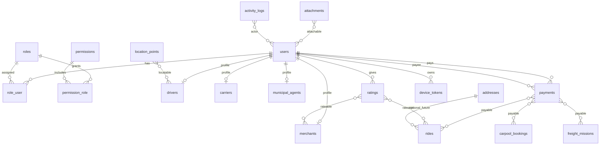

# MAMI — Plan Maître Base de Données (Super App)

**Version** : 2.0  
**Date** : juin 2026  
**Statut** : **Socle implémenté** — migration `2026_06_17_120000_create_super_app_core_tables`  
**Alignement** : `MAMI_SUPER_APP_ARCHITECTURE.md` · Module Taxi opérationnel · évolution sans rupture

---

## Implémentation juin 2026 (socle livré)

| Table | Statut | Notes |
|-------|--------|-------|
| `roles` | ✅ Créée | 11 rôles via `RolePermissionSeeder` |
| `permissions` | ✅ Créée | 13 permissions initiales |
| `user_roles` | ✅ Créée | Pivot utilisateur ↔ rôle |
| `permission_role` | ✅ Créée | Pivot rôle ↔ permission |
| `addresses` | ✅ Créée | Vide — prête pour modules |
| `locations` | ✅ Créée | Historique GPS polymorphique |
| `ratings` | ✅ Créée | Notation polymorphique |
| `attachments` | ✅ Créée | Fichiers polymorphiques |
| `payments` | ✅ Créée | Paiements polymorphiques |
| `transactions` | ✅ Créée | Ledger par paiement |
| `audit_logs` | ✅ Créée | Audit cross-modules |
| `notifications` | ✅ Existante | Laravel native — non recréée |

Modèles : `App\Modules\Core\Models\*`  
Morph map : `App\Modules\Core\CoreModuleServiceProvider`

---

## 1. Objectif

Définir **dès maintenant** le schéma commun et les règles d’extension pour éviter que chaque module (Covoiturage, TM, Commerce, Municipalité) crée ses propres tables `users`, `payments`, `ratings`, `locations`, etc.

**Règle d’or** : une seule base MySQL, des tables **partagées** (noyau) + des tables **métier par module** reliées au noyau par clés étrangères ou relations polymorphiques.

---

## 2. Principes de conception

| # | Principe | Application |
|---|----------|-------------|
| P1 | **Un utilisateur = une ligne `users`** | Tous les rôles (citoyen, chauffeur, transporteur, commerçant, agent) pointent vers `users.id` |
| P2 | **Profils métier séparés** | `drivers` existe déjà ; ajouter `carriers`, `merchants`, `municipal_agents` sans dupliquer l’identité |
| P3 | **Paiements centralisés** | Une table `payments` polymorphique ; aucun module ne crée `ride_payments`, `tm_payments`, etc. |
| P4 | **Notation centralisée** | Une table `ratings` polymorphique (`rateable_type` / `rateable_id`) |
| P5 | **Géolocalisation centralisée** | Positions courantes sur profils ; historique dans `locations` ; `driver_locations` Taxi conservé en transition |
| P6 | **Notifications centralisées** | Table Laravel `notifications` (existante) + `notification_deliveries` pour SMS/push/email |
| P7 | **Journal d’activité** | `activity_logs` polymorphique pour audit cross-modules |
| P8 | **Pièces jointes** | `attachments` polymorphique (KYC, photos commerce, preuves mission TM) |
| P9 | **Adresses réutilisables** | `addresses` normalisées (pickup, destination, siège PME, point de collecte TM) |
| P10 | **Compatibilité Taxi** | Tables Taxi existantes **non renommées** ; extension par colonnes nullable ou tables satellites |

---

## 3. État actuel (inventaire — ne pas casser)

### 3.1 Tables noyau déjà en production

| Table | Rôle | Module |
|-------|------|--------|
| `users` | Identité + auth (email, phone, password, `is_admin`) | Commun |
| `personal_access_tokens` | Sanctum API | Commun |
| `sessions` | Auth web admin | Commun |
| `notifications` | Notifications Laravel (morph `notifiable`) | Commun |
| `cache`, `jobs` | Infra Laravel | Commun |

### 3.2 Tables Taxi (module de référence — **gel fonctionnel**)

| Table | Rôle |
|-------|------|
| `drivers` | Profil chauffeur + position courante + disponibilité |
| `vehicles` | Véhicule lié au chauffeur |
| `driver_applications` | Onboarding chauffeur |
| `rides` | Course (client, chauffeur, coords, statut, prix) |
| `ride_offers` | Dispatch V2 — offres aux chauffeurs |
| `ride_dispatch_waves` | Vagues de dispatch |
| `ride_events` | Audit temps réel course (GPS, transitions) |
| `driver_locations` | Historique positions chauffeur |

> **Décision** : `rides` et `ride_events` restent spécifiques Taxi. Les futurs modules créent leurs entités métier (`carpool_trips`, `freight_missions`, etc.) mais réutilisent le noyau commun ci-dessous.

---

## 4. Schéma cible — Noyau commun (à créer progressivement)

### 4.1 Identité & rôles

#### `users` (extension — migration additive)

Colonnes **à ajouter** sans casser l’existant :

```sql
-- Migration future (exemple)
phone_verified_at    TIMESTAMP NULL
avatar_attachment_id BIGINT UNSIGNED NULL  -- FK attachments
locale               VARCHAR(10) DEFAULT 'fr'
status               VARCHAR(20) DEFAULT 'active'  -- active, suspended, deleted
last_login_at        TIMESTAMP NULL
metadata             JSON NULL                  -- préférences app, device tokens refs
```

> `phone` existe déjà. OTP stocké dans table dédiée (pas en clair dans `users`).

#### `roles`

| Colonne | Type | Notes |
|---------|------|-------|
| id | BIGINT PK | |
| slug | VARCHAR(50) UNIQUE | `citizen`, `taxi_client`, `taxi_driver`, `carpool_driver`, `carrier`, `merchant`, `municipal_agent`, `admin`, `super_admin` |
| name | VARCHAR(100) | Libellé affiché |
| module | VARCHAR(30) NULL | `taxi`, `carpool`, `freight`, `commerce`, `municipal`, `core` |
| description | TEXT NULL | |
| timestamps | | |

#### `permissions`

| Colonne | Type | Notes |
|---------|------|-------|
| id | BIGINT PK | |
| slug | VARCHAR(80) UNIQUE | ex. `rides.dispatch`, `commerce.moderate` |
| name | VARCHAR(100) | |
| module | VARCHAR(30) | |
| timestamps | | |

#### `role_user` (pivot)

| Colonne | Type | Notes |
|---------|------|-------|
| user_id | FK users | |
| role_id | FK roles | |
| assigned_at | TIMESTAMP | |
| assigned_by | FK users NULL | |
| **PK** | (user_id, role_id) | Un utilisateur peut cumuler plusieurs rôles |

#### `permission_role` (pivot)

| Colonne | Type |
|---------|------|
| role_id | FK |
| permission_id | FK |

> **Migration depuis l’existant** : `users.is_admin` → rôle `admin` ; existence dans `drivers` → rôle `taxi_driver` (script de migration one-shot).

#### `otp_challenges`

| Colonne | Type | Notes |
|---------|------|-------|
| id | BIGINT PK | |
| user_id | FK NULL | NULL si inscription en cours |
| phone | VARCHAR(20) | Index |
| channel | ENUM sms, email | |
| code_hash | VARCHAR(255) | Jamais le code en clair |
| purpose | VARCHAR(30) | login, register, reset, payment_confirm |
| expires_at | TIMESTAMP | |
| consumed_at | TIMESTAMP NULL | |
| attempts | TINYINT DEFAULT 0 | |
| ip_address | VARCHAR(45) NULL | |
| timestamps | | |

---

### 4.2 Profils métier (extension utilisateur)

Chaque profil = **1 user** + table métier. Ne pas fusionner chauffeur et transporteur.

| Table | Statut | Lien | Rôles associés |
|-------|--------|------|----------------|
| `drivers` | **Existe** | `user_id` UNIQUE | taxi_driver |
| `driver_applications` | **Existe** | `user_id` | — |
| `carriers` | À créer (Phase 4 TM) | `user_id` UNIQUE | carrier |
| `carrier_vehicles` | À créer | `carrier_id` | Types : camion, pick-up, tricycle… |
| `merchants` | À créer (Phase 5) | `user_id` UNIQUE | merchant |
| `municipal_agents` | À créer (Phase 6) | `user_id` UNIQUE | municipal_agent |
| `municipal_offices` | À créer | — | Structure administrative (commune, quartier) |

#### Modèle `carriers` (esquisse Phase 4)

```sql
id, user_id UNIQUE, company_name, tax_id NULL, status, rating DECIMAL(3,2),
latitude DECIMAL(10,7) NULL, longitude DECIMAL(10,7) NULL,
is_available BOOLEAN, last_seen_at, last_gps_at, metadata JSON, timestamps
```

> Réutilise le **même pattern** que `drivers` pour GPS et disponibilité.

---

### 4.3 Adresses & lieux

#### `addresses`

Évite de dupliquer lat/lng + labels dans chaque module.

| Colonne | Type | Notes |
|---------|------|-------|
| id | BIGINT PK | |
| label | VARCHAR(255) | Texte affiché (« Carrefour STFO ») |
| latitude | DECIMAL(10,7) NULL | |
| longitude | DECIMAL(10,7) NULL | |
| source | VARCHAR(20) | gps, map, text, imported |
| commune | VARCHAR(100) NULL | |
| quartier | VARCHAR(100) NULL | |
| plus_code | VARCHAR(20) NULL | |
| metadata | JSON NULL | |
| timestamps | | |

#### `user_addresses` (favoris)

| user_id | address_id | label (Maison, Bureau) | is_default |

> **Stratégie Taxi** : `rides.pickup_*` / `destination_*` restent en place (compatibilité). Nouveaux modules utilisent `origin_address_id` / `destination_address_id` FK optionnelles.

---

### 4.4 Géolocalisation & suivi

#### `location_points` (historique unifié)

Remplace à terme la multiplication d’historiques GPS par module.

| Colonne | Type | Notes |
|---------|------|-------|
| id | BIGINT PK | |
| locatable_type | VARCHAR(50) | `App\Models\Driver`, `App\Models\Carrier`, `App\Models\Ride`, `FreightMission`… |
| locatable_id | BIGINT | |
| latitude | DECIMAL(10,7) | |
| longitude | DECIMAL(10,7) | |
| accuracy_meters | SMALLINT NULL | |
| heading | SMALLINT NULL | |
| speed_kmh | DECIMAL(5,2) NULL | |
| recorded_at | TIMESTAMP | Index |
| context | VARCHAR(30) NULL | tracking, dispatch, idle |
| timestamps | | |

**Index** : `(locatable_type, locatable_id, recorded_at)`

> **Migration Taxi** : `driver_locations` reste ; nouvelles écritures peuvent alimenter **les deux** pendant une phase de transition, puis bascule unique vers `location_points`.

#### Positions courantes

Restent sur les profils (`drivers.latitude`, futur `carriers.latitude`) pour requêtes dispatch rapides — **pas de JOIN** sur historique.

---

### 4.5 Paiements (Phase 2 — critique)

#### `payments`

| Colonne | Type | Notes |
|---------|------|-------|
| id | BIGINT PK | |
| payer_id | FK users | |
| payee_id | FK users NULL | Chauffeur, transporteur, commune… |
| payable_type | VARCHAR(80) | Ride, CarpoolBooking, FreightMission, MunicipalInvoice… |
| payable_id | BIGINT | |
| amount | DECIMAL(12,2) | |
| currency | CHAR(3) DEFAULT 'XAF' | FCFA |
| method | VARCHAR(30) | cash, airtel_money, moov_money, card |
| status | VARCHAR(20) | pending, authorized, captured, failed, refunded, cancelled |
| external_reference | VARCHAR(100) NULL | ID opérateur MM |
| idempotency_key | VARCHAR(64) UNIQUE NULL | Anti double débit |
| metadata | JSON NULL | |
| authorized_at | TIMESTAMP NULL | |
| captured_at | TIMESTAMP NULL | |
| failed_at | TIMESTAMP NULL | |
| failure_reason | VARCHAR(255) NULL | |
| timestamps | | |

**Index** : `(payable_type, payable_id)`, `(payer_id, status)`, `external_reference`

#### `payment_events` (journal immuable)

| payment_id | event | payload JSON | created_at |

> Les modules **ne stockent jamais** un statut paiement redondant sans passer par `payments.status` (éventuellement cache dénormalisé `payment_status` sur entité métier pour perf lecture).

---

### 4.6 Notations & avis

#### `ratings`

| Colonne | Type | Notes |
|---------|------|-------|
| id | BIGINT PK | |
| rater_id | FK users | |
| rateable_type | VARCHAR(80) | Ride, Driver, Merchant, Carrier, CarpoolTrip… |
| rateable_id | BIGINT | |
| score | TINYINT | 1–5 |
| comment | TEXT NULL | |
| module | VARCHAR(30) | taxi, carpool, freight, commerce |
| context | VARCHAR(30) NULL | post_ride, post_mission |
| timestamps | | |

**Contrainte** : UNIQUE `(rater_id, rateable_type, rateable_id, context)` — une note par contexte.

#### Agrégats

`drivers.rating` existe. Pattern : colonne `rating` + `ratings_count` sur profils (`merchants`, `carriers`) mis à jour par listener — **pas de AVG() en temps réel** sur gros volume.

---

### 4.7 Notifications & messagerie

#### `notifications` — **existe** (Laravel)

Conserver. Enrichir le `data` JSON avec :

```json
{
  "module": "taxi",
  "event": "RideOfferAccepted",
  "entity_type": "Ride",
  "entity_id": 42,
  "title": "...",
  "body": "...",
  "deep_link": "mami://ride/active/42"
}
```

#### `notification_deliveries` (canaux externes)

| Colonne | Type | Notes |
|---------|------|-------|
| id | BIGINT PK | |
| notification_id | UUID NULL | FK notifications |
| user_id | FK users | |
| channel | VARCHAR(20) | push, sms, email |
| provider | VARCHAR(30) | fcm, twilio, etc. |
| status | VARCHAR(20) | queued, sent, delivered, failed |
| provider_message_id | VARCHAR(100) NULL | |
| payload | JSON NULL | |
| sent_at | TIMESTAMP NULL | |
| timestamps | | |

#### `device_tokens`

| user_id | token | platform (android/ios) | app_flavor (client/driver/super) | last_used_at |

---

### 4.8 Pièces jointes

#### `attachments`

| Colonne | Type | Notes |
|---------|------|-------|
| id | BIGINT PK | |
| attachable_type | VARCHAR(80) | User, DriverApplication, Merchant, Ride… |
| attachable_id | BIGINT | |
| disk | VARCHAR(20) | local, s3 |
| path | VARCHAR(500) | |
| mime_type | VARCHAR(100) | |
| size_bytes | BIGINT | |
| purpose | VARCHAR(30) | avatar, license, vehicle_photo, invoice |
| uploaded_by | FK users NULL | |
| timestamps | | |

---

### 4.9 Journal d’activité & audit

#### `activity_logs`

| Colonne | Type | Notes |
|---------|------|-------|
| id | BIGINT PK | |
| actor_id | FK users NULL | |
| subject_type | VARCHAR(80) NULL | Entité concernée |
| subject_id | BIGINT NULL | |
| action | VARCHAR(50) | created, status_changed, payment_captured |
| module | VARCHAR(30) | |
| properties | JSON NULL | before/after |
| ip_address | VARCHAR(45) NULL | |
| user_agent | VARCHAR(255) NULL | |
| created_at | TIMESTAMP | Pas de updated_at (append-only) |

> `ride_events` reste l’audit **temps réel Taxi** (GPS haute fréquence). `activity_logs` = audit **métier cross-modules** (moins verbeux).

---

### 4.10 Messagerie / négociation (Covoiturage & TM)

#### `conversations`

| id | module | subject_type | subject_id | status | timestamps |

#### `conversation_participants`

| conversation_id | user_id | role | last_read_at |

#### `messages`

| conversation_id | sender_id | body | attachment_id NULL | sent_at |

> Évite `carpool_messages` et `freight_messages` séparés.

---

## 5. Tables par module métier (extensions)

### 5.1 Module A — Taxi (existant — référence)

```
users ──< rides >── drivers ──< vehicles
              │
              ├──< ride_offers
              ├──< ride_dispatch_waves
              ├──< ride_events
              └── driver_locations (→ location_points à terme)

drivers ──< driver_locations
users ──< driver_applications
```

**Extensions futures Taxi** (sans casser) :
- `rides.payment_id` FK nullable → `payments`
- `rides.origin_address_id` / `destination_address_id` FK nullable → `addresses`
- Table `ride_ratings` **interdite** → utiliser `ratings` polymorphique

---

### 5.2 Module B — Covoiturage (Phase 3)

| Table | Description |
|-------|-------------|
| `carpool_trips` | Trajet publié (conducteur, départ, arrivée, places, prix, statut) |
| `carpool_bookings` | Réservation passager (trip_id, user_id, seats, prix négocié, statut) |
| `carpool_booking_offers` | Contre-propositions prix (optionnel) |

**Clés étrangères communes** :
- `driver_user_id` → `users`
- `origin_address_id`, `destination_address_id` → `addresses`
- `payment_id` → `payments`
- Notation via `ratings` sur `CarpoolTrip` / conducteur

---

### 5.3 Module C — Transport marchandises (Phase 4)

| Table | Description |
|-------|-------------|
| `freight_requests` | Demande citoyen/entreprise (type marchandise, poids, adresses) |
| `freight_quotes` | Devis transporteur |
| `freight_missions` | Mission confirmée (request + carrier + statut + suivi) |
| `freight_mission_events` | Transitions mission (optionnel ; sinon `activity_logs`) |

Réutilise : `carriers`, `carrier_vehicles`, `addresses`, `payments`, `location_points`, dispatch pattern inspiré de `ride_offers`.

---

### 5.4 Module D — Commerce & PME (Phase 5)

| Table | Description |
|-------|-------------|
| `business_categories` | Arborescence (maçon, restaurant…) |
| `merchants` | Profil commerçant |
| `merchant_locations` | Points physiques (FK addresses) |
| `merchant_hours` | Horaires |
| `merchant_reviews` | **Interdit** → `ratings` + `comments` |

#### `comments` (avis texte — commerce & municipalité)

| id | commentable_type | commentable_id | author_id | body | status (published, hidden) | timestamps |

---

### 5.5 Module E — Services municipaux (Phase 6)

| Table | Description |
|-------|-------------|
| `municipal_offices` | Commune / service |
| `municipal_agents` | Agent lié user |
| `taxpayer_accounts` | Lien contribuable (user ou merchant) |
| `municipal_invoices` | Avis / facture |
| `municipal_payments` | **Interdit** → `payments` payable = MunicipalInvoice |
| `citizen_reports` | Signalements (coords, photo via attachments) |

---

## 6. Relations polymorphiques — registre central

| Relation | Table | Types autorisés (exemples) |
|----------|-------|---------------------------|
| Paiement | `payments.payable_*` | Ride, CarpoolBooking, FreightMission, MunicipalInvoice |
| Note | `ratings.rateable_*` | Ride, Driver, Carrier, Merchant, CarpoolTrip |
| Position historique | `location_points.locatable_*` | Driver, Carrier, Ride, FreightMission |
| Pièce jointe | `attachments.attachable_*` | User, Merchant, DriverApplication, CitizenReport |
| Activité | `activity_logs.subject_*` | Toute entité métier |
| Commentaire | `comments.commentable_*` | Merchant, MunicipalOffice |

**Convention Laravel** : stocker le FQCN (`App\Models\Ride`) ou un alias court documenté (`rides`) — **un seul format** dans tout le projet (à figer en enum `MorphMap`).

---

## 7. Conventions de nommage

| Élément | Convention | Exemple |
|---------|------------|---------|
| Tables | snake_case pluriel | `freight_missions` |
| Clés étrangères | `{table_singular}_id` | `carrier_id` |
| Statuts | string + enum PHP | `status` VARCHAR(30) |
| Montants | DECIMAL(12,2) | FCFA sans décimale en UI |
| Coordonnées | DECIMAL(10,7) | aligné existant |
| Dates métier | `{action}_at` | `started_at`, `captured_at` |
| JSON flexible | `metadata` | pas de colonnes spaghetti |
| Index dispatch | composite métier | `(is_available, status, last_gps_at)` |

---

## 8. Stratégie de migration (sans casser le Taxi)

### Phase 0 — Immédiat (documentation + préparation)

- [x] Inventaire tables existantes (ce document)
- [ ] Enregistrer `MorphMap` dans `AppServiceProvider`
- [ ] Créer migrations **roles / permissions** sans retirer `is_admin`

### Phase 1 — Stabilisation Taxi

- Aucune modification destructive
- Ajouter `ratings` + lier fin de course Taxi
- Ajouter `payments` (cash d’abord, MM ensuite)

### Phase 2 — Paiements Mobile Money

- `payments` + `payment_events`
- FK `rides.payment_id` nullable

### Phase 3–6 — Nouveaux modules

- Créer uniquement tables §5.2–5.5
- **Checklist PR** : aucune table `*_payments`, `*_ratings`, `*_notifications` module-specific

### Règle de revue Cursor (avant chaque migration)

```
□ La migration est-elle additive (pas de DROP colonne Taxi) ?
□ Réutilise-t-elle payments / ratings / addresses / attachments ?
□ Index ajoutés pour les requêtes dispatch / liste ?
□ Test Feature couvre la migration ou le modèle ?
□ Rapport d'impact docs/IMPACT_*.md si > 3 tables touchées ?
```

---

## 9. Diagramme noyau commun



---

## 10. Tableau de bord global — sources de données

| Indicateur | Source principale |
|------------|-------------------|
| Utilisateurs | `users` + `role_user` |
| Chauffeurs connectés | `drivers` WHERE `status` = online + `last_seen_at` récent |
| Courses en cours | `rides` WHERE status IN (accepted, arrived, started) |
| Missions TM | `freight_missions` (Phase 4) |
| Trajets covoiturage | `carpool_trips` (Phase 3) |
| Commerces | `merchants` (Phase 5) |
| Recouvrements | `municipal_invoices` + `payments` (Phase 6) |
| Revenus plateforme | `payments` WHERE status = captured + `metadata.commission` |

---

## 11. Anti-patterns interdits

| Interdit | Alternative |
|----------|-------------|
| `client_users` / `driver_users` | `users` + rôles + profils |
| `ride_payments` | `payments` polymorphique |
| `taxi_notifications` | `notifications` + `module` dans data |
| Dupliquer lat/lng sans `addresses` | FK `address_id` sur nouvelles entités |
| GPS historique par module | `location_points` |
| Statut paiement uniquement en JSON métier | `payments.status` source de vérité |
| Supprimer colonnes `rides` utilisées par apps | colonnes nullable + dépréciation documentée |

---

## 12. Prochaines actions recommandées

1. **Valider** ce document en réunion direction (30 min).
2. **Créer** `docs/MAMI_SUPER_APP_ARCHITECTURE.md` (version formalisée du doc architecture 2026-2028).
3. **Implémenter** Phase 0 : migrations `roles`, `permissions`, `role_user`, `permission_role` + seeder rôles §7 doc architecture.
4. **Implémenter** Phase 2 : `payments` avant Covoiturage (tous les modules en auront besoin).
5. **Flutter** : préparer `ServiceModule` enum sur l’écran d’accueil sans toucher au flux Taxi existant.

---

## 13. Références code actuel

| Élément | Chemin |
|---------|--------|
| Migrations Taxi | `database/migrations/` |
| Modèles | `app/Models/` |
| Events temps réel | `app/Events/` |
| Config dispatch | `config/mami.php` |
| Doc Taxi V2 | `docs/MAMI_TAXI_V2.md` |

---

*Ce document est la source de vérité pour toute nouvelle table MAMI. Toute dérogation doit être justifiée par écrit dans le rapport d’impact du module concerné.*
