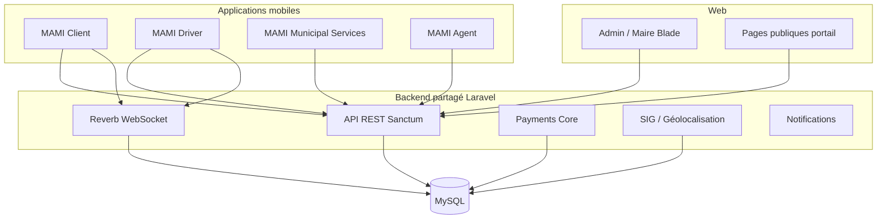

# MAMI Super App — Architecture Maîtresse

**Version :** 1.0  
**Date :** juin 2026  
**Statut :** document de référence plateforme  
**Branche active :** `feature/mami-taxi-v2-p2`  
**Dernière livraison majeure :** Municipality V3 Sprint 3 (quittances officielles & impression terrain)

---

## Documents liés

| Document | Contenu |
|----------|---------|
| [MAMI_SUPER_APP_ARCHITECTURE.md](MAMI_SUPER_APP_ARCHITECTURE.md) | Socle technique Super App (juin 2026) |
| [MAMI_MODULES_SPECIFICATION.md](MAMI_MODULES_SPECIFICATION.md) | Spécification par module backend |
| [MAMI_ROLE_PERMISSION_MATRIX.md](MAMI_ROLE_PERMISSION_MATRIX.md) | Matrice détaillée rôles/permissions |
| [MAMI_DATABASE_MASTER_PLAN.md](MAMI_DATABASE_MASTER_PLAN.md) | Schéma BDD partagé |
| [DOMAIN_MIGRATION_REPORT.md](DOMAIN_MIGRATION_REPORT.md) | Domaines production (`mami.ga`) |
| [municipality-v3/README.md](municipality-v3/README.md) | Dossier fiscalité & recouvrement V3 |

---

## 1. Vision globale MAMI Platform

MAMI.GA est une **plateforme numérique multiservices** pour les citoyens, les opérateurs économiques, les chauffeurs/transporteurs et les administrations municipales du Gabon — avec un premier déploiement territorial sur **Owendo**.

### Mission

Offrir un écosystème unifié couvrant :

- la **mobilité** (taxi, covoiturage, transport de marchandises) ;
- l’**économie locale** (annuaire commerces, main-d’œuvre) ;
- les **services municipaux** (signalements, démarches, information communale) ;
- la **fiscalité et le recouvrement** (registre économique, encaissement terrain, quittances officielles).

### Principes d’architecture

| Principe | Décision |
|----------|----------|
| Un backend | Laravel 13 monolithique modulaire |
| Une base | MySQL unique, schémas par domaine métier |
| Zéro rupture Taxi | API `/api/rides/*` gelée ; code legacy préservé |
| Extension progressive | Modules + feature flags (`config/mami.php`) |
| Auth unifiée | Sanctum + rôles/permissions centralisés (Core) |
| Temps réel | Laravel Reverb (WebSocket) + fallback polling mobile |
| Multi-applications | Plusieurs APK spécialisés, un même noyau API |

### Domaines production (infrastructure 2026)

| Rôle | URL |
|------|-----|
| Portail citoyen | `https://mami.ga` |
| API REST | `https://api.mami.ga/api` |
| Backoffice admin / maire | `https://admin.mami.ga` |
| WebSocket Reverb | `wss://ws.mami.ga` |

### Schéma logique haut niveau



### État actuel vs cible applications

| APK cible | Réalisation juin 2026 | Emplacement code |
|-----------|----------------------|------------------|
| **MAMI Client** | ✅ En production (`mobile/mami_client`) | Taxi + signalements + portail Super App |
| **MAMI Driver** | ✅ En production (`mobile/mami_driver`) | Taxi + dispatch P3 |
| **MAMI Municipal Services** | 🔶 Partiellement dans `mami_client` | Signalements citoyens, infos mairie |
| **MAMI Agent** | 🔶 Partiellement dans `mami_client` | Recensement, fiscalité, recouvrement Sprint 1–3 |

> La scission en quatre APK distincts est une **cible produit 2026** ; le code actuel regroupe Client + Agent municipal dans `mami_client` pour accélérer le pilote Owendo.

---

## 2. Backend partagé

### 2.1 Laravel (monolithe modulaire)

```
app/
├── Http/Controllers/Api/          # Taxi historique (gel compatibilité)
├── Models/                        # Modèles Taxi
├── Services/                      # Dispatch, GPS, courses
└── Modules/
    ├── Core/                      # Rôles, permissions, audit, payments
    ├── Taxi/                      # Registrar module (code legacy)
    ├── Carpool/                   # Scaffold
    ├── Transport/                 # Scaffold TM
    ├── Commerce/                  # Scaffold PME
    └── Municipality/              # Fiscalité, SIG, recouvrement (actif)
```

**Feature flags** (`config/mami.php`) :

| Variable | Module | Statut juin 2026 |
|----------|--------|------------------|
| *(toujours actif)* | Taxi | Production |
| `MAMI_MODULE_CARPOOL` | Covoiturage | Scaffold |
| `MAMI_MODULE_TRANSPORT` | Transport marchandises | Scaffold |
| `MAMI_MODULE_COMMERCE` | Commerce / PME | Scaffold |
| `MAMI_MODULE_MUNICIPALITY` | Municipalité | **Production Owendo** |
| `MAMI_TAXI_V2` / `MAMI_DISPATCH_V2` | Taxi V2 / Dispatch P3 | Production optionnelle |

**Middleware** : `module:{slug}` bloque l’API si module désactivé (HTTP 403).

### 2.2 MySQL

Base unique `mami_ga` — domaines principaux :

| Domaine | Tables représentatives |
|---------|------------------------|
| Core / Auth | `users`, `roles`, `permissions`, `user_roles`, `personal_access_tokens` |
| Taxi | `rides`, `drivers`, `vehicles`, `ride_offers`, `driver_locations` |
| Payments | `payments`, `transactions` (orchestration transverse) |
| Municipality | `economic_operators`, `fiscal_obligations`, `municipal_payments`, `municipal_receipts`, `cash_sessions` |
| GIS | `municipal_territories`, `municipal_sectors`, `economic_zones`, coordonnées opérateurs |
| Audit | `audit_logs` (journal transverse module `municipality`, `taxi`, etc.) |

Référence complète : [MAMI_DATABASE_MASTER_PLAN.md](MAMI_DATABASE_MASTER_PLAN.md).

### 2.3 Reverb (temps réel)

| Composant | Rôle |
|-----------|------|
| Laravel Reverb | Serveur WebSocket compatible protocole Pusher |
| Canaux privés | `private-user-{id}`, `private-driver-{id}`, `private-ride-{id}` |
| Auth | `POST /broadcasting/auth` (Sanctum Bearer) |
| Événements Taxi | `RideRequested`, `RideAssigned`, `RideOfferCreated`, `DriverLocationUpdated`, … |
| Mobile | `pusher_channels_flutter` + `ReverbConfig` dérivé de `wss://ws.mami.ga` |

Mode **hybride** : WebSocket prioritaire, polling REST en secours (offres chauffeur, suivi course).

### 2.4 Payments (noyau transverse)

| Couche | Responsabilité |
|--------|----------------|
| `PaymentOrchestratorService` | Lie paiement Core ↔ paiement métier (ex. `municipal_payments`) |
| `payments` / `transactions` | Comptabilité générale, statuts, références |
| Municipality Sprint 3 | **Espèces uniquement** — Mobile Money reporté Sprint 4 |
| Futur | Airtel Money, Moov Money, carte, virement |

### 2.5 Notifications

| Canal | Statut | Usage |
|-------|--------|-------|
| Reverb (push temps réel) | Production Taxi | Offres, statuts course |
| Base `notifications` (Core) | Prévu | In-app, historique |
| SMS / e-mail | Futur | OTP, quittances, rappels fiscaux |
| FCM / APNs | Futur | Push natif hors session WebSocket |

### 2.6 GIS (Système d'Information Géographique)

| Brique | Statut | Détail |
|--------|--------|--------|
| Référentiel Owendo | Production | Territoire `OWE`, secteurs, ZOP, zones économiques |
| Opérateurs économiques | Production | GPS à l'enrôlement, secteur, carte admin |
| Carte admin Taxi | Production | Leaflet + positions chauffeurs |
| Carte municipale | Production | Signalements, opérateurs |
| SIG fiscal (couches recouvrement) | Conception V3 | [10_CARTOGRAPHIE_SIG_FISCALE.md](municipality-v3/10_CARTOGRAPHIE_SIG_FISCALE.md) |
| Contrainte terrain | Production | GPS obligatoire à l'encaissement (sauf superviseur) |

Références : [GIS_ARCHITECTURE.md](GIS_ARCHITECTURE.md), [GIS_API_SPECIFICATION.md](GIS_API_SPECIFICATION.md).

---

## 3. APK MAMI Client

**Cible :** citoyens et usagers des services urbains.  
**Code actuel :** `mobile/mami_client`  
**Config :** `AppConfig.apiBaseUrl`, `portalUrl`, `websocketUrl`

### Modules fonctionnels

| Module | Statut | Fonctionnalités |
|--------|--------|-----------------|
| **Taxi** | ✅ Production | Réservation, estimation, suivi course, historique, Reverb |
| **Covoiturage** | 📋 Planifié | Publication/réservation trajets — backend scaffold |
| **Commerce** | 📋 Planifié | Annuaire PME, recherche, fiches commerces |
| **Main-d'œuvre** | 📋 Planifié | Mise en relation demandeurs ↔ travailleurs (spec à définir) |
| **TM (Transport marchandises)** | 📋 Planifié | Demande fret, devis, suivi mission — backend scaffold |
| **Signalements** | ✅ Production | Signalement citoyen Owendo (voirie, propreté, etc.) |

### Navigation actuelle (Super App portail)

- Accueil multiservices (grille avec feature flags)
- Taxi : `/book` → recherche → course active
- Municipalité : signalements, portail agent (si rôle `municipal_agent`)
- Profil, historique courses

### Rôles typiques

`citizen`, `taxi_customer`, `carpool_passenger`, `transport_customer`

---

## 4. APK MAMI Driver

**Cible :** chauffeurs et transporteurs professionnels.  
**Code actuel :** `mobile/mami_driver`

### Modules fonctionnels

| Module | Statut | Fonctionnalités |
|--------|--------|-----------------|
| **Taxi Driver** | ✅ Production | Disponibilité, GPS, offres dispatch P3, acceptation, cycle course |
| **Covoiturage Driver** | 📋 Planifié | Publication trajets, gestion passagers |
| **TM Driver** | 📋 Planifié | Missions fret, tournées, preuves de livraison |

### Temps réel

- Canal `private-driver-{id}` — événements `RideOfferCreated`, etc.
- Polling offres `/api/rides/offers/current` en complément

### Rôles typiques

`taxi_driver`, `carpool_driver`, `transport_driver`

---

## 5. APK MAMI Municipal Services

**Cible :** citoyens d'une commune — services publics numériques.  
**Statut :** fonctionnalités partiellement intégrées dans `mami_client` ; APK dédié prévu.

### Modules fonctionnels

| Module | Statut | Fonctionnalités |
|--------|--------|-----------------|
| **Services citoyens** | 🔶 Partiel | Signalements avec photo + GPS |
| **Démarches** | 📋 Planifié | Demandes administratives, suivi dossier |
| **Informations communales** | 📋 Planifié | Actualités, horaires, contacts, cartographie publique |

### API associée

- `POST /api/municipality/reports` — création signalement
- Futur : portail démarches, notifications statut dossier

### Rôles typiques

`citizen` (+ permission `municipality.reports.create`)

---

## 6. APK MAMI Agent

**Cible :** agents municipaux terrain et superviseurs.  
**Statut :** cœur métier livré en Municipality V3 Sprints 1–3 ; APK dédié prévu (séparation de `mami_client`).

### Modules fonctionnels

| Module | Statut | Livraison |
|--------|--------|-----------|
| **Recensement** | ✅ Production | Enrôlement opérateurs économiques, photo façade, GPS |
| **Fiscalité** | ✅ Production | Moteur configurable (taxes, taux, obligations, affectations) |
| **Recouvrement** | ✅ Production | Sessions caisse, scan QR, encaissement, quittances, impression BT 58 mm |
| **SIG** | 🔶 Partiel | Carte admin, données géo opérateurs ; couches fiscales avancées en cours |

### Parcours terrain (Sprint 3 — opérationnel)

```
Scan QR commerce
    → Consultation situation fiscale
    → Encaissement espèces
    → Quittance officielle (PDF + signature SHA-256)
    → Impression thermique Bluetooth
    → Vérification publique QR (https://mami.ga/public/receipts/verify/{token})
```

### Écrans Flutter (dans `mami_client` aujourd'hui)

Hub recouvrement, ouverture/fermeture caisse, scan QR, situation fiscale, encaissement, quittances, impression.

### Rôles typiques

`municipal_agent`, `admin` (superviseur)

---

## 7. Cartographie des rôles

| Slug | Libellé | Module | APK(s) | Description |
|------|---------|--------|--------|-------------|
| `citizen` | Citoyen | core | Client, Municipal Services | Utilisateur de base |
| `taxi_customer` | Client Taxi | taxi | Client | Demande de courses |
| `taxi_driver` | Chauffeur Taxi | taxi | Driver | Exécute courses |
| `carpool_driver` | Conducteur Covoiturage | carpool | Driver | Publie trajets |
| `carpool_passenger` | Passager Covoiturage | carpool | Client | Réserve places |
| `transport_customer` | Client TM | transport | Client | Demande fret |
| `transport_driver` | Transporteur TM | transport | Driver | Missions marchandises |
| `merchant` | Commerçant | commerce | Client / Commerce | Gère fiche PME |
| `municipal_agent` | Agent municipal | municipality | Agent | Terrain fiscal |
| `admin` | Administrateur | core | Web admin | Backoffice, superviseur |
| `super_admin` | Super administrateur | core | Web admin | Tous droits |

**Règle :** un utilisateur peut cumuler plusieurs rôles (`user_roles`).  
**Compatibilité legacy :** `users.is_admin = true` ↔ rôle `admin` ; existence `drivers` ↔ rôle `taxi_driver`.

---

## 8. Cartographie des permissions

### Permissions transverses (Core)

| Slug | Description |
|------|-------------|
| `core.admin.access` | Accès backoffice Blade |
| `core.super_admin.access` | Tous droits système |

### Taxi

| Slug | Rôles principaux |
|------|------------------|
| `taxi.rides.request` | taxi_customer |
| `taxi.rides.dispatch` | taxi_driver |
| `taxi.rides.manage` | admin |

### Covoiturage (futur)

| Slug | Rôles principaux |
|------|------------------|
| `carpool.trips.publish` | carpool_driver |
| `carpool.trips.book` | carpool_passenger |

### Transport marchandises (futur)

| Slug | Rôles principaux |
|------|------------------|
| `transport.requests.create` | transport_customer |
| `transport.missions.manage` | transport_driver |

### Commerce (futur)

| Slug | Rôles principaux |
|------|------------------|
| `commerce.merchants.view` | citizen, taxi_customer, … |
| `commerce.merchants.manage` | merchant |

### Municipalité (production Owendo)

| Slug | Rôles principaux | Usage |
|------|------------------|-------|
| `municipality.reports.create` | citizen, taxi_customer | Signalements |
| `municipality.reports.manage` | municipal_agent, admin | Traitement signalements |
| `municipality.dashboard.view` | municipal_agent | Tableau de bord |
| `municipality.collections.manage` | municipal_agent | Recouvrement |
| `municipality.operators.manage` | admin | Registre économique |
| `economic_operator.create` | municipal_agent | Enrôlement terrain |
| `economic_operator.update` | municipal_agent | Mise à jour commerce |
| `economic_operator.view` | municipal_agent | Consultation |
| `economic_operator.inspect` | municipal_agent | Contrôle terrain |
| `municipal.tax.view` | admin | Consultation moteur fiscal |
| `municipal.tax.manage` | admin | Taxes, taux, objectifs |
| `municipal.tax.assign` | admin | Affectation taxes |
| `municipal.cash_session.open` | municipal_agent, admin | Ouverture caisse |
| `municipal.cash_session.close` | municipal_agent, admin | Clôture caisse |
| `municipal.payment.collect` | municipal_agent, admin | Encaissement |
| `municipal.payment.collect_without_gps` | admin | Bypass GPS superviseur |
| `municipal.fiscal.view` | municipal_agent, admin | Situation fiscale |
| `municipal.receipt.annul` | admin | Annulation quittance |

**Contrôle API :** Sanctum + `hasPermission()` + middleware `module:municipality`.

Source de vérité : `database/seeders/RolePermissionSeeder.php`.

---

## 9. Roadmap 2026

### T1 — T2 2026 (réalisé)

| Trimestre | Livrable | Statut |
|-----------|----------|--------|
| T1 | Taxi MVP, admin web, Reverb, GPS | ✅ |
| T1 | Super App socle (Core, rôles, feature flags) | ✅ |
| T1–T2 | Taxi V2, Dispatch P3, offres chauffeur | ✅ |
| T2 | Municipality V1 — registre, signalements, SIG Owendo | ✅ |
| T2 | Municipality V2.5 — fondations paiements, QR, visites | ✅ |
| T2 | Domaines `mami.ga` (API, admin, portail, ws) | ✅ |

### T2 — T3 2026 (en cours / à venir)

| Période | Livrable | Statut |
|---------|----------|--------|
| Juin 2026 | **Municipality V3 Sprint 1** — moteur fiscal configurable | ✅ |
| Juin 2026 | **Sprint 2** — sessions caisse, encaissement terrain | ✅ |
| Juin 2026 | **Sprint 3** — quittances PDF, signature, vérification publique, impression BT | ✅ |
| Juil. 2026 | **Sprint 4** — Mobile Money (Airtel, Moov) | 📋 |
| Juil.–Août 2026 | Brigade terrain, sync offline agent | 📋 |
| Août 2026 | SIG fiscal avancé (couches carte maire) | 📋 |
| Q3 2026 | Scission APK Agent / Municipal Services | 📋 |
| Q3 2026 | Module Commerce (annuaire PME) | 📋 |
| Q4 2026 | Covoiturage MVP | 📋 |
| Q4 2026 | Transport marchandises MVP | 📋 |

### 2027 (orientation)

- VoIP dispatch (Asterisk) — phase 4 historique README
- Multi-communes (réplication référentiel territorial)
- Open Banking / agrégation paiements
- Analytics maire & open data communal

---

## 10. Priorisation des modules après Municipality V3 Sprint 3

Sprint 3 clôt la boucle **espèces + quittance officielle**. L'ordre de priorité recommandé :

### Priorité 1 — Municipality V3 Sprint 4 (paiements digitaux)

| Pourquoi | Impact |
|----------|--------|
| Réduit la friction encaissement | Mobile Money = standard Gabon |
| Complète le moteur `PaymentOrchestrator` | Alignement comptabilité Core |
| Dépendances : Sprint 3 stable | Quittances déjà signées et vérifiables |

**Livrables :** intégration Airtel Money, Moov Money, réconciliation, quittances MM.

### Priorité 2 — Consolidation terrain Agent

| Pourquoi | Impact |
|----------|--------|
| Sécurise l'exploitation quotidienne | Sync offline, brigades, clôtures caisse |
| APK Agent dédié | Séparation sécurité / UX / déploiement Play Store |

**Livrables :** `mami_agent` APK, sync pull/push, mode dégradé sans réseau.

### Priorité 3 — SIG fiscal & dashboard Maire V3.5

| Pourquoi | Impact |
|----------|--------|
| Valeur politique forte | Vision recouvrement par quartier, impayés, heatmaps |
| Exploite données Sprint 1–3 | Obligations, paiements, quittances géolocalisés |

### Priorité 4 — Commerce (annuaire PME)

| Pourquoi | Impact |
|----------|--------|
| Synergie registre `economic_operators` | Réutilise données Municipality |
| Faible risque Taxi | Module isolé, flag `MAMI_MODULE_COMMERCE` |

### Priorité 5 — Covoiturage

| Pourquoi | Impact |
|----------|--------|
| Demande mobilité alternative | Complète l'offre Client |
| Scaffold backend existant | Effort modéré |

### Priorité 6 — Transport marchandises (TM)

| Pourquoi | Impact |
|----------|--------|
| Marché B2B / logistique urbaine | Réutilise pattern dispatch Taxi |
| Complexité plus élevée | Devis, négociation, preuves livraison |

### Priorité 7 — Main-d'œuvre

| Pourquoi | Impact |
|----------|--------|
| Spécification métier à valider | Nouveau domaine (pas de scaffold) |
| Peut s'appuyer sur Commerce + Municipality | Après annuaire opérateurs stabilisé |

### Hors priorité immédiate

- VoIP / Asterisk
- Paiement carte / virement bancaire (post Mobile Money)
- Multi-pays (hors Gabon)

---

## Synthèse exécutive

MAMI Platform repose sur **un backend Laravel unique** exposé via `api.mami.ga`, avec **deux APK en production** (Client, Driver) et **deux APK cibles** (Municipal Services, Agent) en cours de séparation.

Le module **Municipality V3** est le moteur de croissance territoriale 2026 : après trois sprints (fiscalité, caisse, quittances), le **Sprint 4 Mobile Money** est la prochaine étape critique, suivie de la consolidation terrain et du SIG fiscal.

Le module **Taxi** reste la référence technique (dispatch, Reverb, GPS) et ne doit subir **aucune régression** lors des extensions Super App.

---

*Document maintenu par l'équipe MAMI.GA — mise à jour lors de chaque release majeure module.*
