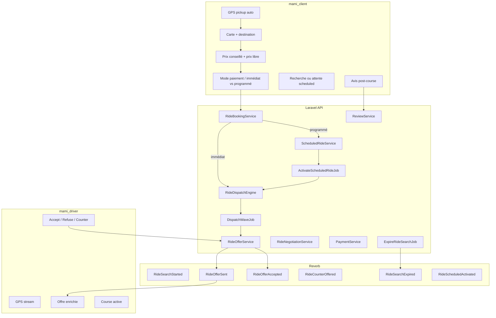
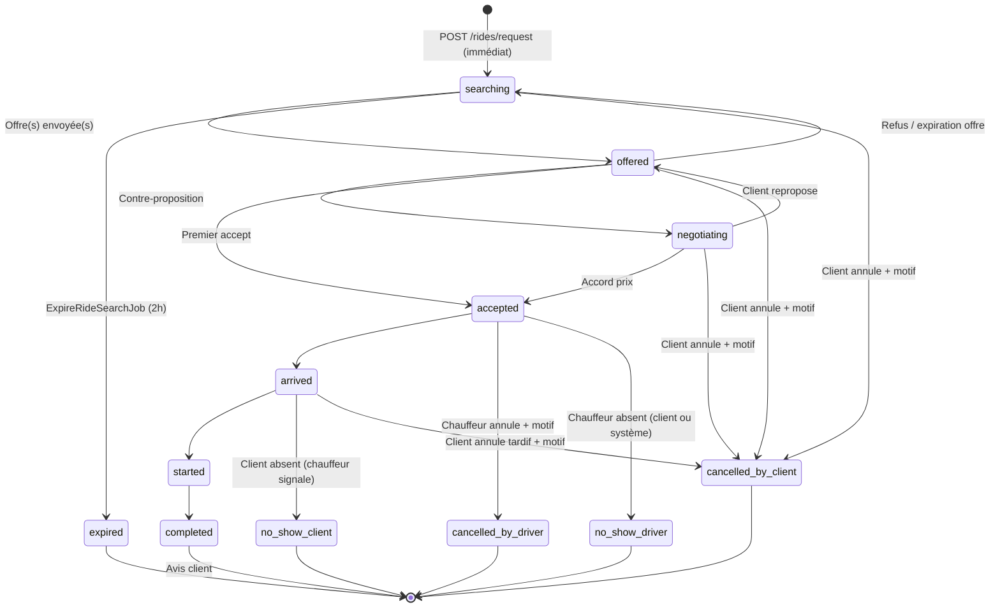
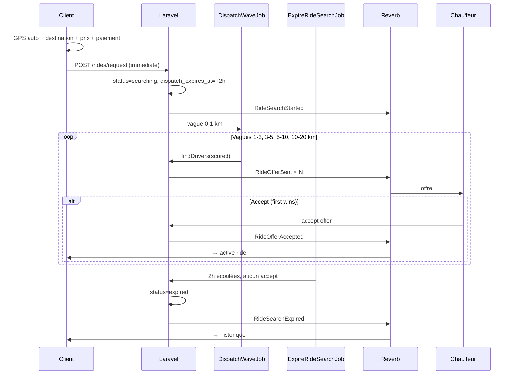
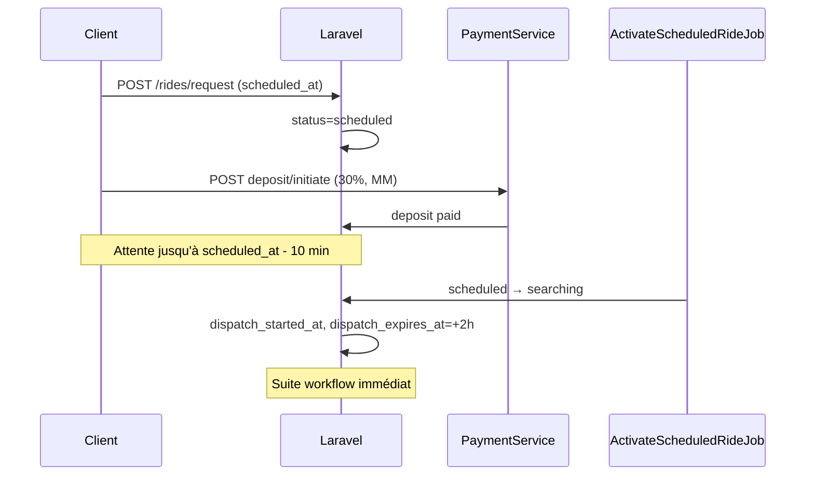
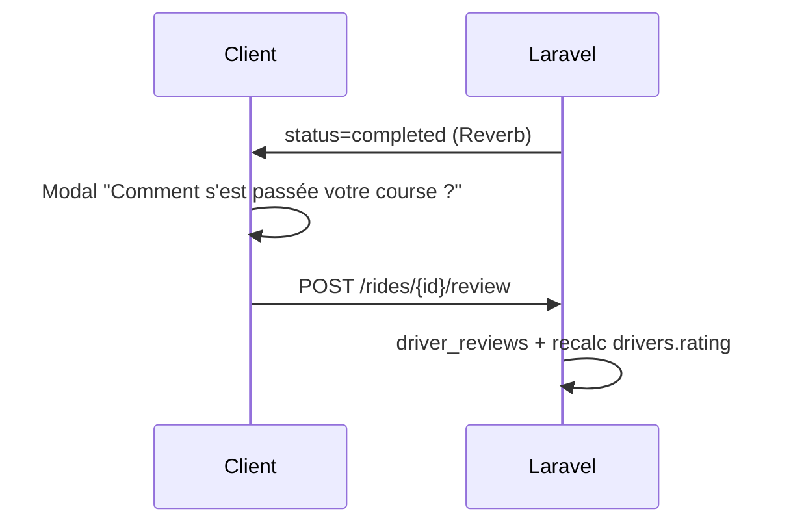
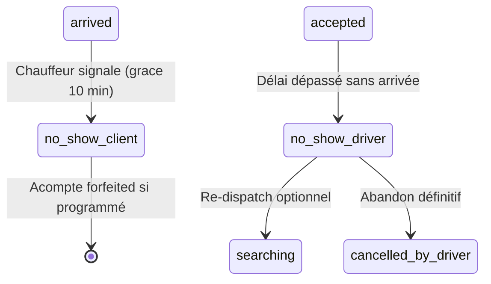

# MAMI Taxi V2 — Architecture cible (version consolidée)

**Statut :** plan validé — **aucune implémentation code métier**  
**Dernière mise à jour :** 2026-05-23 (finalisé)  
**Périmètre :** `mobile/mami_client`, `mobile/mami_driver`, API Laravel

Ce document intègre le rapport technique V2 initial **et** les ajustements métier complémentaires (expiration, réservation programmée, acompte, avis client, dispatch pondéré, vagues GPS, paiement cash).

---

## Table des matières

1. [Synthèse](#1-synthèse)
2. [Audit existant (rappel)](#2-audit-existant-rappel)
3. [Architecture cible](#3-architecture-cible)
4. [Schéma base de données](#4-schéma-base-de-données)
5. [Statuts et diagrammes d'état](#5-statuts-et-diagrammes-détat)
6. [Événements Reverb](#6-événements-reverb)
7. [Endpoints API](#7-endpoints-api)
8. [Workflows client / chauffeur](#8-workflows-client--chauffeur)
9. [Dispatch GPS et scoring chauffeur](#9-dispatch-gps-et-scoring-chauffeur)
10. [Paiement et acomptes](#10-paiement-et-acomptes)
11. [Expérience client — avis](#11-expérience-client--avis)
12. [Jobs planifiés](#12-jobs-planifiés)
13. [Schéma des écrans](#13-schéma-des-écrans)
14. [Roadmap par phases](#14-roadmap-par-phases)
15. [Fichiers à modifier](#15-fichiers-à-modifier)
16. [Estimations](#16-estimations)
17. [Driver Availability Lock](#17-driver-availability-lock)
18. [Annulations et no-show](#18-annulations-et-no-show)
19. [Décisions et risques](#19-décisions-et-risques)

---

## 1. Synthèse

### Modèle V1 (actuel)

- Assignation **immédiate** au chauffeur le plus proche (rayon fixe ~10 km).
- `driver_id` renseigné dès la création, statut `pending`.
- Prix calculé **côté serveur** uniquement.
- Pas de paiement, pas d'offre multi-chauffeur, pas de réservation programmée.
- Reject chauffeur → course `cancelled` (fin définitive).

### Modèle V2 (cible)

| Capacité | Description |
|----------|-------------|
| Réservation immédiate | GPS auto → destination carte → prix conseillé + **prix libre** → mode paiement |
| Recherche progressive | Vagues **0–1, 1–3, 3–5, 5–10, 10–20 km** |
| Offres temps réel | Premier chauffeur acceptant gagne ; Reverb payload-rich |
| Expiration | **2 h max** sans acceptation → `expired` |
| Réservation programmée | `scheduled_at` → activation auto **5–15 min avant** |
| Acompte programmé | **30 %** via Mobile Money / carte (pas cash) |
| Avis client | 5 critères + note globale + commentaire |
| Dispatch intelligent | Distance + disponibilité + fraîcheur + **note chauffeur** |
| Paiement | **Cash** (principal) + Airtel + Moov ; cash interdit pour acompte |
| Verrou chauffeur | **Driver Availability Lock** sur réservations programmées acceptées |
| Annulations | `cancelled_by_client` / `cancelled_by_driver` + motif |
| No-show | `no_show_client` / `no_show_driver` avec règles acompte et pénalités |

### Flag de transition

```env
MAMI_DISPATCH_V2=true
```

Coexistence V1/V2 possible pendant la migration.

---

## 2. Audit existant (rappel)

### Réutilisable sans refonte

| Composant | Backend | Client | Chauffeur |
|-----------|---------|--------|-----------|
| GPS | `DriverLocationService` | `user_location_provider` | `location_tracker_provider` |
| Carte | — | `MamiMap`, `ride_booking_screen` | `incoming_ride_card` |
| Estimation | `estimatePrice()`, haversine | `PriceUtils`, `RouteUtils` | — |
| Lifecycle course | `RideDispatchService` accept→complete | `active_ride_screen` | idem |
| Reverb | 7 events, channels privés | `ReverbService` | idem |
| Tracking | `RideTrackingService` | `ride_live_tracking_provider` | idem |

### Gaps critiques V1 → V2

- Pas de `searching` sans `driver_id`.
- Pas de `ride_offers` ni re-dispatch sur refus.
- Pas d'expiration automatique.
- Pas de `scheduled_at` / statut `scheduled`.
- Pas de paiement ni acompte.
- Pas de `driver_reviews`.
- `drivers.rating` statique (5.00) — non alimenté par avis.
- `GET /rides/current` chauffeur uniquement.

---

## 3. Architecture cible



### Services backend (nouveaux / refactorés)

| Service | Responsabilité |
|---------|----------------|
| `RideBookingService` | Création immédiate ou programmée, validation prix/paiement |
| `RideDispatchEngine` | Vagues GPS, scoring chauffeur, création offres |
| `RideOfferService` | Accept / reject / counter, first-wins atomique |
| `RideNegotiationService` | Contre-propositions (Phase 5) |
| `ScheduledRideService` | CRUD réservations, calcul acompte, activation |
| `PaymentService` | Acomptes, remboursements, solde (stub → intégration MM) |
| `ReviewService` | Soumission avis, recalcul `drivers.rating` |
| `RideExpirationService` | Expiration 2 h, cleanup dispatch |
| `DriverAvailabilityLockService` | Verrou créneau chauffeur (réservations programmées) |
| `RideCancellationService` | Annulations motivées, no-show, libération verrous |

---

## 4. Schéma base de données

### 4.1 Table `rides` — évolution

| Champ | Type | Description |
|-------|------|-------------|
| `id` | bigint PK | |
| `client_id` | FK users | |
| `driver_id` | FK drivers, **nullable** | Null pendant `searching` / `scheduled` |
| `pickup_latitude` | decimal(10,7) | GPS client au moment de la demande |
| `pickup_longitude` | decimal(10,7) | |
| `destination_latitude` | decimal(10,7) | |
| `destination_longitude` | decimal(10,7) | |
| `status` | string enum | Voir §5 |
| `booking_type` | enum | `immediate`, `scheduled` |
| `scheduled_at` | timestamp **nullable** | Date/heure programmée |
| `activated_at` | timestamp nullable | Passage `scheduled` → `searching` |
| `suggested_price` | decimal(10,2) | Prix conseillé système |
| `proposed_price` | decimal(10,2) | Prix saisi client |
| `agreed_price` | decimal(10,2) nullable | Prix final accepté |
| `deposit_amount` | decimal(10,2) nullable | 30 % si programmé |
| `deposit_status` | enum nullable | `pending`, `paid`, `refunded`, `forfeited` |
| `payment_method` | enum | `cash`, `airtel_money`, `moov_money` |
| `balance_payment_method` | enum nullable | Solde en fin de course (cash autorisé) |
| `distance_km` | decimal(8,3) nullable | Distance trajet estimée |
| `duration_minutes` | int nullable | Durée estimée |
| `search_radius_km` | decimal(5,2) nullable | Vague courante |
| `dispatch_started_at` | timestamp nullable | Début recherche chauffeur |
| `dispatch_expires_at` | timestamp nullable | **now + 2 h** à la création recherche |
| `accepted_at` | timestamp nullable | |
| `started_at` | timestamp nullable | Existant |
| `completed_at` | timestamp nullable | Existant |
| `estimated_price` | decimal(10,2) nullable | **Rétrocompat** — alias `suggested_price` |
| `cancelled_at` | timestamp nullable | Horodatage annulation |
| `cancelled_by_role` | enum nullable | `client`, `driver`, `system` |
| `cancellation_reason` | string nullable | Motif libre ou code enum (voir §18) |
| `no_show_detected_at` | timestamp nullable | Horodatage constat no-show |
| `no_show_reported_by` | enum nullable | `client`, `driver`, `system` |
| `created_at`, `updated_at` | timestamps | |

**Index :** `(status, dispatch_expires_at)`, `(client_id, status)`, `(scheduled_at, status)`, `(driver_id, scheduled_at)`.

### 4.2 Table `ride_offers`

| Champ | Type | Description |
|-------|------|-------------|
| `id` | bigint PK | |
| `ride_id` | FK rides | |
| `driver_id` | FK drivers | |
| `status` | enum | `pending`, `accepted`, `rejected`, `expired`, `countered` |
| `offered_price` | decimal(10,2) | Prix client au moment de l'offre |
| `counter_price` | decimal(10,2) nullable | Contre-proposition chauffeur |
| `distance_to_pickup_km` | decimal(8,3) | |
| `dispatch_score` | decimal(8,4) nullable | Score composite dispatch |
| `radius_wave` | string | `0-1`, `1-3`, `3-5`, `5-10`, `10-20` |
| `expires_at` | timestamp | Timeout offre individuelle (~30 s) |
| `responded_at` | timestamp nullable | |
| `created_at`, `updated_at` | timestamps | |

**Contrainte :** `UNIQUE(ride_id, driver_id)`.

### 4.3 Table `ride_dispatch_waves` (audit)

| Champ | Type |
|-------|------|
| `id` | bigint PK |
| `ride_id` | FK |
| `radius_min_km` | decimal |
| `radius_max_km` | decimal |
| `drivers_notified` | int |
| `started_at` | timestamp |
| `ended_at` | timestamp nullable |

### 4.4 Table `scheduled_ride_deposits`

Alternative acceptable : extension de `payments` avec `type = deposit`. Table dédiée recommandée pour clarté métier.

| Champ | Type | Description |
|-------|------|-------------|
| `id` | bigint PK | |
| `ride_id` | FK rides, unique | |
| `user_id` | FK users | |
| `amount` | decimal(10,2) | 30 % du `agreed_price` ou `proposed_price` |
| `currency` | string | `XAF` |
| `payment_method` | enum | `airtel_money`, `moov_money`, `card` |
| `status` | enum | `pending`, `paid`, `refunded`, `forfeited` |
| `provider_reference` | string nullable | Référence opérateur |
| `paid_at` | timestamp nullable | |
| `refunded_at` | timestamp nullable | |
| `forfeited_at` | timestamp nullable | Client absent |
| `created_at`, `updated_at` | timestamps | |

**Règles :**

- Acompte **obligatoire** pour `booking_type = scheduled`.
- **Cash interdit** pour l'acompte.
- Solde restant payable en **cash** à la fin de course.

### 4.5 Table `payments` (fin de course — Phase 6+)

| Champ | Type | Description |
|-------|------|-------------|
| `id` | bigint PK | |
| `ride_id` | FK | |
| `type` | enum | `deposit`, `balance`, `full` |
| `amount` | decimal(10,2) | |
| `payment_method` | enum | `cash`, `airtel_money`, `moov_money`, `card` |
| `status` | enum | `pending`, `completed`, `failed`, `refunded` |
| `provider_reference` | string nullable | |
| timestamps | | |

### 4.6 Table `driver_reviews`

| Champ | Type | Description |
|-------|------|-------------|
| `id` | bigint PK | |
| `ride_id` | FK rides, unique | Un avis par course |
| `driver_id` | FK drivers | |
| `user_id` | FK users | Client |
| `overall_rating` | tinyint | 1–5 |
| `punctuality_rating` | tinyint | 1–5 |
| `courtesy_rating` | tinyint | 1–5 |
| `driving_rating` | tinyint | 1–5 |
| `cleanliness_rating` | tinyint | 1–5 |
| `pricing_rating` | tinyint | 1–5 — respect du prix convenu |
| `comment` | text nullable | |
| `created_at` | timestamp | |

**Effet :** recalcul périodique ou immédiat de `drivers.rating` (moyenne pondérée `overall_rating`).

### 4.7 Table `driver_availability_locks`

Verrouille un chauffeur sur un créneau lorsqu'il accepte une **réservation programmée**, pour éviter les courses concurrentes sur le même intervalle.

| Champ | Type | Description |
|-------|------|-------------|
| `id` | bigint PK | |
| `driver_id` | FK drivers | |
| `ride_id` | FK rides, unique | Course associée |
| `locked_from` | timestamp | Début du verrou (acceptation ou `scheduled_at - lead`) |
| `locked_until` | timestamp | Fin estimée : `scheduled_at + duration_minutes + buffer` |
| `status` | enum | `active`, `released`, `expired` |
| `released_at` | timestamp nullable | Libération effective |
| `release_reason` | string nullable | `completed`, `cancelled`, `no_show_client`, `no_show_driver`, `reassigned` |
| `created_at`, `updated_at` | timestamps | |

**Index :** `(driver_id, status)`, `(locked_from, locked_until)`.

**Règles :**

- Créé à l'acceptation d'une course `booking_type = scheduled`.
- Le chauffeur est **exclu du dispatch** tant que `status = active` sur le créneau chevauchant.
- Durée buffer configurable : `scheduled_ride_lock_buffer_minutes` (défaut **30 min** après fin estimée).
- Libéré automatiquement sur : `completed`, annulation, no-show, expiration.

### 4.8 Table `ride_bids` (futur — enchères)

Hors scope phases 1–9. Réservée pour enchères multi-chauffeurs.

### 4.9 Enums PHP

```php
// RideStatus
scheduled, searching, negotiating, accepted, arrived, started, completed,
expired, cancelled_by_client, cancelled_by_driver, no_show_client, no_show_driver

// BookingType
immediate, scheduled

// PaymentMethod
cash, airtel_money, moov_money, card

// DepositStatus / PaymentStatus
pending, paid, refunded, forfeited, completed, failed

// RideOfferStatus
pending, accepted, rejected, expired, countered

// DriverAvailabilityLockStatus
active, released, expired

// CancellationReasonCode (motifs structurés — combinables avec texte libre)
changed_plans, found_alternative, wrong_address, price_disagreement,
driver_too_far, driver_unresponsive, client_unresponsive, emergency,
vehicle_issue, traffic, other

// CancelledByRole / NoShowReportedBy
client, driver, system
```

---

## 5. Statuts et diagrammes d'état

### 5.1 Statuts `rides`

| Statut | Description |
|--------|-------------|
| `scheduled` | Réservation programmée, acompte en attente ou payé, pas encore de recherche |
| `searching` | Recherche chauffeur active (`driver_id = null`) |
| `negotiating` | Contre-proposition en cours (Phase 5) |
| `accepted` | Chauffeur assigné, en route vers client |
| `arrived` | Chauffeur sur place |
| `started` | Course en cours |
| `completed` | Terminée — déclenche avis client |
| `cancelled_by_client` | Annulée par le client (avec motif) |
| `cancelled_by_driver` | Annulée par le chauffeur (avec motif) |
| `no_show_client` | Client absent au point de rendez-vous |
| `no_show_driver` | Chauffeur absent / non arrivé dans le délai |
| `expired` | **Aucun chauffeur** après 2 h ou timeout recherche |

**Note :** `pending` V1 est remplacé par `searching` + `ride_offers.pending`. Le statut générique `cancelled` V1 est remplacé par `cancelled_by_client` / `cancelled_by_driver`.

**Champs obligatoires à l'annulation :**

- `cancellation_reason` (code enum + texte optionnel)
- `cancelled_at`
- `cancelled_by_role`

### 5.2 Diagramme — réservation immédiate



### 5.3 Diagramme — réservation programmée

```mermaid
stateDiagram-v2
  [*] --> scheduled: POST /rides/request (scheduled_at)

  scheduled --> scheduled: Acompte pending
  scheduled --> scheduled: Acompte paid
  scheduled --> searching: ActivateScheduledRideJob (5-15 min avant)
  scheduled --> cancelled_by_client: Client annule (remboursement si paid)
  scheduled --> expired: scheduled_at + 2h sans activation

  searching --> accepted: Chauffeur accepte
  searching --> expired: ExpireRideSearchJob

  accepted --> arrived: Chauffeur en route / sur place
  note right of accepted
    Driver Availability Lock actif
    (driver_availability_locks)
  end note

  arrived --> started --> completed --> [*]
  arrived --> no_show_client: Client absent
  accepted --> no_show_driver: Chauffeur absent
  accepted --> cancelled_by_driver: Chauffeur annule
```

### 5.4 Règle d'expiration (§1)

```text
dispatch_expires_at = dispatch_started_at + 2 heures
```

**Job `ExpireRideSearchJob` :**

1. Sélectionner `rides` où `status IN (searching, negotiating)` ET `dispatch_expires_at < now()`.
2. Passer `status = expired`.
3. Expirer toutes `ride_offers` pending.
4. Broadcast `RideSearchExpired`.
5. Arrêter `DispatchWaveJob` en cours (flag ou cache).
6. Côté client : quitter écran recherche → historique.

**Planification :** `Schedule::job(ExpireRideSearchJob::class)->everyMinute()` dans `routes/console.php`.

---

## 6. Événements Reverb

### 6.1 Événements V2

| Event | Canaux | Payload clé |
|-------|--------|-------------|
| `RideSearchStarted` | `private-user-{clientId}`, `private-ride-{id}` | coords, prix, paiement, `dispatch_expires_at` |
| `RideOfferSent` | `private-driver-{driverId}` | offre complète + timer |
| `RideOfferExpired` | `private-driver-{driverId}` | `offer_id` |
| `RideOfferRejected` | `private-user-{clientId}` | `offer_id`, `driver_id` |
| `RideCounterOffered` | `private-user-{clientId}` | `counter_price` |
| `RideOfferAccepted` | user + driver + ride | ride complet, `agreed_price` |
| `RideSearchExpired` | `private-user-{clientId}`, `private-ride-{id}` | `ride_id`, `reason`, `expired_at` |
| `RideScheduledActivated` | `private-user-{clientId}` | `ride_id`, `scheduled_at` |
| `RideCancelled` | `private-ride-{id}` | **Legacy** — remplacé par événements ci-dessous |
| `RideCancelledByClient` | user + driver + ride | `ride_id`, `cancellation_reason`, `cancelled_at` |
| `RideCancelledByDriver` | user + driver + ride | `ride_id`, `cancellation_reason`, `cancelled_at` |
| `RideNoShowClient` | user + driver + ride | `ride_id`, `deposit_forfeited?`, `detected_at` |
| `RideNoShowDriver` | user + driver + ride | `ride_id`, `deposit_refunded?`, `penalty_applied?` |
| `DriverAvailabilityLocked` | `private-driver-{driverId}` | `ride_id`, `locked_from`, `locked_until` |
| `DriverAvailabilityReleased` | `private-driver-{driverId}` | `ride_id`, `release_reason` |
| `RideRejected` | `private-user-{clientId}` | **À créer** (manquant V1) |
| `DepositPaid` | `private-user-{clientId}` | `ride_id`, `amount` |
| `DepositRefunded` | `private-user-{clientId}` | `ride_id`, `amount` |

### 6.2 Événements existants conservés

`RideAccepted`, `RideArrived`, `RideStarted`, `RideCompleted`, `DriverLocationUpdated`.

---

## 7. Endpoints API

### 7.1 Booking

| Méthode | Route | Body / notes |
|---------|-------|--------------|
| POST | `/api/rides/request` | `pickup_*`, `dest_*`, `proposed_price`, `payment_method`, `booking_type`, `scheduled_at?` |
| POST | `/api/rides/{id}/cancel` | Client — body : `{ reason_code, reason_text? }` → `cancelled_by_client` |
| POST | `/api/rides/{id}/cancel-by-driver` | Chauffeur — body : `{ reason_code, reason_text? }` → `cancelled_by_driver` |
| POST | `/api/rides/{id}/report-no-show-client` | Chauffeur — `status = arrived` requis → `no_show_client` |
| POST | `/api/rides/{id}/report-no-show-driver` | Client — après délai grâce → `no_show_driver` |
| GET | `/api/rides/current` | **Client + Chauffeur** |
| GET | `/api/rides/{id}/dispatch-status` | Vague, temps restant, `dispatch_expires_at` |
| GET | `/api/rides/scheduled` | Liste réservations programmées client |

### 7.2 Offres chauffeur

| Méthode | Route |
|---------|-------|
| GET | `/api/rides/offers/current` |
| POST | `/api/rides/{id}/offers/{offer}/accept` |
| POST | `/api/rides/{id}/offers/{offer}/reject` |
| POST | `/api/rides/{id}/offers/{offer}/counter` |

### 7.3 Négociation (Phase 5)

| Méthode | Route |
|---------|-------|
| POST | `/api/rides/{id}/accept-counter` |
| POST | `/api/rides/{id}/reject-counter` |

### 7.4 Acompte programmé

| Méthode | Route |
|---------|-------|
| POST | `/api/rides/{id}/deposit/initiate` | Airtel / Moov / carte |
| POST | `/api/rides/{id}/deposit/confirm` | Webhook ou confirmation manuelle |
| POST | `/api/rides/{id}/deposit/refund` | Annulation client |

### 7.5 Avis (post-course)

| Méthode | Route |
|---------|-------|
| POST | `/api/rides/{id}/review` | 5 critères + commentaire |
| GET | `/api/drivers/{id}/reviews` | Historique public |

### 7.6 Paiement solde (Phase 6)

| Méthode | Route |
|---------|-------|
| GET | `/api/payment-methods` |
| POST | `/api/rides/{id}/payment/confirm-balance` | Cash ou MM en fin de course |

### 7.7 Configuration (`config/mami.php`)

```php
'dispatch_radius_waves' => [
    ['min' => 0,  'max' => 1],
    ['min' => 1,  'max' => 3],
    ['min' => 3,  'max' => 5],
    ['min' => 5,  'max' => 10],
    ['min' => 10, 'max' => 20],
],
'dispatch_wave_delay_seconds' => 15,
'offer_timeout_seconds' => 30,
'search_max_duration_hours' => 2,
'scheduled_activation_lead_minutes' => 10,  // 5-15 configurable
'scheduled_deposit_percent' => 30,
'scheduled_ride_lock_buffer_minutes' => 30,
'no_show_client_grace_minutes' => 10,   // après status=arrived
'no_show_driver_grace_minutes' => 15,   // après scheduled_at ou accepted_at
'dispatch_score_weights' => [
    'distance' => 0.45,
    'availability' => 0.20,
    'freshness' => 0.15,      // temps depuis dernière course
    'rating' => 0.20,
],
```

---

## 8. Workflows client / chauffeur

### 8.1 Réservation immédiate



### 8.2 Réservation programmée



### 8.3 Avis post-course



---

## 9. Dispatch GPS et scoring chauffeur

### 9.1 Vagues GPS (§7)

| Vague | Rayon | Objectif |
|-------|-------|----------|
| 1 | **0 – 1 km** | Réactivité zone dense (Libreville) |
| 2 | **1 – 3 km** | |
| 3 | **3 – 5 km** | |
| 4 | **5 – 10 km** | |
| 5 | **10 – 20 km** | Dernière chance |

Délai entre vagues : **15 s** (configurable).

### 9.2 Score dispatch (§5)

Pour chaque chauffeur éligible dans la vague :

```text
score = w1 × (1 / distance_km)
      + w2 × availability_score
      + w3 × freshness_score
      + w4 × (driver_rating / 5)
```

| Facteur | Description |
|---------|-------------|
| **Distance** | Plus proche = meilleur score |
| **Disponibilité** | `is_available`, `status = online`, présence récente |
| **Fraîcheur** | Temps depuis dernière course terminée (favorise rotation) |
| **Note** | `drivers.rating` alimenté par `driver_reviews` |

Les offres sont envoyées aux **N meilleurs scores** par vague (ex. top 5), pas uniquement au plus proche.

### 9.3 Refus chauffeur

- Refus = `ride_offers.status = rejected` uniquement.
- La course reste en `searching` (sauf expiration 2 h).
- **Pas** de `cancelled` sur simple refus.

---

## 10. Paiement et acomptes

### 10.1 Modes disponibles

| Contexte | Cash | Airtel Money | Moov Money | Carte |
|----------|------|--------------|------------|-------|
| Réservation immédiate | ✅ principal | ✅ | ✅ | futur |
| Acompte programmé (30 %) | ❌ | ✅ | ✅ | futur |
| Solde fin de course | ✅ | ✅ | ✅ | futur |

### 10.2 Calcul acompte

```text
deposit_amount = round(agreed_price × 0.30, 0)
```

Si pas encore d'`agreed_price` à la réservation : `proposed_price × 0.30`.

### 10.3 Statuts acompte

| Statut | Signification |
|--------|---------------|
| `pending` | Réservation créée, paiement non reçu |
| `paid` | Acompte reçu — réservation confirmée |
| `refunded` | Annulation client avant course |
| `forfeited` | Client absent — acompte conservé |

---

## 11. Expérience client — avis

### Déclenchement

- Statut ride → `completed`
- Modal obligatoire (skippable une fois ? — à décider UX) sur client

### UI client

```
Comment s'est passée votre course ?

★★★★★  Note globale

Ponctualité        [1-5]
Courtoisie         [1-5]
Conduite           [1-5]
Propreté véhicule  [1-5]
Respect du prix    [1-5]

[Commentaire libre]

[Envoyer]
```

### Impact dispatch

- `drivers.rating` = moyenne mobile des `overall_rating` (min 10 avis pour pondération pleine, sinon note par défaut 5.0).

---

## 12. Jobs planifiés

| Job | Déclencheur | Action |
|-----|-------------|--------|
| `DispatchWaveJob` | Après création / fin de vague | Notifie chauffeurs vague courante |
| `ExpireRideSearchJob` | **Chaque minute** | Expire recherches > 2 h |
| `ActivateScheduledRideJob` | **Chaque minute** | `scheduled` → `searching` si `scheduled_at - lead <= now()` |
| `ExpireOfferJob` | Après création offre | Offre individuelle timeout ~30 s |
| `RecalculateDriverRatingJob` | Après avis | Met à jour `drivers.rating` |
| `DetectNoShowJob` | **Chaque minute** | Détecte `no_show_driver` / relance alertes |
| `ReleaseExpiredDriverLocksJob` | **Chaque minute** | Libère verrous `locked_until < now()` |
| `MarkDriversOfflineCommand` | Existant | Conservé |

---

## 13. Schéma des écrans

### Client — nouveaux / modifiés

| Écran | Route | Nouveauté V2 |
|-------|-------|--------------|
| Réservation | `/book` | Toggle Immédiat / Programmé, date-heure, acompte |
| Recherche | `/ride/searching/:id` | Vague GPS, timer 2 h, annuler |
| Expiré | modal | Message + historique |
| Programmé | `/rides/scheduled` | Liste réservations à venir |
| Acompte | `/ride/deposit/:id` | Paiement MM 30 % |
| Négociation | `/ride/negotiate/:id` | Phase 5 |
| Avis | `/ride/review/:id` | Post-`completed` |
| Active | `/ride/active/:id` | Mode paiement affiché |

### Chauffeur — nouveaux / modifiés

| Écran | Modification |
|-------|--------------|
| `IncomingRideCard` | Prix, paiement, distance trajet, timer offre |
| Counter-offer sheet | Phase 5 |
| Dashboard | Score / note visible (optionnel) |

---

## 14. Roadmap par phases

### Phase 0 — Préparation (1 semaine)

- [ ] Branche `feature/mami-taxi-v2`
- [ ] Ce document validé
- [ ] Retrait bypass diagnostic splash
- [ ] Migrations schéma V2 (sans activer dispatch)
- [ ] Flag `MAMI_DISPATCH_V2`

### Phase 1 — Destination carte + GPS auto (3–4 j)

- Pickup GPS automatique verrouillé
- Destination sur carte
- Distance / durée / prix conseillé affichés
- API retourne `distance_km`, `duration_minutes`

### Phase 2 — Prix proposé client (2–3 j)

- Champs `proposed_price`, `suggested_price`
- UI saisie prix libre
- Validation API min/max

### Phase 3 — Dispatch progressif + expiration 2 h (10–12 j)

- `RideDispatchEngine`, vagues **0-1 → 10-20 km**
- Table `ride_offers`, statut `searching`
- **`ExpireRideSearchJob`** + event `RideSearchExpired`
- `POST /rides/{id}/cancel`, `GET /rides/current` client
- Scoring dispatch (distance + dispo + fraîcheur + rating)

### Phase 4 — Acceptation Reverb temps réel (5–6 j)

- Events `RideOfferSent`, `RideOfferAccepted`
- UI chauffeur enrichie (payload direct)
- First-wins atomique

### Phase 5 — Contre-proposition (5–7 j)

- Statut `negotiating`
- Endpoints counter / accept-counter
- Écrans négociation

### Phase 6 — Paiement Cash / Airtel / Moov (3–4 j stub)

- Sélection mode paiement immédiat
- Table `payments` stub
- Affichage sur offre et course active

### Phase 7 — Réservation programmée + acompte + verrou chauffeur (10–12 j)

- `scheduled_at`, statut `scheduled`
- **`ActivateScheduledRideJob`**
- Table `scheduled_ride_deposits`
- Table **`driver_availability_locks`** + `DriverAvailabilityLockService`
- UI date/heure + flux acompte MM
- Remboursement annulation
- Exclusion chauffeur verrouillé du dispatch

### Phase 8 — Avis client + rating dispatch (5–6 j)

- Table `driver_reviews`
- Modal post-course
- Recalcul `drivers.rating`
- Intégration score dispatch

### Phase 7b — Annulations motivées et no-show (4–5 j)

- Statuts `cancelled_by_client`, `cancelled_by_driver`, `no_show_client`, `no_show_driver`
- Endpoints cancel / report-no-show + validation délais de grâce
- Events Reverb associés
- Règles acompte : `forfeited` (no_show_client), `refunded` (no_show_driver)
- Pénalité note chauffeur sur `no_show_driver` (configurable)
- UI motif annulation (client + chauffeur)

### Phase 9 — Stabilisation (1 semaine)

- Tests E2E, suppression logs debug
- Déploiement VPS + Reverb prod
- Intégration Mobile Money réelle (sprint séparé +10–15 j)

### Ordre recommandé

```text
P0 → P1 → P2 → P3 → P4 → P6 → P5 → P7 → P7b → P8 → P9
```

P6 avant P7 car l'acompte réutilise l'infrastructure paiement. P7b après P7 (no-show programmé dépend du verrou et de l'acompte).

---

## 15. Fichiers à modifier

### Backend — nouveaux

```
app/Enums/BookingType.php
app/Enums/PaymentMethod.php
app/Enums/DepositStatus.php
app/Enums/RideOfferStatus.php
app/Models/RideOffer.php
app/Models/RideDispatchWave.php
app/Models/ScheduledRideDeposit.php
app/Models/DriverReview.php
app/Models/Payment.php
app/Services/RideDispatchEngine.php
app/Services/RideOfferService.php
app/Services/RideNegotiationService.php
app/Services/ScheduledRideService.php
app/Services/PaymentService.php
app/Services/ReviewService.php
app/Services/RideExpirationService.php
app/Services/DriverAvailabilityLockService.php
app/Services/RideCancellationService.php
app/Enums/CancellationReasonCode.php
app/Jobs/DispatchWaveJob.php
app/Jobs/ExpireRideSearchJob.php
app/Jobs/ActivateScheduledRideJob.php
app/Jobs/ExpireOfferJob.php
app/Jobs/RecalculateDriverRatingJob.php
app/Jobs/DetectNoShowJob.php
app/Jobs/ReleaseExpiredDriverLocksJob.php
app/Models/DriverAvailabilityLock.php
app/Events/RideSearchStarted.php
app/Events/RideOfferSent.php
app/Events/RideOfferAccepted.php
app/Events/RideOfferExpired.php
app/Events/RideOfferRejected.php
app/Events/RideCounterOffered.php
app/Events/RideSearchExpired.php
app/Events/RideScheduledActivated.php
app/Events/RideCancelled.php
app/Events/RideCancelledByClient.php
app/Events/RideCancelledByDriver.php
app/Events/RideNoShowClient.php
app/Events/RideNoShowDriver.php
app/Events/DriverAvailabilityLocked.php
app/Events/DriverAvailabilityReleased.php
app/Events/RideRejected.php
app/Events/DepositPaid.php
app/Events/DepositRefunded.php
app/Http/Controllers/Api/RideReviewController.php
app/Http/Controllers/Api/DepositController.php
database/migrations/*_v2_rides_fields.php
database/migrations/*_create_ride_offers_table.php
database/migrations/*_create_scheduled_ride_deposits_table.php
database/migrations/*_create_driver_reviews_table.php
database/migrations/*_create_payments_table.php
database/migrations/*_create_driver_availability_locks_table.php
tests/Feature/RideExpirationTest.php
tests/Feature/DriverAvailabilityLockTest.php
tests/Feature/RideCancellationTest.php
tests/Feature/RideNoShowTest.php
tests/Feature/ScheduledRideTest.php
tests/Feature/DriverReviewTest.php
tests/Feature/RideDispatchV2Test.php
```

### Backend — existants

```
app/Enums/RideStatus.php
app/Enums/RideEventType.php
app/Models/Ride.php
app/Models/Driver.php
app/Services/RideDispatchService.php
app/Http/Controllers/Api/RideController.php
app/Http/Requests/Rides/RequestRideRequest.php
app/Http/Resources/RideResource.php
routes/api.php
routes/console.php
config/mami.php
routes/channels.php
```

### Client Flutter — nouveaux

```
lib/features/rides/domain/models/payment_method.dart
lib/features/rides/domain/models/booking_type.dart
lib/features/rides/domain/models/ride_offer_model.dart
lib/features/rides/domain/models/driver_review_draft.dart
lib/features/rides/presentation/widgets/payment_method_selector.dart
lib/features/rides/presentation/widgets/booking_type_selector.dart
lib/features/rides/presentation/widgets/scheduled_datetime_picker.dart
lib/features/rides/presentation/widgets/price_input_field.dart
lib/features/rides/presentation/widgets/dispatch_status_banner.dart
lib/features/rides/presentation/widgets/expired_ride_dialog.dart
lib/features/rides/presentation/widgets/cancellation_reason_sheet.dart
lib/features/rides/presentation/widgets/no_show_report_sheet.dart
lib/features/rides/presentation/screens/ride_negotiate_screen.dart
lib/features/rides/presentation/screens/ride_deposit_screen.dart
lib/features/rides/presentation/screens/scheduled_rides_screen.dart
lib/features/rides/presentation/screens/ride_review_screen.dart
lib/features/rides/presentation/providers/dispatch_status_provider.dart
lib/features/rides/data/deposit_repository.dart
lib/features/rides/data/review_repository.dart
```

### Chauffeur Flutter — nouveaux

```
lib/features/rides/presentation/widgets/counter_offer_sheet.dart
lib/features/rides/presentation/providers/incoming_offer_provider.dart
```

---

## 16. Estimations

| Phase | Description | Jours dev | QA |
|-------|-------------|-----------|-----|
| P0 | Préparation | 3 | 1 |
| P1 | Carte + GPS | 3–4 | 1 |
| P2 | Prix client | 2–3 | 1 |
| P3 | Dispatch + expiration 2h | 10–12 | 2 |
| P4 | Reverb offres | 5–6 | 1 |
| P5 | Négociation | 5–7 | 1 |
| P6 | Paiement (stub) | 3–4 | 1 |
| P7 | Programmé + acompte + verrou | 10–12 | 2 |
| P7b | Annulations + no-show | 4–5 | 1 |
| P8 | Avis + rating | 5–6 | 1 |
| P9 | Stabilisation | 5 | 2 |
| **Total** | | **55–67 j** | **14 j** |
| **Grand total** | | | **~69–81 j** (~16–17 semaines, 1 dev) |

Intégration Mobile Money opérateurs : **+10–15 j** (hors total).

---

## 17. Driver Availability Lock

### Objectif

Éviter qu'un chauffeur ayant accepté une réservation programmée reçoive d'autres offres sur le même créneau, ce qui provoquerait des absences ou des annulations de dernière minute.

### Déclenchement

| Moment | Action |
|--------|--------|
| Chauffeur accepte une course `booking_type = scheduled` | Création `driver_availability_locks` (`status = active`) |
| `ActivateScheduledRideJob` | Vérification verrou toujours actif avant dispatch |
| Dispatch engine | Exclure tout chauffeur avec verrou `active` chevauchant `[locked_from, locked_until]` |

### Calcul du créneau

```text
locked_from  = accepted_at (ou scheduled_at - lead_minutes si acceptation anticipée)
locked_until = scheduled_at + duration_minutes + scheduled_ride_lock_buffer_minutes
```

Exemple : course programmée 08:30, durée estimée 25 min, buffer 30 min → verrou jusqu'à **09:25**.

### Libération du verrou

| Événement | `release_reason` |
|-----------|------------------|
| Course `completed` | `completed` |
| `cancelled_by_client` / `cancelled_by_driver` | `cancelled` |
| `no_show_client` | `no_show_client` |
| `no_show_driver` | `no_show_driver` + éventuelle re-dispatch |
| `locked_until` dépassé sans course | `expired` (job `ReleaseExpiredDriverLocksJob`) |

### Impact dispatch

- Requête `findNearbyDrivers()` : `WHERE driver_id NOT IN (SELECT driver_id FROM driver_availability_locks WHERE status = active AND overlaps(...))`
- Event `DriverAvailabilityLocked` notifie l'app chauffeur (badge « Réservation confirmée »).

### Réservations immédiates

Pas de verrou anticipé. Le chauffeur passe en `on_ride` / `is_available = false` dès l'acceptation (comportement existant).

---

## 18. Annulations et no-show

### 18.1 Statuts d'annulation

| Statut | Initiateur | Motif obligatoire |
|--------|------------|-------------------|
| `cancelled_by_client` | Client | `cancellation_reason` (code + texte optionnel) |
| `cancelled_by_driver` | Chauffeur | `cancellation_reason` (code + texte optionnel) |

**Motifs structurés (`CancellationReasonCode`) :**

| Code | Usage typique |
|------|---------------|
| `changed_plans` | Client |
| `found_alternative` | Client |
| `wrong_address` | Client |
| `price_disagreement` | Client ou chauffeur |
| `driver_too_far` | Client |
| `emergency` | Les deux |
| `vehicle_issue` | Chauffeur |
| `traffic` | Chauffeur |
| `client_unresponsive` | Chauffeur |
| `other` | Les deux (+ texte libre requis) |

### 18.2 Fenêtres d'annulation

| Statut ride | Client peut annuler | Chauffeur peut annuler |
|-------------|---------------------|------------------------|
| `scheduled` (acompte paid) | Oui — remboursement acompte | Non (pas encore assigné) |
| `searching` / `negotiating` | Oui — sans pénalité | Non |
| `accepted` (immédiat) | Oui — sans pénalité | Oui — avec motif, impact rating léger |
| `accepted` (programmé) | Oui — remboursement partiel selon délai | Oui — avec motif, libère verrou |
| `arrived` | Oui — annulation tardive | Non — utiliser no-show client |
| `started` | Non | Non |

### 18.3 No-show client (`no_show_client`)

**Conditions :**

1. `status = arrived`
2. Chauffeur sur place depuis ≥ `no_show_client_grace_minutes` (défaut **10 min**)
3. Chauffeur appelle `POST /api/rides/{id}/report-no-show-client`
4. Optionnel : confirmation GPS chauffeur à proximité du pickup (< 200 m)

**Conséquences :**

| Contexte | Action |
|----------|--------|
| Immédiat | Course clôturée, chauffeur libéré |
| Programmé (acompte paid) | `deposit_status = forfeited` — acompte non remboursé |
| Verrou chauffeur | `DriverAvailabilityLock` libéré |
| Client | Notification + historique |
| Event | `RideNoShowClient` |

### 18.4 No-show chauffeur (`no_show_driver`)

**Conditions (au moins une) :**

1. **Programmé** : `scheduled_at` + `no_show_driver_grace_minutes` (défaut **15 min**) écoulés, `status = accepted`, chauffeur non `arrived`
2. **Immédiat** : `accepted_at` + délai grâce écoulé, pas de mouvement GPS significatif vers pickup
3. Client appelle `POST /api/rides/{id}/report-no-show-driver` OU `DetectNoShowJob` automatique

**Conséquences :**

| Contexte | Action |
|----------|--------|
| Programmé (acompte paid) | `deposit_status = refunded` — acompte remboursé au client |
| Chauffeur | Pénalité rating (-0.2 à -0.5 configurable), compteur no-show |
| Verrou | Libéré |
| Re-dispatch | Option : repasser en `searching` si dans fenêtre 2 h (programmé) |
| Event | `RideNoShowDriver` |

### 18.5 Diagramme no-show



### 18.6 Endpoints récapitulatifs

| Méthode | Route | Résultat |
|---------|-------|----------|
| POST | `/api/rides/{id}/cancel` | `cancelled_by_client` |
| POST | `/api/rides/{id}/cancel-by-driver` | `cancelled_by_driver` |
| POST | `/api/rides/{id}/report-no-show-client` | `no_show_client` |
| POST | `/api/rides/{id}/report-no-show-driver` | `no_show_driver` |

Body commun (annulations) :

```json
{
  "reason_code": "changed_plans",
  "reason_text": "Réunion reportée"
}
```

---

## 19. Décisions et risques

| # | Sujet | Décision |
|---|-------|----------|
| 1 | Durée max recherche | **2 heures** → `expired` |
| 2 | Vagues GPS | **0-1, 1-3, 3-5, 5-10, 10-20 km** |
| 3 | Cash | Autorisé immédiat + solde ; **interdit acompte** |
| 4 | Acompte programmé | **30 %** MM/carte |
| 5 | Activation programmée | **5–15 min** avant `scheduled_at` |
| 6 | Refus chauffeur | N'annule pas la course |
| 7 | Rating dispatch | Pondération configurable |
| 8 | Avis | 5 critères + global ; alimente `drivers.rating` |
| 9 | Verrou chauffeur | `driver_availability_locks` sur programmé accepté |
| 10 | Annulations | `cancelled_by_client` / `cancelled_by_driver` + motif |
| 11 | No-show | `no_show_client` / `no_show_driver` + règles acompte |

| Risque | Mitigation |
|--------|------------|
| Client absent (programmé) | `no_show_client` → acompte `forfeited` |
| Chauffeur absent (programmé) | `no_show_driver` → remboursement + pénalité |
| Double réservation chauffeur | **Driver Availability Lock** |
| Recherche 2 h sans chauffeur | `RideSearchExpired` + historique |
| Course fantôme | `ExpireRideSearchJob` chaque minute |
| Double accept | Transaction DB + lock `ride_offers` |
| Rating peu fiable (< 5 avis) | Poids rating réduit dans score |
| Annulation sans motif | `reason_code` obligatoire API |

---

## Annexe — Mapping V1 → V2

| V1 | V2 |
|----|-----|
| `pending` + driver assigné | `searching` + `ride_offers` |
| reject → `cancelled` | reject → offre `rejected`, recherche continue |
| `cancelled` générique | `cancelled_by_client` / `cancelled_by_driver` + motif |
| Pas de no-show | `no_show_client` / `no_show_driver` |
| Pas de verrou chauffeur | `driver_availability_locks` (programmé) |
| `estimated_price` seul | `suggested_price` + `proposed_price` + `agreed_price` |
| Pas d'expiration | `expired` après 2 h |
| Immédiat seul | `immediate` + `scheduled` |
| Rating fixe 5.0 | `driver_reviews` → `drivers.rating` dynamique |

---

**Prochaine étape :** démarrage **Phase 0 + Phase 1** sur branche `feature/mami-taxi-v2`.
