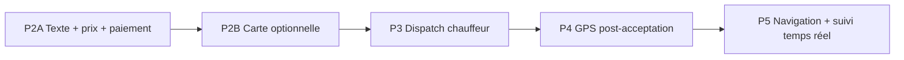

# Plan d'implémentation — Hybride Text-first

**Décision produit :** validée  
**Modèle retenu :** Hybride Text-first  
**Base :** `v2-p1-stable` / branche `feature/mami-taxi-v2-p2`  
**Date :** 2026-06-12  
**Statut :** plan technique — **aucun développement**  
**Références :** [P2_TEXT_BOOKING_PROPOSAL.md](./P2_TEXT_BOOKING_PROPOSAL.md), [MAMI_TAXI_V2.md](./MAMI_TAXI_V2.md), [P1_FINAL_VALIDATION.md](./P1_FINAL_VALIDATION.md)

---

## Décision produit (rappel)

```text
Flux principal :
  Départ      → [ Texte libre ]
  Destination → [ Texte libre ]
  Prix        → [ Montant proposé ]
  Paiement    → Cash | Airtel Money | Moov Money
  Option      → [ Choisir sur la carte ]

Contraintes :
  ✗ GPS non obligatoire à la création
  ✓ GPS client partagé uniquement après acceptation chauffeur
```

---

## Vue d'ensemble des phases



| Phase | Objectif | Livrable utilisateur |
|-------|----------|----------------------|
| **P2A** | Créer une demande sans GPS ni carte | Formulaire texte → course `searching` (sans dispatch actif ou stub) |
| **P2B** | Affiner départ/destination sur carte | Lien « Choisir sur la carte » → coords optionnelles |
| **P3** | Trouver et assigner un chauffeur | Recherche progressive, offres, acceptation |
| **P4** | Localiser le client après acceptation | Partage position client à la demande |
| **P5** | Exécution et suivi course | Navigation chauffeur, carte live, ETA |

**Ordre strict :** P2A → P2B → P3 → P4 → P5. P2B peut être parallélisé partiellement avec la fin de P2A si l'API P2A est figée.

---

## État actuel (baseline `v2-p1-stable`)

| Composant | État |
|-----------|------|
| `RideBookingV2Screen` | GPS-first, carte obligatoire, pas de texte ni prix client |
| `POST /rides/request` | Coords **obligatoires**, dispatch V1 immédiat |
| `POST /rides/estimate` | Coords obligatoires |
| `rides` | `pickup_*` / `destination_*` lat/lng NOT NULL en migration V1 |
| V2 champs préparés | `proposed_price`, `payment_method`, `suggested_price` — **nullable, non utilisés** |
| Labels texte | **Absents** |
| Dispatch V2 | Config seulement (`MAMI_DISPATCH_V2=false`) |
| Partage GPS client | **Absent** |
| Chauffeur | `IncomingRideCard` carte + coords, code `68b342b` |

---

# P2A — Réservation texte + prix + paiement

## Objectif

Permettre au client de **créer une demande de course** avec uniquement :

- `pickup_label` (texte)
- `destination_label` (texte)
- `proposed_price` (montant FCFA)
- `payment_method` (cash | airtel_money | moov_money)

**Sans** GPS, **sans** carte, **sans** dispatch fonctionnel (statut `searching` stocké, UI « recherche » — dispatch réel en P3).

## Prérequis

- Branche `feature/mami-taxi-v2-p2` depuis `v2-p1-stable`
- Aucune dépendance P2B/P3

## Backend — P2A

### Migration

**Fichier :** `database/migrations/2026_06_12_100000_add_text_booking_fields_to_rides_table.php`

| Colonne | Type | Notes |
|---------|------|-------|
| `pickup_label` | string(255) nullable | Texte départ |
| `destination_label` | string(255) nullable | Texte destination |
| `pickup_notes` | text nullable | Précisions optionnelles |
| `location_source` | string default `text` | `text`, `map`, `gps` — origine enrichissement |

**Modifier contrainte coords (migration séparée ou même fichier) :**

| Colonne | Changement |
|---------|------------|
| `pickup_latitude` | nullable |
| `pickup_longitude` | nullable |
| `destination_latitude` | nullable |
| `destination_longitude` | nullable |

> Les rides V1 existantes conservent leurs coords. Nouvelles rides text-only : coords NULL autorisées.

### Config (`config/mami.php`)

```php
'min_proposed_price' => (int) env('MAMI_MIN_PROPOSED_PRICE', 500),
'max_proposed_price' => (int) env('MAMI_MAX_PROPOSED_PRICE', 500000),
'pickup_label_min_length' => 3,
'destination_label_min_length' => 3,
```

### Nouveau service

**Fichier :** `app/Services/RideBookingService.php`

Responsabilités :

1. Valider texte + prix + paiement
2. Calculer `suggested_price` :
   - si coords présentes → `RideEstimateService`
   - sinon → **fourchette par défaut** ou `null` (P2A : `suggested_price` nullable acceptable)
3. Créer ride :
   - `status` = `searching` (nouveau enum — migration statuts ou mapping temporaire `pending` + flag)
   - `booking_type` = `immediate`
   - `proposed_price`, `payment_method` renseignés
   - `driver_id` = **null** (attente P3)
   - `dispatch_expires_at` = now + 2h (préparation P3)

**Note statut :** ajouter `RideStatus::Searching` dans `app/Enums/RideStatus.php` + migration si absent.

### Request / validation

**Fichier :** `app/Http/Requests/Rides/CreateRideRequest.php` (remplace ou complète `RequestRideRequest` pour V2)

```php
'pickup_label'        => ['required', 'string', 'min:3', 'max:255'],
'destination_label'   => ['required', 'string', 'min:3', 'max:255'],
'pickup_notes'        => ['nullable', 'string', 'max:500'],
'proposed_price'      => ['required', 'numeric', 'min:...', 'max:...'],
'payment_method'      => ['required', Rule::enum(PaymentMethod::class)],
// coords optionnelles P2A (nullables)
'pickup_latitude'     => ['nullable', 'numeric', 'between:-90,90'],
'pickup_longitude'    => ['nullable', 'numeric', 'between:-180,180'],
'destination_latitude'=> ['nullable', 'numeric', 'between:-90,90'],
'destination_longitude'=> ['nullable', 'numeric', 'between:-180,180'],
```

### Endpoint

| Méthode | Route | Action |
|---------|-------|--------|
| `POST` | `/api/rides/request` | V2 : text-first via `RideBookingService` si `MAMI_TAXI_V2=true` |
| `POST` | `/api/rides/request/v1` | Alias rétrocompat ou détection payload (coords seules = V1) |

**Stratégie coexistence :**

```text
Si body contient pickup_label → flux V2 (RideBookingService)
Sinon si coords required → flux V1 (RideDispatchService) — déprécié client V2
```

### Resource API

**Fichier :** `app/Http/Resources/RideResource.php` — exposer :

```json
{
  "pickup_label": "Lalala, rond-point Total",
  "destination_label": "Nzeng-Ayong, marché",
  "pickup_notes": null,
  "proposed_price": 3000,
  "suggested_price": null,
  "payment_method": "cash",
  "pickup_latitude": null,
  "pickup_longitude": null,
  "status": "searching"
}
```

### Tests

| Fichier | Cas |
|---------|-----|
| `tests/Feature/RideBookingTextTest.php` | Création text-only OK |
| | Validation prix min/max |
| | PaymentMethod enum |
| | Labels trop courts → 422 |
| | Coords absentes → 201 |

### Fichiers backend impactés

```
app/Enums/RideStatus.php
app/Models/Ride.php
app/Services/RideBookingService.php          [NEW]
app/Http/Controllers/Api/RideController.php
app/Http/Requests/Rides/CreateRideRequest.php [NEW]
app/Http/Resources/RideResource.php
config/mami.php
routes/api.php
database/migrations/...
tests/Feature/RideBookingTextTest.php      [NEW]
```

## Client Flutter — P2A

### Nouvel écran principal

**Remplacer / succéder :** `RideBookingV2Screen` → `RideBookingTextScreen`

**Fichier :** `lib/features/rides/presentation/screens/ride_booking_text_screen.dart`

| Widget | Rôle |
|--------|------|
| `TextFormField` pickup | Départ texte libre |
| `TextFormField` destination | Destination texte libre |
| `TextFormField` notes | Optionnel |
| `PriceInputField` | Prix proposé FCFA |
| `PaymentMethodSelector` | Cash / Airtel / Moov |
| `PrimaryButton` | « Chercher un chauffeur » |
| Lien secondaire | « Choisir sur la carte » → **désactivé ou stub P2B** |

**Pas d'appel** `userLocationProvider` au `initState`. GPS **non requis**.

### Nouveaux fichiers client

```
lib/features/rides/domain/models/payment_method.dart
lib/features/rides/presentation/widgets/payment_method_selector.dart
lib/features/rides/presentation/widgets/price_input_field.dart
lib/features/rides/presentation/providers/booking_form_provider.dart
lib/features/rides/data/rides_repository.dart          [extend createRideV2()]
lib/features/rides/presentation/screens/ride_booking_text_screen.dart
lib/features/rides/presentation/screens/ride_searching_screen.dart  [extend]
```

### `RideBookingGate`

```dart
f.useV2Booking ? RideBookingTextScreen() : RideBookingScreen()
```

Conserver `RideBookingV2Screen` en archive ou le supprimer en fin P2B.

### Repository — payload

```dart
Future<RideModel> requestRideV2({
  required String pickupLabel,
  required String destinationLabel,
  required double proposedPrice,
  required PaymentMethod paymentMethod,
  String? pickupNotes,
  double? pickupLatitude,
  double? pickupLongitude,
  double? destinationLatitude,
  double? destinationLongitude,
});
```

### Écran recherche (stub P2A)

`RideSearchingScreen` — afficher labels texte + prix + paiement. Message : « Recherche de chauffeur… » (dispatch P3 activera les mises à jour Reverb).

### Tests client

- Widget test formulaire validation
- Unit test serialization `RideModel` champs texte

## Chauffeur — P2A

**Aucun changement obligatoire** — pas de dispatch actif. Optionnel : préparer `RideModel` pour champs texte (lecture seule).

## Critères d'acceptation P2A

- [ ] Client crée une course **sans permission GPS**
- [ ] API 201 avec `pickup_label`, `destination_label`, `proposed_price`, `payment_method`
- [ ] Coords NULL en base pour course text-only
- [ ] `suggested_price` affiché si coords fournies, sinon masqué ou « — »
- [ ] Validation prix 500–500 000 FCFA
- [ ] Cash sélectionné par défaut
- [ ] Navigation vers écran recherche
- [ ] Tests Feature backend verts

## Estimation P2A

| Couche | Jours |
|--------|-------|
| Backend | 2 |
| Client | 2–3 |
| QA | 1 |
| **Total** | **5–6 j** |

---

# P2B — Carte optionnelle

## Objectif

Ajouter l'option **« Choisir sur la carte »** pour affiner départ et/ou destination. Les coords enrichissent la demande mais restent **optionnelles**.

## Contraintes produit (non négociables)

| Contrainte | Détail |
|------------|--------|
| **P2A intact** | Le parcours texte validé (`v2-p2a-stable`) reste **100 % fonctionnel** sans régression |
| **Carte facultative** | Aucune étape carte obligatoire ; le lien « Choisir sur la carte » est **optionnel** |
| **Comportement texte inchangé** | Si l'utilisateur ne touche pas la carte → même payload, même UX, même enregistrement qu'en P2A |
| **GPS non requis** | Pas de demande permission GPS à l'ouverture de l'écran |

## Prérequis

- Tag `v2-p2a-stable` — baseline figée
- API `CreateRideRequest` / `RideBookingService` stables
- Réutiliser `MamiMap`, `LatLngUtils`, `RouteUtils` (P1)

---

## Analyse d'usage future (métriques produit)

### Objectif

Mesurer l'utilisation réelle des modes de saisie pour guider les futures décisions produit (Gabon) :

| Mode global | `pickup_source` | `destination_source` | Exemple |
|-------------|-----------------|----------------------|---------|
| **Texte uniquement** | `text` | `text` | P2A validé — Carrefour STFO → Sni owendo |
| **Carte uniquement** | `map` | `map` | Labels vides ou auto-générés, coords seules |
| **Hybride** | `hybrid` et/ou `hybrid` | Texte saisi + point affiné sur carte |

Ces champs sont **purement analytiques** — ils n'impactent pas le dispatch (P3) ni le parcours chauffeur.

### Modèle `rides` — nouveaux champs

| Colonne | Type | Valeurs | Défaut P2A rétroactif |
|---------|------|---------|------------------------|
| `pickup_source` | string enum | `text`, `map`, `hybrid` | `text` |
| `destination_source` | string enum | `text`, `map`, `hybrid` | `text` |

**Migration :** `2026_06_XX_add_location_sources_to_rides_table.php`

**Enum PHP :** `app/Enums/LocationSource.php`

```php
enum LocationSource: string
{
    case Text = 'text';
    case Map = 'map';
    case Hybrid = 'hybrid';
}
```

### Règles de calcul à la création (`RideBookingService`)

Appliquées **par point** (départ et destination indépendants) :

| Condition | `*_source` |
|-----------|------------|
| Label saisi, **pas** de coords | `text` |
| Coords fournies, label vide ou auto | `map` |
| Label saisi **et** coords fournies (carte utilisée) | `hybrid` |

**P2A sans modification comportementale :** si l'utilisateur remplit uniquement les champs texte (comme aujourd'hui) → `pickup_source = text`, `destination_source = text` (identique au cas validé terrain).

**P2B carte seule (cas rare) :** tap carte sans modifier le texte existant sur l'autre champ → source `map` ou `hybrid` selon le champ concerné.

### Exposition API

`RideResource` inclut :

```json
{
  "pickup_source": "text",
  "destination_source": "hybrid"
}
```

Pas d'exposition client obligatoire en UI — stockage serveur suffisant pour analytics.

### Requêtes analytics (futures)

```sql
-- Répartition modes (30 derniers jours)
SELECT pickup_source, destination_source, COUNT(*) AS rides
FROM rides
WHERE created_at >= NOW() - INTERVAL 30 DAY
GROUP BY pickup_source, destination_source;

-- Taux texte pur (comme P2A)
SELECT COUNT(*) * 100.0 / (SELECT COUNT(*) FROM rides) AS pct_text_only
FROM rides
WHERE pickup_source = 'text' AND destination_source = 'text';
```

**Dashboard admin (hors scope P2B dev) :** graphique camembert + évolution hebdomadaire — phase ultérieure.

### Tests P2B — sources

| Cas | `pickup_source` | `destination_source` |
|-----|-----------------|----------------------|
| Texte seul (régression P2A) | `text` | `text` |
| Carte départ + texte destination | `map` ou `hybrid` | `text` |
| Texte + carte destination | `text` | `hybrid` |
| Carte des deux points | `map` | `map` |

---

## Backend — P2B

### Comportement

- Coords fournies → recalcul `suggested_price`, `distance_km`, `duration_minutes` via `RideEstimateService`
- `pickup_label` / `destination_label` **toujours conservés** (texte prime pour affichage chauffeur)
- `pickup_source` / `destination_source` renseignés automatiquement (client n'envoie pas ces champs)

### Endpoint estimate étendu (optionnel)

**Fichier :** `app/Http/Requests/Rides/EstimateRideRequest.php`

Accepter soit coords, soit labels (MVP P2B : coords seulement depuis carte — estimate inchangé).

### Géocodage léger (MVP)

**Fichier :** `app/Support/LibrevilleLandmarks.php` ou `app/Services/AddressHintService.php`

Dictionnaire statique quartiers → centroid approximatif pour **suggestion** `suggested_price` quand seul le texte est fourni (optionnel P2B, pas bloquant).

## Client Flutter — P2B

### Modal carte

**Fichier :** `lib/features/rides/presentation/screens/ride_map_picker_sheet.dart`

```text
┌─────────────────────────────────────┐
│  Choisir sur la carte          [×]  │
├─────────────────────────────────────┤
│  [ MamiMap fullScreen ]             │
│  Tap = point sélectionné            │
│  Toggle: Départ | Destination       │
├─────────────────────────────────────┤
│  [ Confirmer ce point ]             │
└─────────────────────────────────────┘
```

### Intégration formulaire P2A (sans régression)

- Bouton « Choisir sur la carte » **ajouté** — n'apparaît pas bloquant, flux texte par défaut inchangé
- Si l'utilisateur **ignore** la carte → comportement **strictement identique** à P2A
- Retour sheet : coords + optionnellement hint texte (« Près de … »)
- `booking_form_provider` fusionne texte + coords **sans écraser** le texte saisi sauf action explicite
- Si carte utilisée → badge « Affiné sur carte » sous le champ concerné
- Le client **n'envoie pas** `pickup_source` / `destination_source` — calcul **côté serveur** uniquement

### Suggested price live

Si départ **et** destination ont coords → appel `POST /rides/estimate` → afficher « Prix conseillé : X FCFA » sous le champ prix.

### Fichiers client

```
lib/features/rides/presentation/screens/ride_map_picker_sheet.dart  [NEW]
lib/features/rides/presentation/providers/booking_form_provider.dart [extend]
lib/features/rides/presentation/screens/ride_booking_text_screen.dart [extend]
```

### Fichiers backend (complément analytics)

```
app/Enums/LocationSource.php                                        [NEW]
database/migrations/..._add_location_sources_to_rides_table.php     [NEW]
app/Services/RideBookingService.php                                 [extend resolveLocationSource()]
app/Http/Resources/RideResource.php                                 [extend]
tests/Feature/RideBookingTextTest.php                               [extend source assertions]
tests/Feature/RideBookingMapTest.php                                [NEW]
```

Supprimer ou déprécier `ride_booking_v2_screen.dart` (GPS-first P1).

## Chauffeur — P2B

Aucun changement.

## Critères d'acceptation P2B

- [ ] Commander avec texte seul — **régression P2A identique** (payload, UX, pas de GPS)
- [ ] `pickup_source = text`, `destination_source = text` pour parcours texte pur
- [ ] Ouvrir carte, sélectionner départ et/ou destination, confirmer
- [ ] `suggested_price` calculé après sélection carte (si les deux points ont coords)
- [ ] Labels texte conservés après enrichissement carte
- [ ] `pickup_source` / `destination_source` corrects pour chaque combinaison text/map/hybrid
- [ ] Cas validé P2A (Carrefour STFO → Sni owendo) toujours reproductible

## Estimation P2B

| Couche | Jours |
|--------|-------|
| Backend (sources + hints optionnels) | 1–1.5 |
| Client (sheet + intégration) | 2 |
| QA (régression P2A + sources) | 1 |
| **Total** | **4–4.5 j** |

---

# P3 — Dispatch chauffeur

## Objectif

Après création d'une demande (`status=searching`), **trouver et proposer** la course aux chauffeurs éligibles via dispatch progressif V2, puis **assigner** au premier acceptant.

## Prérequis

- P2A (création ride `searching`, `driver_id` null)
- Chauffeur online + GPS heartbeat (existant `68b342b`)
- `MAMI_DISPATCH_V2=true` sur VPS

## Backend — P3

### Nouvelles tables

| Table | Fichier migration |
|-------|-------------------|
| `ride_offers` | `create_ride_offers_table` |
| `ride_dispatch_waves` | `create_ride_dispatch_waves_table` (audit) |

Voir schéma [MAMI_TAXI_V2.md](./MAMI_TAXI_V2.md) §4.2–4.3.

### Nouveaux services

| Service | Rôle |
|---------|------|
| `RideDispatchEngine` | Orchestration vagues, expiration 2h |
| `RideOfferService` | CRUD offres, first-wins atomique |
| `RideDispatchScoringService` | Score distance + dispo + fraîcheur + rating |

### Point de recherche sans coords pickup

**Problème :** `DriverLocationService::findNearby()` exige lat/lng pickup.

**Solutions P3 (par priorité) :**

1. **Géocodage texte** → centroid quartier (`AddressHintService`)
2. **Vague élargie initiale** si coords NULL (démarrer à 3–5 km, pas 0–1 km)
3. **Après P4** : affinage quand client partage GPS

```php
// RideDispatchEngine::resolveSearchPoint(Ride $ride): ?GeoPoint
if ($ride->hasPickupCoordinates()) return GeoPoint::fromRidePickup($ride);
if ($hint = $this->addressHintService->resolve($ride->pickup_label)) return $hint;
return GeoPoint::librevilleCenter(); // fallback avec rayon large
```

### Jobs

| Job | Rôle |
|-----|------|
| `DispatchWaveJob` | Vague suivante (0–1, 1–3, … 10–20 km) |
| `ExpireRideSearchJob` | 2h → `expired` |
| `ExpireOfferJob` | Timeout offre 30s |

**Fichier :** `routes/console.php` — scheduler jobs.

### Events Reverb

| Event | Canal |
|-------|-------|
| `RideSearchStarted` | `private-user-{clientId}` |
| `RideOfferSent` | `private-driver-{driverId}` |
| `RideOfferAccepted` | client + chauffeur |
| `RideOfferRejected` | audit |
| `RideSearchExpired` | client |

Payload offre **text-first** :

```json
{
  "ride_id": 42,
  "pickup_label": "Lalala, rond-point Total",
  "destination_label": "Nzeng-Ayong, marché",
  "proposed_price": 3000,
  "payment_method": "cash",
  "pickup_latitude": null,
  "distance_to_pickup_km": null
}
```

### Endpoints

| Méthode | Route | Rôle |
|---------|-------|------|
| `POST` | `/api/rides/{id}/offers/{offer}/accept` | Chauffeur accepte |
| `POST` | `/api/rides/{id}/offers/{offer}/reject` | Chauffeur refuse |
| `POST` | `/api/rides/{id}/cancel` | Client annule recherche |
| `GET` | `/api/rides/current` | Client : course searching/active |

Modifier `POST /rides/request` : après création → `RideDispatchEngine::start($ride)`.

### Tests

```
tests/Feature/RideDispatchV2Test.php
tests/Feature/RideExpirationTest.php
tests/Feature/RideOfferTest.php
```

## Client Flutter — P3

| Composant | Fichier |
|-----------|---------|
| `dispatch_status_provider` | Écoute `RideSearchStarted`, `RideOfferAccepted`, `RideSearchExpired` |
| `DispatchStatusBanner` | État recherche sur `RideSearchingScreen` |
| `ExpiredRideDialog` | Course expirée 2h |
| Appel `requestRideV2` → écoute Reverb + poll `GET /rides/current` |

## Chauffeur — P3

| Composant | Fichier |
|-----------|---------|
| `incoming_offer_provider` | Écoute `RideOfferSent` |
| Refonte `IncomingRideCard` | **Texte first** : labels, prix, paiement ; carte si coords |
| `counter_offer_sheet` | Reporté P5 négociation si hors scope |

**Fichiers :**

```
lib/features/rides/domain/models/ride_offer_model.dart
lib/features/rides/presentation/providers/incoming_offer_provider.dart
lib/features/rides/presentation/widgets/incoming_ride_card.dart [refonte]
```

## Critères d'acceptation P3

- [ ] Demande text-only → offre envoyée à chauffeur online proche (zone approximative)
- [ ] Chauffeur voit pickup/destination **texte** + prix + cash
- [ ] Premier acceptant gagne (`agreed_price` = `proposed_price`)
- [ ] Client notifié → transition `accepted`
- [ ] Expiration 2h sans accept → `expired`
- [ ] V1 dispatch désactivé si `MAMI_DISPATCH_V2=true`

## Estimation P3

| Couche | Jours |
|--------|-------|
| Backend | 8–10 |
| Client | 3–4 |
| Chauffeur | 2–3 |
| QA terrain | 2 |
| **Total** | **15–19 j** |

---

# P4 — Partage GPS après acceptation

## Objectif

Une fois la course **acceptée** (`status=accepted`), le client est invité à **partager sa position** pour permettre au chauffeur de le localiser précisément.

## Prérequis

- P3 : flux acceptation opérationnel
- Permission GPS client (demandée **à ce moment**, pas à la réservation)

## Backend — P4

### Migration

| Colonne | Type |
|---------|------|
| `client_location_sharing` | boolean default false |
| `client_location_updated_at` | timestamp nullable |
| `client_latitude` | decimal nullable (live, distinct pickup si besoin) |
| `client_longitude` | decimal nullable |

Alternative : table `ride_client_locations` (historique) — recommandé si audit requis.

### Endpoint

| Méthode | Route | Auth | Corps |
|---------|-------|------|-------|
| `POST` | `/api/rides/{ride}/client-location` | Client | `{ latitude, longitude }` |
| `POST` | `/api/rides/{ride}/client-location/stop` | Client | Arrêt partage |

**Règles :**

- Autorisé seulement si `ride.client_id` = user et `status` in (`accepted`, `arrived`)
- Met à jour `pickup_latitude/longitude` **ou** `client_latitude/longitude` selon design
- `client_location_sharing` = true

### Event Reverb

**Nouveau :** `ClientLocationUpdated`

- Canaux : `private-driver-{driverId}`, `private-ride-{rideId}`, `private-user-{clientId}`
- Payload : `{ latitude, longitude, updated_at }`

### Service

**Fichier :** `app/Services/ClientLocationService.php`

- Validation coords
- Broadcast event
- Recalcul ETA via `DistanceRefreshService`

## Client Flutter — P4

### Écran course active / acceptée

**Fichier :** `lib/features/rides/presentation/screens/active_ride_screen.dart`

Après `accepted` :

```text
┌─────────────────────────────────────┐
│  Chauffeur en route                 │
│  [ Partager ma position ]           │  ← CTA principal
│  ✓ Position partagée (maj 10s)      │
└─────────────────────────────────────┘
```

### Provider

**Fichier :** `lib/features/rides/presentation/providers/client_location_sharing_provider.dart`

- Demande permission GPS **ici**
- Timer 10–15 s → `POST client-location`
- Arrêt à `arrived` / `started` / logout

### Deep link

Non requis P4 (navigation = P5).

## Chauffeur — P4

- `active_ride_screen` : marqueur client live si `ClientLocationUpdated`
- Afficher texte pickup **+** pin GPS quand disponible
- Distance/ETA recalculée

## Critères d'acceptation P4

- [ ] Pas de demande GPS à la réservation (régression P2A)
- [ ] Après acceptation → CTA partage visible
- [ ] Client accepte → chauffeur voit pin live < 15 s
- [ ] Client refuse → chauffeur a toujours labels texte + téléphone
- [ ] Partage s'arrête à l'arrivée chauffeur

## Estimation P4

| Couche | Jours |
|--------|-------|
| Backend | 2–3 |
| Client | 2–3 |
| Chauffeur | 1–2 |
| QA terrain | 1 |
| **Total** | **6–9 j** |

---

# P5 — Navigation et suivi temps réel

## Objectif

Finaliser l'**exécution** de la course : navigation chauffeur vers client, suivi live client, ETA fiable, cycle arrived → started → completed.

## Prérequis

- P4 : position client disponible (ou texte + appel en fallback)
- Existant : `RideTrackingService`, `DriverLocationUpdated`, `location_tracker_provider` chauffeur

## Backend — P5

### Enrichissements

| Service | Action |
|---------|--------|
| `RideTrackingService` | Fusionner position chauffeur + client + labels texte |
| `GET /rides/{id}/tracking` | Ajouter `client_location`, `pickup_label`, ETA bidirectionnel |

### Deep link (côté apps, pas API)

```
https://www.google.com/maps/dir/?api=1&destination={lat},{lng}
```

### Events existants à enrichir

- `DriverLocationUpdated` — inclure `pickup_label`, distance to **client live**
- `DriverArrived`, `RideStarted`, `RideCompleted` — inchangés

### Négociation (hors scope strict P5)

Contre-offre chauffeur → reporter phase P5 spec originale ou P5b.

## Client Flutter — P5

| Écran | Amélioration |
|-------|--------------|
| `active_ride_screen` | Carte plein écran, chauffeur animé, ETA |
| `ride_live_tracking_provider` | Fusion `ClientLocationUpdated` + `DriverLocationUpdated` |
| Fallback | Bouton appeler chauffeur |

## Chauffeur — P5

| Écran | Amélioration |
|-------|--------------|
| `active_ride_screen` | Navigation externe (Google Maps / Waze) |
| Carte | Pin client live + label texte pickup |
| Actions | Arrivé → Démarrer → Terminer (existant) |

## Critères d'acceptation P5

- [ ] Chauffeur ouvre navigation vers client (coords live ou centroid)
- [ ] Client voit chauffeur se rapprocher sur carte
- [ ] ETA mise à jour < 30 s
- [ ] Cycle complet : accept → share GPS → arrived → start → complete
- [ ] Test terrain 3 m : chauffeur rejoint client avec GPS post-acceptation

## Estimation P5

| Couche | Jours |
|--------|-------|
| Backend | 1–2 |
| Client | 2–3 |
| Chauffeur | 2–3 |
| QA terrain | 2 |
| **Total** | **7–10 j** |

---

## Synthèse planning

| Phase | Description | Jours dev | QA | Cumul |
|-------|-------------|-----------|-----|-------|
| **P2A** | Texte + prix + paiement | 4–5 | 1 | 5–6 |
| **P2B** | Carte optionnelle | 2.5–3 | 1 | 3.5–4 |
| **P3** | Dispatch chauffeur | 13–17 | 2 | 15–19 |
| **P4** | GPS post-acceptation | 5–6 | 1 | 6–9 |
| **P5** | Navigation + suivi | 5–8 | 2 | 7–10 |
| **Total** | | **29.5–39** | **7** | **~37–48 j** |

> Hors P6 paiement MM réel, P7 programmé, P8 avis — voir [MAMI_TAXI_V2.md](./MAMI_TAXI_V2.md).

---

## Stratégie de branches

```text
main @ v2-p1-stable
  └── feature/mami-taxi-v2-p2
        ├── P2A → merge partiel ou tag v2-p2a
        ├── P2B → tag v2-p2b
        ├── P3  → feature/mami-taxi-v2-p3 (depuis p2b)
        ├── P4  → feature/mami-taxi-v2-p4
        └── P5  → feature/mami-taxi-v2-p5
```

**Recommandation :** tag intermédiaire après chaque phase (`v2-p2a`, `v2-p2b`, `v2-p3`, …).

---

## Feature flags

| Flag | P2A | P2B | P3 | P4 | P5 |
|------|-----|-----|----|----|-----|
| `MAMI_TAXI_V2` | `true` | `true` | `true` | `true` | `true` |
| `MAMI_DISPATCH_V2` | `false` | `false` | `true` | `true` | `true` |

---

## Risques transverses

| Risque | Phase | Mitigation |
|--------|-------|------------|
| Dispatch sans coords imprécis | P3 | Géocodage quartiers + vague large |
| Régression V1 | P2A | Détection payload V1/V2 |
| Chauffeur APK obsolète | P3 | Rebuild + release notes |
| Permission GPS refusée post-accept | P4 | Fallback texte + appel |
| Tuiles OSM lentes | P2B | Carte optionnelle seulement |
| Tests terrain dispatch | P3–P5 | Checklist [DISPATCH_REAL_WORLD_TEST.md](./DISPATCH_REAL_WORLD_TEST.md) |

---

## Checklist démarrage P2A

- [ ] Valider ce plan produit / tech
- [ ] Créer migration `pickup_label`, coords nullable
- [ ] Implémenter `RideBookingTextScreen`
- [ ] Désactiver GPS obligatoire sur `/book`
- [ ] Tests `RideBookingTextTest`
- [ ] QA : commander sans GPS ni carte

---

## Documents liés

- [P2_TEXT_BOOKING_PROPOSAL.md](./P2_TEXT_BOOKING_PROPOSAL.md) — étude UX
- [MAMI_TAXI_V2.md](./MAMI_TAXI_V2.md) — architecture cible complète
- [P1_FINAL_VALIDATION.md](./P1_FINAL_VALIDATION.md) — baseline
- [P1_RELEASE_NOTES.md](./P1_RELEASE_NOTES.md) — tag `v2-p1-stable`

---

**Prochaine action :** validation de ce plan → démarrage implémentation **P2A** sur `feature/mami-taxi-v2-p2`.
