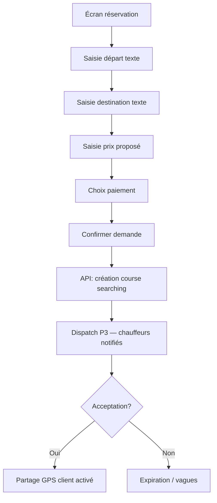

# Proposition P2 — Réservation Text-first (étude fonctionnelle)

**Branche :** `feature/mami-taxi-v2-p2`  
**Base :** `v2-p1-stable` (P1 clôturée)  
**Date :** 2026-06-12  
**Statut :** étude fonctionnelle — **aucun développement**  
**Références :** [MAMI_TAXI_V2.md](./MAMI_TAXI_V2.md), [P1_FINAL_VALIDATION.md](./P1_FINAL_VALIDATION.md)

---

## Contexte et motivation

Les tests terrain P1 (client + chauffeur, Libreville) confirment la **faisabilité technique** du GPS et de l'estimation, mais soulèvent un écart d'**usage réel** :

- Les clients décrivent leurs trajets en **quartiers**, **points de repère** et **destinations connues** (« Lalala carrefour Total », « vers PK8 », « Glass après la station »).
- Le flux **GPS obligatoire dès la création** (pickup auto + tap carte destination) est perçu comme **lourd**, surtout en mobilité, sous faible luminosité, ou avec une connexion instable.
- Le GPS reste **indispensable après acceptation** pour que le chauffeur **rejoigne précisément** le client et assure le suivi de course.

Cette étude compare trois modèles — **GPS-first** (P1), **Text-first**, **Hybride** — et formule une recommandation pour le marché gabonais avant le développement P2.

---

## 1. Modèle actuel GPS-first (P1)

### 1.1 Description

| Étape | Comportement actuel |
|-------|---------------------|
| Départ | GPS automatique (`user_location_provider`) — verrouillé, non éditable |
| Destination | Tap sur carte OSM (`RideBookingV2Screen`) |
| Estimation | `POST /api/rides/estimate` (Haversine serveur) |
| Prix | `suggested_price` affiché — pas de saisie client en P1 |
| Paiement | Non implémenté |
| Dispatch | Non implémenté en V2 P1 (SnackBar « phase P3 ») |

**Schéma données :** `rides` stocke uniquement `pickup_latitude/longitude` et `destination_latitude/longitude` — **aucun champ texte adresse**.

### 1.2 Avantages

| Avantage | Détail |
|----------|--------|
| Précision géographique | Coordonnées exploitables directement par dispatch Haversine (P3) |
| Estimation automatique | Distance, durée, prix conseillé sans ambiguïté sémantique |
| Carte lisible | Visualisation immédiate du trajet (polyline, marqueurs) |
| Alignement dispatch V2 | Vagues GPS 0–1 km… 10–20 km prévues dans la spec |
| Tracking course | `RideTrackingService`, `DriverLocationUpdated` déjà basés sur coords |
| Cohérence chauffeur | `IncomingRideCard` affiche carte pickup/destination |

### 1.3 Inconvénients

| Inconvénient | Détail |
|--------------|--------|
| Friction UX | Permission GPS, acquisition, carte grise/NaN (corrigé P1 mais fragile) |
| Peu naturel au Gabon | Adressage informel ; les gens ne pensent pas en coordonnées |
| Dépendance réseau + tuiles OSM | Carte inutilisable offline ou si tuiles lentes |
| Pickup verrouillé | Impossible de commander « pour quelqu'un d'autre » ou depuis un lieu décrit |
| Destination imprécise au tap | Doigt large sur petit écran → point approximatif |
| Barrière numérique | Utilisateurs habitués au téléphone vocal / WhatsApp / bouche-à-oreille |
| Double charge cognitive | Comprendre carte + GPS avant même de dire où aller |

### 1.4 Impacts UX (retours terrain synthétisés)

```text
Parcours P1 typique aujourd'hui :
  Home → Commander → attendre GPS → lire carte → tap destination
  → lire estimation → Continuer → message « phase P3 »

Points de friction observés :
  ① « Pourquoi la carte avant de dire où je vais ? »
  ② « Je connais le prix, je veux juste proposer 3000 FCFA »
  ③ « Mon départ c'est derrière le marché, pas sur la carte »
  ④ GPS OK sur Home, mais re-senti comme bloquant sur /book
```

**Taux d'abandon estimé (qualitatif) :** élevé sur l'écran `/book` si GPS lent ou carte peu familière — à confirmer par analytics P2.

---

## 2. Modèle Text-first

### 2.1 Principe

Le client **décrit** son trajet en langage naturel. Le GPS n'est **pas requis** à la création. Le prix et le mode de paiement sont **choisis explicitement** par le client.

### 2.2 Champs fonctionnels

| Champ | Type | Exemple Gabon | Obligatoire |
|-------|------|---------------|-------------|
| **Départ** | Texte libre | « Lalala, rond-point Total » | Oui |
| **Destination** | Texte libre | « Centre-ville, vers CCI » | Oui |
| **Prix proposé** | Montant FCFA | `3500` | Oui |
| **Mode de paiement** | Enum | Cash / Airtel Money / Moov Money | Oui |
| **Commentaire** | Texte optionnel | « Je suis en pagne bleu, devant la boutique » | Non |

### 2.3 Prix proposé par le client

Aligné sur la spec V2 (`proposed_price`, `suggested_price`, `agreed_price`) :

| Champ | Rôle |
|-------|------|
| `suggested_price` | Calcul serveur (si géocodage possible) — **indicatif** |
| `proposed_price` | Montant saisi par le client — **offre initiale** |
| `agreed_price` | Prix final après acceptation (ou négociation P5) |

**Règles métier proposées :**

- Plancher / plafond configurables (`MAMI_MIN_PROPOSED_PRICE`, `MAMI_MAX_PROPOSED_PRICE`).
- Si `proposed_price` < 50 % de `suggested_price` → avertissement client (pas blocage).
- Chauffeur voit **les deux** montants à l'acceptation.

### 2.4 Mode de paiement

| Méthode | Usage Gabon | Immédiat | Programmé |
|---------|-------------|----------|-----------|
| **Cash** | ~70–80 % des courses taxi | Oui (défaut) | Solde à l'arrivée |
| **Airtel Money** | Mobile Money dominant | Oui (stub P6) | Acompte 30 % (P7) |
| **Moov Money** | Second opérateur | Idem | Idem |

**Cash = défaut** — cohérent avec le terrain. MM pour programmé + utilisateurs sans liquide.

### 2.5 Flux Text-first (immédiat)



### 2.6 Avantages Text-first

- Aligné sur les **habitudes locales** (oral, repères, quartiers).
- **Rapide** : 4 champs + bouton, pas de carte obligatoire.
- Fonctionne **sans GPS** ni permission à la création.
- Le **prix proposé** reflète la négociation culturelle du taxi au Gabon.
- Accessible sur **terminaux modestes** (moins de données carto).

### 2.7 Risques Text-first

| Risque | Mitigation |
|--------|------------|
| Ambiguïté des adresses | Compléments libres + géocodage asynchrone (P2+) |
| Dispatch sans coords pickup | Centroides quartiers / géocodage approximatif pour vagues |
| Fraude prix | Bornes min/max + historique client |
| Chauffeur perdu | GPS client **après** acceptation (§3) |
| Support client | Modération textes, signalement |

---

## 3. Utilisation du GPS après acceptation

### 3.1 Principe : « Texte pour commander, GPS pour exécuter »

```text
Phase A — Création (text-first)     : adresses texte + prix + paiement
Phase B — Recherche (P3)              : dispatch sur zone approximative
Phase C — Acceptation                 : activation partage position client
Phase D — Exécution                   : navigation chauffeur + tracking temps réel
```

### 3.2 Partage de position du client

**Déclencheur :** chauffeur accepte la course (`status` → `accepted`).

| Mécanisme | Description |
|-----------|-------------|
| Prompt client | « Un chauffeur a accepté — partagez votre position pour qu'il vous trouve » |
| Consentement explicite | Bouton « Partager ma position » (RGPD / confiance) |
| Mise à jour | `POST /api/rides/{id}/client-location` toutes les 10–15 s |
| Stockage | `rides.pickup_latitude/longitude` **affinés** ou table `ride_client_locations` |
| Arrêt | À `arrived` ou `started` |

**Alternative progressive :** une seule capture GPS au moment du consentement, puis rafraîchissement si l'app est au premier plan.

### 3.3 Navigation chauffeur vers client

| Étape | Données chauffeur |
|-------|-------------------|
| Offre reçue | Texte départ/destination + prix proposé + paiement |
| Après acceptation | Texte + **coords client live** + distance/ETA |
| Carte | Marqueur client animé (`DriverLocationUpdated` symétrique côté client) |
| Action | Bouton « Ouvrir dans Google Maps / Waze » (deep link) |

Le chauffeur lit d'abord le **texte** (« Lalala Total »), puis se fie au **pin GPS** pour les derniers mètres.

### 3.4 Suivi de course

Réutilisation de l'existant :

- `RideTrackingService` — distance/ETA Haversine
- `DriverLocationUpdated` — Reverb
- `ride_live_tracking_provider` — client

**Enrichissement proposé :** afficher côte à côte **adresse texte** et **position live** sur `active_ride_screen` (client et chauffeur).

---

## 4. Option hybride (recommandée)

### 4.1 Principe

| Couche | Rôle |
|--------|------|
| **Texte** | Interface principale — départ, destination, prix, paiement |
| **Carte** | Option « Affiner sur la carte » — secondaire, repliable |
| **GPS** | Silencieux en arrière-plan pour suggestion départ ; actif après acceptation |

### 4.2 Comportement par défaut

```text
Écran réservation hybride :
┌─────────────────────────────────────┐
│  Réserver un trajet                 │
├─────────────────────────────────────┤
│  Départ                             │
│  [ Lalala, rond-point Total      ]  │  ← texte, pré-rempli GPS si dispo
│  ○ Utiliser ma position GPS         │  ← toggle optionnel
├─────────────────────────────────────┤
│  Destination                        │
│  [ Centre-ville, CCI               ]  │
│  [ 📍 Affiner sur la carte ]        │  ← lien secondaire
├─────────────────────────────────────┤
│  Votre prix (FCFA)                  │
│  [ 3500        ]  Conseillé: 3200   │
├─────────────────────────────────────┤
│  Paiement  (•) Cash  ( ) Airtel     │
│            ( ) Moov                   │
├─────────────────────────────────────┤
│  [ Commander maintenant ]             │
└─────────────────────────────────────┘
```

### 4.3 Règles hybrides

1. **Texte suffit** pour soumettre une demande.
2. Si GPS disponible → pré-remplir le champ départ (« Près de votre position actuelle ») **sans bloquer**.
3. Carte accessible via lien — ouvre modal / demi-écran.
4. `suggested_price` calculé si coords disponibles ; sinon estimation **par zone** ou fourchette textuelle.
5. Après acceptation → flux GPS identique au §3.

---

## 5. Maquettes écrans client

### 5.1 Réservation immédiate (hybride)

```text
┌──────────────────────────────────────────┐
│ ←  Commander maintenant                  │
├──────────────────────────────────────────┤
│                                          │
│  Où partez-vous ?                        │
│  ┌────────────────────────────────────┐  │
│  │ 📍 Akébé, près Pharmacie du Gabon  │  │
│  └────────────────────────────────────┘  │
│  ☑ Utiliser ma position GPS actuelle      │
│                                          │
│  Où allez-vous ?                           │
│  ┌────────────────────────────────────┐  │
│  │ 🏁 Nzeng-Ayong, marché               │  │
│  └────────────────────────────────────┘  │
│  Suggestions : Lalala · Glass · PK12     │
│  [ Affiner sur la carte ]                  │
│                                          │
│  ─────────────────────────────────────   │
│  Prix conseillé : 2 800 FCFA             │
│  Votre proposition *                     │
│  ┌────────────────────────────────────┐  │
│  │ 3000                               │  │
│  └────────────────────────────────────┘  │
│                                          │
│  Comment payer ?                         │
│  ┌──────┐ ┌──────────┐ ┌──────────┐     │
│  │ Cash │ │  Airtel  │ │   Moov   │     │
│  │  ✓   │ │   Money  │ │   Money  │     │
│  └──────┘ └──────────┘ └──────────┘     │
│                                          │
│  Note (optionnel)                        │
│  ┌────────────────────────────────────┐  │
│  │ Devant la station Shell            │  │
│  └────────────────────────────────────┘  │
│                                          │
│  ┌────────────────────────────────────┐  │
│  │      🔍 Chercher un chauffeur       │  │
│  └────────────────────────────────────┘  │
└──────────────────────────────────────────┘
```

**États :**

- Chargement : spinner sur bouton, champs désactivés.
- Erreur validation : bordure rouge + message sous champ.
- Succès : navigation vers écran « Recherche en cours » (P3).

### 5.2 Réservation programmée

```text
┌──────────────────────────────────────────┐
│ ←  Réserver pour plus tard               │
├──────────────────────────────────────────┤
│  Type : ( ) Maintenant  (•) Programmé    │
│                                          │
│  Date et heure *                         │
│  ┌──────────────┐  ┌──────────────┐     │
│  │ 15/06/2026   │  │  07:30       │     │
│  └──────────────┘  └──────────────┘     │
│                                          │
│  Départ *                                │
│  [ Aéroport Léon Mba, arrivée vol ]      │
│                                          │
│  Destination *                           │
│  [ Glass, domicile — Immeuble Azur ]     │
│                                          │
│  Prix proposé *        Conseillé: 12 000 │
│  [ 10000 ]                               │
│                                          │
│  Paiement acompte (30 %) *                │
│  ( ) Cash ✗   (•) Airtel   ( ) Moov      │
│  Acompte : 3 000 FCFA                    │
│  Solde en cash à bord : 7 000 FCFA       │
│                                          │
│  ┌────────────────────────────────────┐  │
│  │   Confirmer et payer l'acompte      │  │
│  └────────────────────────────────────┘  │
└──────────────────────────────────────────┘
```

**Spécificités programmé :** acompte MM obligatoire (spec V2 §4.4) ; texte encore plus pertinent (vol, RDV médical, etc.).

### 5.3 Partage GPS après acceptation

```text
┌──────────────────────────────────────────┐
│  🚕 Chauffeur en route                    │
├──────────────────────────────────────────┤
│  Jean-Paul · Toyota Corolla · AB-123-CD  │
│  ⭐ 4.7                                   │
│                                          │
│  ┌────────────────────────────────────┐  │
│  │         [ Carte live ]              │  │
│  │    🚕 ─────────── 👤               │  │
│  │    Chauffeur        Vous            │  │
│  └────────────────────────────────────┘  │
│                                          │
│  📍 Départ convenu :                     │
│     « Akébé, Pharmacie du Gabon »        │
│                                          │
│  ⚠️ Aidez votre chauffeur à vous trouver │
│  ┌────────────────────────────────────┐  │
│  │  📡 Partager ma position en direct  │  │
│  └────────────────────────────────────┘  │
│  Position partagée ✓  Mise à jour 8s    │
│                                          │
│  Prix convenu : 3 000 FCFA · Cash        │
│                                          │
│  [ Appeler ]  [ Annuler la course ]      │
└──────────────────────────────────────────┘
```

**Sans consentement GPS :** bannière persistante + le chauffeur s'appuie sur texte + appel téléphonique (`ride.client.phone` déjà exposé chauffeur).

---

## 6. Impacts backend

### 6.1 Table `rides` — nouveaux champs proposés

| Champ | Type | Description |
|-------|------|-------------|
| `pickup_label` | string nullable | Texte départ saisi client |
| `destination_label` | string nullable | Texte destination |
| `pickup_notes` | text nullable | Précisions (« devant la boutique ») |
| `client_location_sharing` | boolean default false | Consentement partage live |
| `client_location_updated_at` | timestamp nullable | Dernier heartbeat client |

Les champs `pickup_latitude/longitude` deviennent **nullable à la création**, renseignés progressivement (géocodage, GPS client post-acceptation).

### 6.2 Estimation (`RideEstimateService`)

| Mode | Entrée | Sortie |
|------|--------|--------|
| GPS (P1) | 4 coords | distance, durée, suggested_price |
| Texte | labels + optional coords | suggested_price **approximatif** ou fourchette |
| Hybride | texte + coords partielles | suggested_price priorité coords |

**Nouveau service proposé :** `AddressGeocodingService` — phase 1 = dictionnaire quartiers Libreville ; phase 2 = Nominatim / Google Places.

### 6.3 Dispatch (P3)

| Aspect | GPS-first | Text-first / Hybride |
|--------|-----------|----------------------|
| Point de recherche | `pickup_lat/lng` exact | Centroid quartier ou géocodage |
| Vague 0–1 km | Précise | Approximative si pas de coords |
| Score distance | Fiable | Pondération réduite ; poids texte + fraîcheur |
| Offre chauffeur | Carte + coords | **Texte en premier**, carte si coords |

**Évolution `RideOfferSent` payload :**

```json
{
  "pickup_label": "Lalala, rond-point Total",
  "destination_label": "Nzeng-Ayong, marché",
  "proposed_price": 3000,
  "payment_method": "cash",
  "pickup_latitude": null,
  "pickup_longitude": null
}
```

### 6.4 Notifications

| Event | Contenu enrichi |
|-------|-----------------|
| `RideOfferSent` | Labels texte + prix + paiement |
| `RideOfferAccepted` | Demande partage GPS client |
| `ClientLocationUpdated` | **Nouveau** — position client live |
| SMS fallback (futur) | Texte course si Reverb offline |

### 6.5 Paiements

| Champ ride | Rempli à la création |
|------------|---------------------|
| `proposed_price` | Montant client |
| `payment_method` | cash / airtel_money / moov_money |
| `agreed_price` | = proposed_price à l'acceptation (sauf négociation P5) |

Validation API P2 :

```text
proposed_price >= config('mami.min_proposed_price')
proposed_price <= config('mami.max_proposed_price')
payment_method in PaymentMethod enum
pickup_label min 3 chars
destination_label min 3 chars
```

---

## 7. Impacts application chauffeur

### 7.1 Écran offre entrante (`IncomingRideCard`)

**Aujourd'hui :** carte + distance Haversine + téléphone client.

**Évolution proposée :**

```text
┌──────────────────────────────────────────┐
│  🔔 Nouvelle course · 3 000 FCFA · Cash   │
├──────────────────────────────────────────┤
│  Départ : Lalala, rond-point Total        │
│  → Destination : Nzeng-Ayong, marché      │
│  Note client : devant la station Shell    │
│                                          │
│  Distance estimée : ~2.5 km (approx.)     │
│  [ Carte ] si coords disponibles          │
│                                          │
│  Client : Marie · +241 06 XX XX XX       │
│  [ Refuser ]        [ Accepter ]          │
└──────────────────────────────────────────┘
```

### 7.2 Après acceptation

- Carte **plein écran** avec pin client live (si partage actif).
- Sinon : texte + bouton appel + bouton « Je suis arrivé ».
- Pas de changement sur le **tracker GPS chauffeur** (10 s) — inchangé depuis `68b342b`.

### 7.3 Effort estimé chauffeur

| Composant | Effort |
|-----------|--------|
| `RideModel` — champs texte | Faible |
| `IncomingRideCard` — layout texte-first | Moyen |
| `active_ride_screen` — pin client live | Moyen (P3/P4) |
| Deep link navigation externe | Faible |

**Pas de rebuild chauffeur obligatoire pour P2 texte seul** — si payload API rétrocompatible (coords + nouveaux champs optionnels).

---

## 8. Comparaison détaillée

### 8.1 Matrice fonctionnelle

| Critère | GPS-first (P1) | Text-first | Hybride |
|---------|----------------|------------|---------|
| Rapidité saisie | ⭐⭐ | ⭐⭐⭐⭐⭐ | ⭐⭐⭐⭐ |
| Précision pickup | ⭐⭐⭐⭐⭐ | ⭐⭐ | ⭐⭐⭐⭐ |
| Précision destination | ⭐⭐⭐⭐ | ⭐⭐ | ⭐⭐⭐⭐ |
| Naturel marché GA | ⭐⭐ | ⭐⭐⭐⭐⭐ | ⭐⭐⭐⭐⭐ |
| Dispatch précis (P3) | ⭐⭐⭐⭐⭐ | ⭐⭐⭐ | ⭐⭐⭐⭐ |
| Hors-ligne / faible réseau | ⭐⭐ | ⭐⭐⭐⭐ | ⭐⭐⭐⭐ |
| Prix négocié client | ❌ P1 | ✅ | ✅ |
| Choix paiement | ❌ | ✅ | ✅ |
| Accessibilité | ⭐⭐⭐ | ⭐⭐⭐⭐⭐ | ⭐⭐⭐⭐ |
| Complexité dev | ⭐⭐ (fait) | ⭐⭐⭐ | ⭐⭐⭐⭐ |
| Risque erreur adresse | Faible | Élevé | Moyen |
| Suivi post-acceptation | ⭐⭐⭐⭐ | ⭐⭐⭐⭐⭐* | ⭐⭐⭐⭐⭐ |

\* si partage GPS client activé à l'acceptation.

### 8.2 Matrice technique

| Composant | GPS-first | Text-first | Hybride |
|-----------|-----------|------------|---------|
| Migration DB | Existant | +labels texte | +labels texte |
| Géocodage | Non requis | Requis (MVP quartiers) | Optionnel |
| `RideEstimateService` | Coords only | Texte / zone | Les deux |
| Dispatch V1 | Coords obligatoires | Approximatif | Coords si dispo |
| Client Flutter | `RideBookingV2Screen` | Nouvel écran | Refonte V2 |
| Tests terrain | Validé P1 | À valider | À valider |

### 8.3 Matrice métier Gabon

| Facteur local | GPS-first | Text-first | Hybride |
|---------------|-----------|------------|---------|
| Adressage informel | Mal adapté | Bien adapté | Bien adapté |
| Négociation prix | Absente | Native | Native |
| Cash dominant | N/A P1 | Natif | Natif |
| Confiance chauffeur-client | Carte abstraite | Langage commun | Les deux |
| Libreville dense / repères | Faible | Fort (Total, PK, marchés) | Fort |
| Zones périurbaines (PK, Ntoum) | Bon | Bon si vocabulaire local | Bon |
| Connexion intermittente | Fragile | Robuste | Robuste |

---

## 9. Recommandation finale — marché gabonais

### 9.1 Décision proposée

**Adopter le modèle Hybride Text-first** comme cible P2, en révisant le périmètre de la phase :

| Ancien P2 (spec) | Nouveau P2 proposé |
|------------------|-------------------|
| Prix proposé uniquement | **Texte + prix + paiement + carte optionnelle** |
| GPS obligatoire (hérité P1) | GPS **différé** (suggestion départ + post-acceptation) |

Le GPS-first pur reste disponible via **« Affiner sur la carte »** pour les utilisateurs à l'aise.

### 9.2 Justification

1. **Comportement utilisateur** — Au Gabon, la commande d'un taxi commence par « je suis à X, je vais à Y, c'est combien ? » — séquence **texte + prix**, pas carte.
2. **Tests terrain P1** — GPS technique OK, mais friction UX sur `/book` ; le Home GPS fonctionne bien → le GPS est mieux positionné **après engagement** (acceptation).
3. **Négociation** — Le prix proposé client reflète la réalité du marché (pas de taximètre universalisé).
4. **Cash** — Paiement cash par défaut aligné sur ~80 % des transactions terrain.
5. **Dispatch P3** — Le texte seul ne suffit pas pour les vagues 0–1 km ; l'hybride permet d'affiner progressivement (géocodage quartier → GPS client live).
6. **Coût** — Réutilise P1 (carte, estimation, GPS providers) sans jeter le travail ; ajoute une couche texte par-dessus.
7. **Chauffeur** — Affiche ce qu'il comprend (quartiers) avant de naviguer au GPS.

### 9.3 Périmètre P2 révisé suggéré

| Inclus P2 | Reporté |
|-----------|---------|
| Écran réservation hybride text-first | Dispatch P3 |
| `pickup_label`, `destination_label` | Géocodage API externe (MVP = quartiers statiques) |
| `proposed_price` + validation min/max | Négociation P5 |
| Sélecteur paiement (UI + stockage) | Intégration MM réelle P6/P7 |
| Carte optionnelle (modal) | Programmé complet P7 |
| Spec partage GPS post-acceptation (API + UX) | Implémentation tracking client P3/P4 |

### 9.4 Risques résiduels à surveiller

| Risque | Action |
|--------|--------|
| Adresses ambiguës | Dictionnaire quartiers Libreville + suggestions |
| Dispatch imprécis sans coords | Accepter vagues élargies ; GPS client dès acceptation |
| Abus prix bas | Plancher + historique |
| Chauffeurs non mis à jour | Payload API rétrocompatible |

### 9.5 Critères de succès P2 (avant P3)

- [ ] Commander en **< 30 s** sans ouvrir la carte (test terrain 10 clients).
- [ ] **80 %** des courses créées avec texte seul (analytics).
- [ ] Prix proposé saisi sur **100 %** des demandes.
- [ ] Paiement sélectionné sur **100 %** des demandes.
- [ ] Chauffeur confirme que les **labels texte** sont compréhensibles (test 5 chauffeurs).
- [ ] Carte optionnelle utilisée par **< 30 %** des commandes (indicateur text-first suffisant).

---

## Annexes

### A. Quartiers / repères Libreville (MVP suggestions)

```text
Akébé · Nzeng-Ayong · Lalala · Glass · Oloumi · Batterie IV
Louis · Camp des Boys · Nombakélé · Sablière · Awendo
Aéroport Léon Mba · CC40 · Mbolo · PK5 · PK8 · PK12
Centre-ville · Montée de Louis · Kalikak · Baraka
```

### B. Mapping spec V2 → P2 révisé

| Spec V2 originale | P2 text-first hybride |
|-------------------|----------------------|
| §8.1 GPS auto + destination carte | Texte défaut, carte optionnelle |
| §Phase 2 prix proposé | Prix + paiement + texte |
| `proposed_price` | Inchangé |
| `payment_method` | UI P2, stub settlement P6 |

### C. Documents liés

- [MAMI_TAXI_V2.md](./MAMI_TAXI_V2.md) — architecture cible
- [P1_FINAL_VALIDATION.md](./P1_FINAL_VALIDATION.md) — baseline P1
- [DISPATCH_REAL_WORLD_TEST.md](./DISPATCH_REAL_WORLD_TEST.md) — audit dispatch terrain (si présent)

---

**Prochaine étape suggérée :** validation produit de ce document → mise à jour roadmap P2 dans `MAMI_TAXI_V2.md` → développement sur `feature/mami-taxi-v2-p2`.
