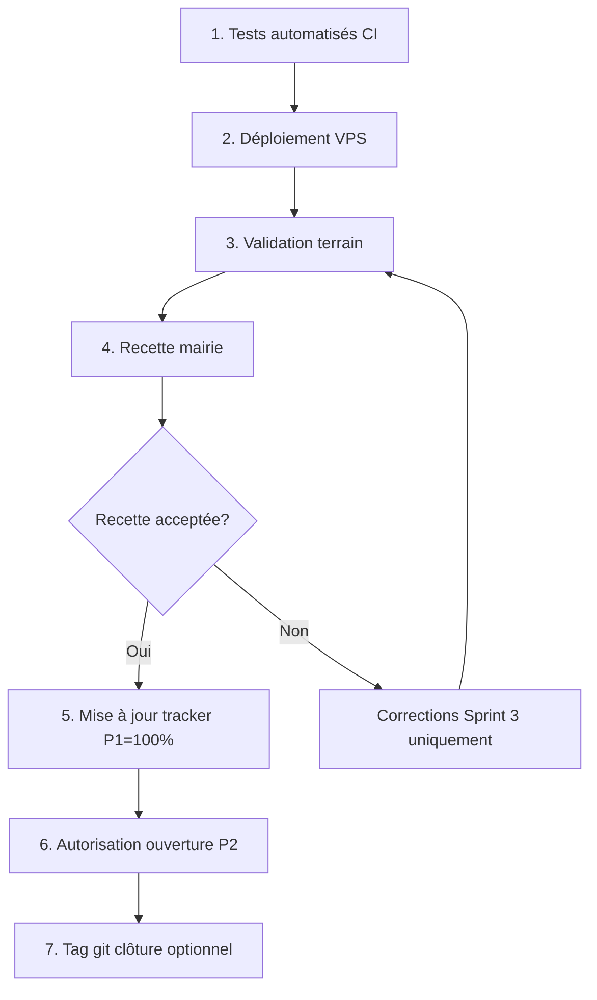

# Procédure de clôture — Municipality V3 Sprint 3 (Priorité 1)

**Version :** 1.0  
**Date :** juin 2026  
**Objectif :** clôturer définitivement la Priorité 1 et autoriser l'ouverture de la Priorité 2

---

## Règles pendant la clôture

- **Aucun développement P2, P3, P4 ou P5** tant que cette procédure n'est pas terminée.
- **Aucune modification** de la feuille de route 2026.
- Toute amélioration détectée → **backlog uniquement** ([MAMI_2026_PROGRESS_TRACKER.md](MAMI_2026_PROGRESS_TRACKER.md)).

---

## Vue d'ensemble du processus



---

## Étape 1 — Tests automatisés

**Responsable :** équipe technique  
**Document :** [RAPPORT_VALIDATION_SPRINT3_MUNICIPALITE.md](RAPPORT_VALIDATION_SPRINT3_MUNICIPALITE.md) section B.4

```bash
php artisan test --filter=Municipality
php artisan test --filter=Ride
```

| # | Critère | OK |
|---|---------|-----|
| 1.1 | Suite Municipality 100 % verte | ☐ |
| 1.2 | Régression Taxi 100 % verte | ☐ |
| 1.3 | CI GitHub Actions verte | ☐ |

**Si échec :** corriger **uniquement** dans le périmètre Sprint 3. Ne pas démarrer P2.

---

## Étape 2 — Déploiement VPS production

**Responsable :** équipe technique / infra  
**Document :** [CHECKLIST_DEPLOIEMENT_VPS_SPRINT3.md](CHECKLIST_DEPLOIEMENT_VPS_SPRINT3.md)

| # | Critère | OK |
|---|---------|-----|
| 2.1 | Code ≥ `2396c1b` déployé | ☐ |
| 2.2 | `MAMI_MODULE_MUNICIPALITY=true` | ☐ |
| 2.3 | 8 migrations Municipality appliquées | ☐ |
| 2.4 | Seeders permissions + Owendo exécutés | ☐ |
| 2.5 | Domaines HTTPS opérationnels | ☐ |
| 2.6 | Queue + Reverb actifs | ☐ |
| 2.7 | APK agent rebuild et distribué | ☐ |
| 2.8 | Données pilote (taxes, opérateurs) configurées | ☐ |

---

## Étape 3 — Validation terrain

**Responsable :** agent municipal + superviseur  
**Document :** [CHECKLIST_VALIDATION_TERRAIN_SPRINT3.md](CHECKLIST_VALIDATION_TERRAIN_SPRINT3.md)

| # | Critère | OK |
|---|---------|-----|
| 3.1 | Parcours scan → encaissement → quittance | ☐ |
| 3.2 | Impression Bluetooth 58 mm validée | ☐ |
| 3.3 | QR vérification publique OK | ☐ |
| 3.4 | Sécurité permissions vérifiée | ☐ |
| 3.5 | Clôture session caisse OK | ☐ |
| 3.6 | Aucune anomalie bloquante ouverte | ☐ |

---

## Étape 4 — Recette mairie

**Responsable :** représentant mairie + chef de projet  
**Document :** [CHECKLIST_RECETTE_MAIRIE_SPRINT3.md](CHECKLIST_RECETTE_MAIRIE_SPRINT3.md)

| # | Critère | OK |
|---|---------|-----|
| 4.1 | Démonstration live réalisée | ☐ |
| 4.2 | Périmètre Sprint 3 validé | ☐ |
| 4.3 | Éléments reportés (Mobile Money, etc.) acceptés | ☐ |
| 4.4 | Procès-verbal signé | ☐ |
| 4.5 | Décision : recette acceptée | ☐ |

**Si recette refusée :** retour étape 3 après corrections Sprint 3 uniquement.

---

## Étape 5 — Mise à jour du suivi d'avancement

**Responsable :** chef de projet  
**Document :** [MAMI_2026_PROGRESS_TRACKER.md](MAMI_2026_PROGRESS_TRACKER.md)

Modifier le tableau principal :

```markdown
| P1 | Municipality V3 Sprint 3 | Terminé | 100 % | juin 2026 | <DATE_CLOTURE> |
```

Modifier le détail P1 — tous les livrables en ✅.

Ajouter dans **Historique des mises à jour** :

```markdown
| <DATE_CLOTURE> | Clôture officielle P1 — recette mairie signée — autorisation P2 |
```

| # | Action | OK |
|---|--------|-----|
| 5.1 | P1 statut → **Terminé** | ☐ |
| 5.2 | P1 progression → **100 %** | ☐ |
| 5.3 | Date de clôture renseignée | ☐ |
| 5.4 | Historique mis à jour | ☐ |
| 5.5 | Rapport validation finalisé (toutes cases OK) | ☐ |

---

## Étape 6 — Autorisation officielle Priorité 2

**Document de référence :** [MAMI_2026_EXECUTION_PLAN.md](MAMI_2026_EXECUTION_PLAN.md) — section Priorité 2

Rédiger l'autorisation (email ou note interne) :

```
AUTORISATION D'OUVERTURE — PRIORITÉ 2
Module : MAMI Commerce & Services
Date : <DATE>
Référence clôture P1 : <DATE_CLOTURE>
Recette mairie : CHECKLIST_RECETTE_MAIRIE_SPRINT3.md signée
Condition : aucun développement Commerce avant cette autorisation
```

| # | Critère | OK |
|---|---------|-----|
| 6.1 | Autorisation écrite chef de projet / mairie | ☐ |
| 6.2 | Équipe dev informée : P2 peut démarrer | ☐ |
| 6.3 | P2 statut tracker → **Planifié** ou **En cours** | ☐ |

---

## Étape 7 — Tag git de clôture (optionnel recommandé)

Une fois le commit tracker poussé :

```bash
git tag -a v1.6-sprint3-closed -m "Cloture officielle Municipality V3 Sprint 3 - Priorite 1"
git push origin v1.6-sprint3-closed
```

| # | Action | OK |
|---|--------|-----|
| 7.1 | Tag `v1.6-sprint3-closed` créé | ☐ |
| 7.2 | Tag poussé sur origin | ☐ |

---

## Étape 8 — Communication de clôture

| Destinataire | Message |
|--------------|---------|
| Équipe dev | P1 clôturée — démarrer P2 selon plan d'exécution |
| Mairie | Cycle fiscal Sprint 3 opérationnel zone pilote |
| VPS ops | Configuration production figée — pas de rollback sans accord |

| # | Action | OK |
|---|--------|-----|
| 8.1 | Équipe informée | ☐ |
| 8.2 | Documentation à jour sur branche | ☐ |

---

## Checklist finale de clôture

| # | Condition | OK |
|---|-----------|-----|
| ✅ | Tests automatisés verts | ☐ |
| ✅ | VPS production conforme | ☐ |
| ✅ | Validation terrain acceptée | ☐ |
| ✅ | Recette mairie signée | ☐ |
| ✅ | Tracker P1 = 100 % | ☐ |
| ✅ | Autorisation P2 émise | ☐ |
| ✅ | Aucune fonctionnalité P2+ développée prématurément | ☐ |

---

## En cas d'anomalie bloquante

1. Documenter dans le backlog du tracker (ne pas élargir le périmètre).
2. Corriger **uniquement** dans Sprint 3 si bloquant pour la clôture.
3. Rejouer l'étape concernée (terrain ou recette).
4. **Ne pas** démarrer Commerce & Services.

---

## Documents de la liasse de clôture

| # | Document | Statut |
|---|----------|--------|
| 1 | [RAPPORT_VALIDATION_SPRINT3_MUNICIPALITE.md](RAPPORT_VALIDATION_SPRINT3_MUNICIPALITE.md) | ☐ Finalisé |
| 2 | [CHECKLIST_DEPLOIEMENT_VPS_SPRINT3.md](CHECKLIST_DEPLOIEMENT_VPS_SPRINT3.md) | ☐ Complétée |
| 3 | [CHECKLIST_VALIDATION_TERRAIN_SPRINT3.md](CHECKLIST_VALIDATION_TERRAIN_SPRINT3.md) | ☐ Complétée |
| 4 | [CHECKLIST_RECETTE_MAIRIE_SPRINT3.md](CHECKLIST_RECETTE_MAIRIE_SPRINT3.md) | ☐ Signée |
| 5 | [PROCEDURE_CLOTURE_SPRINT3.md](PROCEDURE_CLOTURE_SPRINT3.md) | ☐ Exécutée |
| 6 | [MAMI_2026_PROGRESS_TRACKER.md](MAMI_2026_PROGRESS_TRACKER.md) | ☐ P1 = 100 % |

---

**Clôture Priorité 1 déclarée le :** _________________________  
**Autorisation Priorité 2 émise le :** _________________________  
**Responsable clôture :** _________________________
