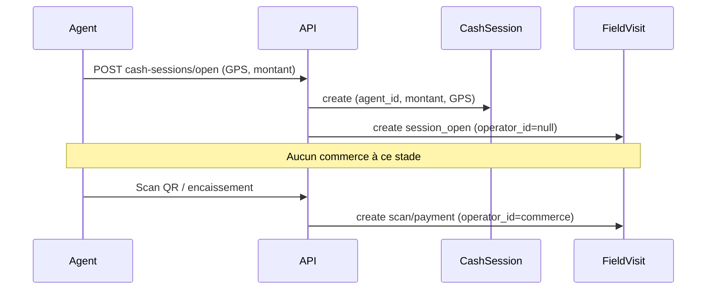

# Rapport d'audit — HTTP 500 ouverture de caisse (Sprint 3.2.5)

**Date :** 16 juin 2026  
**Symptôme terrain :** `POST /api/municipality/fiscal/cash-sessions/open` → HTTP 500  
**Log Laravel :**

```text
SQLSTATE[23000]: Integrity constraint violation: 1048
Column 'operator_id' cannot be null
```

**Point d'entrée signalé :** `app/Modules/Municipality/Services/CashSessionService.php`, ligne 56

---

## 1. Modèle créé à la ligne 56

| Élément | Valeur |
|---------|--------|
| **Table** | `field_visits` |
| **Modèle Eloquent** | `App\Modules\Municipality\Models\FieldVisit` |
| **Méthode** | `CashSessionService::open()` |
| **Ligne exacte** | 56–65 |

Ce n'est **pas** un `CashSession`, un `AuditLog`, ni un `MunicipalPayment`. La session de caisse est créée aux lignes 43–54 ; l'échec survient lors de la **journalisation terrain** (`FieldVisit`) juste après.

```56:65:app/Modules/Municipality/Services/CashSessionService.php
            FieldVisit::query()->create([
                'operator_id' => null,
                'agent_id' => $agent->id,
                'cash_session_id' => $session->id,
                'visit_type' => VisitType::SessionOpen,
                'visit_date' => now()->toDateString(),
                'latitude' => $data['latitude'] ?? null,
                'longitude' => $data['longitude'] ?? null,
                'notes' => $data['notes'] ?? null,
            ]);
```

Le même schéma est reproduit à la **fermeture** (lignes 102–110, `VisitType::SessionClose`, `operator_id => null`).

---

## 2. Pourquoi `operator_id` est NULL

### Table qui reçoit l'INSERT

`field_visits`

### Colonnes obligatoires (schéma source)

| Colonne | Migration initiale | Obligatoire métier |
|---------|-------------------|-------------------|
| `operator_id` | **nullable** | Non pour `session_open` / `session_close` |
| `agent_id` | NOT NULL | Oui |
| `visit_type` | NOT NULL | Oui |
| `visit_date` | NOT NULL | Oui |
| `cash_session_id` | nullable (Sprint 2) | Oui pour ouverture/fermeture caisse |
| `municipal_payment_id` | nullable (Sprint 2) | Non à l'ouverture |
| `notes`, `latitude`, `longitude` | nullable | Non |

### D'où devrait provenir `operator_id` ?

Pour les visites **liées à un commerce** (scan QR, consultation, encaissement, inspection…) : l'ID de l'`EconomicOperator` concerné.

Pour **l'ouverture et la fermeture de caisse** : **aucun commerce** n'est encore impliqué. L'agent ouvre une session globale avant de scanner ou d'encaisser. `operator_id` doit donc rester **NULL** ; l'identité pertinente est `agent_id` + `cash_session_id`.

Le code applicatif reflète déjà cette règle (`operator_id => null` explicite).

### Cause racine de l'erreur terrain

**Décalage entre l'intention du code / des migrations sources et le schéma MySQL en production.**

- Le code et les tests attendent `operator_id = NULL` pour `session_open`.
- MySQL en production rejette l'INSERT car la colonne `field_visits.operator_id` est **NOT NULL** à l'exécution.

La migration fondatrice définit pourtant la colonne comme nullable :

```24:27:database/migrations/2026_06_21_100000_create_municipality_v25_foundation_tables.php
        Schema::create('field_visits', function (Blueprint $table): void {
            $table->id();
            $table->foreignId('operator_id')->nullable()->constrained('economic_operators')->restrictOnDelete();
            $table->foreignId('agent_id')->constrained('users')->restrictOnDelete();
```

Hypothèses plausibles sur la prod :

1. Base créée ou altérée avant l'ajout de `->nullable()` dans cette migration.
2. Migration partielle / schéma manuel non aligné sur le dépôt.
3. Environnement de test local non représentatif (les tests CI passent si le schéma est correct ; l'erreur 1048 n'apparaît que lorsque la colonne est NOT NULL).

La migration `2026_06_21_110000_restrict_operator_dependent_foreign_keys.php` ne modifie que la règle `ON DELETE` de la FK ; elle ne devrait pas retirer le `nullable`, mais ne le **réaffirme pas** non plus.

---

## 3. Workflow métier



| Étape | Commerce requis ? | `operator_id` |
|-------|-------------------|---------------|
| Ouverture caisse | Non | NULL (correct) |
| Fermeture caisse | Non | NULL (correct) |
| Scan / consultation / paiement | Oui | ID du commerce |

**Conclusion métier :** exiger `operator_id` à l'ouverture de caisse serait une **erreur de modélisation**. La dépendance obligatoire en base est incorrecte pour les types `session_open` et `session_close`.

---

## 4. Revue des migrations connexes

| Table | `operator_id` | Rôle |
|-------|---------------|------|
| `cash_sessions` | **absent** | Session agent ; pas de lien commerce |
| `field_visits` | nullable (source) / **NOT NULL (prod observée)** | Journal terrain multi-types |
| `municipal_payments` | NOT NULL | Encaissement toujours lié à un commerce |
| `fiscal_obligations` | NOT NULL | Obligation fiscale par commerce |
| `fiscal_collections` | **n'existe pas** | Le recouvrement passe par `municipal_payments` + `FieldVisit` type `payment` |

Seule `field_visits` doit accepter `operator_id` NULL pour les événements de session.

---

## 5. Correctif recommandé (à valider avant implémentation)

**Option retenue (minimale) :** migration corrective pour garantir `field_visits.operator_id` **nullable** en production, sans modifier `CashSessionService` (le code est déjà correct).

**À ne pas faire :** inventer un `operator_id` fictif à l'ouverture de caisse — cela fausserait les statistiques commerce et les rapports terrain.

Détail du patch, impacts et tests : voir `docs/RAPPORT_CORRECTIF_OPERATOR_ID_FIELD_VISITS.md`.

---

## 6. Synthèse

| Champ | Détail |
|-------|--------|
| **Table concernée** | `field_visits` |
| **Modèle** | `FieldVisit` |
| **Ligne code** | `CashSessionService.php:56` (`FieldVisit::create`) |
| **Cause racine** | INSERT avec `operator_id = null` sur une colonne NOT NULL en production |
| **Correctif** | Rendre `operator_id` nullable (alignement schéma ↔ métier) |
