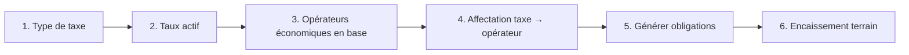
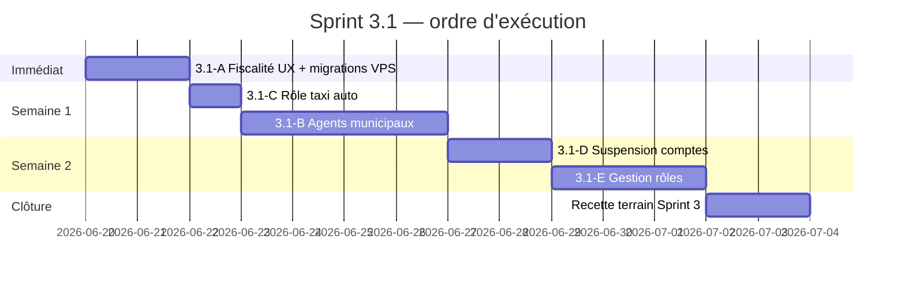

# Rapport d'audit — Sprint 3.1 Fiscalité & Administration utilisateurs

**Version :** 1.0  
**Date :** juin 2026  
**Périmètre :** diagnostic Fiscalité Owendo (web admin) + état administration utilisateurs  
**Objectif :** Sprint 3 totalement opérationnel en production — **aucun développement P2–P5**

---

## Synthèse exécutive

| Domaine | Verdict |
|---------|---------|
| Code backend fiscal (services + SQL) | ✅ **Fonctionnel** — validé par tests API Feature |
| Routes POST web admin fiscalité | ✅ **Déclarées et câblées** |
| Affichage erreurs formulaires fiscalité | ❌ **Absent** — cause principale perçue « rien ne se passe » |
| Chaîne métier fiscalité | ⚠️ **Séquentielle** — taux/affectations/obligations dépendent des étapes précédentes |
| Migrations production | ⚠️ **À vérifier** — cause n°1 si table absente (erreur 500) |
| Gestion utilisateurs / rôles | ❌ **Non implémentée** (hors candidatures taxi) |
| Validation agents municipaux | ❌ **Absente** |
| Attribution auto rôle `taxi_driver` | ❌ **Manquante** à l'approbation candidature |

**Conclusion :** les écrans Fiscalité Owendo **peuvent créer des données** si les prérequis sont remplis et le formulaire est valide. Le dysfonctionnement observé en production est très probablement dû à une **combinaison** : (1) erreurs de validation **invisibles**, (2) migrations ou module non activés, (3) chaîne métier incomplète (pas d'opérateurs / pas de taux).

---

# Partie 1 — Audit Fiscalité Owendo (web admin)

## 1.1 Architecture des routes

**Préfixe :** `/admin/municipality/fiscal/*`  
**Middleware :** `auth` + `admin` + `module:municipality`  
**Fichier :** `routes/web.php` lignes 50–64

| Action | Méthode | Route nommée | Contrôleur |
|--------|---------|--------------|------------|
| Liste types taxes | GET | `admin.municipality.fiscal.tax-types` | `FiscalAdminController@taxTypes` |
| **Créer type taxe** | **POST** | `admin.municipality.fiscal.tax-types.store` | `FiscalAdminController@storeTaxType` |
| Activer/désactiver taxe | POST | `admin.municipality.fiscal.tax-types.toggle` | `toggleTaxType` |
| Liste taux | GET | `admin.municipality.fiscal.rates` | `rates` |
| **Créer taux** | **POST** | `admin.municipality.fiscal.rates.store` | `storeRate` |
| Désactiver taux | POST | `admin.municipality.fiscal.rates.deactivate` | `deactivateRate` |
| Objectifs annuels | GET/POST | `targets` / `targets.store` | `targets` / `storeTarget` |
| Affectations | GET/POST | `assignments` / `assignments.store` | `assignments` / `storeAssignment` |
| Obligations | GET | `obligations` | `obligations` |
| **Générer obligations** | **POST** | `obligations.generate` | `generateObligations` |

**Verdict routes POST :** ✅ Toutes présentes et alignées avec les formulaires Blade.

---

## 1.2 Contrôleurs et logique métier

**Contrôleur web :** `app/Modules/Municipality/Http/Controllers/Admin/FiscalAdminController.php`

| Méthode | Validation | Service | Écriture SQL |
|---------|------------|---------|--------------|
| `storeTaxType` | `code` regex `^[A-Za-z0-9\-]+$`, `name` requis | `TaxTypeService::create` | `INSERT municipal_tax_types` |
| `storeRate` | `tax_type_id`, `amount_xaf`, `billing_period`, dates | `TaxRateService::create` | `INSERT municipal_tax_rates` |
| `storeTarget` | `tax_type_id`, `fiscal_year`, montant | `TargetService::upsert` | `INSERT/UPDATE municipal_collection_targets` |
| `storeAssignment` | `operator_id`, `tax_type_id` | `FiscalAssignmentService::assign` | `INSERT operator_tax_assignments` |
| `generateObligations` | — | `FiscalObligationGeneratorService::generate` | `INSERT fiscal_obligations` |

**Contrôleur API parallèle (fonctionnel) :** `FiscalTaxTypeController` + `AuthorizesFiscalAccess` — tests Feature passent via `/api/municipality/fiscal/taxes`.

**Écart web vs API :**

| Aspect | Web `FiscalAdminController` | API `Fiscal*Controller` |
|--------|----------------------------|------------------------|
| Contrôle permissions fiscal | ❌ Aucun — seul `is_admin` | ✅ `municipal.tax.manage` / `view` |
| Tests automatisés | ❌ Aucun test web | ✅ `FiscalTaxTypeTest`, etc. |

> Le web admin ne bloque **pas** la création par permissions fines — tout admin connecté peut poster.

---

## 1.3 Validations — causes d'échec silencieux

### Règle critique sur le champ `code` (types de taxes)

```php
'code' => ['required', 'string', 'max:50', 'regex:/^[A-Za-z0-9\-]+$/'],
```

| Saisie utilisateur | Résultat |
|--------------------|----------|
| `TAX-COMMERCE` | ✅ Valide |
| `Taxe boutique` | ❌ **Rejeté** (espaces, accents) |
| `taxe_commerce` | ❌ **Rejeté** (underscore interdit) |
| `TAXE MARCHE` | ❌ **Rejeté** |

**Erreur fréquente :** l'utilisateur saisit un libellé lisible dans le champ **Code** au lieu d'un identifiant technique.

### Autres validations

| Formulaire | Règle bloquante courante |
|------------|-------------------------|
| Taux | `tax_type_id` requis — liste vide si aucun type créé |
| Affectation | `operator_id` doit exister dans `economic_operators` |
| Affectation | Taxe inactive → `ValidationException` |
| Affectation | Doublon actif même opérateur + taxe → exception |
| Génération obligations | 0 créées si pas d'affectations + taux actifs |

### Affichage des erreurs — **CAUSE PRINCIPALE UX**

| Fichier | `session('success')` | `$errors` / `@error` |
|---------|---------------------|----------------------|
| `layouts/admin.blade.php` | ✅ | ❌ **Absent** |
| `fiscal/tax-types.blade.php` | ✅ | ❌ **Absent** |
| `fiscal/rates.blade.php` | ✅ | ❌ **Absent** |
| `fiscal/assignments.blade.php` | ✅ | ❌ **Absent** |
| Tous les écrans fiscal | ✅ | ❌ **Absent** |

**Conséquence :** lors d'un échec de validation Laravel (`422` redirect back), l'utilisateur revient sur la page **sans message d'erreur visible** → impression que « ça ne crée rien en base ».

**JavaScript :** `resources/js/admin.js` gère uniquement le polling live (dashboard, chauffeurs, carte). **Aucun JS** n'intercepte les formulaires fiscalité. **Pas d'erreur JS** liée à la création.

---

## 1.4 Permissions

| Couche | Contrôle |
|--------|----------|
| Accès pages fiscalité | `EnsureUserIsAdmin` (`users.is_admin` ou rôle `admin`) |
| Module municipalité | `EnsureModuleEnabled('municipality')` → `MAMI_MODULE_MUNICIPALITY` |
| Permissions `municipal.tax.*` | **Non vérifiées** sur le web admin |

**Si `MAMI_MODULE_MUNICIPALITY=false` :** GET et POST retournent **403** — les écrans ne seraient pas « accessibles ». Si les écrans s'affichent, le module est **activé**.

**Si migrations absentes :** GET peut afficher une liste vide ; POST provoque **500 SQL** (`Table 'municipal_tax_types' doesn't exist`).

---

## 1.5 Requêtes SQL et tables

**Migration requise :** `2026_06_23_100000_create_municipality_fiscal_engine_tables.php`

| Table | Rôle |
|-------|------|
| `municipal_tax_types` | Types de taxes |
| `municipal_tax_rates` | Taux |
| `municipal_collection_targets` | Objectifs annuels |
| `operator_tax_assignments` | Affectations |
| `fiscal_obligations` | Obligations générées |

**Migration audit :** `2026_06_17_100000_create_super_app_core_tables.php` → table `audit_logs` (écrite dans la même transaction que la création fiscal).

**Vérification production :**

```bash
php artisan migrate:status | findstr municipality
# ou
php artisan tinker --execute="echo \App\Modules\Municipality\Models\MunicipalTaxType::count();"
```

---

## 1.6 Chaîne métier obligatoire (ordre de saisie)



| Étape | Si sautée | Symptôme |
|-------|-----------|----------|
| 1 | — | Rien d'autre ne peut fonctionner |
| 2 | Pas de taux | Obligations = 0 générées |
| 3 | Pas d'opérateurs | Liste affectation vide |
| 4 | Pas d'affectation | Obligations = 0 |
| 5 | Pas d'obligations | Encaissement agent impossible |

**Message succès trompeur :** `generateObligations` affiche toujours « X créée(s), Y ignorée(s) » même si X=0.

---

## 1.7 Tests automatisés (preuve backend OK)

| Suite | Route testée | Résultat attendu |
|-------|--------------|------------------|
| `FiscalTaxTypeTest` | `POST /api/municipality/fiscal/taxes` | ✅ `assertDatabaseHas municipal_tax_types` |
| `FiscalRateTest` | `POST /api/municipality/fiscal/rates` | ✅ |
| `FiscalAssignmentTest` | `POST /api/municipality/fiscal/assignments` | ✅ |
| `FiscalObligationGenerationTest` | `POST .../obligations/generate` | ✅ |

**Aucun test** ne couvre les formulaires **web** `FiscalAdminController` — gap de couverture, pas de bug backend prouvé.

---

## 1.8 Diagnostic — causes exactes (par probabilité production)

| # | Cause | Probabilité | Symptôme | Vérification |
|---|-------|-------------|----------|--------------|
| **C1** | **Erreurs validation non affichées** (code invalide, champs requis) | **Élevée** | Page recharge, aucun message, 0 ligne en base | Saisir `TAX-TEST` + nom valide ; inspecter `storage/logs/laravel.log` |
| **C2** | **Migration fiscal non exécutée** sur VPS | **Élevée** | Erreur 500 au POST | `migrate:status` |
| **C3** | **Chaîne incomplète** (pas d'opérateurs / pas de taux) | **Élevée** | Types OK mais obligations vides | Compter `economic_operators` |
| **C4** | **CSRF / session** (`admin.mami.ga` vs `APP_URL`) | Moyenne | Erreur 419 Page Expired | Logs nginx / Laravel |
| **C5** | `route:cache` obsolète | Faible | 404 ou 405 sur POST | `php artisan route:list --name=fiscal` |
| **C6** | Échec audit `audit_logs` (migration core absente) | Moyenne | 500 + rollback transaction | Log SQL |
| **C7** | Permissions fines bloquantes | **Non applicable web** | — | — |

### Cause exacte retenue (synthèse)

> **Le backend fiscal est opérationnel ; le problème observé est principalement un défaut d'exploitation et d'UX admin : validations échouées sans retour visuel (C1), combiné aux prérequis migrations (C2) et chaîne métier (C3).**

---

## 1.9 Actions correctives Sprint 3.1 — Fiscalité (sans P2–P5)

| # | Action | Effort | Type |
|---|--------|--------|------|
| F1 | Afficher `$errors` dans `layouts/admin.blade.php` + champs `@error` fiscal | 0,5 j | Correctif UX |
| F2 | Vérifier/appliquer migrations fiscal sur VPS | 0,5 j | Ops |
| F3 | Guide inline : « Code = TAX-COMMERCE, pas de espaces » | 0,25 j | UX |
| F4 | Message si génération obligations = 0 avec explication | 0,25 j | UX |
| F5 | Test Feature web `FiscalAdminWebTest` (1 POST tax-type) | 0,5 j | Qualité |
| F6 | Bandeau checklist : types → taux → opérateurs → affectations | 0,5 j | UX |

---

# Partie 2 — Audit administration utilisateurs

## 2.1 Matrice des fonctionnalités

| Fonctionnalité | Existe ? | Implémentation | Gap |
|----------------|----------|----------------|-----|
| **Gestion des utilisateurs** | ❌ Partiel | `ClientController` lecture seule (`/admin/clients`) | Pas de création, édition, suspension |
| **Gestion des rôles** | ❌ | `RolePermissionSeeder` uniquement | Pas d'UI attribution/retrait |
| **Validation chauffeurs taxi** | ✅ | `driver_applications` + `/admin/driver-applications` | Rôle `taxi_driver` non attaché à l'approbation |
| **Validation agents municipaux** | ❌ | Attribution manuelle SQL/Tinker | Pas d'écran, pas de seeder agent |
| **Activation / suspension comptes** | ❌ | Pas de `account_status` sur `users` | Aucun mécanisme |
| **Attribution automatique des rôles** | ⚠️ Partiel | Seeder sync `admin` + `taxi_driver` (si `drivers` existe) | Pas à l'approbation candidature ni création agent |

---

## 2.2 Détail par profil

### Citoyens

| Élément | État |
|---------|------|
| Inscription | `POST /api/register` — aucun rôle assigné automatiquement |
| Validation | Aucune |
| Admin | Liste clients taxi uniquement |

### Chauffeurs Taxi

| Élément | État |
|---------|------|
| Candidature | `POST /api/driver-applications` ✅ |
| Statut | `pending` / `approved` / `rejected` ✅ |
| Admin | `/admin/driver-applications` — approuver / rejeter ✅ |
| Création profil | `drivers` + `vehicles` à l'approbation ✅ |
| Rôle `taxi_driver` | ❌ **Non attaché** dans `DriverEnrollmentService::approve` |
| Notification | ✅ Push + Reverb |

### Agents municipaux

| Élément | État |
|---------|------|
| Création | Manuelle (Tinker / SQL) |
| Validation | Aucun workflow |
| Admin | ❌ Aucun écran |
| Rôle | `municipal_agent` via `user_roles` manuel |
| Seeder compte agent | ❌ Absent |

### Administrateurs

| Élément | État |
|---------|------|
| Création | `AdminSeeder` → `admin@mami.ga` |
| Validation | Interne |
| Rôles | `admin` via `is_admin` + seeder |

### Conducteurs Covoiturage / TM

| Élément | État |
|---------|------|
| Implémentation | ❌ Hors scope Sprint 3 — P4 / P5 |

---

## 2.3 Écarts critiques bloquant Sprint 3 production

| ID | Écart | Impact terrain |
|----|-------|----------------|
| **U1** | Pas d'écran création agent municipal | Agents non déployables sans SQL |
| **U2** | Rôle `taxi_driver` non auto à l'approbation | Chauffeur approuvé mais permissions API dispatch absentes |
| **U3** | Pas de suspension compte | Impossible de désactiver un agent compromis |
| **U4** | Inscription citoyen sans rôle `taxi_customer` | Mineur — courses peuvent fonctionner via permissions héritées |

---

# Partie 3 — Plan d'implémentation minimal Sprint 3.1

**Objectif :** Sprint 3 opérationnel et testable en production.  
**Hors scope :** P2 Commerce, P3 Main d'œuvre, P4 Covoiturage, P5 TM, hub validation universel.

## 3.1 Lots et estimations

| Lot | Contenu | Jours | Migrations | API | Admin | Flutter |
|-----|---------|-------|------------|-----|-------|---------|
| **3.1-A** | Correctifs fiscalité web (F1–F6) | 2 | 0 | 0 | 6 vues | 0 |
| **3.1-B** | Agents municipaux (création + rôle) | 3–4 | 1 | 5 | 2 | 0 |
| **3.1-C** | Correctif rôle taxi à l'approbation | 0,5 | 0 | 0 | 0 | 0 |
| **3.1-D** | Suspension compte (`account_status`) | 1–2 | 1 | 2 | 1 | 0 |
| **3.1-E** | Gestion rôles minimale (admin) | 2–3 | 0 | 3 | 2 | 0 |
| **Total Sprint 3.1** | | **8,5–11,5 j** | **2** | **10** | **11** | **0** |

---

## 3.2 Lot 3.1-A — Fiscalité web opérationnelle (priorité immédiate)

### Livrables

1. Bloc erreurs global dans `layouts/admin.blade.php`
2. `@error` sur chaque champ fiscal
3. Aide contextuelle champ `code`
4. Alerte si `generateObligations` retourne 0 créées
5. Checklist visuelle en haut de la nav fiscal
6. Vérification migrations VPS (procédure ops, pas de code)

### Critères d'acceptation

- [ ] Création type `TAX-PILOTE` visible en liste après submit
- [ ] Code invalide affiche message rouge explicite
- [ ] Chaîne complète types → taux → affectation → obligations documentée dans l'UI
- [ ] Test web Feature POST tax-type vert

---

## 3.3 Lot 3.1-B — Création agents municipaux

### Backend

| Composant | Détail |
|-----------|--------|
| Migration | `municipal_agents` : `user_id`, `matricule`, `zone_id`, `status`, `verified_at`, `verified_by` |
| Controller | `MunicipalityAgentAdminController` |
| Service | `MunicipalAgentProvisioningService` |

### Routes admin

| Méthode | Route | Action |
|---------|-------|--------|
| GET | `/admin/municipality/agents` | Liste |
| GET | `/admin/municipality/agents/create` | Formulaire |
| POST | `/admin/municipality/agents` | Créer user + agent + rôle `municipal_agent` |
| PATCH | `/admin/municipality/agents/{id}/suspend` | Suspendre |

### Workflow

```
Admin saisit nom, email, téléphone, zone
  → Création User (mot de passe temporaire / reset mail V2)
  → INSERT municipal_agents (status=active)
  → user_roles += municipal_agent
  → Agent peut se connecter sur APK et accéder au hub Recouvrement
```

### Critères d'acceptation

- [ ] Admin crée agent sans Tinker
- [ ] `GET /api/me` retourne `roles: ["municipal_agent"]`
- [ ] Encaissement terrain possible avec ce compte

---

## 3.4 Lot 3.1-C — Validation chauffeurs taxi (complément)

### Modification unique

Dans `DriverEnrollmentService::approve`, après création `Driver` :

```php
// Spécification — pseudo-code
$role = Role::where('slug', 'taxi_driver')->first();
$user->roles()->syncWithoutDetaching([$role->id => ['assigned_at' => now()]]);
```

### Critères d'acceptation

- [ ] Candidature approuvée → `hasRole('taxi_driver')` = true
- [ ] `GET /api/me` inclut permission `taxi.rides.dispatch`
- [ ] Chauffeur peut passer en ligne sur `mami_driver`

---

## 3.5 Lot 3.1-D — Activation / suspension comptes

### Migration

```sql
ALTER users ADD account_status VARCHAR(20) DEFAULT 'active';
-- values: active, suspended
```

### Middleware

`EnsureAccountIsActive` — bloque API et web si `suspended`.

### Admin

Bouton Suspendre / Réactiver sur fiche utilisateur et fiche agent.

---

## 3.6 Lot 3.1-E — Gestion rôles minimale

### Écran `/admin/users`

- Liste utilisateurs (paginée)
- Fiche : rôles actuels, boutons Ajouter rôle / Retirer rôle
- Réservé `super_admin` ou `admin` avec audit log

### API interne (optionnelle si web seulement)

| Méthode | Route |
|---------|-------|
| POST | `/api/admin/users/{id}/roles` |
| DELETE | `/api/admin/users/{id}/roles/{slug}` |

---

## 3.7 Ordre d'exécution recommandé



---

## 3.8 Compatibilité roadmap 2026

| Règle | Respect |
|-------|---------|
| Pas de P2–P5 | ✅ Lots limités à fiscalité admin + users Sprint 3 |
| Sprint 3 clôture avant P2 | ✅ 3.1-B prérequis recette terrain |
| Backlog | Hub validation universel, OTP, `profile_validations` → reporté (voir `SPECIFICATION_VALIDATION_UTILISATEURS_MAMI.md`) |
| Taxi gelé | ✅ Seule touche : attribution rôle à l'approbation (correctif, pas refonte) |

---

## 3.9 Checklist go-live Sprint 3.1

### Fiscalité

- [ ] Migrations `2026_06_23_*` appliquées
- [ ] `MAMI_MODULE_MUNICIPALITY=true`
- [ ] ≥ 1 type taxe + taux + affectation + obligations générées
- [ ] Erreurs formulaire visibles

### Utilisateurs

- [ ] ≥ 1 agent municipal créé via admin
- [ ] ≥ 1 chauffeur candidature approuvée avec rôle `taxi_driver`
- [ ] Procédure suspension documentée

### Terrain

- [ ] Encaissement bout-en-bout (checklist terrain existante)
- [ ] Recette mairie signée

---

*Rapport d'audit — documentation uniquement, aucun code modifié.*
