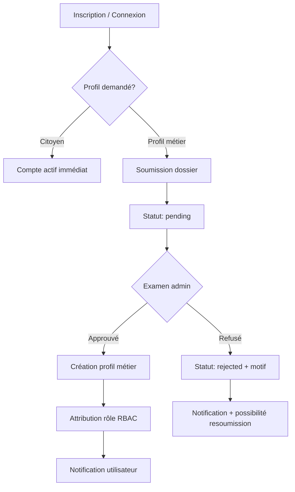

# Spécification — Système de validation des utilisateurs MAMI

**Version :** 1.0  
**Date :** juin 2026  
**Statut :** document d'architecture produit — aucun développement associé  
**Tag de référence :** `v1.6-roadmap-2026`

---

## Documents liés

| Document | Contenu |
|----------|---------|
| [MAMI_ROLE_PERMISSION_MATRIX.md](MAMI_ROLE_PERMISSION_MATRIX.md) | Rôles et permissions actuels |
| [MAMI_2026_EXECUTION_PLAN.md](MAMI_2026_EXECUTION_PLAN.md) | Feuille de route figée P1→P5 |
| [MAMI_DATABASE_MASTER_PLAN.md](MAMI_DATABASE_MASTER_PLAN.md) | Schéma BDD cible |
| [AUDIT_TESTABILITE_SPRINT3_MUNICIPALITE.md](AUDIT_TESTABILITE_SPRINT3_MUNICIPALITE.md) | Lacunes création agents |

---

## Objectif

Définir le **cycle de vie complet** des comptes MAMI pour six familles d'utilisateurs :

| Famille | Rôle cible | APK principal |
|---------|------------|---------------|
| Citoyens | `citizen` / `taxi_customer` | MAMI Client |
| Chauffeurs Taxi | `taxi_driver` | MAMI Driver |
| Transporteurs TM | `transport_driver` | MAMI Driver |
| Conducteurs Covoiturage | `carpool_driver` | MAMI Driver |
| Agents municipaux | `municipal_agent` | MAMI Agent (dans `mami_client` aujourd'hui) |
| Administrateurs | `admin` / `super_admin` | Backoffice web |

**Principe directeur :** un seul compte `users`, plusieurs **profils métier** validables indépendamment, plusieurs rôles cumulables après validation.

---

## État des lieux (juin 2026)

| Profil | Workflow validation | Admin UI | Profil métier | Rôle auto |
|--------|---------------------|----------|---------------|-----------|
| Citoyen | Aucun (inscription libre) | ❌ | — | ❌ |
| Chauffeur Taxi | ✅ `driver_applications` | ✅ `/admin/driver-applications` | `drivers` + `vehicles` | ⚠️ Partiel (seeder seulement) |
| Conducteur Covoiturage | ❌ Non implémenté | ❌ | ❌ (prévu P4) | ❌ |
| Transporteur TM | ❌ Non implémenté | ❌ | ❌ (prévu P5) | ❌ |
| Agent municipal | ❌ Attribution manuelle | ❌ | ❌ (prévu `municipal_agents`) | ❌ |
| Administrateur | Création manuelle / seeder | ❌ | `is_admin` | ✅ via seeder |

**Référence implémentée :** `DriverEnrollmentService` — modèle de référence pour les futurs profils.

---

## 1. Statuts utilisateurs

### 1.1 Statut global du compte (`users.account_status`)

Statut transverse du compte d'authentification — **table `users` (colonne à ajouter)**.

| Statut | Slug | Description |
|--------|------|-------------|
| Actif | `active` | Compte utilisable (défaut après inscription) |
| En attente de vérification | `pending_verification` | Email/téléphone non confirmé (optionnel V2) |
| Suspendu | `suspended` | Bloqué par admin (fraude, abus) |
| Désactivé | `deactivated` | Désinscription ou fermeture demandée |

> **Phase 1 (2026) :** seuls `active` et `suspended` sont requis. Les citoyens sont `active` dès l'inscription.

### 1.2 Statut de profil métier (`profile_validations.status`)

Chaque demande d'activation d'un profil métier suit un cycle indépendant — **table transverse `profile_validations` (à créer)**.

| Statut | Slug | Description |
|--------|------|-------------|
| Brouillon | `draft` | Formulaire commencé, non soumis |
| En attente | `pending` | Soumis, en file de validation |
| En cours d'examen | `under_review` | Pris en charge par un validateur (optionnel) |
| Approuvé | `approved` | Profil actif, rôle accordé |
| Refusé | `rejected` | Refus avec motif |
| Révoqué | `revoked` | Profil retiré après approbation |
| Expiré | `expired` | Documents périmés (assurance, permis — V2) |

### 1.3 Statuts opérationnels (post-validation)

Une fois approuvé, chaque profil a son propre statut opérationnel :

| Profil | Table | Statuts opérationnels |
|--------|-------|----------------------|
| Chauffeur Taxi | `drivers.status` | `offline`, `online`, `on_ride` (existant) |
| Conducteur Covoiturage | `carpool_drivers.status` | `inactive`, `active`, `suspended` |
| Transporteur TM | `carriers.status` | `inactive`, `active`, `suspended` |
| Agent municipal | `municipal_agents.status` | `inactive`, `active`, `suspended` |
| Citoyen | — | N/A |
| Administrateur | — | N/A (`is_admin` + rôle) |

### 1.4 Matrice profil → type de validation

| Type de profil | Slug `profile_type` | Validation requise | Validateur |
|----------------|---------------------|-------------------|------------|
| Citoyen | `citizen` | Non | — |
| Client Taxi | `taxi_customer` | Non (auto à l'inscription) | — |
| Chauffeur Taxi | `taxi_driver` | **Oui** | Admin MAMI |
| Conducteur Covoiturage | `carpool_driver` | **Oui** | Admin MAMI |
| Transporteur TM | `transport_driver` | **Oui** | Admin MAMI |
| Agent municipal | `municipal_agent` | **Oui** | Admin MAMI + superviseur mairie |
| Commerçant | `merchant` | Oui (P2) | Admin / mairie |
| Main d'œuvre | `workforce_provider` | Oui (P3) | Admin |
| Administrateur | `admin` | **Oui** — création interne uniquement | Super admin |

---

## 2. Workflow de validation

### 2.1 Vue d'ensemble



### 2.2 Citoyens

```
POST /api/register
  → users.account_status = active
  → Attacher rôle taxi_customer (auto) OU citizen
  → Permissions immédiates : taxi.rides.request, municipality.reports.create, commerce.merchants.view
```

**Aucune validation admin.** Identité = email + mot de passe (+ téléphone optionnel).

### 2.3 Chauffeurs Taxi (existant — à compléter)

**État actuel :**

```
Utilisateur connecté
  → POST /api/driver-applications (photos + identité + véhicule)
  → driver_applications.status = pending
  → Admin : GET /admin/driver-applications
  → Admin approuve
  → Création drivers + vehicles
  → Notification + événement Reverb
```

**Écarts à combler (spécification cible) :**

| Étape manquante | Action cible |
|-----------------|--------------|
| Attribution rôle `taxi_driver` | À l'approbation : `user_roles` += `taxi_driver` |
| Entrée `profile_validations` | Unifier avec table transverse |
| Resoumission après refus | Nouvelle candidature si `rejected` |
| Expiration documents | V2 — assurance, permis |

### 2.4 Conducteurs Covoiturage (P4 — à implémenter)

```
Utilisateur connecté (citoyen)
  → POST /api/carpool/drivers/register
  → profile_validations (profile_type=carpool_driver, status=pending)
  → carpool_drivers (status=inactive) + carpool_vehicles
  → Admin examine identité + véhicule personnel
  → PATCH /api/admin/carpool/drivers/{id}/verify
  → status=approved → rôle carpool_driver
  → carpool_drivers.status = active
  → Peut publier trajets (POST /api/carpool/trips)
```

**Règle métier :** un utilisateur peut être `taxi_driver` ET `carpool_driver` — profils **indépendants**, validations séparées.

### 2.5 Transporteurs TM (P5 — à implémenter)

```
Utilisateur connecté
  → POST /api/transport/carriers/register
  → profile_validations (profile_type=transport_driver, status=pending)
  → carriers (status=inactive) + carrier_vehicles
  → Admin examine identité + flotte
  → PATCH /api/admin/transport/carriers/{id}/verify
  → status=approved → rôle transport_driver
  → carriers.status = active
  → Peut soumettre devis (POST /api/transport/requests/{id}/quotes)
```

### 2.6 Agents municipaux (P1 clôture — à implémenter)

```
Création par admin OU candidature interne mairie
  → POST /api/admin/municipality/agents (admin uniquement)
     OU POST /api/municipality/agent-applications (V2 — agent pré-nommé par la mairie)
  → profile_validations (profile_type=municipal_agent, status=pending)
  → municipal_agents (status=inactive, zone_opérationnelle, matricule)
  → Superviseur mairie valide
  → PATCH /api/admin/municipality/agents/{id}/verify
  → status=approved → rôle municipal_agent
  → municipal_agents.status = active
  → Accès APK Agent : recouvrement, enrôlement, SIG
```

**Phase pilote Owendo (P1 clôture) :** création manuelle acceptable ; **cible 2026** = écran admin dédié.

### 2.7 Administrateurs

```
Création exclusive par super_admin
  → Pas d'inscription publique
  → POST /api/admin/users (super_admin)
  → users.is_admin = true
  → Rôle admin ou super_admin
  → Permissions core.admin.access
```

**Jamais** via `POST /api/register`.

### 2.8 Cumul de profils (exemple cible)

```
Jean Dupont (users.id = 42)
  ├── taxi_driver      → approved (drivers.id = 10)
  ├── carpool_driver   → approved (carpool_drivers.id = 5)
  └── transport_driver → pending  (carriers.id = 3, status=inactive)
```

---

## 3. Permissions avant validation

Principe : **aucune permission métier sensible** tant que le profil n'est pas `approved`.

| Profil demandé | Permissions autorisées AVANT validation |
|----------------|----------------------------------------|
| **Citoyen** (inscription) | `municipality.reports.create`, `commerce.merchants.view`, `taxi.rides.request` |
| **Chauffeur Taxi** (pending) | Aucune permission `taxi.rides.dispatch` ; lecture statut candidature uniquement |
| **Conducteur Covoiturage** (pending) | Aucune `carpool.trips.publish` |
| **Transporteur TM** (pending) | Aucune `transport.missions.manage` |
| **Agent municipal** (pending) | Aucune permission `municipal.*` ni `economic_operator.*` |
| **Administrateur** | N/A — pas de pré-validation publique |

### APIs accessibles avant validation (tous profils métier)

| API | Accès pending |
|-----|---------------|
| `GET /api/me` | ✅ |
| `GET /api/driver-applications/status` | ✅ (taxi) |
| `GET /api/carpool/drivers/me` | ✅ (lecture statut — P4) |
| `GET /api/transport/carriers/me` | ✅ (lecture statut — P5) |
| `POST /api/*/register` ou `applications` | ✅ (une seule pending à la fois) |
| Endpoints métier (courses, trajets, encaissement) | ❌ **403** |

---

## 4. Permissions après validation

### 4.1 Citoyen / Client Taxi

| Rôle | Permissions |
|------|-------------|
| `taxi_customer` | `taxi.rides.request`, `municipality.reports.create`, `commerce.merchants.view` |
| `citizen` | `municipality.reports.create`, `commerce.merchants.view` |

### 4.2 Chauffeur Taxi (après approbation)

| Rôle | Permissions | Profil |
|------|-------------|--------|
| `taxi_driver` | `taxi.rides.dispatch` | `drivers` actif |

Accès : disponibilité GPS, offres dispatch, cycle de course.

### 4.3 Conducteur Covoiturage (après approbation — P4)

| Rôle | Permissions | Profil |
|------|-------------|--------|
| `carpool_driver` | `carpool.trips.publish` | `carpool_drivers` actif |

### 4.4 Transporteur TM (après approbation — P5)

| Rôle | Permissions | Profil |
|------|-------------|--------|
| `transport_driver` | `transport.missions.manage`, `transport.quotes.submit` | `carriers` actif |

### 4.5 Agent municipal (après approbation)

| Rôle | Permissions |
|------|-------------|
| `municipal_agent` | `municipality.dashboard.view`, `municipality.collections.manage`, `municipality.reports.manage`, `economic_operator.create/update/view/inspect`, `municipal.cash_session.open/close`, `municipal.payment.collect`, `municipal.fiscal.view` |

### 4.6 Administrateur

| Rôle | Permissions clés |
|------|------------------|
| `admin` | `core.admin.access` + fiscalité + recouvrement + `municipal.receipt.annul` |
| `super_admin` | Toutes |

### 4.7 Règle de cumul

Les permissions sont l'**union** des permissions de tous les rôles approuvés :

```
permissions_effectives = ∪ permissions(role) pour role ∈ user.roles où profil associé = approved
```

---

## 5. Écrans d'administration nécessaires

### 5.1 Existants (à conserver)

| Écran | Route | Profil |
|-------|-------|--------|
| Candidatures chauffeurs taxi | `/admin/driver-applications` | Chauffeur Taxi |

### 5.2 À créer — priorisation roadmap

| Priorité | Écran | Route proposée | Profil | Phase |
|----------|-------|----------------|--------|-------|
| **P1 clôture** | Gestion agents municipaux | `/admin/municipality/agents` | Agent municipal | Sprint 3 clôture |
| **P1 clôture** | Détail + validation agent | `/admin/municipality/agents/{id}` | Agent municipal | Sprint 3 clôture |
| **Transverse** | Hub validations | `/admin/validations` | Tous profils | Post-P1 |
| **P4** | Conducteurs covoiturage | `/admin/carpool/drivers` | Covoiturage | Priorité 4 |
| **P5** | Transporteurs TM | `/admin/transport/carriers` | TM | Priorité 5 |
| **P2** | Commerçants (revendication) | `/admin/commerce/claims` | Merchant | Priorité 2 |
| **P3** | Professionnels main d'œuvre | `/admin/workforce/providers` | Workforce | Priorité 3 |
| **Core** | Utilisateurs et rôles | `/admin/users` | Tous | Post-P1 |
| **Core** | Détail utilisateur + profils | `/admin/users/{id}` | Tous | Post-P1 |

### 5.3 Contenu type d'un écran de validation

- Identité : nom, téléphone, email, photo, pièce d'identité
- Véhicule(s) : plaque, marque, modèle, couleur, photos
- Documents : permis, assurance (V2)
- Historique : candidatures précédentes, refus, motifs
- Actions : **Approuver** | **Refuser** (motif obligatoire) | **Suspendre** | **Révoquer**
- Audit : validateur, date, `assigned_by`

---

## 6. Tables supplémentaires

### 6.1 Table transverse — `profile_validations` (nouvelle)

| Colonne | Type | Description |
|---------|------|-------------|
| `id` | bigint | PK |
| `user_id` | FK users | Demandeur |
| `profile_type` | enum | `taxi_driver`, `carpool_driver`, `transport_driver`, `municipal_agent`, `merchant`, `workforce_provider` |
| `status` | enum | `draft`, `pending`, `under_review`, `approved`, `rejected`, `revoked`, `expired` |
| `profile_id` | bigint nullable | ID polymorphique du profil métier |
| `profile_type_class` | string nullable | Classe Laravel polymorphique |
| `payload` | json | Données soumises (snapshot) |
| `rejection_reason` | text nullable | Motif refus |
| `reviewed_by` | FK users nullable | Validateur |
| `reviewed_at` | timestamp nullable | Date décision |
| `expires_at` | timestamp nullable | Expiration documents (V2) |
| `created_at` / `updated_at` | timestamps | |

> **Migration progressive :** `driver_applications` reste en place ; synchronisation vers `profile_validations` ou fusion en P1+.

### 6.2 Extension `users`

| Colonne | Type | Description |
|---------|------|-------------|
| `account_status` | enum | `active`, `suspended`, `deactivated` |
| `phone_verified_at` | timestamp nullable | V2 |
| `email_verified_at` | timestamp nullable | Existant Laravel |

### 6.3 Profils métier (nouvelles tables — roadmap)

| Table | Priorité | Rôle |
|-------|----------|------|
| `municipal_agents` | P1 clôture | Profil agent : matricule, zone, commune |
| `carpool_drivers` + `carpool_vehicles` | P4 | Conducteur covoiturage |
| `carriers` + `carrier_vehicles` | P5 | Transporteur TM |
| `merchant_claims` | P2 | Revendication commerce |
| `workforce_providers` | P3 | Main d'œuvre |

### 6.4 Tables existantes (conservées)

| Table | Usage |
|-------|-------|
| `users` | Identité unique |
| `roles`, `permissions`, `user_roles`, `permission_role` | RBAC |
| `driver_applications` | Candidatures taxi (legacy → unifier) |
| `drivers`, `vehicles` | Profil taxi actif |
| `audit_logs` | Traçabilité validations |

### 6.5 Documents et pièces jointes

Réutiliser **`attachments`** (Core) :

```
attachable_type = ProfileValidation | DriverApplication | CarpoolDriver | ...
attachable_id   = id
kind            = id_card | driving_license | vehicle_photo | insurance
```

---

## 7. APIs nécessaires

### 7.1 APIs existantes (taxi)

| Méthode | Route | Rôle |
|---------|-------|------|
| POST | `/api/register` | Inscription citoyen |
| POST | `/api/login` | Connexion |
| GET | `/api/me` | Profil + rôles + permissions |
| POST | `/api/driver-applications` | Soumission candidature taxi |
| GET | `/api/driver-applications/status` | Statut candidature taxi |

### 7.2 APIs à créer — Core validation

| Méthode | Route | Auth | Description |
|---------|-------|------|-------------|
| GET | `/api/profile-validations/me` | Sanctum | Mes demandes en cours |
| GET | `/api/profile-validations/{id}` | Sanctum | Détail demande |
| POST | `/api/profile-validations/{id}/resubmit` | Sanctum | Resoumission après refus |

### 7.3 APIs à créer — Agents municipaux (P1 clôture)

| Méthode | Route | Auth | Description |
|---------|-------|------|-------------|
| GET | `/api/admin/municipality/agents` | Admin | Liste agents |
| POST | `/api/admin/municipality/agents` | Admin | Créer demande agent |
| GET | `/api/admin/municipality/agents/{id}` | Admin | Détail dossier |
| PATCH | `/api/admin/municipality/agents/{id}/approve` | Admin | Approuver |
| PATCH | `/api/admin/municipality/agents/{id}/reject` | Admin | Refuser |
| PATCH | `/api/admin/municipality/agents/{id}/suspend` | Admin | Suspendre |
| PATCH | `/api/admin/municipality/agents/{id}/revoke` | Admin | Révoquer |

### 7.4 APIs à créer — Covoiturage (P4)

| Méthode | Route | Description |
|---------|-------|-------------|
| POST | `/api/carpool/drivers/register` | Soumission dossier |
| GET | `/api/carpool/drivers/me` | Statut profil |
| PATCH | `/api/admin/carpool/drivers/{id}/verify` | Validation admin |

### 7.5 APIs à créer — TM (P5)

| Méthode | Route | Description |
|---------|-------|-------------|
| POST | `/api/transport/carriers/register` | Soumission dossier |
| GET | `/api/transport/carriers/me` | Statut profil |
| PATCH | `/api/admin/transport/carriers/{id}/verify` | Validation admin |

### 7.6 APIs admin transverses (post-P1)

| Méthode | Route | Description |
|---------|-------|-------------|
| GET | `/api/admin/validations` | File d'attente toutes typologies |
| GET | `/api/admin/users` | Liste utilisateurs |
| GET | `/api/admin/users/{id}` | Profils + rôles + validations |
| POST | `/api/admin/users/{id}/roles` | Attribuer rôle (super_admin) |
| DELETE | `/api/admin/users/{id}/roles/{slug}` | Retirer rôle |

### 7.7 Notifications (tous profils)

| Événement | Canal |
|-----------|-------|
| Soumission reçue | Push + in-app |
| Approuvé | Push + email/SMS (V2) |
| Refusé (avec motif) | Push + in-app |
| Suspendu / révoqué | Push + email |

Réutiliser : `notifications` Laravel + Reverb (`DriverApplicationApproved` comme modèle).

---

## 8. Impacts Flutter

### 8.1 MAMI Client (`mami_client`)

| Écran | Impact |
|-------|--------|
| Inscription / Connexion | Afficher rôles et profils en attente dans `UserModel` |
| Accueil Super App | Masquer modules dont profil non validé |
| Municipalité / Agent | Bloquer hub agent si rôle `municipal_agent` absent |
| Covoiturage (P4) | Écran inscription conducteur + statut pending |
| TM demandeur (P5) | Pas de validation profil côté client |

**`UserModel` enrichi :**

```dart
// Spécification — champs à exposer via /api/me
roles: List<String>
permissions: List<String>
profileValidations: List<ProfileValidationSummary>  // nouveau
pendingProfiles: List<String>   // ex: ['carpool_driver']
activeProfiles: List<String>    // ex: ['taxi_customer', 'municipal_agent']
```

### 8.2 MAMI Driver (`mami_driver`)

| Écran | Impact |
|-------|--------|
| Connexion | Vérifier `taxi_driver` OU `carpool_driver` OU `transport_driver` |
| Sélecteur de mode | Nouveau : Taxi / Covoiturage / TM selon profils approuvés |
| Candidature taxi | Existe côté API — écran enrollment à aligner si absent |
| Inscription covoiturage (P4) | Nouveau parcours register → pending → approved |
| Inscription TM (P5) | Nouveau parcours + gestion véhicules |

**Règle UI :** si seul profil `pending` → écran « Dossier en cours d'examen » (pas d'accès dispatch/trajets/missions).

### 8.3 Backoffice

Pas d'APK — web Blade admin uniquement pour validation.

### 8.4 Feature flags

`GET /api/app/features` inchangé pour modules ; la validation profil est **indépendante** du flag module :

```
Module carpool activé (MAMI_MODULE_CARPOOL=true)
  ET profil carpool_driver approved
  → tuile + API accessibles
```

---

## 9. Compatibilité avec la roadmap 2026

### 9.1 Principe de non-rupture

| Règle | Application |
|-------|-------------|
| Feuille de route figée | Cette spec **ne modifie pas** l'ordre P1→P5 |
| Un module à la fois | Validation agents = **P1 clôture** ; covoiturage = **P4** ; TM = **P5** |
| Backlog | Vérification email/SMS, expiration documents → backlog |
| Taxi gelé | Workflow `driver_applications` conservé ; enrichissement rôle seulement |

### 9.2 Calendrier d'implémentation suggéré

| Phase | Périmètre validation | Priorité roadmap |
|-------|---------------------|------------------|
| **P1 clôture** | Écran admin agents + `municipal_agents` + attribution rôle auto | P1 |
| **Correctif taxi** | Attribution `taxi_driver` à l'approbation candidature | P1 (hors feature) |
| **Post-P1** | Hub `/admin/validations` + `/admin/users` | Transverse |
| **P2** | Validation commerçants (`merchant_claims`) | P2 Commerce |
| **P3** | Validation professionnels main d'œuvre | P3 |
| **P4** | Validation conducteurs covoiturage | P4 |
| **P5** | Validation transporteurs TM | P5 |

### 9.3 Estimation charge (validation uniquement)

| Lot | Jours estimés | Migrations | API | Écrans admin | Écrans Flutter |
|-----|---------------|------------|-----|--------------|----------------|
| Agents municipaux (P1) | 5–8 | 2 | 6 | 2 | 1 |
| Correctif taxi + rôle | 1–2 | 0 | 0 | 0 | 0 |
| Hub transverse | 8–12 | 1 | 8 | 3 | 0 |
| Covoiturage (P4) | 8–10 | 2 | 5 | 2 | 3 |
| TM (P5) | 8–10 | 2 | 5 | 2 | 3 |
| **Total 2026** | **30–42** | **7** | **24** | **9** | **7** |

> Charge **additive** aux modules métier — ne remplace pas les estimations du plan d'exécution.

### 9.4 Alignement architecture cible

| APK cible 2026 | Profils validables |
|----------------|-------------------|
| MAMI Client | Citoyen (auto), passager covoiturage (auto), demandeur TM (auto) |
| MAMI Driver | Chauffeur taxi, conducteur covoiturage, transporteur TM — **profils multiples** |
| MAMI Agent | Agent municipal |
| Backoffice | Administrateurs, validateurs |

### 9.5 Items backlog (hors scope 2026)

| ID | Élément |
|----|---------|
| BL-V01 | Vérification OTP téléphone à l'inscription |
| BL-V02 | Expiration automatique permis / assurance |
| BL-V03 | Validation biométrique |
| BL-V04 | Portail auto-service agent (candidature mairie) |
| BL-V05 | Délégation validation au superviseur communal (rôle `municipal_supervisor`) |

---

## 10. Synthèse décisionnelle

| Question | Réponse |
|----------|---------|
| Un compte peut-il cumuler plusieurs profils ? | **Oui** — rôles indépendants après validation séparée |
| La validation est-elle obligatoire pour les profils métier ? | **Oui** — sauf citoyen/client |
| Quel modèle de référence ? | `DriverEnrollmentService` + `driver_applications` |
| Quelle lacune critique P1 ? | **Pas d'admin pour créer/valider les agents municipaux** |
| Quelle lacune critique taxi ? | Rôle `taxi_driver` non attaché automatiquement à l'approbation |
| Compatible roadmap 2026 ? | **Oui** — déploiement incrémental par priorité |

---

*Spécification produit uniquement — aucun code, aucune migration, aucun commit associé.*
