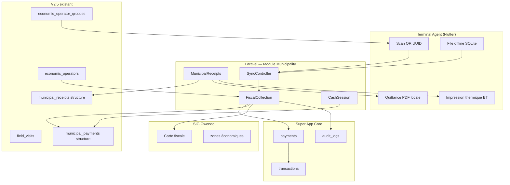
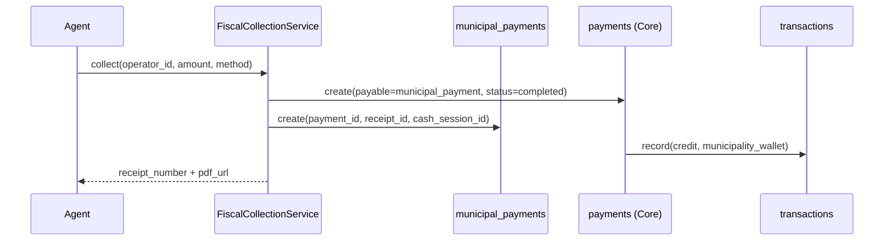

# 1. Architecture générale V3 — Fiscalité, Recouvrement et Quittances

## 1.1 Vision

MAMI Municipality V3 positionne l'**Agent Municipal Android** comme terminal de recouvrement fiscal de première ligne. Le Maire et les responsables financiers disposent d'une vision consolidée (dashboard + SIG). Le registre économique V2 et les fondations V2.5 restent la source de vérité des opérateurs et des QR.



## 1.2 Principes architecturaux

| Principe | Application V3 |
|----------|----------------|
| **Séparation Taxi / Municipality** | Namespace `App\Modules\Municipality` ; routes `/api/v1/municipality/*` ; flag `MAMI_MODULE_MUNICIPALITY` |
| **Double écriture contrôlée** | Chaque encaissement crée un `municipal_payment` **et** un `payment` Core (lien `payment_id`) |
| **QR sécurisé** | Scan résout `qr_uuid` (UUID v4) — jamais `OWE-COM-*` seul |
| **Offline-first** | Mobile écrit en local ; sync idempotente via `client_operation_id` |
| **Traçabilité** | Toute mutation financière → `audit_logs` + horodatage agent/GPS |
| **Extensibilité Mobile Money** | Provider pattern : `cash`, `airtel_money`, `moov_money` |

## 1.3 Couches applicatives

### 1.3.1 Couche présentation (Flutter `mami_client`)

| Écran | Rôle |
|-------|------|
| `AgentHomeScreen` | Hub recouvrement (existant V2.5, activer items) |
| `QrScanCollectionScreen` | Scan → fiche opérateur → encaissement |
| `CashPaymentScreen` | Saisie montant espèces, rendu monnaie |
| `MobileMoneyPaymentScreen` | MSISDN, initiation, polling statut |
| `ReceiptPreviewScreen` | Aperçu PDF + partage |
| `ThermalPrintScreen` | Envoi ESC/POS Bluetooth |
| `CashSessionScreen` | Ouverture / clôture caisse |
| `OfflineQueueScreen` | File sync en attente |
| `MayorDashboardScreen` | Web ou tablette (Phase V3.3+) |

**Packages Flutter prévus** : `mobile_scanner`, `sqflite`/`drift`, `printing`, `esc_pos_bluetooth`, `connectivity_plus`, `geolocator`.

### 1.3.2 Couche API (Laravel)

```
app/Modules/Municipality/
├── Http/Controllers/Api/
│   ├── FiscalCollectionController.php      # encaissement
│   ├── MunicipalReceiptController.php      # quittances
│   ├── CashSessionController.php           # caisse
│   ├── SyncController.php                  # batch offline
│   └── MayorFiscalDashboardController.php
├── Services/
│   ├── FiscalCollectionService.php
│   ├── MunicipalReceiptService.php
│   ├── CashSessionService.php
│   ├── OperatorFiscalAccountService.php    # solde / dette
│   ├── PaymentCancellationService.php
│   ├── PaymentRefundService.php
│   └── Sync/
│       ├── OfflineSyncService.php
│       └── IdempotencyGuard.php
├── PaymentProviders/
│   ├── CashPaymentProvider.php
│   ├── AirtelMoneyProvider.php             # stub V3.1
│   └── MoovMoneyProvider.php                 # stub V3.2
└── Jobs/
    ├── GenerateReceiptPdfJob.php
    └── ReconcileMobileMoneyJob.php
```

### 1.3.3 Couche domaine (extensions V2.5)

Les services V2.5 existants sont **réutilisés**, pas remplacés :

| Service V2.5 | Rôle V3 |
|--------------|---------|
| `QRCodeManagement` | Résolution scan → opérateur |
| `FieldVisitService` | Visites sans paiement (contrôle) |
| `MunicipalReceiptReferenceGenerator` | Numéro `OWE-RCP-*` |
| `MunicipalBusinessCardService` | Carte commerce (hors flux encaissement) |

### 1.3.4 Couche données

- **PostgreSQL** : vérité serveur
- **SQLite local** (mobile) : file d'attente sync, cache opérateur, session caisse ouverte
- **Stockage fichiers** : PDF quittances (`storage/app/municipality/receipts/{year}/`)

### 1.3.5 Couche intégration Core



**Règle** : `payments.payable_type` = `App\Modules\Municipality\Models\MunicipalPayment` (ou morph map équivalent).

## 1.4 Frontières de module

| Module | Responsabilité | Hors périmètre V3 |
|--------|----------------|-------------------|
| **FiscalCollection** | Calcul dette, encaissement, lien Core | Tarification paramétrique avancée (V3.5) |
| **MunicipalReceipts** | Émission, PDF, impression | Archivage légal long terme (V4) |
| **CashSession** | Caisse agent journalière | Trésorerie municipale globale |
| **Brigade** | Campagnes terrain groupées | Préparation V3.4 ; spec V4 `recovery_campaigns` |
| **GIS fiscal** | Visualisation couches | Édition géométries (admin SIG séparé) |

## 1.5 Sécurité et permissions

### Rôles Spatie (extensions)

| Permission | Rôle(s) |
|------------|---------|
| `municipal.payment.collect` | `municipal_agent` |
| `municipal.payment.void` | `municipal_supervisor` |
| `municipal.payment.refund` | `municipal_finance` |
| `municipal.cash_session.open\|close` | `municipal_agent` |
| `municipal.cash_session.approve_close` | `municipal_supervisor` |
| `municipal.receipt.view\|reprint` | `municipal_agent`, `mayor` |
| `municipal.dashboard.fiscal` | `mayor`, `municipal_finance` |
| `municipal.brigade.manage` | `municipal_supervisor` |

### Contrôles transactionnels

- Montant encaissé ≤ plafond session caisse (configurable)
- Void/refund impossible si session clôturée et validée
- Double scan QR : idempotence 60 s (même `client_operation_id`)

## 1.6 Non-régression Taxi

| Vérification | Mécanisme |
|--------------|-----------|
| Tables `rides`, `drivers`, `ride_*` | Aucune migration V3 ne les touche |
| Routes `/api/v1/rides/*`, `/drivers/*` | Inchangées ; tests CI Taxi inchangés |
| Jobs dispatch | Namespace séparé `App\Jobs\` vs `App\Modules\Municipality\Jobs\` |
| Feature flag | `MAMI_MODULE_TAXI` et `MAMI_MODULE_MUNICIPALITY` indépendants |
| CI | Suite `tests/Feature/Municipality/*` + suite Taxi en parallèle |

## 1.7 Dépendances externes

| Service | Usage V3 | Phase |
|---------|----------|-------|
| Airtel Money API | Encaissement MM | V3.1 (sandbox) → V3.2 (prod) |
| Moov Money API | Encaissement MM | V3.2 (sandbox) → V3.3 (prod) |
| Imprimante thermique BT | ESC/POS 58/80 mm | V3.0 (espèces) |
| DomPDF / Snappy | PDF quittance | V3.0 |
| Reverb / Pusher | Notification dashboard Maire (optionnel) | V3.3 |

## 1.8 Environnements

| Env | Modules actifs | Données |
|-----|----------------|---------|
| `local` | Municipality + Taxi | Seeders Owendo |
| `staging` | Municipality seul possible | Opérateurs test |
| `production` | Les deux selon flags | Données réelles Owendo |

## 1.9 Critères d'acceptation architecture

- [ ] Chaque encaissement traçable de l'agent au `payment` Core
- [ ] Quittance unique `OWE-RCP-*` par paiement validé
- [ ] Mode offline : aucune perte après sync réussie
- [ ] Annulation/remboursement avec piste d'audit complète
- [ ] Dashboard Maire alimenté sans requête bloquante sur mobile
- [ ] Carte SIG : couche paiements / impayés sans dupliquer géométries opérateurs
