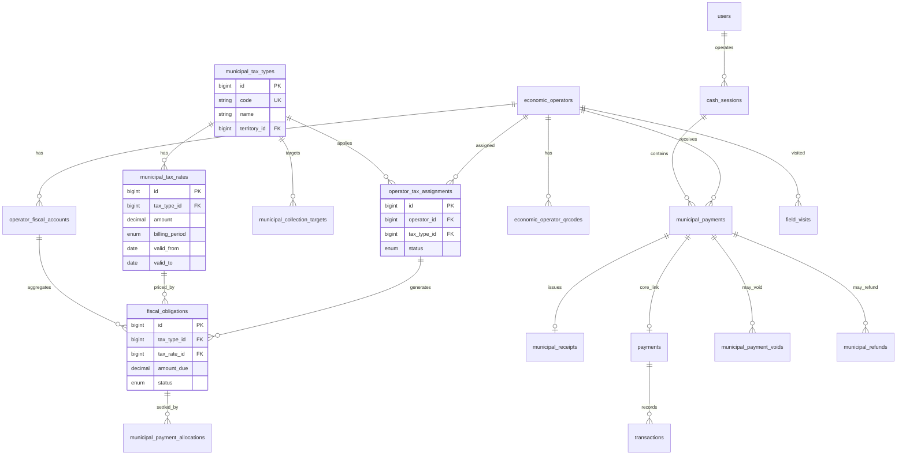

# 2. Modèle de données détaillé — Municipality V3

## 2.1 Vue d'ensemble ER



## 2.2 Tables existantes V2 / V2.5 (réutilisation)

### `economic_operators` (V2 — inchangé structurellement)

Source identité commerce. V3 ajoute uniquement des **lectures** et **affectations fiscales**.

| Colonne clé | Usage V3 |
|-------------|----------|
| `public_id` | Affichage humain `OWE-COM-000001` |
| `location` | SIG, validation GPS encaissement |
| `economic_zone_id` | Filtrage SIG / brigade (pas de tarif zone en V3.0) |
| `category_id` | Suggestion affectation taxes (règle dashboard) |
| `status` | `active` requis pour encaissement |

### `economic_operator_categories` (V2)

**Inchangé** — libellés métier (Boutique, Restaurant, etc.). **Aucune colonne de montant.** Le lien fiscal passe par `municipal_tax_types.category_id` (optionnel) et `operator_tax_assignments`.

### `economic_operator_qrcodes` (V2.5)

| Colonne | Usage V3 |
|---------|----------|
| `qr_uuid` | **Valeur encodée dans le QR** — clé scan |
| `qr_value` | Label affiché `OWE-COM-*` |
| `is_active` | QR révoqué → scan refusé |

### `field_visits` (V2.5)

Visites de contrôle sans encaissement. V3 enrichit optionnellement `visit_outcome` avec `payment_collected` (bool).

### `municipal_payments` (V2.5 — **extensions V3**)

| Colonne existante | Type | Note |
|-------------------|------|------|
| `operator_id` | FK | RESTRICT |
| `amount` | decimal(12,2) | |
| `collected_by` | FK users | Agent |
| `collected_at` | timestamp | |
| `metadata` | json | GPS, device_id, brigade |

**Colonnes à ajouter (migration V3.0)** :

| Colonne | Type | Description |
|---------|------|-------------|
| `payment_id` | FK nullable → `payments.id` | Lien Core |
| `receipt_id` | FK nullable → `municipal_receipts.id` | |
| `cash_session_id` | FK nullable → `cash_sessions.id` | |
| `client_operation_id` | uuid UNIQUE | Idempotence offline |
| `sync_status` | enum | `synced`, `pending`, `failed` |
| `gps_latitude` / `gps_longitude` / `gps_accuracy_m` | | Preuve terrain |
| `mobile_money_reference` / `mobile_money_provider` | | MM V3.1+ |

**Note** : l'allocation multi-obligations utilise la table pivot `municipal_payment_allocations` (voir §2.3).

### `municipal_receipts` (V2.5 — **extensions V3**)

| Colonne ajoutée | Description |
|-----------------|-------------|
| `pdf_path`, `pdf_generated_at` | Stockage PDF |
| `print_count`, `last_printed_at` | Impression BT |
| `qr_verification_token` | Vérification publique |
| `document_hash` | Signature numérique V3.0 |
| `tax_lines_json` | Snapshot taxes / périodes payées |
| `issued_offline` | boolean |

## 2.3 Moteur fiscal configurable (V3.0)

> Détail fonctionnel : [19_MOTEUR_FISCAL_CONFIGURABLE.md](19_MOTEUR_FISCAL_CONFIGURABLE.md)

### `municipal_tax_types`

| Colonne | Type | Contraintes |
|---------|------|-------------|
| `id` | bigint PK | |
| `territory_id` | FK | Owendo |
| `code` | string UK | `TAX-BOUTIQUE`, etc. |
| `name` | string | |
| `description` | text nullable | |
| `category_id` | FK nullable | → `economic_operator_categories` |
| `is_active` | boolean | |
| `created_by` / `updated_by` | FK users | |
| `timestamps`, `deleted_at` | | soft delete |

### `municipal_tax_rates`

| Colonne | Type | Contraintes |
|---------|------|-------------|
| `id` | bigint PK | |
| `tax_type_id` | FK | RESTRICT |
| `amount` | decimal(12,2) | **Seule source de montant** |
| `currency` | char(3) | default XAF |
| `billing_period` | enum | `monthly`, `quarterly`, `semi_annual`, `annual` |
| `valid_from` | date | |
| `valid_to` | date nullable | |
| `due_day_of_period` | smallint | default 1 |
| `created_by` | FK users | |
| `timestamps` | | |

Index : `(tax_type_id, valid_from, valid_to)`.

### `municipal_collection_targets`

| Colonne | Type | Contraintes |
|---------|------|-------------|
| `id` | bigint PK | |
| `tax_type_id` | FK | |
| `territory_id` | FK | |
| `fiscal_year` | smallint | |
| `target_amount` | decimal(14,2) | Objectif annuel |
| `set_by` | FK users | |
| `timestamps` | | |

UNIQUE (`tax_type_id`, `territory_id`, `fiscal_year`).

### `operator_tax_assignments`

| Colonne | Type | Contraintes |
|---------|------|-------------|
| `id` | bigint PK | |
| `operator_id` | FK | → `economic_operators` |
| `tax_type_id` | FK | → `municipal_tax_types` |
| `tax_rate_id` | FK nullable | Taux figé ou null = courant |
| `assigned_from` / `assigned_to` | date | |
| `status` | enum | `active`, `suspended`, `ended` |
| `assigned_by` | FK users | |
| `assignment_source` | enum | `manual`, `enrollment`, `bulk_import`, `category_rule` |
| `timestamps` | | |

UNIQUE partiel : (`operator_id`, `tax_type_id`) WHERE `status = active`.

### `operator_fiscal_accounts`

Compte fiscal synthétique par opérateur.

| Colonne | Type | Contraintes |
|---------|------|-------------|
| `id` | bigint PK | |
| `operator_id` | FK | UNIQUE |
| `balance_due` | decimal(12,2) | ≥ 0, recalculé |
| `last_payment_at` | timestamp nullable | |
| `last_assessment_at` | timestamp nullable | |
| `fiscal_year` | smallint | |
| `status` | enum | `current`, `overdue`, `exempt`, `disputed` |
| `timestamps` | | |

### `fiscal_obligations`

Lignes de dette **générées par le moteur** à partir des affectations.

| Colonne | Type | Contraintes |
|---------|------|-------------|
| `id` | bigint PK | |
| `operator_id` | FK | |
| `account_id` | FK | → `operator_fiscal_accounts` |
| `tax_type_id` | FK | → `municipal_tax_types` |
| `tax_rate_id` | FK | Snapshot taux |
| `assignment_id` | FK | → `operator_tax_assignments` |
| `obligation_type` | enum | `periodic_tax`, `penalty`, `regularization` |
| `period_start` / `period_end` | date | |
| `period_label` | string | « Juin 2026 », « T2 2026 » |
| `amount_due` | decimal(12,2) | Copié de `tax_rate.amount` |
| `amount_paid` | decimal(12,2) default 0 | |
| `status` | enum | `open`, `partial`, `paid`, `waived`, `cancelled` |
| `due_date` | date | |
| `reference` | string nullable | `OBL-2026-06-TAX-BOUTIQUE-42` |
| `timestamps` | | |

UNIQUE (`operator_id`, `tax_type_id`, `period_start`, `period_end`) pour `obligation_type = periodic_tax`.

**Règle** : `SUM(amount_due - amount_paid)` obligations `open|partial` = `balance_due`.

### `municipal_payment_allocations`

Pivot paiement ↔ obligations (multi-taxes).

| Colonne | Type |
|---------|------|
| `id` | bigint PK |
| `municipal_payment_id` | FK |
| `fiscal_obligation_id` | FK |
| `amount_allocated` | decimal(12,2) |
| `timestamps` | |

## 2.4 Tables opérationnelles V3

### `cash_sessions`

| Colonne | Type | Contraintes |
|---------|------|-------------|
| `session_number` | string UK | `OWE-CS-YYYYMMDD-AGENT-NN` |
| `user_id` | FK | Agent |
| `opening_float` | decimal(12,2) | |
| `expected_cash` | decimal(12,2) | Calculé |
| `counted_cash` | decimal nullable | |
| `status` | enum | `open`, `pending_close`, `closed`, `approved` |
| `opened_at` / `closed_at` | timestamp | |
| `opening_gps` / `closing_gps` | point nullable | |
| `device_id` | string nullable | |

### `municipal_payment_voids` / `municipal_refunds` / `offline_sync_batches`

Inchangés (voir version précédente architecture).

### `recovery_campaigns` / `field_teams` (V3.4)

Préparation brigade — inchangé.

## 2.5 Tables Core Super App

`payments`, `transactions`, `audit_logs` — réutilisation inchangée.  
`audit_logs` étendu aux entités : `MunicipalTaxType`, `MunicipalTaxRate`, `OperatorTaxAssignment`.

## 2.6 Modèle mobile (SQLite local)

| Table locale | Rôle |
|--------------|------|
| `local_tax_rates_cache` | Taux courants (TTL sync) |
| `local_obligations_cache` | Obligations ouvertes par opérateur |
| `local_payments` / `local_receipts` / `sync_queue` | Inchangé |

**Aucun montant fiscal dans l'APK.**

## 2.7 Énumérations

```
BillingPeriod: monthly, quarterly, semi_annual, annual
TaxAssignmentStatus: active, suspended, ended
TaxAssignmentSource: manual, enrollment, bulk_import, category_rule
FiscalObligationType: periodic_tax, penalty, regularization
FiscalObligationStatus: open, partial, paid, waived, cancelled
```

## 2.8 Intégrité référentielle

| FK | ON DELETE |
|----|-----------|
| operator_tax_assignments.operator_id | RESTRICT |
| fiscal_obligations.tax_type_id | RESTRICT |
| municipal_tax_rates.tax_type_id | RESTRICT |
| municipal_payments.operator_id | RESTRICT |

## 2.9 Migration strategy

| Version | Migrations |
|---------|------------|
| V3.0 | Moteur fiscal (`municipal_tax_*`, `operator_tax_assignments`, `municipal_collection_targets`), `fiscal_obligations` enrichi, `municipal_payment_allocations`, `cash_sessions`, extensions payments/receipts |
| V3.1 | `municipal_payment_voids`, `offline_sync_batches` |
| V3.2 | `municipal_refunds`, `cash_session_denominations` |
| V3.4 | `recovery_campaigns`, brigades |

Aucune migration ne touche `rides`, `drivers`, ou tables Taxi.
