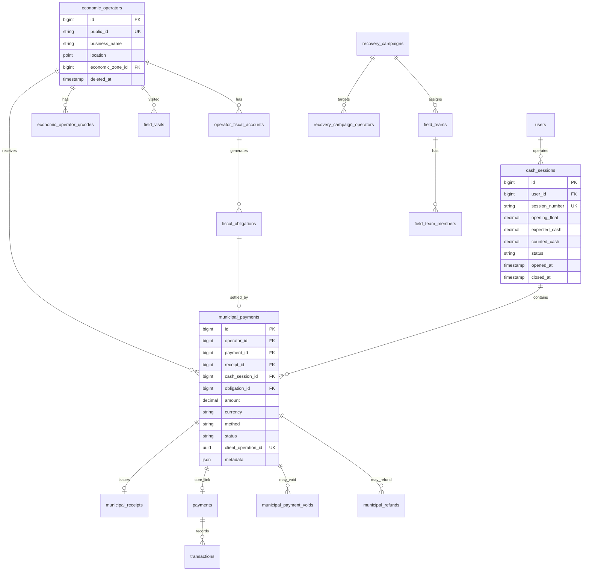

# 2. Modèle de données détaillé — Municipality V3

## 2.1 Vue d'ensemble ER



## 2.2 Tables existantes V2 / V2.5 (réutilisation)

### `economic_operators` (V2 — inchangé structurellement)

Source identité commerce. V3 ajoute uniquement des **lectures** via relations fiscales.

| Colonne clé | Usage V3 |
|-------------|----------|
| `public_id` | Affichage humain `OWE-COM-000001` |
| `location` | SIG, validation GPS encaissement |
| `economic_zone_id` | Tarification zone (V3.5) |
| `status` | `active` requis pour encaissement |

### `economic_operator_qrcodes` (V2.5)

| Colonne | Usage V3 |
|---------|----------|
| `qr_uuid` | **Valeur encodée dans le QR** — clé scan |
| `qr_value` | Label affiché `OWE-COM-*` |
| `is_active` | QR révoqué → scan refusé |

### `field_visits` (V2.5)

Visites de contrôle sans encaissement. V3 enrichit optionnellement `visit_outcome` avec `payment_collected` (bool) pour corrélation.

### `municipal_payments` (V2.5 — **extensions V3**)

Structure actuelle à compléter :

| Colonne existante | Type | Note |
|-------------------|------|------|
| `id` | bigint PK | |
| `operator_id` | FK → economic_operators | RESTRICT |
| `amount` | decimal(12,2) | |
| `currency` | char(3) default XAF | |
| `payment_method` | string | → enum normalisé |
| `status` | string | draft → completed → voided |
| `collected_by` | FK users | Agent |
| `collected_at` | timestamp | |
| `metadata` | json | GPS, device_id |

**Colonnes à ajouter (migration V3.0)** :

| Colonne | Type | Description |
|---------|------|-------------|
| `payment_id` | FK nullable → `payments.id` | Lien Core Super App |
| `receipt_id` | FK nullable → `municipal_receipts.id` | Quittance émise |
| `cash_session_id` | FK nullable → `cash_sessions.id` | Session caisse |
| `obligation_id` | FK nullable → `fiscal_obligations.id` | Dette réglée |
| `client_operation_id` | uuid UNIQUE | Idempotence offline |
| `sync_status` | enum | `synced`, `pending`, `failed` |
| `synced_at` | timestamp nullable | |
| `voided_at` | timestamp nullable | |
| `voided_by` | FK users nullable | |
| `gps_latitude` | decimal(10,7) nullable | Preuve terrain |
| `gps_longitude` | decimal(10,7) nullable | |
| `gps_accuracy_m` | decimal nullable | |
| `mobile_money_reference` | string nullable | Réf opérateur MM |
| `mobile_money_provider` | enum nullable | airtel, moov |

**Index** : `(operator_id, collected_at)`, `(cash_session_id)`, `(client_operation_id)`, `(status)`.

### `municipal_receipts` (V2.5 — **extensions V3**)

| Colonne existante | Note |
|-------------------|------|
| `receipt_number` | UNIQUE `OWE-RCP-YYYY-NNNNNN` |
| `operator_id` | |
| `payment_id` | FK municipal_payments (existant) |

**Colonnes à ajouter** :

| Colonne | Type | Description |
|---------|------|-------------|
| `pdf_path` | string nullable | Chemin stockage |
| `pdf_generated_at` | timestamp nullable | |
| `print_count` | int default 0 | Réimpressions |
| `last_printed_at` | timestamp nullable | |
| `qr_verification_token` | uuid | Vérification publique quittance |
| `issued_offline` | boolean default false | Émise avant sync |
| `template_version` | string default 'v1' | Évolution modèle |

## 2.3 Nouvelles tables V3

### `operator_fiscal_accounts`

Compte fiscal synthétique par opérateur (solde dû).

| Colonne | Type | Contraintes |
|---------|------|-------------|
| `id` | bigint PK | |
| `operator_id` | FK | UNIQUE → economic_operators |
| `balance_due` | decimal(12,2) | ≥ 0 |
| `last_payment_at` | timestamp nullable | |
| `last_assessment_at` | timestamp nullable | |
| `fiscal_year` | smallint | Année fiscale Owendo |
| `status` | enum | `current`, `overdue`, `exempt`, `disputed` |
| `timestamps` | | |

### `fiscal_obligations`

Lignes de dette (taxe mensuelle, pénalité, régularisation).

| Colonne | Type | Contraintes |
|---------|------|-------------|
| `id` | bigint PK | |
| `operator_id` | FK | |
| `account_id` | FK | → operator_fiscal_accounts |
| `obligation_type` | enum | `monthly_tax`, `penalty`, `regularization`, `other` |
| `period_start` | date | |
| `period_end` | date | |
| `amount_due` | decimal(12,2) | |
| `amount_paid` | decimal(12,2) default 0 | |
| `status` | enum | `open`, `partial`, `paid`, `waived`, `cancelled` |
| `due_date` | date | |
| `reference` | string nullable | Référence interne |
| `timestamps` | | |

**Règle** : `SUM(amount_due - amount_paid)` des obligations `open|partial` = `balance_due` du compte.

### `cash_sessions`

| Colonne | Type | Contraintes |
|---------|------|-------------|
| `id` | bigint PK | |
| `session_number` | string UK | `OWE-CS-YYYYMMDD-AGENT-NN` |
| `user_id` | FK | Agent |
| `territory_id` | FK nullable | Owendo |
| `opening_float` | decimal(12,2) | Fond de caisse |
| `expected_cash` | decimal(12,2) default 0 | Calculé |
| `counted_cash` | decimal nullable | Saisie clôture |
| `variance` | decimal nullable | counted - expected |
| `status` | enum | `open`, `pending_close`, `closed`, `approved` |
| `opened_at` | timestamp | |
| `closed_at` | timestamp nullable | |
| `approved_by` | FK users nullable | Superviseur |
| `approved_at` | timestamp nullable | |
| `opening_gps` | point nullable | |
| `closing_gps` | point nullable | |
| `device_id` | string nullable | Terminal |
| `notes` | text nullable | |
| `timestamps` | | |

**Contrainte métier** : un seul `status=open` par `user_id` à la fois.

### `cash_session_denominations` (optionnel V3.0, recommandé V3.1)

Détail billets/pièces à la clôture.

| Colonne | Type |
|---------|------|
| `cash_session_id` | FK |
| `denomination` | int (500, 1000, …) |
| `quantity` | int |

### `municipal_payment_voids`

| Colonne | Type |
|---------|------|
| `id` | bigint PK |
| `municipal_payment_id` | FK UNIQUE |
| `voided_by` | FK users |
| `reason_code` | enum |
| `reason_detail` | text nullable |
| `supervisor_approval_id` | FK users nullable |
| `voided_at` | timestamp |
| `timestamps` | |

### `municipal_refunds`

| Colonne | Type |
|---------|------|
| `id` | bigint PK |
| `original_payment_id` | FK → municipal_payments |
| `refund_payment_id` | FK nullable → municipal_payments | Contre-passation |
| `amount` | decimal(12,2) |
| `method` | enum | cash, mobile_money |
| `status` | enum | pending, completed, failed |
| `requested_by` | FK users |
| `approved_by` | FK users nullable |
| `mobile_money_reference` | string nullable |
| `timestamps` | |

### `offline_sync_batches` (serveur)

| Colonne | Type |
|---------|------|
| `id` | bigint PK |
| `user_id` | FK |
| `device_id` | string |
| `batch_uuid` | uuid UK |
| `payload_hash` | string |
| `status` | enum | received, processed, partial, rejected |
| `processed_at` | timestamp nullable |
| `error_summary` | json nullable |
| `timestamps` | |

### `recovery_campaigns` (préparation Brigade V3.4)

Aligné sur `FISCAL_RECOVERY_MODULE_SPEC.md` :

| Colonne | Type |
|---------|------|
| `id` | bigint PK |
| `name` | string |
| `territory_id` | FK |
| `economic_zone_id` | FK nullable |
| `start_date` | date |
| `end_date` | date |
| `status` | enum | draft, active, completed |
| `target_amount` | decimal nullable |
| `created_by` | FK users |

### `field_teams` / `field_team_members`

| Table | Rôle |
|-------|------|
| `field_teams` | Équipe brigade (chef + agents) |
| `field_team_members` | `team_id`, `user_id`, `role` |

### `recovery_campaign_operators`

Cible opérateurs d'une campagne : `campaign_id`, `operator_id`, `priority`, `assigned_team_id`.

## 2.4 Tables Core Super App (réutilisation)

### `payments`

| Champ V3 | Valeur |
|----------|--------|
| `payable_type` | MunicipalPayment::class |
| `payable_id` | municipal_payments.id |
| `amount` | = municipal_payments.amount |
| `currency` | XAF |
| `method` | cash, airtel_money, moov_money |
| `status` | pending → completed / failed |
| `provider_reference` | Réf MM externe |
| `metadata` | operator_public_id, receipt_number |

### `transactions`

Écriture comptable : crédit portefeuille municipal (`wallet_type=municipality`), débit si remboursement.

### `audit_logs`

`auditable_type` = MunicipalPayment, CashSession, MunicipalReceipt, etc.

## 2.5 Modèle mobile (SQLite local)

| Table locale | Rôle |
|--------------|------|
| `local_cash_sessions` | Miroir session ouverte |
| `local_payments` | Paiements en attente sync |
| `local_receipts` | PDF blob ou chemin temp |
| `local_operators_cache` | Cache post-scan (TTL 24h) |
| `sync_queue` | `operation_type`, `payload_json`, `retry_count`, `status` |

**Clé idempotence** : `client_operation_id` (UUID généré côté mobile à la création).

## 2.6 Énumérations

```
MunicipalPaymentStatus: draft, pending_sync, completed, voided, refunded
MunicipalPaymentMethod: cash, airtel_money, moov_money
CashSessionStatus: open, pending_close, closed, approved
FiscalObligationStatus: open, partial, paid, waived, cancelled
VoidReasonCode: duplicate, wrong_amount, wrong_operator, fraud_suspected, other
RefundStatus: pending, completed, failed
SyncStatus: synced, pending, failed
```

## 2.7 Intégrité référentielle

| FK | ON DELETE |
|----|-----------|
| municipal_payments.operator_id | RESTRICT |
| municipal_payments.payment_id | RESTRICT |
| municipal_receipts.operator_id | RESTRICT |
| cash_sessions.user_id | RESTRICT |
| fiscal_obligations.operator_id | RESTRICT |

**Soft delete** `economic_operators` : encaissement refusé si opérateur archivé ; obligations historiques conservées.

## 2.8 Migration strategy

| Version | Migrations |
|---------|------------|
| V3.0 | `cash_sessions`, extensions `municipal_payments` / `municipal_receipts`, `operator_fiscal_accounts`, `fiscal_obligations` |
| V3.1 | `municipal_payment_voids`, `offline_sync_batches` |
| V3.2 | `municipal_refunds`, `cash_session_denominations` |
| V3.4 | `recovery_campaigns`, `field_teams`, `recovery_campaign_operators` |

Aucune migration ne touche `rides`, `drivers`, ou tables Taxi.
