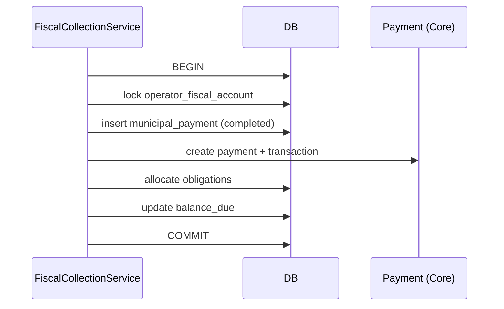

# 3. FiscalCollection Module

## 3.1 Mission

Orchestrer l'**encaissement fiscal terrain** : résolution opérateur, calcul du dû, création paiement municipal + paiement Core, affectation obligation, mise à jour compte fiscal.

## 3.2 Responsabilités

| In scope | Out of scope |
|----------|--------------|
| Scan QR → opérateur | Édition registre économique (V2) |
| Affichage solde / obligations (multi-taxes) | Paramétrage taxes (dashboard Maire) |
| Encaissement multi-méthode | Comptabilité générale municipale |
| Idempotence offline | Règlement bancaire hors MM |

## 3.3 Composants

```
FiscalCollectionService
├── FiscalEngineService             # lecture taux, obligations (pas d'écriture taxes)
├── OperatorFiscalAccountService    # balance_due, statut
├── ObligationAllocationService     # FIFO multi-taxes sur obligations ouvertes
├── PaymentOrchestrator             # municipal + Core payment
├── GpsValidationService            # ≤20m opérateur (configurable)
└── CollectionPolicy                # plafonds, permissions
```

> Paramétrage taxes : [19_MOTEUR_FISCAL_CONFIGURABLE.md](19_MOTEUR_FISCAL_CONFIGURABLE.md)

## 3.4 API REST (prévue)

| Méthode | Route | Description |
|---------|-------|-------------|
| GET | `/operators/by-qr/{uuid}` | Existant V2.5 — enrichir avec `fiscal_account` |
| GET | `/operators/{id}/fiscal-summary` | Solde, obligations par taxe, dernier paiement |
| POST | `/collections` | Encaissement |
| GET | `/collections/{id}` | Détail |
| POST | `/collections/preview` | Simulation sans écriture |

### Payload `POST /collections`

```json
{
  "operator_id": 42,
  "qr_uuid": "550e8400-e29b-41d4-a716-446655440000",
  "amount": 15000,
  "currency": "XAF",
  "method": "cash",
  "cash_session_id": 7,
  "obligation_ids": [101, 102],
  "client_operation_id": "f47ac10b-58cc-4372-a567-0e02b2c3d479",
  "gps": { "latitude": 0.6543, "longitude": 9.3456, "accuracy_m": 8 },
  "device_id": "android-abc123"
}
```

### Réponse succès

```json
{
  "municipal_payment_id": 1001,
  "payment_id": 5001,
  "receipt_number": "OWE-RCP-2026-000042",
  "receipt_pdf_url": "/api/v1/municipality/receipts/1001/pdf",
  "amount_allocated": 15000,
  "remaining_balance": 0,
  "allocations": [
    { "obligation_id": 101, "tax_code": "TAX-BOUTIQUE", "period_label": "Juin 2026", "amount": 15000 }
  ],
  "sync_status": "synced"
}
```

## 3.5 Règles métier

### 3.5.1 Éligibilité encaissement

1. Opérateur `status = active`, non soft-deleted
2. QR `is_active = true`
3. Agent permission `municipal.payment.collect`
4. Session caisse `open` (obligatoire pour espèces)
5. GPS : distance opérateur ≤ `config('mami.municipality.collection_max_gps_distance_m', 20)` sauf override superviseur

### 3.5.2 Allocation montant (multi-taxes)

Ordre **FIFO** par `due_date`, puis `tax_type_id` sur obligations `open` puis `partial` :

```
amount_remaining = payment.amount
foreach obligation in obligations.open.orderBy(due_date, tax_type_id):
    pay = min(obligation.amount_due - obligation.amount_paid, amount_remaining)
    insert municipal_payment_allocations(obligation_id, pay)
    amount_remaining -= pay
```

Un paiement peut couvrir plusieurs obligations (ex. taxe commerce + taxe occupation).  
Surpaiement : refusé en V3.0.

### 3.5.3 Orchestration transactionnelle



Rollback complet si échec Core ou violation contrainte.

### 3.5.4 Mobile Money

Délégation aux providers (voir doc 11). Flux :

1. `POST /collections` → `status=pending`, `payment Core pending`
2. Webhook / polling provider → `completed` ou `failed`
3. Si `completed` → émission quittance ; si `failed` → libération allocation

## 3.6 Génération des obligations (moteur fiscal V3.0)

Les obligations ne sont **jamais seedées avec des montants en code**. Flux :

1. Maire crée `municipal_tax_types` + `municipal_tax_rates` (dashboard)
2. Finance affecte taxes aux opérateurs (`operator_tax_assignments`)
3. `GenerateFiscalObligationsJob` crée `fiscal_obligations` par période
4. Agent consulte `fiscal-summary` → liste obligations ouvertes par taxe

**Prérequis encaissement** : au moins une obligation `open|partial` OU solde `balance_due > 0`.

Voir [19_MOTEUR_FISCAL_CONFIGURABLE.md](19_MOTEUR_FISCAL_CONFIGURABLE.md).

## 3.7 Événements domaine

| Event | Listeners |
|-------|-----------|
| `MunicipalPaymentCompleted` | GenerateReceiptPdfJob, UpdateFiscalMapCache |
| `MunicipalPaymentVoided` | ReverseObligationAllocation |
| `CollectionOfflineReceived` | OfflineSyncService |

## 3.8 Erreurs standard

| Code HTTP | Code métier | Cas |
|-----------|-------------|-----|
| 404 | `OPERATOR_NOT_FOUND` | QR inconnu |
| 422 | `OPERATOR_INACTIVE` | Archivé / inactif |
| 422 | `NO_OPEN_CASH_SESSION` | Espèces sans caisse |
| 422 | `AMOUNT_EXCEEDS_DUE` | Surpaiement |
| 409 | `DUPLICATE_OPERATION` | client_operation_id existant |
| 422 | `GPS_TOO_FAR` | Hors rayon |

## 3.9 Tests d'acceptation (spec)

- Encaissement espèces complet réduit `balance_due` à 0 (opérateur multi-taxes)
- Obligations générées depuis `operator_tax_assignments` + taux courant
- Double POST même `client_operation_id` → 1 seul paiement
- Paiement sans session ouverte (cash) → 422
- Opérateur soft-deleted → 422
- Core `payment` créé avec bon `payable_type`
