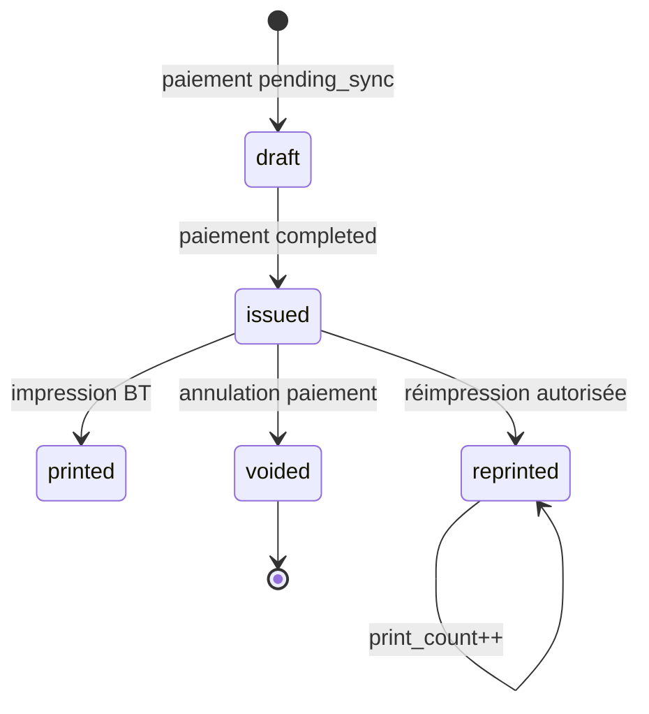

# 4. MunicipalReceipts Module

## 4.1 Mission

Émettre des **quittances officielles** immuables (après validation), numérotées `OWE-RCP-YYYY-NNNNNN`, exportables PDF et imprimables sur terminal thermique Bluetooth.

## 4.2 Cycle de vie quittance



## 4.3 Composants

```
MunicipalReceiptService
├── MunicipalReceiptReferenceGenerator  # existant V2.5
├── ReceiptTemplateRenderer             # Blade → HTML
├── ReceiptPdfGenerator                 # DomPDF
├── ReceiptVerificationService          # QR token public
└── ThermalReceiptFormatter             # ESC/POS (mobile)
```

## 4.4 Numérotation

Format : `OWE-RCP-{YYYY}-{6 digits zero-padded}`

- Séquence par année civile Owendo (timezone `Africa/Libreville`)
- Génération **atomique** (DB sequence ou `SELECT FOR UPDATE` sur compteur)
- UNIQUE constraint `receipt_number` (existant V2.5)
- Offline : numéro provisoire `OWE-RCP-PENDING-{client_operation_id_short}` remplacé à la sync

## 4.5 Contenu quittance (template v1)

### En-tête
- Blason / logo Commune d'Owendo
- « QUITTANCE DE PAIEMENT — TAXE MUNICIPALE »
- N° quittance, date/heure émission

### Corps
| Champ | Source |
|-------|--------|
| Opérateur | `business_name`, `public_id` |
| Adresse / zone | `economic_zone.name`, quartier |
| Période couverte | `fiscal_obligations.period_label` par allocation |
| Détail taxes | `tax_lines_json` : code taxe, libellé, montant |
| Montant payé | `municipal_payments.amount` |
| Mode paiement | cash / Airtel / Moov |
| Référence MM | si applicable |
| Agent collecteur | `users.name`, matricule |

### Pied
- QR vérification : URL `https://mami.ga/v/r/{qr_verification_token}`
- **Signature numérique** : `document_hash` = SHA256(receipt_number | operator_id | amount | tax_lines | collected_at)
- Mention légale : « Document officiel — falsification punie »

## 4.6 PDF

| Aspect | Choix |
|--------|-------|
| Moteur | DomPDF (déjà stack Laravel) |
| Format | A5 portrait |
| Stockage | `storage/app/municipality/receipts/{year}/{receipt_number}.pdf` |
| Génération | Async `GenerateReceiptPdfJob` post-paiement |
| Accès API | `GET /receipts/{id}/pdf` (auth + permission) |

### Endpoint vérification publique (sans auth)

`GET /public/receipts/verify/{token}` → JSON statut `valid|voided`, montant, date (données limitées).

## 4.7 Impression thermique Bluetooth

### Protocole
- ESC/POS via package Flutter `esc_pos_bluetooth` ou `print_bluetooth_thermal`
- Largeurs : 58 mm (priorité terrain) et 80 mm (config)

### Layout thermique (58 mm)

```
    COMMUNE D'OWENDO
    QUITTANCE MUNICIPALE
------------------------
N° OWE-RCP-2026-000042
Date: 16/06/2026 14:32
------------------------
Commerce: Boulangerie XYZ
ID: OWE-COM-000042
Zone: Marché Central
------------------------
Montant: 15 000 XAF
Mode: ESPECES
Periode: Juin 2026
Taxe: TAX-BOUTIQUE
------------------------
Agent: Jean ONDO
------------------------
[QR 120x120 verification]
------------------------
Merci pour votre
contribution citoyenne
```

### Règles impression
- `print_count` incrémenté à chaque envoi BT réussi
- Réimpression : permission `municipal.receipt.reprint` ; log audit
- Offline : impression locale depuis template embarqué ; resync `print_count` optionnel

## 4.8 API REST

| Méthode | Route | Description |
|---------|-------|-------------|
| GET | `/receipts/{id}` | Métadonnées |
| GET | `/receipts/{id}/pdf` | Téléchargement PDF |
| POST | `/receipts/{id}/reprint` | Log réimpression |
| GET | `/operators/{id}/receipts` | Historique paginé |

## 4.9 Liaison paiement ↔ quittance

1:1 stricte pour paiement `completed` :

- `municipal_receipts.municipal_payment_id` UNIQUE
- Création dans la même transaction DB que `municipal_payments.status=completed`

## 4.10 Annulation

Si paiement voided :
- Quittance `status=voided` (colonne à ajouter) ou watermark PDF « ANNULÉ »
- Vérification publique retourne `voided`
- Pas de suppression physique (audit)

## 4.11 Préparation multi-langue (V3.5)

Templates `receipts/v1/fr.blade.php` ; structure prête pour `en` si besoin investisseurs.
