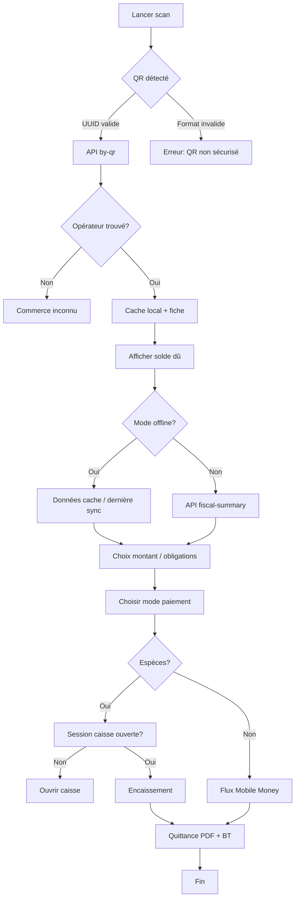

# 6. QR Collection Workflow

## 6.1 Vue d'ensemble

Flux principal V3 : l'agent scanne le QR du commerce, le système résout l'opérateur via UUID, affiche la dette, encaisse et émet la quittance.



## 6.2 Sécurité QR (héritage V2.5)

| Entrée scan | Résultat |
|-------------|----------|
| UUID v4 (`qr_uuid`) | ✅ Résolution |
| `QR-OWE-COM-000001-XXXXXXXX` (suffixe token) | ✅ Résolution |
| `OWE-COM-000001` seul | ❌ Rejeté |
| `QR-OWE-COM-000001` sans suffixe | ❌ Rejeté |

**Raison** : éviter la forge par énumération de `public_id`.

## 6.3 Écran mobile — étapes UX

### Étape 1 — Scan
- Caméra `mobile_scanner`
- Vibrations + bip sur lecture
- Timeout 30 s → saisie manuelle UUID (superviseur only, V3.2)

### Étape 2 — Fiche opérateur
- Nom, photo, `OWE-COM-*`, zone, catégorie
- **Liste taxes affectées** (`operator_tax_assignments`)
- **Détail obligations ouvertes** par taxe et période (`period_label`)
- Badge statut fiscal : `À jour` / `Impayé` / `En retard`
- Carte mini (flutter_map) position commerce + position agent

### Étape 3 — Montant
- Montant suggéré = `balance_due` (somme obligations ouvertes, toutes taxes)
- Détail par taxe : `TAX-BOUTIQUE — Juin 2026 — 15 000 XAF`
- Sélection obligations cochables (multi-taxes)

### Étape 4 — Paiement
- Boutons : Espèces | Airtel | Moov
- Récapitulatif avant confirmation

### Étape 5 — Quittance
- Aperçu PDF
- Actions : Imprimer BT | Partager WhatsApp | Nouveau scan

## 6.4 Validation GPS (terrain)

Lors de `POST /collections` :

```
distance = haversine(agent_gps, operator.location)
if distance > max_distance AND !supervisor_override:
    reject GPS_TOO_FAR
```

**Offline** : GPS capturé à la collecte, validé à la sync (rejeter si hors rayon sauf flag `gps_validated_at_sync=false` avec review superviseur).

## 6.5 Cache offline post-scan

Après scan réussi online :

```json
{
  "operator_id": 42,
  "qr_uuid": "...",
  "cached_at": "2026-06-16T10:00:00Z",
  "fiscal_summary": {
    "balance_due": 40000,
    "tax_assignments": ["TAX-BOUTIQUE", "TAX-OCCUPATION"],
    "obligations": [
      { "tax_code": "TAX-BOUTIQUE", "period_label": "Juin 2026", "amount_due": 15000 },
      { "tax_code": "TAX-OCCUPATION", "period_label": "T2 2026", "amount_due": 25000 }
    ]
  }
}
```

TTL : 24 h. Encaissement offline utilise ce cache ; resync recalcule allocations serveur.

## 6.6 Idempotence

Chaque tentative encaissement génère `client_operation_id` (UUID) **avant** appel API :

- Stocké dans `sync_queue` et `local_payments`
- Retry réseau : même UUID
- Serveur : UNIQUE → retourne réponse originale (200, pas doublon)

## 6.7 Cas limites

| Cas | Comportement |
|-----|--------------|
| QR révoqué (`is_active=false`) | Message + contacter mairie |
| Opérateur archivé | Scan OK mais encaissement refusé |
| Dette = 0 | Félicitations + proposition visite contrôle |
| Paiement MM timeout | Statut pending + écran suivi |
| Imprimante BT déconnectée | PDF + file impression différée |

## 6.8 Métriques workflow

- Temps scan → quittance (p50, p95)
- Taux échec GPS
- Taux sync offline réussie
- Scans sans encaissement (abandon funnel)
