# 7. Agent Collection Workflow

## 7.1 Persona

**Agent municipal de terrain** : équipé smartphone Android MAMI, responsable du recouvrement quotidien sur son secteur (quartier / zone économique assignée).

## 7.2 Journée type

```mermaid
gantt
    title Journée agent recouvrement
    dateFormat HH:mm
    section Matin
    Connexion app           :07:00, 15m
    Ouverture caisse        :07:15, 10m
  Briefing offline sync     :07:25, 5m
    section Terrain
    Tournée scan/encaissement :08:00, 6h
    section Midi
    Sync file attente       :12:30, 10m
    section Après-midi
    Tournée suite           :13:00, 4h
    section Soir
    Clôture caisse          :17:30, 15m
    Sync finale             :17:45, 10m
```

## 7.3 Parcours applicatif

### 7.3.1 Authentification
- Token Sanctum existant
- `/me` retourne rôles + permissions + `assigned_territory` / `assigned_zones` (V3.1)

### 7.3.2 Hub agent (`AgentHomeScreen`)

| Menu item | V3 statut |
|-----------|-----------|
| Enrôlement commerce | Actif (V2) |
| **Scanner & encaisser** | **V3.0** |
| **Ma caisse** | **V3.0** |
| Visite terrain | V2.5 actif |
| File synchronisation | **V3.0** |
| Historique du jour | **V3.0** |

### 7.3.3 Ouverture caisse
Voir CashSession Module. Blocage si non ouverte avant premier encaissement espèces.

### 7.3.4 Tournée
1. Liste opérateurs impayés du secteur (optionnel, V3.1) — tri par proximité GPS
2. OU scan opportuniste QR sur vitrine
3. Pour chaque encaissement : workflow QR (doc 6)

### 7.3.5 Visite sans paiement
`field_visits` existant : agent documente passage si commerçant absent ou refuse — alimente brigade et carte SIG.

### 7.3.6 Clôture
Comptage espèces, soumission, attente validation si écart.

## 7.4 Mode offline-first

### Principes
- **Lecture** : cache opérateurs + obligations (sync matinale)
- **Écriture** : paiements espèces + quittances locales en queue
- **MM** : nécessite réseau (pas de queue MM offline en V3.0)

### Sync matinale (`POST /sync/pull`)

Télécharge pour secteur agent :
- Opérateurs actifs + QR metadata
- Obligations ouvertes
- Paramètres config (seuils GPS, montants catégories)

### Sync push (`POST /sync/push`)

Batch ordonné :
1. Ouverture caisse (si locale)
2. Paiements (`client_operation_id`)
3. Quittances associées
4. Clôture caisse

### Résolution conflits

| Conflit | Résolution |
|---------|------------|
| Obligation déjà payée autre agent | Rejet paiement + notification |
| Session caisse serveur déjà ouverte | Fusion ou fermeture forcée admin |
| Montant cache ≠ serveur | Serveur fait foi, agent notifié |

## 7.5 Assignation territoriale

| Niveau | V3.0 | V3.2 |
|--------|------|------|
| Tout Owendo | ✅ | |
| Par zone économique | | ✅ |
| Par quartier SIG | | V3.4 |

Table prévue `user_territory_assignments` : `user_id`, `economic_zone_id`, `valid_from`, `valid_to`.

## 7.6 Notifications agent

| Event | Canal |
|-------|-------|
| Sync échouée | Push + badge file |
| Clôture approuvée / rejetée | Push |
| Paiement MM confirmé | In-app |

## 7.7 KPI agent (voir doc 17)

- Montant collecté / jour
- Nombre quittances
- Taux de recouvrement secteur
- Écart caisse moyen

## 7.8 Formation terrain (déploiement)

1. Scan QR sécurisé vs ancien format
2. Ouverture / clôture caisse
3. Procédure écart caisse
4. Offline : ne pas désinstaller app avant sync
5. Impression thermique appairage BT
