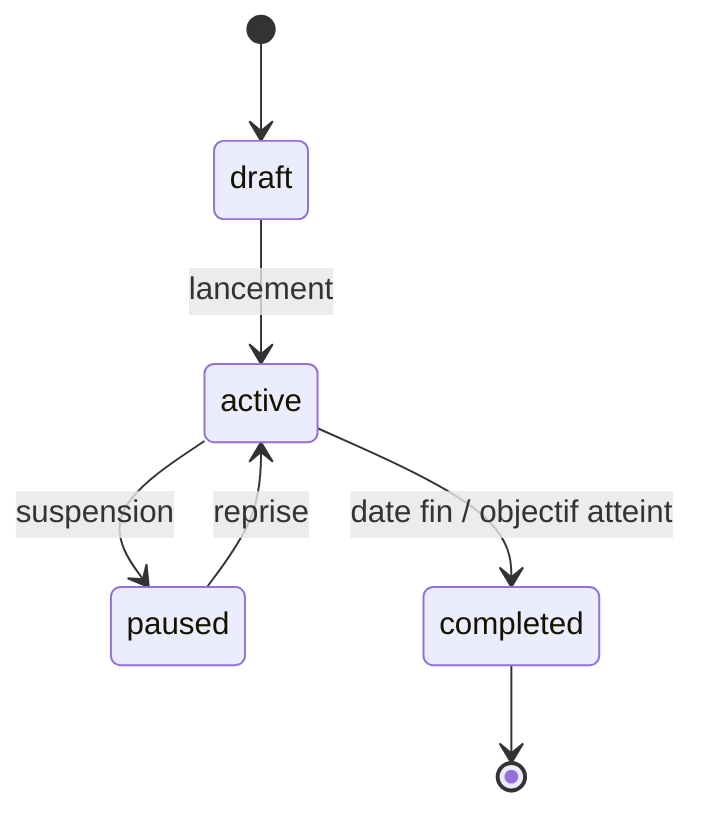

# 8. Brigade Workflow

## 8.1 Mission

Organiser des **campagnes de recouvrement groupées** : plusieurs agents, secteur ciblé, objectifs chiffrés, suivi chef de brigade.

**Phase** : conception V3.4, implémentation après stabilisation V3.0–V3.2.

## 8.2 Acteurs

| Rôle | Responsabilités |
|------|-----------------|
| Superviseur municipal | Crée campagne, affecte équipes |
| Chef de brigade | Coordonne tournée, valide clôtures groupées |
| Agent brigade | Scan / encaissement (même flux QR) |
| Maire | Consulte avancement campagne |

## 8.3 Cycle campagne



## 8.4 Création campagne

### Données
- Nom : « Campagne Marché Central — Juin 2026 »
- `territory_id` = Owendo
- `economic_zone_id` optionnel
- Période `start_date` → `end_date`
- `target_amount` optionnel
- Liste opérateurs cibles (impayés > N jours) OU critère dynamique

### API (V3.4)
- `POST /recovery-campaigns`
- `POST /recovery-campaigns/{id}/operators` (bulk)
- `POST /recovery-campaigns/{id}/teams`

## 8.5 Équipes terrain

```
field_teams
  id, campaign_id, name, lead_user_id

field_team_members
  team_id, user_id, role: lead | member
```

Chef de brigade : permissions `municipal.brigade.lead` + vue consolidée équipe.

## 8.6 Parcours brigade (jour J)

1. **Briefing** (app) : carte secteur, liste cibles, objectif jour
2. **Dispersion** : agents en binômes (optionnel)
3. **Collecte** : workflow QR standard, tag `campaign_id` dans metadata paiement
4. **Points de contrôle** : sync horaire, tableau équipe
5. **Débrief** : clôture caisses individuelles + rapport chef

## 8.7 Visites de recouvrement

Extension `field_visits` ou table `recovery_visits` (V4 spec) :

| outcome | Suite |
|---------|-------|
| `paid` | Lien `municipal_payment_id` |
| `refused` | Motif, photo, GPS |
| `absent` | Reprogrammation |
| `sealed` | Escalade juridique (hors V3) |

## 8.8 Tableau brigade (chef)

| Indicateur | Source |
|------------|--------|
| Objectif / réalisé | SUM payments metadata.campaign_id |
| Opérateurs visités | field_visits |
| Taux conversion visite → paiement | |
| Classement agents | |

## 8.9 Carte campagne

Couche SIG temporaire :
- Cibles impayées (rouge)
- Payés pendant campagne (vert)
- Visités sans paiement (orange)

## 8.10 Différence agent solo vs brigade

| Aspect | Agent solo | Brigade |
|--------|------------|---------|
| Campagne | — | `recovery_campaign_id` |
| Objectif | KPI perso | KPI équipe |
| Carte | Secteur assigné | Zone campagne |
| Clôture | Individuelle | Individuelle + rapport chef |

## 8.11 Préparation V3.0–V3.3

Dès V3.0, inclure dans `municipal_payments.metadata` :

```json
{ "campaign_id": null, "team_id": null }
```

Permet reporting rétroactif quand tables campagne arrivent en V3.4.
