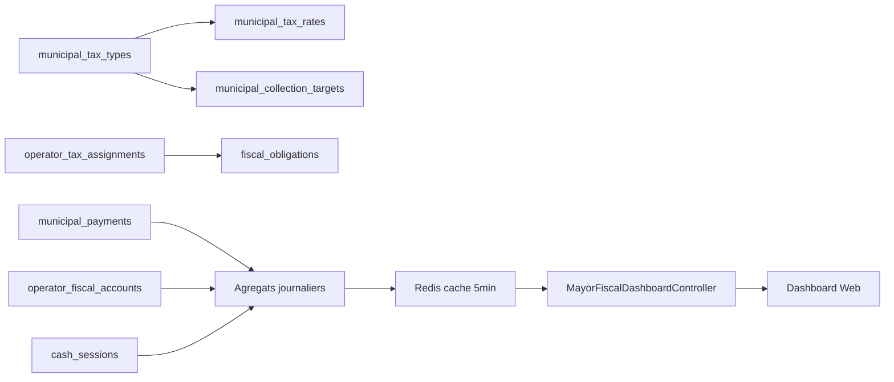

# 9. Mayor Fiscal Dashboard

## 9.1 Mission

Fournir au **Maire** et à la direction financière une vue exécutive temps quasi-réel du recouvrement fiscal Owendo.

## 9.2 Utilisateurs et accès

| Rôle | Accès |
|------|-------|
| `mayor` | Lecture complète |
| `municipal_finance` | Lecture + exports |
| `municipal_supervisor` | Vue opérationnelle (pas stratégique) |

Permission : `municipal.dashboard.fiscal`

**Canal** : Web admin Laravel (Inertia/Livewire) prioritaire ; widget Flutter tablette V3.3 optionnel.

## 9.3 Architecture données

**V3.0** : dashboard inclut **gestion fiscale** (CRUD taxes) + KPI simples  
**V3.3** : table matérialisée `fiscal_daily_snapshots` (job nightly + refresh hourly)

## 9.4 Écrans

### 9.4.1 Vue d'ensemble (home)

| Widget | Métrique |
|--------|----------|
| Encaissements aujourd'hui | SUM amount completed today |
| Encaissements mois | SUM month |
| Taux recouvrement | collected / assessed |
| Opérateurs à jour vs impayés | count by status |
| Répartition mode paiement | pie cash / airtel / moov |
| Carte chaleur mini | SIG embed |

### 9.4.2 Recouvrement temporel

Graphique ligne 30 jours :
- Montant encaissé / jour
- Nombre quittances / jour
- Comparaison M-1

### 9.4.3 Par zone économique

Tableau :
| Zone | Opérateurs | Dû | Collecté | Taux |
|------|------------|-----|----------|------|

Carte choroplèthe zones (couleur = taux recouvrement).

### 9.4.4 Agents

| Agent | Quittances | Montant | Écart caisse moyen |
|-------|------------|---------|-------------------|

### 9.4.5 Trésorerie caisses

Sessions ouvertes, montants espèces en circulation terrain, écarts en attente validation.

### 9.4.6 Alertes

- Écart caisse > seuil non validé > 24 h
- Chute encaissements > 30 % vs moyenne 7 jours
- Pic annulations

### 9.4.7 Gestion fiscale (V3.0 — prioritaire)

| Écran | Actions Maire / Finance |
|-------|-------------------------|
| Types de taxes | Créer, modifier, archiver `municipal_tax_types` |
| Taux | Ajouter versions (`municipal_tax_rates`) : montant, périodicité, validité |
| Objectifs annuels | Saisir `municipal_collection_targets` par taxe |
| Affectations | Assigner taxes aux opérateurs (unitaire, masse, par catégorie) |
| Génération | Lancer `GenerateFiscalObligationsJob` |

Voir [19_MOTEUR_FISCAL_CONFIGURABLE.md](19_MOTEUR_FISCAL_CONFIGURABLE.md).

### 9.4.8 Suivi objectifs

| Widget | Formule |
|--------|---------|
| Objectif vs réalisé (taxe) | `SUM(payments) / target_amount` par `tax_type_id` |
| Objectif global Owendo | SUM targets vs SUM collections année |
| Projection fin d'année | linéaire sur encaissements YTD |

## 9.5 API

| Méthode | Route | Description |
|---------|-------|-------------|
| GET | `/dashboard/fiscal/overview` | KPIs principaux |
| GET | `/dashboard/fiscal/timeseries` | Série temporelle |
| GET | `/dashboard/fiscal/by-zone` | Par zone |
| GET | `/dashboard/fiscal/by-agent` | Par agent |
| GET | `/dashboard/fiscal/alerts` | Alertes actives |
| GET | `/dashboard/fiscal/export` | CSV / Excel |
| GET/POST | `/tax-types` | CRUD taxes |
| GET/POST | `/tax-types/{id}/rates` | Versions tarifaires |
| GET/POST | `/collection-targets` | Objectifs annuels |
| GET/POST | `/operators/{id}/tax-assignments` | Affectations |
| POST | `/fiscal-obligations/generate` | Génération manuelle |

Extension endpoint existant V2.5 `v3_preparatory` → remplacé par endpoints ci-dessus.

## 9.6 Filtres globaux

- Période : jour / semaine / mois / personnalisé
- Zone économique
- Mode paiement
- Agent (superviseur)

## 9.7 Performance

| Contrainte | Cible |
|------------|-------|
| TTFB overview | < 800 ms |
| Refresh | 5 min cache, bouton force refresh |
| Export 10k lignes | < 30 s async job |

## 9.8 Sécurité

- Pas de PII commerçant dans exports publics
- Logs accès dashboard (qui a consulté quand)
- Rate limit 60 req/min

## 9.9 Évolution V3.5

- Prévisions ML recouvrement (hors scope initial)
- Benchmark mois année précédente
- Intégration rapport conseil municipal PDF
