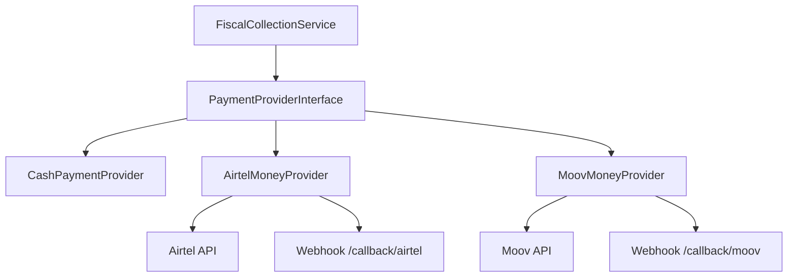
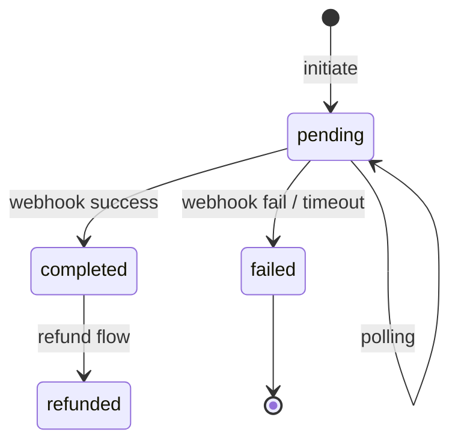

# 11. Intégration Mobile Money

## 11.1 Objectif

Permettre l'encaissement fiscal via **Airtel Money** et **Moov Money** (Gabon), en réutilisant le socle `payments` / `transactions` Super App.

## 11.2 Architecture provider



### Interface `PaymentProviderInterface`

```
initiate(collectionRequest): ProviderInitResult
checkStatus(providerReference): ProviderStatus
handleWebhook(payload): WebhookResult
cancel(providerReference): void  // si supporté
```

## 11.3 Flux utilisateur (agent)

1. Agent saisit montant + numéro client MSISDN (+241…)
2. `POST /collections` `method=airtel_money`
3. API initie push USSD / STK côté client commerçant
4. Écran attente : polling `GET /collections/{id}/status` 3 s / 60 s max
5. Succès → quittance ; échec → message + retry

**Offline** : Mobile Money **non disponible** sans réseau — UI désactive boutons MM.

## 11.4 Mapping Core

| Champ `payments` | Valeur MM |
|------------------|-----------|
| `method` | `airtel_money` / `moov_money` |
| `status` | `pending` → `completed` / `failed` |
| `provider_reference` | ID transaction opérateur |
| `metadata` | msisdn, operator_code, raw_response |

| Champ `municipal_payments` | Valeur |
|------------------------------|--------|
| `mobile_money_provider` | airtel / moov |
| `mobile_money_reference` | = provider_reference |
| `status` | pending jusqu'à confirmation |

## 11.5 Airtel Money (préparation)

### Phase V3.1 — Stub + sandbox

| Composant | Action |
|-----------|--------|
| `AirtelMoneyProvider` | Implémente interface, mode `sandbox` |
| Config `.env` | `AIRTEL_MONEY_CLIENT_ID`, `CLIENT_SECRET`, `MERCHANT_ID` |
| Webhook | `POST /api/v1/webhooks/airtel-money` (signature HMAC) |
| Job | `ReconcileMobileMoneyJob` toutes les 5 min pour pending > 2 min |

### API attendue (à confirmer contrat Airtel Gabon)

- `POST /merchant/v1/payments/` — initiation
- `GET /standard/v1/payments/{id}` — statut
- Codes : `TS` (success), `TF` (failed), `TIP` (pending)

### Sécurité

- Vérification signature webhook
- MSISDN masqué dans logs (`+24107****56`)
- Idempotence : `client_operation_id` + `provider_reference` UNIQUE

## 11.6 Moov Money (préparation)

### Phase V3.2 — Stub + sandbox

Même pattern que Airtel :

| Composant | Action |
|-----------|--------|
| `MoovMoneyProvider` | Interface |
| Config | `MOOV_MONEY_API_KEY`, `MERCHANT_CODE` |
| Webhook | `POST /api/v1/webhooks/moov-money` |

### Différences attendues

- Format auth possiblement API key header
- Délai confirmation parfois > 60 s → étendre polling 120 s

## 11.7 États paiement MM



**Règle** : quittance émise **uniquement** sur `completed`. Pas de quittance sur `pending`.

## 11.8 Réconciliation

`ReconcileMobileMoneyJob` :
- Sélectionne `municipal_payments` pending > 2 min
- Appelle `checkStatus` provider
- Met à jour + déclenche `MunicipalPaymentCompleted` si succès

Rapport quotidien écarts provider vs ledger municipal.

## 11.9 Remboursements MM (V3.3)

Voir doc 14 — API reverse transfer si supportée, sinon remboursement espèces avec approbation finance.

## 11.10 Tests

| Test | Attendu |
|------|---------|
| Sandbox success | payment completed + receipt |
| Sandbox fail | pas de receipt, obligation non allouée |
| Webhook doublon | idempotent |
| Timeout polling | failed + notification agent |

## 11.11 Conformité

- PCI : pas de stockage données carte (N/A MM)
- Agrément marchand municipal sur comptes Airtel/Moov dédiés « Commune Owendo »
