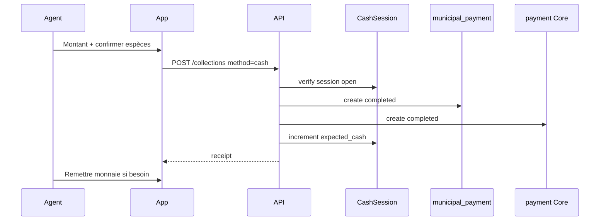

# 12. Intégration Paiement Espèces

## 12.1 Mission

Gérer l'encaissement **physique en XAF** sur le terrain, intégré à la session de caisse agent et au ledger Core.

## 12.2 Flux



## 12.3 Prérequis

| Règle | Détail |
|-------|--------|
| Session ouverte | `cash_session.status = open` |
| `cash_session_id` | Obligatoire dans payload |
| Plafond session | `expected_cash + amount ≤ max_cash_per_session` |
| GPS | Validation distance (configurable) |

## 12.4 Saisie montant (UI)

- Montant dû pré-rempli
- Clavier numérique XAF (pas de centimes — arrondi entier)
- Affichage rendu monnaie si agent saisit « reçu du client » (option V3.1, UX seulement — pas stocké sauf audit)

### Option V3.1 — `amount_received`

```json
{
  "amount": 15000,
  "amount_received": 20000,
  "change_given": 5000
}
```

Stocké dans `metadata` pour audit, n'affecte pas `expected_cash` (basé sur `amount` taxe).

## 12.5 Impact caisse

```
expected_cash += municipal_payment.amount
  WHERE method = cash AND status = completed
```

Les annulations espèces (void) décrémentent `expected_cash` si session encore `open` ou `pending_close`.

## 12.6 Offline espèces

**Autorisé** — flux critique terrain Owendo :

1. Paiement écrit SQLite `local_payments` + `sync_status=pending`
2. Quittance locale numéro provisoire
3. Impression BT possible immédiatement
4. Sync push : serveur valide session, obligations, GPS
5. Remplacement numéro quittance définitif `OWE-RCP-*`

### Risque double encaissement offline

Mitigation :
- `client_operation_id` unique
- Serveur rejette si obligation déjà soldée
- Agent voit conflit dans file sync

## 12.7 Core `payments`

| Champ | Valeur |
|-------|--------|
| `method` | `cash` |
| `status` | `completed` (immédiat) |
| `provider_reference` | null |
| `metadata.cash_session_number` | OWE-CS-… |

`transactions` : crédit wallet municipal `cash_on_hand` (compte analytique agent optionnel V3.2).

## 12.8 Contrôles fraude

| Signal | Action |
|--------|--------|
| > 10 paiements même montant / heure | Alerte superviseur |
| Encaissement hors horaire (22h-6h) | Log + review |
| GPS manquant offline | Flag review à sync |

## 12.9 Impression immédiate

Après succès espèces → écran quittance avec bouton **Imprimer** actif par défaut (contrairement MM où attente confirmation).

## 12.10 Différences vs Mobile Money

| Aspect | Espèces | Mobile Money |
|--------|---------|--------------|
| Session caisse | Requise | Non |
| Statut paiement | Immédiat completed | pending → completed |
| Offline | Oui | Non |
| expected_cash | Oui | Non |
| Quittance | Immédiate | Après confirmation |
