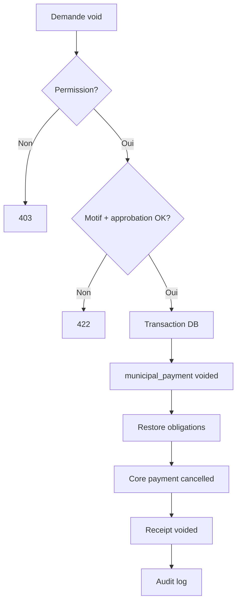

# 13. Gestion des annulations

## 13.1 Définitions

| Terme | Signification |
|-------|---------------|
| **Void (annulation)** | Annuler un paiement erroné **le même jour** ou avant clôture caisse validée |
| **Correction** | Nouveau paiement + void de l'ancien (montant différent) |

Pas de suppression physique — statut `voided` + piste audit.

## 13.2 Motifs autorisés

| `reason_code` | Description | Approbation |
|---------------|-------------|-------------|
| `duplicate` | Double saisie | Agent + auto si < 1 h |
| `wrong_amount` | Montant incorrect | Superviseur |
| `wrong_operator` | Mauvais commerce | Superviseur |
| `fraud_suspected` | Fraude présumée | Finance + superviseur |
| `other` | Détail obligatoire | Superviseur |

## 13.3 Règles métier

1. Seuls paiements `status=completed` annulables
2. Paiement déjà `refunded` → void interdit (flux refund)
3. Si quittance émise → marquée voided / watermark ANNULÉ
4. **Obligations** : montants alloués restaurés via `municipal_payment_allocations` (`amount_paid` décrémenté par taxe)
5. **Compte fiscal** : `balance_due` recalculé
6. **Core payment** : statut `cancelled` + transaction contre-passation
7. **Caisse espèces** : `expected_cash` ajusté si session non `approved`
8. Si session `approved` : void nécessite écriture d'ajustement session suivante (V3.2)

## 13.4 Workflow



## 13.5 API

| Méthode | Route | Description |
|---------|-------|-------------|
| POST | `/collections/{id}/void` | Annulation |
| GET | `/collections/{id}/void` | Détail void si existant |

### Payload

```json
{
  "reason_code": "wrong_amount",
  "reason_detail": "Saisi 15000 au lieu de 5000",
  "supervisor_pin": "****"
}
```

## 13.6 Offline

Void **non autorisé offline** en V3.0 — nécessite validation serveur et superviseur.

V3.2 : void offline en queue avec approbation superviseur différée (risque élevé — optionnel).

## 13.7 Mobile Money

Si paiement MM :
- Void avant règlement provider : marquer failed
- Après règlement : passer par **remboursement** (doc 14), pas void simple

## 13.8 Audit

`municipal_payment_voids` + `audit_logs` :

```json
{
  "action": "municipal_payment.voided",
  "old": { "status": "completed", "amount": 15000 },
  "new": { "status": "voided" },
  "reason_code": "wrong_amount",
  "actor_id": 12,
  "supervisor_id": 5
}
```

## 13.9 Impact dashboard

- KPI « encaissements » : exclut voided
- KPI « annulations » : count + montant / période
- Alerte si taux annulation > 2 %

## 13.10 Permissions

`municipal.payment.void` — agent peut demander `duplicate` < 1 h ; superviseur tous motifs.
