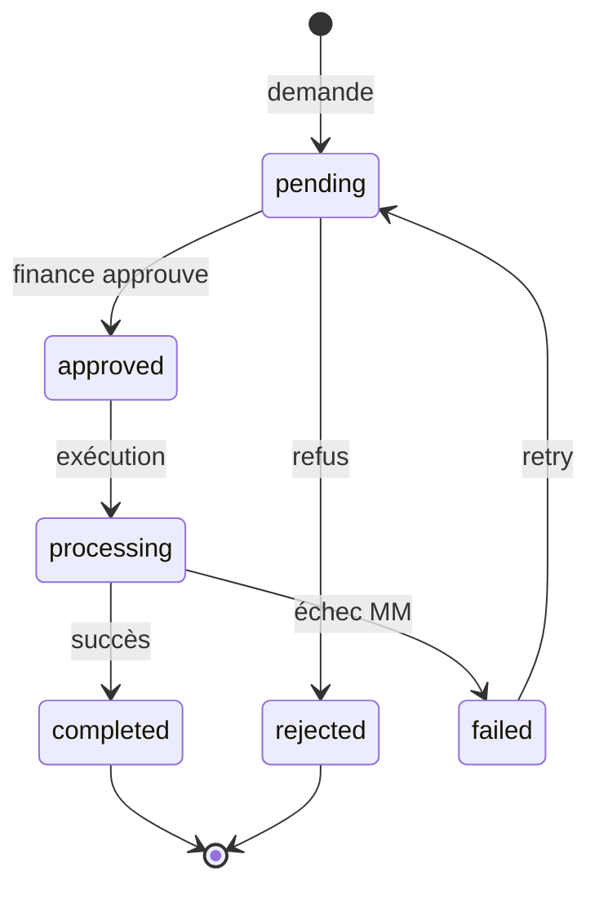

# 14. Gestion des remboursements

## 14.1 Mission

Retourner des fonds au commerçant après paiement validé (erreur, litige résolu en faveur du commerçant, double encaissement non voidable).

## 14.2 Différence void vs refund

| | Void | Refund |
|---|------|--------|
| Délai | Court (même jour / session) | Tout moment post-validation |
| Effet | Annule transaction | Nouvelle transaction inverse |
| Quittance originale | Voided | Conservée + note remboursement |
| MM | Rare | Reverse transfer ou espèces |

## 14.3 Workflow

## 14.4 Données `municipal_refunds`

| Champ | Description |
|-------|-------------|
| `original_payment_id` | Paiement source |
| `amount` | ≤ montant original (partiel autorisé V3.2) |
| `method` | `cash` ou même provider MM |
| `refund_payment_id` | Lien paiement négatif ou entry séparée |
| `status` | pending → completed |

## 14.5 Règles

1. Permission `municipal.payment.refund` (finance)
2. Montant remboursement ≤ `original.amount - SUM(refunds completed)`
3. Obligations : réouverture proportionnelle par taxe (`amount_paid` décrémenté sur chaque `fiscal_obligation` allouée)
4. `balance_due` augmenté en conséquence
5. Core : transaction débit wallet municipal

## 14.6 Remboursement espèces

- Sortie de caisse **session ouverte** de l'agent ou caisse centrale mairie (V3.3)
- `expected_cash` décrémenté
- Quittance remboursement : `OWE-RFD-YYYY-NNNNNN` (format parallèle, V3.2)

## 14.7 Remboursement Mobile Money

| Provider | Mécanisme |
|----------|-----------|
| Airtel | API refund si disponible ; sinon manuel + référence |
| Moov | Idem |

Statut `processing` jusqu'à confirmation webhook refund.

## 14.8 API

| Méthode | Route |
|---------|-------|
| POST | `/collections/{id}/refunds` |
| GET | `/refunds/{id}` |
| POST | `/refunds/{id}/approve` |
| POST | `/refunds/{id}/reject` |

## 14.9 Offline

Remboursements **interdits offline** — flux finance uniquement online.

## 14.10 Audit et reporting

- Dashboard : ligne « remboursements » séparée des encaissements
- Export mensuel pour comptabilité
- Taux remboursement / encaissements < 0,5 % cible

## 14.11 Cas particulier sync offline conflictuelle

Si paiement offline sync rejeté (obligation déjà payée) mais commerçant a reçu quittance provisoire :

1. Procédure manuelle superviseur
2. Pas de remboursement auto — enregistrement `disputed` sur compte fiscal
3. Résolution humaine avant refund
