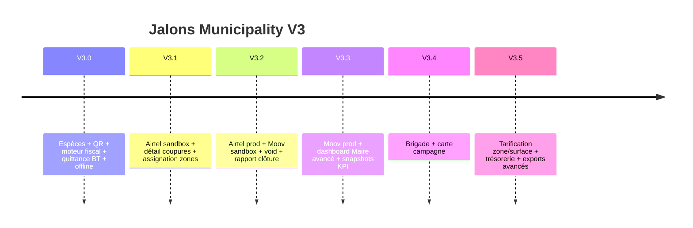
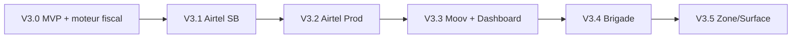

# 18. Plan de déploiement V3.0 → V3.5

## 18.1 Stratégie globale

Déploiement **incrémental** par capacités, zone géographique croissante, sans régression Taxi.



## 18.2 V3.0 — Terminal recouvrement MVP

**Durée estimée** : 6–8 semaines dev + 2 semaines pilote

### Backend
- [ ] Migrations moteur fiscal : `municipal_tax_types`, `municipal_tax_rates`, `municipal_collection_targets`, `operator_tax_assignments`
- [ ] Migrations : `fiscal_obligations` enrichi, `municipal_payment_allocations`, `cash_sessions`, extensions payments/receipts
- [ ] `FiscalEngineService` + `GenerateFiscalObligationsJob`
- [ ] `FiscalCollectionService`, `CashSessionService`, `MunicipalReceiptService`
- [ ] Dashboard web : CRUD taxes + affectations (pas de montants en seed)
- [ ] Lien Core `payments` / `transactions`
- [ ] `SyncController` push/pull (taux + obligations)
- [ ] Permissions Spatie (`municipal.tax.manage`, `municipal.tax.assign`)
- [ ] Tests Feature Municipality (objectif +30 tests)

### Mobile
- [ ] Écrans : scan, encaissement espèces, caisse, quittance, sync queue
- [ ] SQLite offline + `client_operation_id`
- [ ] PDF preview (`printing`)
- [ ] Impression thermique BT 58 mm
- [ ] Activer menu AgentHome items

### Infra
- [ ] Redis cache dashboard léger
- [ ] Stockage PDF `storage/app/municipality/receipts`

### Pré-requis pilote (mairie)
- [ ] Saisie dashboard : types de taxes (Boutique, Restaurant, Garage, PME, Marché)
- [ ] Saisie taux : montant + périodicité + validité par taxe
- [ ] Saisie objectifs annuels 2026
- [ ] Affectation taxes aux ~50 opérateurs pilotes
- [ ] Lancement génération obligations période courante

### Pilote
- **1 zone économique** Owendo (ex. Marché Central)
- **3 agents** + 1 superviseur
- **~50 opérateurs** avec taxes affectées (aucun montant en code)

### Critères go-live V3.0
- Taxes créées et modifiables depuis dashboard sans déploiement
- Obligations générées depuis affectations
- 100 encaissements espèces sans perte sync
- 0 régression tests Taxi CI
- Quittances PDF vérifiables
- Clôture caisse bout-en-bout

### Rollback V3.0
- Flag `MAMI_MUNICIPALITY_COLLECTION_ENABLED=false`
- Migrations down non destructives (colonnes nullable)
- App mobile : feature flag désactive encaissement

---

## 18.3 V3.1 — Airtel sandbox + renforcement caisse

**Durée** : 4 semaines

- [ ] `AirtelMoneyProvider` sandbox
- [ ] Webhook + `ReconcileMobileMoneyJob`
- [ ] `cash_session_denominations`
- [ ] `user_territory_assignments` par zone
- [ ] Liste impayés proximité GPS
- [ ] KPI agent dans app

**Pilote** : même zone + MM test sur 10 commerçants volontaires

---

## 18.4 V3.2 — Airtel prod + Moov sandbox + contrôles

**Durée** : 4–6 semaines

- [ ] Airtel Money production
- [ ] `MoovMoneyProvider` sandbox
- [ ] `municipal_payment_voids` + API void
- [ ] Rapport PDF clôture caisse
- [ ] Photo clôture (option)
- [ ] Extension 3 zones économiques

**Critères** : taux MM success > 95 % sandbox Moov

---

## 18.5 V3.3 — Moov prod + dashboard Maire

**Durée** : 4 semaines

- [ ] Moov Money production
- [ ] Dashboard web Maire complet (doc 9)
- [ ] `fiscal_daily_snapshots` + exports CSV
- [ ] Couches SIG fiscales (doc 10)
- [ ] Reverb notifications alertes (optionnel)

**Pilote** : extension toutes zones Owendo

---

## 18.6 V3.4 — Brigade

**Durée** : 4 semaines

- [ ] Tables `recovery_campaigns`, `field_teams`, etc.
- [ ] API campagnes + UI superviseur
- [ ] Carte campagne
- [ ] KPI brigade

**Événement** : première campagne ciblée impayés > 60 jours

---

## 18.7 V3.5 — Maturité fiscale avancée

**Durée** : 6 semaines

- [ ] Tarification par zone économique / surface (extension moteur, pas remplacement)
- [ ] Remise trésorerie (`cash_deposit`)
- [ ] Rapport mensuel PDF conseil municipal
- [ ] Archive froide audit
- [ ] Avances / surfacturation contrôlée
- [ ] MBTiles offline secteur

---

## 18.8 Matrice risques

| Risque | Impact | Mitigation |
|--------|--------|------------|
| Réseau instable Owendo | Élevé | Offline-first V3.0 |
| Écart caisse récurrent | Moyen | Seuils + formation |
| API MM indisponible | Moyen | Fallback espèces |
| Double paiement sync | Élevé | Idempotence UUID |
| Régression Taxi | Critique | CI séparé + flags |
| Fraude agent | Moyen | GPS + audit + plafonds |

## 18.9 Checklist non-régression Taxi

Avant chaque release V3.x :

```bash
php artisan test --filter=Taxi
php artisan test --filter=Municipality
# Vérifier routes rides/drivers inchangées
```

`.env` production :
```
MAMI_MODULE_TAXI=true
MAMI_MODULE_MUNICIPALITY=true
MAMI_MUNICIPALITY_COLLECTION_ENABLED=true  # V3.0+
```

## 18.10 Formation et change management

| Phase | Audience | Contenu |
|-------|----------|---------|
| V3.0 | Agents | QR, caisse, offline, impression |
| V3.1 | Agents | MM Airtel |
| V3.2 | Superviseurs | Void, validation écarts |
| V3.3 | Maire + finance | Dashboard, exports |
| V3.4 | Brigades | Campagnes |

## 18.11 Commandes déploiement VPS (rappel)

```bash
git pull origin <release-branch>
composer install --no-dev --optimize-autoloader
php artisan migrate --force
php artisan db:seed --class=MunicipalityDatabaseSeeder --force
php artisan config:cache && php artisan route:cache
php artisan queue:restart
```

## 18.12 Dépendances entre versions



V3.0 est **bloquant** pour toutes les suites. Dashboard (V3.3) peut démarrer en parallèle partiel dès V3.0 avec KPI simples.

## 18.13 Livrables documentaires (ce dossier)

| # | Document | Statut |
|---|----------|--------|
| 1–18 | `docs/municipality-v3/*.md` | ✅ Architecture v1.1 |
| 19 | Moteur fiscal configurable | ✅ |
| — | Implémentation code | ⏳ Après validation |

**Prochaine étape recommandée** : revue architecture par équipe Owendo + validation Maire → ordre de développement V3.0.
