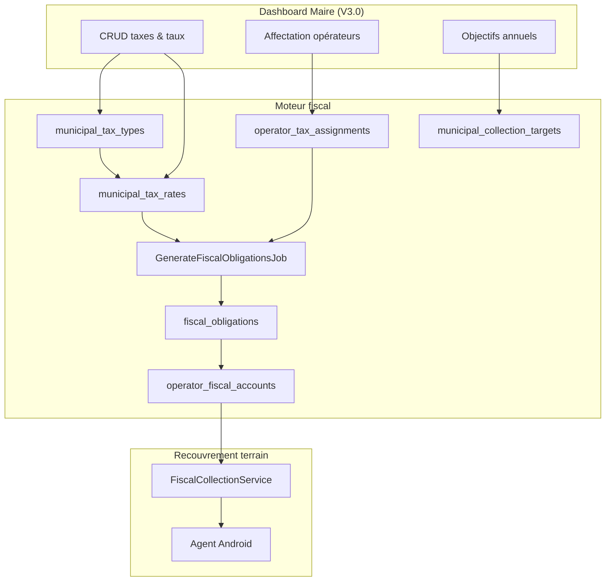

# 19. Moteur fiscal configurable

## 19.1 Mission

Remplacer toute tarification codée en dur (ex. `economic_operator_categories.default_monthly_tax`) par un **moteur fiscal paramétrable depuis le dashboard Maire**, sans redéploiement applicatif.

Les montants, périodicités, validités et objectifs de recouvrement sont des **données métier**, pas du code.

## 19.2 Principes fondateurs

| # | Principe | Implication technique |
|---|----------|----------------------|
| 1 | Aucun montant codé en dur | Montants uniquement dans `municipal_tax_rates` |
| 2 | Taxes créées depuis le dashboard | CRUD `municipal_tax_types` + taux via UI web |
| 3 | Chaque taxe : montant, périodicité, validité, objectif annuel | `municipal_tax_rates` + `municipal_collection_targets` |
| 4 | Un opérateur peut avoir plusieurs taxes | `operator_tax_assignments` (N taxes / opérateur) |
| 5 | Maire modifie sans déploiement | Nouveau taux = nouvelle ligne `municipal_tax_rates` ; job obligations |
| 6 | Obligations générées depuis affectations | `GenerateFiscalObligationsJob` lit assignments + taux actifs |

## 19.3 Architecture logique



## 19.4 Tables du moteur

### `municipal_tax_types`

Catalogue des taxes municipales (définition métier).

| Colonne | Type | Contraintes |
|---------|------|-------------|
| `id` | bigint PK | |
| `territory_id` | FK | → `municipal_territories` (Owendo) |
| `code` | string UK | Ex. `TAX-COMMERCE`, `TAX-OCCUPATION` |
| `name` | string | Ex. « Taxe communale commerce » |
| `description` | text nullable | |
| `category_id` | FK nullable | → `economic_operator_categories` (aide affectation auto) |
| `is_active` | boolean default true | |
| `created_by` | FK users | Maire / finance |
| `updated_by` | FK users nullable | |
| `timestamps` | | |
| `soft_deletes` | | Historique conservé |

**Note** : `category_id` est une **suggestion** pour l'affectation en masse, pas une source de montant.

### `municipal_tax_rates`

Versions tarifaires d'une taxe (montant + périodicité + fenêtre de validité).

| Colonne | Type | Contraintes |
|---------|------|-------------|
| `id` | bigint PK | |
| `tax_type_id` | FK | → `municipal_tax_types` RESTRICT |
| `amount` | decimal(12,2) | Montant par période |
| `currency` | char(3) default XAF | |
| `billing_period` | enum | `monthly`, `quarterly`, `semi_annual`, `annual` |
| `valid_from` | date | Début d'application |
| `valid_to` | date nullable | Fin (null = taux courant) |
| `due_day_of_period` | smallint default 1 | Jour échéance dans la période |
| `created_by` | FK users | |
| `timestamps` | | |

**Règles** :
- Un seul taux **courant** par `tax_type_id` à une date donnée (pas de chevauchement `valid_from`/`valid_to`)
- Modifier un montant = **créer un nouveau taux** avec nouveau `valid_from` ; clôturer l'ancien (`valid_to = veille`)
- Les obligations déjà émises conservent le `tax_rate_id` snapshot

### `municipal_collection_targets`

Objectif annuel de recouvrement par taxe (pilotage Maire).

| Colonne | Type | Contraintes |
|---------|------|-------------|
| `id` | bigint PK | |
| `tax_type_id` | FK | → `municipal_tax_types` |
| `territory_id` | FK | Owendo |
| `fiscal_year` | smallint | Ex. 2026 |
| `target_amount` | decimal(14,2) | Objectif annuel XAF |
| `notes` | text nullable | |
| `set_by` | FK users | Maire |
| `timestamps` | | |

**Contrainte** : UNIQUE (`tax_type_id`, `territory_id`, `fiscal_year`)

### `operator_tax_assignments`

Affectation d'une ou plusieurs taxes à un opérateur économique.

| Colonne | Type | Contraintes |
|---------|------|-------------|
| `id` | bigint PK | |
| `operator_id` | FK | → `economic_operators` RESTRICT |
| `tax_type_id` | FK | → `municipal_tax_types` RESTRICT |
| `tax_rate_id` | FK nullable | Taux figé ; null = taux courant à la génération |
| `assigned_from` | date | |
| `assigned_to` | date nullable | Fin d'affectation |
| `status` | enum | `active`, `suspended`, `ended` |
| `assigned_by` | FK users | |
| `assignment_source` | enum | `manual`, `enrollment`, `bulk_import`, `category_rule` |
| `notes` | text nullable | |
| `timestamps` | | |

**Règles** :
- Un opérateur actif peut avoir **plusieurs** lignes `active` (taxes distinctes)
- UNIQUE partiel : (`operator_id`, `tax_type_id`) WHERE `status = active`
- À l'enrôlement V2 : règle optionnelle « affecter taxes liées à `category_id` »

## 19.5 Génération des obligations

### Job `GenerateFiscalObligationsJob`

Exécution : **quotidienne 00:15** + déclenchement manuel dashboard + après création/modification taux ou affectation.

```
POUR CHAQUE assignment IN operator_tax_assignments WHERE status = active:
    rate = resolve_rate(assignment)  // tax_rate_id OU taux courant valid_on(today)
    period = current_billing_period(rate.billing_period, today)
    SI obligation existe déjà (operator, tax_type, period_start, period_end):
        CONTINUER
    CRÉER fiscal_obligation:
        operator_id, tax_type_id, tax_rate_id, assignment_id
        amount_due = rate.amount
        period_start, period_end, due_date
        status = open
    METTRE À JOUR operator_fiscal_account.balance_due
```

### Résolution de période

| `billing_period` | `period_start` | `period_end` | Libellé quittance |
|------------------|----------------|--------------|-------------------|
| `monthly` | 1er du mois | dernier jour | « Juin 2026 » |
| `quarterly` | 1er jour trimestre | dernier jour T | « T2 2026 » |
| `semi_annual` | 1er janv. ou 1er juill. | fin semestre | « S1 2026 » |
| `annual` | 1er janv. | 31 déc. | « Année 2026 » |

### Table `fiscal_obligations` (enrichie)

| Colonne ajoutée | Description |
|-----------------|-------------|
| `tax_type_id` | FK → `municipal_tax_types` |
| `tax_rate_id` | Snapshot du taux appliqué |
| `assignment_id` | FK → `operator_tax_assignments` |
| `obligation_type` | `periodic_tax`, `penalty`, `regularization` |

`obligation_type = periodic_tax` pour toutes les obligations issues du moteur.

## 19.6 Dashboard Maire — gestion fiscale (V3.0)

### Écrans

| Écran | Actions |
|-------|---------|
| **Types de taxes** | Liste, créer, archiver |
| **Taux** | Ajouter version, historique, prévisualiser impact |
| **Objectifs annuels** | Saisir `target_amount` par taxe / année |
| **Affectations** | Par opérateur, par zone, import CSV, règle catégorie |
| **Génération** | Bouton « Générer obligations période courante » |

### API REST (prévue)

| Méthode | Route | Permission |
|---------|-------|------------|
| GET/POST | `/tax-types` | `municipal.tax.manage` |
| GET/POST | `/tax-types/{id}/rates` | `municipal.tax.manage` |
| GET/POST | `/collection-targets` | `municipal.tax.manage` |
| GET/POST | `/operators/{id}/tax-assignments` | `municipal.tax.assign` |
| POST | `/tax-assignments/bulk` | `municipal.tax.assign` |
| POST | `/fiscal-obligations/generate` | `municipal.tax.manage` |

### Permissions Spatie (nouvelles)

| Permission | Rôle(s) |
|------------|---------|
| `municipal.tax.manage` | `mayor`, `municipal_finance` |
| `municipal.tax.assign` | `mayor`, `municipal_finance`, `municipal_supervisor` |
| `municipal.tax.view` | `mayor`, `municipal_finance`, `municipal_supervisor` |

## 19.7 Exemple métier Owendo

Configuration initiale saisie par la mairie (dashboard, **pas de seed montants**) :

| Taxe (`code`) | Périodicité | Montant (XAF) | Objectif 2026 |
|---------------|-------------|---------------|---------------|
| `TAX-BOUTIQUE` | Mensuel | 15 000 | 18 000 000 |
| `TAX-RESTAURANT` | Mensuel | 25 000 | 12 000 000 |
| `TAX-GARAGE` | Mensuel | 30 000 | 8 000 000 |
| `TAX-PME` | Trimestriel | 150 000 | 6 000 000 |
| `TAX-MARCHE` | Mensuel | 10 000 | 24 000 000 |

Affectation :
- Opérateur `OWE-COM-000042` (Boutique) → `TAX-BOUTIQUE`
- Opérateur `OWE-COM-000099` (PME + occupation) → `TAX-PME` + `TAX-OCCUPATION`

Obligations juin 2026 :
- Boutique : 1 obligation 15 000 XAF (mensuelle)
- PME : 0 obligation en juin si trimestre payé en avril ; 1 obligation en avril (T2)

## 19.8 Modification sans déploiement

| Action Maire | Effet |
|--------------|-------|
| Nouveau taux boutique 18 000 à partir du 01/07 | Nouvelle ligne `municipal_tax_rates` ; obligations juillet+ à 18 000 |
| Nouvelle taxe « Hygiène » | Création type + taux ; affectation opérateurs ; job génère obligations |
| Suspendre taxe pour un opérateur | `assignment.status = suspended` ; pas de nouvelles obligations |
| Objectif annuel révisé | Mise à jour `municipal_collection_targets` ; KPI dashboard recalculés |

Toute modification → `audit_logs` (voir doc 16).

## 19.9 Cache mobile (sync agent)

`POST /sync/pull` inclut pour le secteur agent :
- Types de taxes actifs (lecture seule)
- Taux courants (`valid_on = today`)
- Obligations ouvertes par opérateur cache

**Aucun montant embarqué dans l'APK** — toujours issus du serveur.

## 19.10 Ce qui est explicitement exclu

| Approche rejetée | Remplacement |
|------------------|--------------|
| `economic_operator_categories.default_monthly_tax` | `municipal_tax_rates` |
| Seed PHP avec montants fixes | Saisie dashboard + import CSV optionnel |
| Config `.env` pour tarifs | Données BDD |
| Montants dans code Flutter | API fiscal-summary |

## 19.11 Tests d'acceptation (spec)

- Création taxe + taux depuis API dashboard → obligations générées au job
- Opérateur multi-taxes → plusieurs obligations ouvertes
- Nouveau taux `valid_from` futur → anciennes obligations inchangées
- Taux chevauchant → rejet validation
- Encaissement alloue FIFO sur obligations multi-taxes
- Modification taxe auditée dans `audit_logs`
